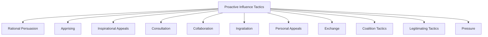
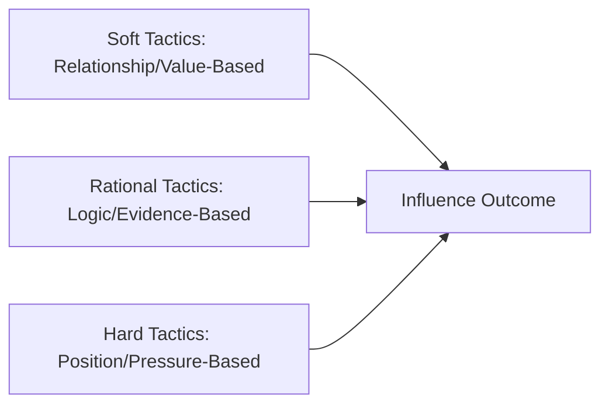
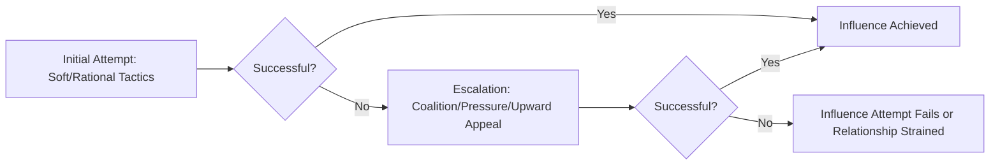

## Influence Tactics

### Overview

Influence tactics are the specific, observable behaviors individuals use to change the attitudes, beliefs, or behaviors of others in organizational settings. Where the "bases of power" literature explains the *resource or capacity* underlying influence attempts, and the "organizational politics" literature explains the *conditions* under which informal influence proliferates, the influence tactics literature focuses squarely on *what people actually do* — the concrete behavioral strategies enacted moment-to-moment in influence attempts, regardless of direction (upward, downward, or lateral) or underlying motive.

The dominant empirical tradition in this domain originates with Kipnis, Schmidt, and Wilkinson's (1980) foundational taxonomy and was substantially extended and refined by Gary Yukl and colleagues over subsequent decades into the most widely used contemporary instrument, the **Influence Behavior Questionnaire (IBQ)**.

### Historical Development

#### Kipnis, Schmidt, and Wilkinson (1980)

Using critical-incident methodology (asking employees to describe a time they successfully influenced someone at work), the original research identified seven core tactic categories, later condensed into a widely cited taxonomy through factor analysis: assertiveness, ingratiation, rationality, sanctions, exchange, upward appeals, and coalitions.

#### Yukl's Extended Taxonomy

Gary Yukl and colleagues substantially expanded and refined this work, ultimately identifying **eleven distinct proactive influence tactics**, validated across numerous studies and organizational contexts using the IBQ.

### The Eleven Proactive Influence Tactics (Yukl)

| Tactic | Description |
| --- | --- |
| Rational Persuasion | Using logical arguments, factual evidence, and detailed explanation to demonstrate that a request or proposal will achieve task objectives |
| Apprising | Explaining how a request will benefit the target personally (e.g., career advancement, skill development), distinct from organizational benefit |
| Inspirational Appeals | Making an emotionally engaging appeal to values, ideals, or aspirations to arouse enthusiasm and commitment |
| Consultation | Inviting the target to participate in planning an activity, decision, or change, thereby increasing their investment in its success |
| Collaboration | Offering to provide necessary resources or assistance if the target will carry out a request or approve a proposed change |
| Ingratiation | Using praise, flattery, or friendly behavior to put the target in a favorable mood prior to making a request |
| Personal Appeals | Asking the target to comply based on feelings of friendship or personal loyalty |
| Exchange | Offering an explicit or implicit reciprocal favor, or reminding the target of a past favor owed |
| Coalition Tactics | Seeking the aid of others, or noting the support of others, to persuade the target |
| Legitimating Tactics | Establishing the legitimacy of a request by referencing organizational policies, rules, authority, or precedent |
| Pressure | Using demands, threats, frequent checking, or persistent reminders to influence compliance |

**Example**: A project manager seeking a colleague's approval for a scope change might use *rational persuasion* by presenting data showing the current scope is unachievable within budget, *consultation* by asking the colleague to help redesign the scope collaboratively, or, if time pressure mounts, shift toward *pressure* tactics by repeatedly emphasizing the deadline and escalating urgency in each follow-up message.

### Classification: Soft, Hard, and Rational Tactics

A widely used higher-order classification (Falbe and Yukl, 1992) groups the eleven tactics into three broader categories based on the nature of the influence approach:

1. **Soft Tactics** — rely on personal relationships and the target's own values/interests; generally perceived as more friendly and less coercive (inspirational appeals, consultation, collaboration, ingratiation, personal appeals)
2. **Hard Tactics** — rely on the influencer's position, authority, or ability to apply direct pressure; generally perceived as more forceful and imposing (pressure, legitimating tactics, coalition tactics, exchange)
3. **Rational Tactics** — rely primarily on logical reasoning and factual demonstration; occupies a distinct middle category due to its reliance on objective argumentation rather than relational or positional leverage (rational persuasion, apprising)

**Key Points**

- This tripartite classification is not merely descriptive — it strongly predicts the *type* of follower response the tactic tends to generate, echoing the compliance-identification-internalization distinction found in the bases-of-power literature
- Soft and rational tactics are more consistently associated with **commitment** (genuine buy-in), while hard tactics are more consistently associated with mere **compliance** or outright **resistance**

### Direction of Influence: Upward, Downward, and Lateral

A key contextual moderator of tactic effectiveness and selection is the **direction** of the influence attempt relative to organizational hierarchy:

| Direction | Common Tactic Patterns | Notes |
| --- | --- | --- |
| **Downward** (supervisor to subordinate) | Legitimating tactics, pressure, and exchange are used more frequently, reflecting greater access to positional power bases | Overreliance on hard tactics downward is associated with reduced subordinate satisfaction and commitment |
| **Upward** (subordinate to supervisor) | Rational persuasion, coalition tactics, and ingratiation are used more frequently, since subordinates typically lack legitimate or coercive power over superiors | Upward influence success often depends heavily on the subordinate's credibility and the quality of the existing relationship (connecting directly to LMX theory) |
| **Lateral** (peer to peer) | Rational persuasion, consultation, exchange, and coalition tactics predominate, since peers generally lack formal authority over one another | Lateral influence often relies more heavily on reciprocity norms and relationship quality than vertical influence does |

[Inference] This directional pattern suggests tactic selection is substantially shaped by the influencer's *available power base* at the outset (an individual with strong legitimate power downward has less need to rely on ingratiation, for example) — implying that influence tactic choice is not purely a matter of interpersonal skill or strategic preference but is constrained by the objective power structure within which the influence attempt occurs.

### Tactic Combinations and Sequencing

Research finds that influence attempts are rarely single-tactic events; effective influencers frequently combine or sequence multiple tactics:

- **Tactic combinations**: pairing rational persuasion with inspirational appeals (logical justification plus emotional resonance) is generally found to be more effective than either tactic used in isolation
- **Escalation sequences**: influence attempts often follow an escalating pattern, beginning with soft or rational tactics and shifting toward harder tactics (pressure, coalition-building, upward appeals) only if initial attempts fail — a pattern documented in Kipnis and Schmidt's original research and consistent with a general principle that hard tactics carry relational costs and are typically reserved for situations where softer approaches have proven insufficient

### Moderators of Influence Tactic Effectiveness

1. **Organizational Culture** — cultures emphasizing collaboration and participative decision-making tend to reward soft and rational tactics, while more hierarchical, command-and-control cultures may tolerate or even reward hard tactics more readily
2. **Relationship Quality (LMX)** — higher-quality leader-member exchange relationships are associated with greater reliance on and effectiveness of soft tactics, since trust reduces the perceived risk of vulnerability inherent in consultation or collaboration-based approaches
3. **Target's Personality and Culture** — [Unverified] targets high in agreeableness may respond more readily to ingratiation and personal appeals, while targets high in conscientiousness may respond more strongly to rational persuasion grounded in evidence, though individual-difference moderation research in this specific domain remains less extensive than the broader tactic-effectiveness literature
4. **Cultural Context** — cross-cultural research (informed by Hofstede's cultural dimensions) suggests influence tactic preferences and effectiveness vary systematically; for example, [Unverified] some studies find coalition tactics and appeals to group harmony are relatively more effective in collectivist cultures, while individual rational persuasion may carry relatively more weight in individualist cultures, though this remains an area of ongoing comparative research rather than firmly established cross-cultural law

### Resistance and Influence Failure

Influence attempts do not uniformly succeed; targets can respond with:

- **Resistance** — active refusal, argument, or delay in response to an influence attempt, particularly common in response to hard tactics perceived as illegitimate or excessive
- **Compliance** — surface behavioral conformity without internalized attitude change (paralleling the bases-of-power compliance category)
- **Commitment** — genuine agreement and enthusiastic implementation, most reliably produced by soft and rational tactics, particularly when combined with high target trust in the influencer

**Key Points**

- Resistance is not simply the "failure" of an influence attempt but is itself a meaningful data point — persistent resistance to a specific tactic often signals that the tactic is misaligned with either the target's values, the relational context, or the perceived legitimacy of the underlying request
- [Inference] Repeated reliance on hard tactics following initial resistance, rather than adjusting tactic selection, risks compounding relational damage — since pressure tactics applied to an already-resistant target are likely to reinforce perceptions of illegitimate coercion rather than overcome the underlying objection

### Criticisms and Limitations

- **Self-report and social desirability bias**: because tactics like pressure and coalition-building may be viewed unfavorably, self-report instruments (including the IBQ) are subject to social desirability bias, potentially underreporting hard-tactic usage and overreporting soft-tactic usage
- **Cross-cultural generalizability**: the majority of the foundational influence tactics research (Kipnis, Schmidt, Yukl) was developed and validated primarily in North American organizational samples; the taxonomy's structure and the relative effectiveness rankings of specific tactics may not generalize uniformly across all cultural contexts
- **Static taxonomy versus dynamic reality**: the eleven-tactic taxonomy, while empirically robust, presents influence as a discrete set of categorizable behaviors, potentially understating the fluid, adaptive, and often blended nature of real-time influence attempts as they unfold in actual conversations
- **Overlap with organizational politics and impression management constructs**: several tactics (ingratiation, coalition-building) are studied both within the influence tactics literature and the organizational politics/impression management literatures, and the boundaries between these overlapping research streams are not always clearly delineated

### Practical Application in Organizations

- **Negotiation and stakeholder management training**: professionals frequently learn to diagnose which tactics are likely to be most effective based on relationship quality, direction of influence, and organizational culture before defaulting to habitual tactic choices
- **Change management and buy-in generation**: change leaders lacking strong legitimate or coercive power over affected populations often rely disproportionately on rational persuasion, inspirational appeals, and consultation to build genuine commitment rather than mere compliance, since sustained behavior change during organizational transitions typically requires internalization rather than surface conformity
- **Upward influence skill-building**: because subordinates typically lack access to hard tactics when influencing superiors, training in rational persuasion, apprising (linking requests to the supervisor's own interests), and coalition-building can improve the practical effectiveness of employees seeking to advocate for ideas, resources, or career opportunities
- **Leadership development**: given the consistent finding that soft and rational tactics produce more durable commitment than hard tactics, leadership development programs increasingly emphasize deliberate tactic selection and sequencing as a trainable managerial competency rather than treating influence style as a fixed personal disposition
- **Cross-cultural management training**: multinational organizations increasingly incorporate awareness of cultural variation in influence tactic reception into expatriate and global manager training, given the documented (though still developing) evidence of cross-cultural differences in tactic effectiveness

**Related Topics**

- Bases and Sources of Power
- Organizational Politics
- Leader-Member Exchange Theory
- Negotiation and Conflict Management
- Organizational Change Management
- Cross-Cultural Organizational Behavior (Hofstede's Dimensions)
- Impression Management and Self-Presentation Theory