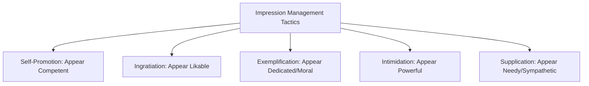
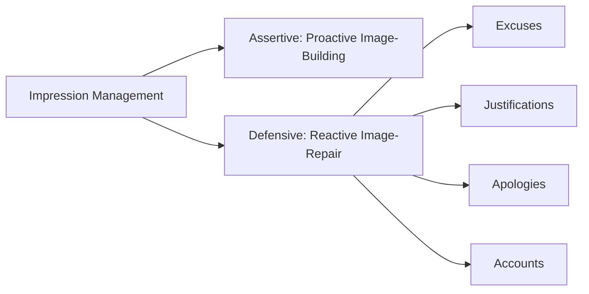
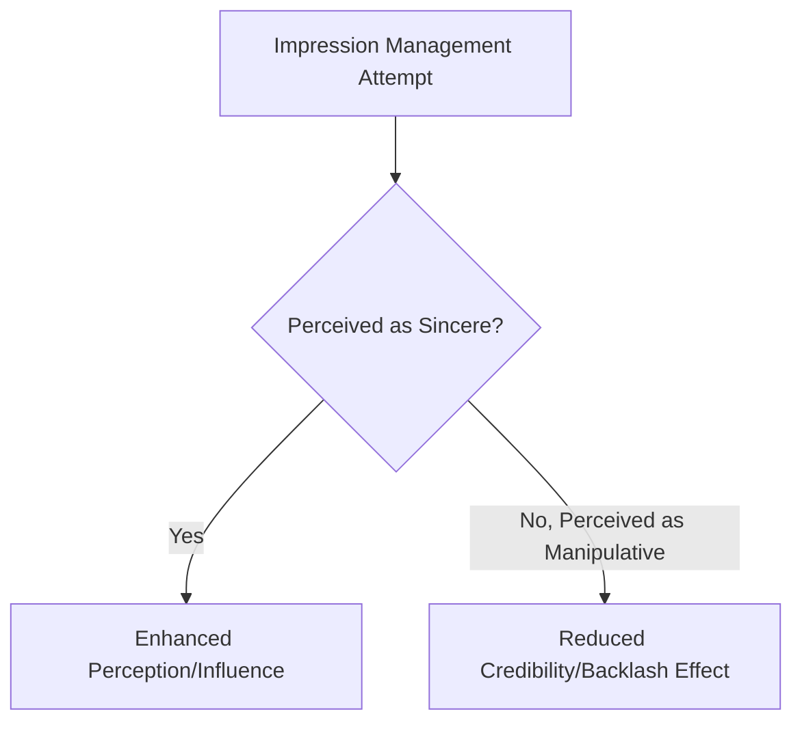

## Impression Management

### Overview

Impression management refers to the deliberate, goal-directed process by which individuals attempt to control, shape, or influence the perceptions others form of them. Originating in sociologist Erving Goffman's dramaturgical framework (1959), which conceptualized social interaction as a form of theatrical performance in which individuals present curated "fronts" to audiences, impression management was subsequently adapted into organizational psychology as a lens for understanding workplace self-presentation behaviors ranging from job interviews to performance reviews to everyday interpersonal interaction.

Within the broader "Power, Politics, and Influence" domain, impression management occupies a distinct niche: while organizational politics and influence tactics focus on shaping others' *behavior*, impression management focuses specifically on shaping others' *perceptions* of the actor — though these frequently overlap in practice, since favorable perceptions are often instrumental to achieving desired behavioral influence.

### Theoretical Foundations

#### Goffman's Dramaturgical Perspective

Goffman's foundational metaphor treats social life as theater: individuals perform a "front stage" self, carefully managed for the audience present, while a "backstage" self (less curated, more authentic) is reserved for private or trusted contexts. Organizational impression management research operationalizes this by studying how employees manage their front-stage presentation across contexts (interviews, meetings, performance reviews) that carry high evaluative stakes.

#### Self-Presentation Theory

Building on Goffman, self-presentation theory (Schlenker, Leary, and others) distinguishes two underlying motivational functions of impression management:

1. **Self-Presentation for Approval/Reward** — managing impressions to gain tangible benefits (promotions, positive evaluations, desirable assignments)
2. **Self-Verification** — managing impressions to confirm and reinforce one's own genuine self-concept to others, independent of instrumental reward

[Inference] This distinction implies that not all impression management is strategically self-serving in a narrow sense — some impression management behavior may be motivated by a genuine desire for others to see and understand the "real" self accurately, blurring the line between impression management and authentic self-disclosure in ways that complicate simple characterizations of the behavior as manipulative.

### Bolino and Turnley's Taxonomy of Impression Management Tactics

The most widely used organizational taxonomy (Jones and Pittman, 1982, later extended by Bolino and Turnley) identifies five core tactics, distinguished by whether they are primarily **assertive** (proactively shaping perception) or **defensive** (protecting an existing impression from damage):

| Tactic | Type | Description |
| --- | --- | --- |
| Self-Promotion | Assertive | Highlighting one's own accomplishments, skills, and abilities to appear competent |
| Ingratiation | Assertive | Using flattery, favor-doing, or opinion conformity to increase likability |
| Exemplification | Assertive | Displaying dedication, self-sacrifice, and hard work to appear committed or morally worthy |
| Intimidation | Assertive | Displaying anger, aggressiveness, or the threat of negative consequences to appear powerful or induce compliance through fear |
| Supplication | Assertive (though functions differently) | Displaying weakness, need, or dependency to elicit sympathy, nurturance, or reduced performance expectations |

**Key Points**

- Self-promotion and exemplification are the tactics most consistently associated with favorable supervisor evaluations when used in moderation and perceived as sincere
- Ingratiation shows a more complex pattern: effective when subtle and perceived as genuine, but associated with reduced credibility and negative evaluations when perceived as transparent flattery, directly connecting to the "apparent sincerity" dimension identified in the political skill literature
- Intimidation and supplication are the least studied in mainstream organizational contexts and are generally viewed as higher-risk tactics, more likely to damage rather than enhance long-term standing, though intimidation in particular can produce short-term compliance in specific power-asymmetric contexts

**Example**: A team member preparing for a performance review who compiles a detailed summary of completed projects and quantified impact is engaging in *self-promotion*. A colleague who consistently arrives earliest and stays latest, ensuring visibility to leadership, is engaging in *exemplification*. A subordinate who frequently agrees with a manager's opinions even when privately holding reservations, in order to be perceived favorably, is engaging in *ingratiation*.

### Assertive vs. Defensive Impression Management

A broader distinction separates impression management into two functional categories based on timing and purpose:

1. **Assertive (Acquisitive) Impression Management** — proactive behaviors aimed at *building* a desired positive image before any threat to reputation has occurred (self-promotion, ingratiation, exemplification, networking-oriented visibility behaviors)
2. **Defensive (Protective) Impression Management** — reactive behaviors aimed at *repairing or protecting* an existing image after a negative event, mistake, or failure threatens it, including:
   - **Excuses** — denying responsibility for a negative outcome while acknowledging the outcome itself occurred
   - **Justifications** — accepting responsibility but reframing the negative outcome as less severe or more reasonable than it appears
   - **Apologies** — accepting responsibility and expressing regret, often paired with a commitment to behavior change
   - **Accounts** — providing an explanation intended to reduce perceived culpability

**Key Points**

- Defensive impression management research draws heavily on attribution theory: whether an audience accepts an excuse or justification depends substantially on perceived locus of causality (internal vs. external), controllability, and stability of the cause offered
- [Inference] Because apologies involve accepting responsibility, they carry short-term reputational cost but are frequently found in organizational trust-repair research to produce better long-term relational outcomes than excuses or justifications, which may protect short-term image at the cost of perceived accountability and trustworthiness

### Interview and Selection Context Applications

Impression management has been particularly extensively studied within employment interview contexts, given the high evaluative stakes and limited information available to interviewers:

- **Honest/Deceptive Impression Management** — a key distinction in interview research separates *honest* impression management (genuine but selective self-presentation, emphasizing real strengths) from *deceptive* impression management (fabrication or significant exaggeration of qualifications, experiences, or accomplishments)
- Meta-analytic evidence generally finds impression management use in interviews is positively associated with interviewer ratings and hiring outcomes, raising a validity concern: interview performance may partly reflect impression management skill rather than job-relevant competence, potentially disadvantaging highly qualified candidates with lower self-promotional skill

[Unverified] The extent to which impression management use in interviews meaningfully compromises the predictive validity of interview-based hiring decisions (versus representing a job-relevant proxy for interpersonal skills genuinely needed in many roles) remains debated in the personnel selection literature, since some impression management skill overlaps substantially with legitimately job-relevant social competencies.

### Impression Management in Performance Appraisal

Beyond interviews, impression management extends into ongoing supervisor-subordinate dynamics, particularly around formal evaluation periods:

- Employees often strategically increase visibility behaviors, self-promotion, and exemplification in the period leading up to performance reviews
- Supervisors themselves engage in defensive impression management when justifying appraisal ratings to subordinates or higher management, particularly when ratings involve difficult or contested judgment calls
- [Inference] The prevalence of appraisal-period impression management surges suggests that performance evaluation systems reliant heavily on recent, salient behavior (rather than continuous, longitudinal tracking) may be particularly susceptible to impression management distortion, connecting to broader performance appraisal literature on recency bias

### Impression Management and Leader Behavior

Impression management is not solely a subordinate or job-seeker behavior; leaders themselves engage extensively in impression management, particularly relevant to several previously covered leadership constructs:

- **Charismatic and transformational leaders** often deliberately employ impression management techniques (vision articulation, symbolic behavior, self-sacrifice displays resembling exemplification) as part of legitimate leadership influence — raising a conceptual boundary question about where authentic transformational leadership behavior ends and strategic impression management begins
- **Pseudo-transformational leadership** (discussed in the transformational/transactional leadership domain) can be understood partly through an impression management lens: charismatic self-presentation techniques used instrumentally without the underlying ethical substance authentic transformational leadership presumes
- **CEO and executive impression management** has been studied extensively in corporate communications research (e.g., strategic framing in earnings calls, annual reports, and public statements during organizational crises), where defensive impression management (attributing poor performance to external/uncontrollable factors) is a well-documented pattern

### Detection and Perceived Authenticity

A central practical and theoretical tension in impression management research concerns **detectability**: impression management tactics are generally effective only to the extent the target does not perceive them as manipulative or insincere. Once detected as strategic rather than genuine, most tactics lose effectiveness and can actively backlash, damaging credibility more than if no impression management had been attempted.

**Key Points**

- This dynamic explains why "apparent sincerity" is identified as a foundational dimension of political skill — the same objective behavior (praising a supervisor's decision) can be received as genuine appreciation or transparent flattery depending on how skillfully and contextually appropriately it is delivered
- [Unverified] Individual differences in target sensitivity to detecting impression management (some research suggests observers vary in their default trust levels and pattern-recognition for insincerity) may explain why the same impression management behavior succeeds with some audiences and fails with others, though this moderation is less thoroughly mapped than the tactic taxonomy itself

### Criticisms and Limitations

- **Measurement reliance on self-report**: because impression management is, almost definitionally, a behavior individuals may be motivated to conceal or underreport (particularly tactics like ingratiation or intimidation, which carry social stigma), self-report measurement faces inherent validity challenges
- **Conflation with authentic behavior**: critics note that virtually any deliberate, socially aware behavior could theoretically be classified as impression management, risking an overly broad and potentially unfalsifiable construct if not carefully bounded by clear behavioral criteria
- **Cultural variability**: [Unverified] the acceptability and interpretation of specific tactics (e.g., self-promotion, which may be viewed as appropriately confident in individualist cultures but as inappropriately boastful in more collectivist or modesty-valuing cultural contexts) likely varies substantially, though comparative cross-cultural impression management research remains less developed than the North American-centric foundational literature
- **Ethical ambiguity**: the line between legitimate, honest self-presentation (emphasizing genuine strengths) and manipulative, potentially deceptive self-presentation is not always clearly operationalized in research designs, complicating both measurement and practical ethical guidance

### Practical Application in Organizations

- **Interview and selection process design**: structured interviews with standardized, behaviorally anchored questions can reduce (though not eliminate) the degree to which interview outcomes are driven by impression management skill rather than job-relevant competence
- **Performance appraisal system design**: continuous or frequent feedback systems, rather than relying solely on periodic formal reviews, can reduce the appraisal-period impression management surge by lowering the stakes and salience of any single evaluative moment
- **Leadership authenticity training**: given the overlap between impression management and both authentic and pseudo-transformational leadership, executive coaching increasingly addresses the distinction between strategic self-presentation and genuine values-consistent behavior, since followers' long-term trust depends heavily on perceived sincerity
- **Crisis communication and reputational management**: organizational communications teams apply defensive impression management research (the relative effectiveness of apologies versus justifications versus excuses) when designing public responses to organizational failures or controversies
- **Coaching for early-career professionals**: since self-promotion and exemplification show the most consistent positive associations with favorable evaluation when used credibly, career development coaching often explicitly teaches employees (particularly those from cultural or personal backgrounds that discourage self-promotion) how to authentically communicate accomplishments without triggering ingratiation-related credibility risk

**Related Topics**

- Influence Tactics
- Organizational Politics
- Bases and Sources of Power
- Attribution Theory in Organizational Behavior
- Authentic and Servant Leadership
- Personnel Selection and Interview Validity
- Performance Appraisal Systems and Rating Bias