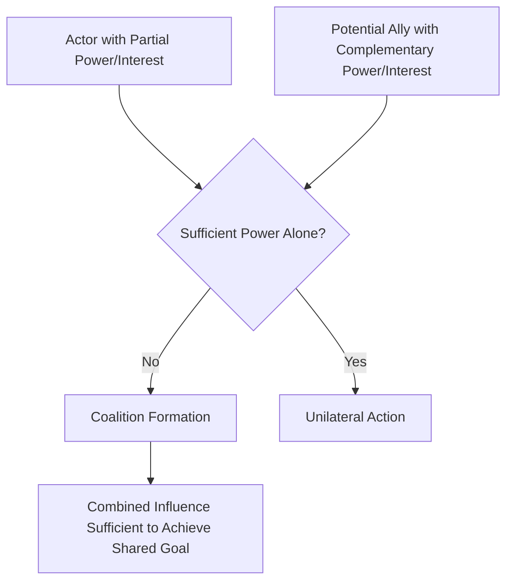
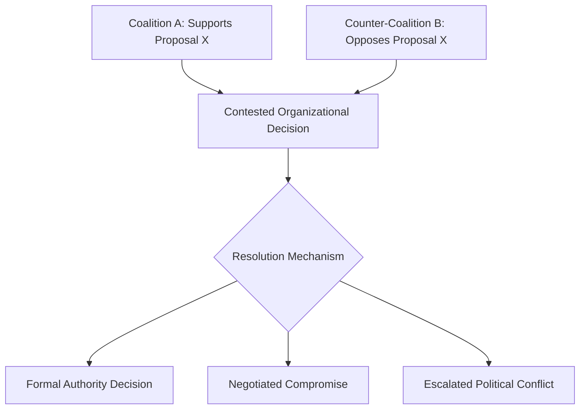

## Coalition Building

### Overview

Coalition building refers to the deliberate process of forming alliances among two or more individuals or groups who combine their resources, influence, and voice to achieve a shared objective that they could not achieve as effectively, or at all, acting independently. Within the "Power, Politics, and Influence" domain, coalition building occupies a distinct role: rather than describing an individual's power base (French and Raven), the broader political climate (organizational politics), or a specific persuasive behavior (influence tactics, where "coalition tactics" appears as one of eleven categories), coalition building is examined here as its own multi-actor, structural phenomenon — the *process* by which aligned interests are identified, alliances are formed, and collective power is mobilized within organizational decision-making.

Coalitions are a central mechanism through which organizational politics translates into actual decision outcomes, particularly in conditions of ambiguity, resource scarcity, or contested authority where no single actor holds sufficient unilateral power to prevail.

### Theoretical Foundations

#### Coalitional Behavior in Organizational Decision-Making (Cyert and March)

Richard Cyert and James March's **Behavioral Theory of the Firm** (1963) provides a foundational organizational-level account: organizations are conceptualized not as unitary, rational actors with a single coherent goal, but as **coalitions of individuals and subgroups with partially conflicting interests and preferences**. Organizational goals themselves are the outcome of a continuous bargaining and coalition-formation process among these internal constituencies, rather than a fixed, pre-given objective function.

This reframes organizational decision-making as fundamentally political and coalitional at its core, rather than as a rational, unitary optimization process — a foundational premise underlying virtually all subsequent organizational politics research.

#### Resource-Based Coalition Formation

Coalitions form most readily when potential members recognize **complementary or overlapping interests** combined with insufficient individual power to achieve a desired outcome alone. This connects directly to structural power theories (strategic contingencies, resource dependence): actors seek coalition partners who possess resources, expertise, network position, or legitimacy that compensates for their own power deficits relative to a specific decision or goal.

### Types of Organizational Coalitions

1. **Dominant Coalition** — the core group of individuals or subunits whose collective preferences most heavily shape organizational strategy and major decisions at any given time; membership in the dominant coalition can shift as strategic contingencies and resource dependencies change over time
2. **Issue-Based Coalitions** — temporary, ad hoc alliances formed around a specific decision or initiative, which may dissolve once the issue is resolved, regardless of whether the outcome was favorable
3. **Standing Coalitions** — more durable alliances (e.g., between departments with persistently aligned interests, such as sales and marketing) that reform repeatedly across multiple issues over time due to consistently overlapping goals
4. **Cross-Hierarchical Coalitions** — alliances spanning different levels of formal hierarchy (e.g., a mid-level manager building support both among peers and among senior sponsors), often necessary when an initiative requires both grassroots buy-in and executive authorization

**Key Points**

- The distinction between issue-based and standing coalitions matters practically: standing coalitions accumulate relational capital and trust over repeated interactions, generally making them faster to mobilize and more durable under pressure than freshly assembled issue-based coalitions
- Dominant coalition membership is a useful diagnostic lens for understanding *de facto* organizational power distribution, which frequently diverges meaningfully from the *de jure* power distribution implied by the formal organizational chart

### Coalition-Building Tactics and Process

#### Sequential Mobilization

Coalition building typically follows an identifiable sequential logic rather than simultaneous recruitment of all potential members:

1. **Core recruitment** — the initiator first secures commitment from one or two highly credible or highly invested allies, establishing initial legitimacy and momentum
2. **Expansion** — the growing coalition leverages the credibility of early members to recruit additional, often more hesitant, participants (a form of social proof)
3. **Consolidation** — the coalition formalizes its shared position, often through a joint proposal, memo, or coordinated presentation, to maximize the perceived unity and weight of the collective voice when approaching decision-makers

**Example**: A department head seeking to secure funding for a new cross-functional analytics platform first approaches a well-respected peer in finance who has independently expressed frustration with current reporting tools (core recruitment). With that peer's support secured, the two jointly approach additional department heads, citing the finance peer's endorsement as social proof of the initiative's legitimacy (expansion). The resulting group of four department heads then submits a single joint funding proposal to the executive committee, presenting a unified cross-departmental voice rather than four separate competing requests (consolidation).

#### Coalition Tactics as a Subset of Influence Tactics

As previously noted in the influence tactics taxonomy, "coalition tactics" — enlisting others' support or citing others' endorsement to persuade a target — represents one of the eleven core proactive influence behaviors. Coalition building, as a broader organizational phenomenon, can be understood as the sustained, structural process that produces the raw material (an actual coalition) subsequently deployed through this specific influence tactic.

### The Role of Network Position in Coalition Formation

Social network research directly informs coalition-building effectiveness:

- **Brokers** (individuals occupying structural holes between otherwise disconnected groups) are uniquely positioned to build cross-group coalitions, since they possess relationships spanning multiple otherwise-unconnected constituencies
- **Central actors** (high degree centrality) can mobilize larger coalitions more rapidly due to a greater number of direct relational ties available for initial recruitment
- Coalition-building capacity is therefore not purely a function of persuasive skill but substantially a function of pre-existing network position — actors with sparse networks face a structural, not merely a skill-based, disadvantage in coalition formation

[Inference] This network-dependence implies that organizations seeking to democratize influence over decision-making (rather than allowing outcomes to be dominated by well-networked incumbents) may need to deliberately create structured cross-functional forums or sponsorship programs that compensate for unequal baseline network access, since coalition-building capacity would otherwise tend to reinforce existing informal power concentrations.

### Coalition Building and Organizational Change

Coalition building is extensively documented as a critical success factor in planned organizational change, most notably formalized in Kotter's influential eight-step change model, where **"building a guiding coalition"** constitutes an explicit, named early stage — reflecting a widely shared premise in the change management literature that a single change champion, however senior or well-intentioned, is rarely sufficient to overcome organizational inertia and resistance without a broader coalition of credible, cross-functional supporters.

**Key Points**

- Effective guiding coalitions in change contexts typically combine members with complementary sources of credibility: formal positional authority, technical expertise, informal relational trust, and effective communication skill, since no single individual typically embodies all forms of credibility simultaneously
- [Inference] The persistent emphasis on coalition-building across independently developed change management, organizational politics, and behavioral theory of the firm literatures suggests a convergent finding across research traditions: sustainable organizational decisions and changes generally require distributed buy-in and shared ownership rather than unilateral authority, even when the initiator possesses substantial formal power

### Coalitions, Conflict, and Competing Interests

Coalition formation does not occur in a vacuum; the emergence of one coalition frequently provokes the formation of a **counter-coalition** representing opposing interests, particularly in resource allocation or strategic direction disputes.

**Key Points**

- The emergence of competing coalitions transforms what might otherwise be a straightforward decision-making process into an explicitly political contest, often requiring either formal authority intervention, negotiated compromise, or prolonged conflict to resolve
- [Inference] Because counter-coalition formation is a predictable response to visible coalition-building efforts, skilled political actors often attempt to build support quietly and secure key commitments before opposing interests have the opportunity to organize a competing coalition — a dynamic sometimes informally described as "securing buy-in before going public" with a proposal

### Ethical Considerations and Dual-Use Nature

Coalition building, like political skill and influence tactics generally, is ethically neutral in its mechanics — the same process can serve constructive organizational purposes (building genuine cross-functional consensus around a beneficial initiative) or self-serving, exclusionary purposes (assembling a coalition to protect a personal position or block a legitimately beneficial change that threatens a coalition member's interests).

[Inference] This dual-use quality means coalition building's organizational value cannot be assessed independent of the underlying objective it serves — a lens consistent with the broader organizational politics literature's move away from treating political behavior as inherently dysfunctional and toward evaluating specific instances based on their actual organizational and ethical consequences.

### Criticisms and Limitations

- **Underdeveloped as a standalone empirical construct**: compared to individual-level constructs like political skill or influence tactics, coalition building has received comparatively less dedicated psychometric and quantitative empirical development, with much of the foundational theory (Cyert and March, Kotter) originating from organizational theory and management practice literature rather than tightly controlled behavioral research
- **Measurement difficulty**: coalitions are inherently relational, multi-actor, and often partially covert phenomena, making them difficult to measure with the same rigor as individual-level attitudes or behaviors; most evidence is qualitative, case-study-based, or drawn from organizational network analysis rather than large-sample quantitative studies
- **Risk of oversimplifying organizational decision-making as purely coalitional**: while Cyert and March's behavioral theory of the firm remains influential, critics note that treating all organizational decisions as purely the product of coalition bargaining risks understating the role of genuine expertise, formal analytical processes, and non-political rational decision-making that also occurs within organizations
- **Potential for coalition ossification**: standing coalitions, while efficient once established, can become rigid and resistant to new information or changing circumstances, potentially perpetuating outdated organizational priorities simply because the coalition supporting them remains entrenched

### Practical Application in Organizations

- **Change management and initiative sponsorship**: practitioners deliberately apply the sequential mobilization model (core recruitment, expansion, consolidation) when seeking to build support for new initiatives, particularly ensuring the guiding coalition includes members with complementary credibility sources rather than relying solely on formal authority
- **Budget and resource allocation processes**: understanding that resource allocation decisions are prime arenas for coalition activity (as noted in the organizational politics literature), finance and strategy functions can proactively build cross-departmental input processes that surface competing interests transparently rather than allowing decisions to be captured entirely by whichever coalition mobilizes most effectively
- **Diversity and inclusion in decision-making**: recognizing coalition-building's dependence on pre-existing network position, organizations seeking more equitable influence over decisions may deliberately create structured forums, sponsorship programs, or cross-functional rotational assignments that build network access for employees who might otherwise lack the relational capital needed to build effective coalitions
- **Executive and board dynamics**: coalition analysis is frequently applied to understand shifting dominant coalitions at the executive and board level, particularly during leadership transitions, mergers, or strategic pivots, where formal authority structures may lag behind actual shifts in influence and alignment
- **Conflict anticipation and management**: given the predictable emergence of counter-coalitions in response to contested proposals, skilled organizational leaders often proactively engage likely opposing interests early in the coalition-building process to negotiate accommodations before positions harden into an adversarial contest

**Related Topics**

- Organizational Politics
- Influence Tactics
- Bases and Sources of Power
- Organizational Change Management (Kotter's 8-Step Model)
- Social Network Analysis in Organizational Behavior
- Resource Dependence Theory
- Conflict Management and Negotiation