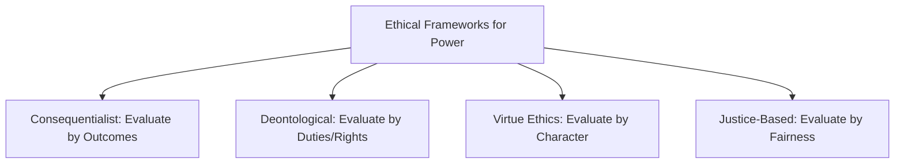
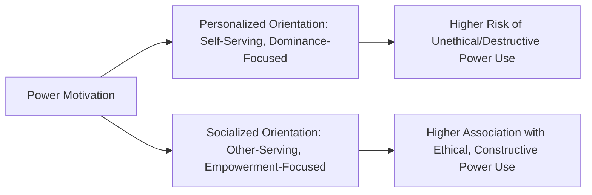
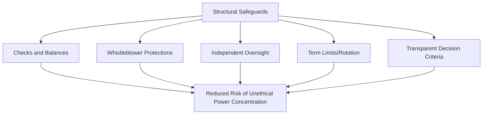

## Ethical Use of Power

### Overview

The ethical use of power addresses a normative question that the descriptive frameworks covered elsewhere in this domain (bases of power, organizational politics, influence tactics, coalition building) deliberately bracket: not merely *how* power operates in organizations, but *how it ought to be exercised*. Where French and Raven's taxonomy explains the sources of power and the influence tactics literature catalogs behavioral strategies, the ethics-of-power literature asks under what conditions the acquisition and exercise of organizational power is legitimate, fair, and consistent with the welfare of those affected by it.

This domain sits at the intersection of leadership ethics, organizational justice, and the destructive leadership literature previously covered, but is distinguished by its explicit normative focus: rather than describing what destructive leaders do (the Toxic Triangle) or cataloging power bases (French and Raven), it establishes evaluative criteria for judging whether a given exercise of power is ethically justified.

### Foundational Ethical Frameworks Applied to Power

Organizational ethics scholars typically draw on established moral philosophy traditions to evaluate power use, producing distinct (and sometimes conflicting) standards:

1. **Consequentialist/Utilitarian Framing** — evaluates power use based on outcomes: power is used ethically when it produces the greatest good for the greatest number of stakeholders affected, weighing benefits and harms across all parties
2. **Deontological Framing** — evaluates power use based on adherence to duties, rules, and rights, independent of outcomes: certain uses of power (e.g., coercion that violates individual autonomy or dignity) are impermissible regardless of the beneficial outcomes they might produce
3. **Virtue Ethics Framing** — evaluates power use based on the character and motivations of the power-holder: ethical power use flows from virtuous dispositions (integrity, humility, justice, practical wisdom) rather than from calculating outcomes or following rules
4. **Justice-Based Framing** — evaluates power use based on fairness in process and distribution, directly connecting to organizational justice theory (distributive, procedural, interactional justice)

**Key Points**

- No single framework dominates organizational ethics research; most applied treatments of power ethics implicitly or explicitly draw on multiple frameworks simultaneously, since each captures a distinct and often complementary dimension of what makes power use legitimate
- [Inference] Practical ethical dilemmas involving power frequently arise precisely because these frameworks can prescribe different conclusions in the same situation — a consequentialist framing might justify a coercive but effective restructuring decision that a deontological framing would reject on the grounds that it violates affected employees' autonomy or dignity, regardless of net benefit

### McClelland's Personalized vs. Socialized Power Orientation

A foundational and widely cited distinction in organizational psychology (David McClelland, extended by McClelland and Burnham) separates two underlying motivational orientations toward power that substantially predict ethical versus unethical power use:

1. **Personalized Power Orientation** — power is sought and exercised primarily for personal gain, status, ego gratification, or dominance over others; associated with impulsivity, low self-control, and exploitation of followers
2. **Socialized Power Orientation** — power is sought and exercised primarily to achieve collective goals, empower others, and serve organizational or societal interests beyond the power-holder's personal benefit; associated with self-control, concern for others, and a longer-term institutional perspective

**Key Points**

- This distinction directly parallels and helps explain the Toxic Triangle's characterization of destructive leaders as possessing a "personalized rather than socialized" power orientation — McClelland's framework provides the underlying motivational-psychology basis for that later leadership taxonomy
- [Inference] Because power orientation is theorized as a relatively stable individual-difference variable rather than purely situational, this suggests selection and assessment processes (screening for socialized versus personalized power motivation during leadership hiring and promotion) may be at least as important as post-hoc governance mechanisms in preventing unethical power use, complementing rather than replacing the environmental/structural safeguards discussed below

### The Responsible Use of Power: Key Ethical Principles

Synthesizing across the organizational ethics and leadership literature, several recurring principles characterize what is generally treated as the responsible or ethical use of power:

1. **Transparency** — the basis, scope, and rationale for power exercised should be open to scrutiny rather than concealed or obscured; covert or manipulative uses of power (as distinguished in the organizational politics literature) are generally treated as more ethically suspect than transparent influence attempts, even when both achieve similar outcomes
2. **Consent and Voluntariness** — ethical power use generally preserves the target's meaningful ability to consent, dissent, or exit, rather than relying on coercion that eliminates genuine choice; this connects directly to the compliance-identification-internalization distinction, since internalization (achieved through legitimate, non-coercive influence) is generally viewed as more ethically sound than compliance extracted through fear
3. **Proportionality** — the degree and type of power exercised should be proportionate to the legitimate organizational need at hand, rather than exceeding what the situation reasonably requires
4. **Accountability** — power-holders should be subject to meaningful oversight, feedback, and consequences for how power is exercised, rather than operating with unchecked discretion (directly connecting to the "conducive environment" leg of the Toxic Triangle, where absence of checks and balances enables destructive power use)
5. **Empowerment Orientation** — echoing socialized power motivation, ethical power use is frequently characterized by an orientation toward developing and empowering others (consistent with servant leadership's emphasis on follower growth) rather than concentrating dependency and control in the power-holder

**Example**: A manager reorganizing team responsibilities exercises power ethically when the rationale is communicated openly to affected employees (transparency), employees retain the ability to raise concerns or request reconsideration through legitimate channels (consent/voice), the reorganization addresses a genuine organizational need without excessive disruption relative to that need (proportionality), and the manager's decision remains subject to review by their own supervisor or HR if concerns are raised (accountability).

### Structural and Governance Safeguards Against Unethical Power Use

Beyond individual-level ethical orientation, organizational research emphasizes structural mechanisms that constrain the potential for unethical power exercise, directly building on the "conducive environment" concept from the destructive leadership literature:

- **Checks and balances** — distributing decision authority across multiple parties or requiring independent review/approval for high-stakes decisions, reducing the capacity for any single actor to exercise unchecked power
- **Whistleblower protections** — formal mechanisms protecting employees who report unethical power use from retaliation, addressing the "susceptible follower" (conformer) dynamic in which fear of retaliation silences legitimate dissent
- **Independent oversight bodies** — ethics committees, ombudspersons, or external auditors who can evaluate power use independent of the internal chain of command in which the power is exercised
- **Term limits and rotation** — limiting the duration any individual holds concentrated power, reducing the risk of entrenchment and unchecked accumulation of personalized power over time
- **Transparent decision criteria** — publishing and consistently applying clear criteria for high-stakes decisions (promotions, resource allocation, discipline) reduces the discretionary space in which unethical or arbitrary power use can occur, directly connecting to the organizational politics literature's finding that decision ambiguity is a key antecedent of dysfunctional political behavior

### Power and Psychological Effects on the Power-Holder

A distinct research stream examines how the *experience* of holding power psychologically affects the power-holder in ways relevant to ethical behavior, independent of pre-existing personality traits:

- The **Approach/Inhibition Theory of Power** (Keltner, Gruenfeld, and Anderson, 2003) proposes that possessing power activates a psychological "approach" orientation (increased action-tendency, reduced attention to risk and social constraint), while lacking power activates an "inhibition" orientation (increased caution, heightened attention to threat and social monitoring)
- Experimental research associated with this tradition has found that experimentally induced feelings of power can be associated with increased risk-taking, reduced perspective-taking (difficulty accurately understanding others' viewpoints), and in some studies, increased likelihood of behaving in self-interested or norm-violating ways
- [Unverified] The replicability and generalizability of specific experimental findings on power's psychological effects has been contested amid the broader social psychology replication crisis; some originally influential findings in this area have faced replication challenges, meaning the strength and universality of these effects should be treated with appropriate caution rather than as firmly settled findings

[Inference] If power genuinely does psychologically reduce perspective-taking and increase risk-tolerance as this theory proposes, this would suggest that ethical power use may require *deliberate compensatory practices* (structured solicitation of feedback, formal perspective-taking exercises, external accountability relationships) rather than relying solely on the power-holder's pre-existing character or intentions, since the psychological experience of holding power itself may work against ethical restraint even among well-intentioned individuals.

### Power Distance and Cultural Variation in Ethical Expectations

Hofstede's power distance cultural dimension is directly relevant to how the ethical use of power is understood and evaluated across cultural contexts:

- In **high power-distance cultures**, significant power asymmetry between superiors and subordinates is more broadly accepted as normal and legitimate, and directive, authority-based power exercise may not carry the same ethical scrutiny it would in lower power-distance contexts
- In **low power-distance cultures**, there is generally greater expectation of participative decision-making, and unilateral or highly directive power exercise is more likely to be perceived as illegitimate or ethically questionable even when formally authorized

[Unverified] This cultural variability raises a genuine and unresolved question for multinational organizations: whether ethical standards for power use should be treated as universal (applying consistent transparency, consent, and accountability standards regardless of cultural context) or should be calibrated to local cultural expectations, a tension that reflects the broader unresolved debate between ethical universalism and cultural relativism in applied business ethics, rather than a question with a single settled answer in the organizational psychology literature.

### Relationship to Previously Covered Constructs

| Construct | Relationship to Ethical Use of Power |
| --- | --- |
| Destructive/Toxic Leadership | Describes the *outcomes and enabling conditions* of unethical power use; ethical-use-of-power frameworks provide the normative standards against which such leadership is judged |
| Bases and Sources of Power | Ethical concerns apply differentially across bases — coercive power carries inherently higher ethical risk than expert or referent power due to its reliance on fear and reduced target autonomy |
| Organizational Politics | Covert, illegitimate political behavior is generally viewed as more ethically suspect than transparent influence, directly reflecting the transparency principle |
| Servant and Authentic Leadership | Both leadership theories can be understood as prescriptive models of *how* to exercise power ethically (through service orientation and value-consistency, respectively), operationalizing socialized power motivation in practice |
| Organizational Justice | Provides the fairness-based evaluative criteria (distributive, procedural, interactional justice) frequently used to assess whether specific exercises of power are ethical |

### Criticisms and Limitations

- **Normative frameworks resist empirical falsification**: unlike descriptive constructs (e.g., abusive supervision, which can be behaviorally measured and its consequences empirically tested), claims about what constitutes "ethical" power use are inherently normative and philosophically contested, making this domain less amenable to the kind of convergent empirical consensus achieved in more descriptive areas of organizational psychology
- **Measurement and operationalization challenges**: translating abstract ethical principles (proportionality, transparency) into behaviorally specific, measurable constructs suitable for organizational research remains underdeveloped compared to more established constructs like abusive supervision or organizational justice
- **Risk of "ethics-washing"**: [Inference] because organizations have strong reputational and legal incentives to be *perceived* as using power ethically, there is a documented risk that formal governance structures (ethics committees, published codes of conduct) may function more as symbolic legitimacy signals than as genuinely effective constraints on power use, particularly when such structures lack real enforcement authority or independence from the power-holders they are meant to oversee
- **Tension between individual and structural explanations**: this domain, like the broader destructive leadership literature, faces an ongoing theoretical tension between attributing unethical power use primarily to individual moral character/motivation (McClelland's personalized power orientation) versus primarily to structural and situational conditions (absence of checks and balances) — most contemporary scholars favor an interactionist view (paralleling the Toxic Triangle) but the relative weighting of these factors remains empirically contested

### Practical Application in Organizations

- **Leadership selection and development**: incorporating assessment of power motivation orientation (socialized versus personalized) into leadership selection processes, and explicitly developing socialized power orientation through training that emphasizes empowerment, stakeholder consideration, and long-term institutional thinking over personal advancement
- **Governance structure design**: implementing concrete structural safeguards (independent ethics oversight, transparent decision criteria, whistleblower protection systems) rather than relying solely on individual leaders' character, in direct response to research suggesting power's psychological effects may erode ethical restraint even among well-intentioned power-holders
- **Codifying transparency and accountability norms**: establishing organizational norms and formal processes that require power-holders to explain and justify significant decisions (particularly around resource allocation, promotion, and discipline) to reduce discretionary space for unethical exercise
- **Cross-cultural governance calibration**: multinational organizations must navigate the power-distance tension by establishing baseline non-negotiable ethical standards (e.g., prohibitions on coercion or exploitation) while allowing some culturally sensitive calibration in less fundamental aspects of power exercise (e.g., degree of participative consultation expected)
- **Board and executive-level oversight**: applying structural safeguard principles (term limits, independent board composition, external auditing) specifically at the most senior organizational levels, where concentrated power and reduced internal accountability create the highest-stakes ethical risk

**Related Topics**

- Bases and Sources of Power
- Destructive and Toxic Leadership
- Organizational Politics
- Organizational Justice (Distributive, Procedural, Interactional)
- Authentic and Servant Leadership
- Whistleblowing and Organizational Dissent
- Business and Organizational Ethics Frameworks