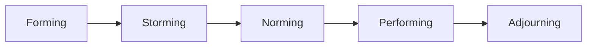
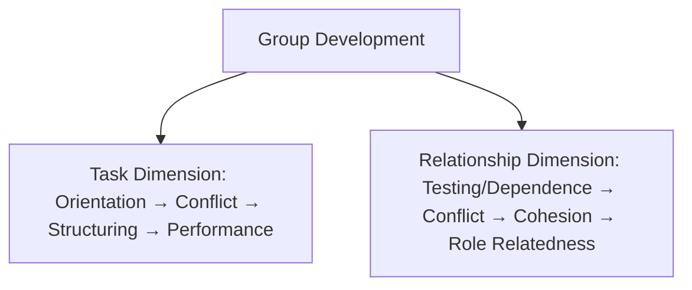
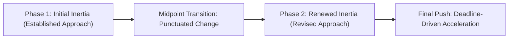

## Group Formation and Development Stages

### Overview

Group formation and development theory addresses a foundational question in organizational psychology: how do collections of individuals become functioning groups or teams over time, and what predictable patterns characterize this developmental trajectory? This body of research shifts analytical focus from static group composition (who is in the group) to the **dynamic, temporal process** by which groups evolve — moving through identifiable phases of interpersonal negotiation, role clarification, norm establishment, and task engagement.

The most influential and widely taught framework in this domain is Bruce Tuckman's stage model (1965, later revised 1977), though subsequent research has substantially complicated the simple linear-stage assumption, most notably through Gersick's punctuated equilibrium model.

### Tuckman's Stages of Group Development

#### The Original Four Stages (1965)

Bruce Tuckman's foundational model, derived from a review of small-group development studies, proposed four sequential stages:

1. **Forming** — the initial stage in which group members are polite, tentative, and oriented toward gathering information about one another, the task, and acceptable behavioral norms; conflict is generally avoided, and members rely heavily on external structure and the designated leader for direction
2. **Storming** — a stage characterized by interpersonal conflict, competition for roles and status, resistance to group control, and disagreement about task approach and group structure; this stage is often uncomfortable but is theorized as a necessary phase for surfacing and resolving underlying tensions
3. **Norming** — the group begins to develop cohesion, establish shared norms, values, and role expectations, and members demonstrate increased willingness to cooperate and reconcile earlier conflicts
4. **Performing** — the group reaches a stage of functional maturity, characterized by high task focus, flexible role allocation, effective problem-solving, and a group structure fully supportive of task accomplishment rather than requiring continuous negotiation

#### The Fifth Stage: Adjourning (1977)

Tuckman and Mary Ann Jensen later added a fifth stage to account for groups with a defined endpoint:

5. **Adjourning** — the group's task is completed and the group disbands; this stage involves recognition of accomplishment, emotional processing of the group's dissolution (which can range from relief to genuine grief depending on relationship quality developed), and transition of members to new activities or groups

**Key Points**

- Tuckman's model is explicitly sequential and linear in its original formulation, implying groups must pass through each stage (particularly storming) to reach mature, effective performance — skipping or suppressing the storming stage is theorized to leave underlying tensions unresolved, potentially resurfacing later and undermining group effectiveness
- [Unverified] While Tuckman's model remains the most widely taught and practically applied framework in organizational training, its original empirical basis derived primarily from a qualitative synthesis of existing studies (many involving therapy and training groups) rather than a single robust, direct empirical test, and subsequent research has found that not all groups progress through the stages in the same order, at the same pace, or through fully discrete, observable stages

**Example**: A newly assembled cross-functional product launch team initially proceeds cautiously, deferring heavily to the project lead's direction and avoiding overt disagreement (forming). As deadlines approach and differing departmental priorities surface, team members begin openly contesting the proposed launch timeline and resource allocation (storming). Following several difficult but candid discussions, the team agrees on decision-making protocols and a shared prioritization framework (norming). The team subsequently operates with minimal friction, flexibly reallocating tasks based on shifting needs without requiring constant renegotiation (performing). Upon successful launch, the team disbands, with members reflecting on lessons learned before moving to new project assignments (adjourning).

### Group Development Task and Relationship Dimensions

Tuckman's original synthesis identified two parallel dimensions unfolding simultaneously at each stage:

- **Task Activity Dimension** — how the group approaches and structures its actual work (orientation to task, conflict over approach, structuring of expectations, effective task performance)
- **Group Structure Dimension** (interpersonal/relational) — how members relate to one another interpersonally (testing/dependence, intragroup conflict, cohesion development, functional role relatedness)

[Inference] This dual-dimension structure implies that a group can experience friction or difficulty in one dimension while progressing smoothly in the other — for example, a team might resolve task-related disagreements about workflow relatively quickly while still working through deeper interpersonal trust issues, suggesting the stages may not always move in perfect lockstep across both dimensions simultaneously, even within Tuckman's own original framework.

### Gersick's Punctuated Equilibrium Model

Connie Gersick's (1988) empirical research on project teams with defined deadlines proposed a significantly different developmental pattern, directly challenging the assumption of smooth, linear stage progression:

- Teams tend to establish an initial approach or framework very early (often in the first meeting) and then maintain relative behavioral **inertia**, continuing with that established approach with little visible change for an extended period
- At the **temporal midpoint** of the group's allotted time (roughly halfway to a deadline), groups experience a marked transition — a burst of concentrated change, reassessment of their approach, and often increased urgency, described as a "midpoint transition"
- Following this transition, the group enters a second phase of relative inertia, executing a revised plan with renewed momentum, followed by a final acceleration in activity as the deadline approaches

**Key Points**

- Gersick's model is described as "punctuated equilibrium" by direct analogy to the evolutionary biology concept, emphasizing long periods of relative behavioral stability interrupted by sudden, concentrated bursts of change, rather than gradual, continuous stage-by-stage evolution
- Unlike Tuckman's model, which frames developmental progression as substantially driven by internal relational and task dynamics unfolding over time, Gersick's model gives significant explanatory weight to an external factor: **awareness of time and impending deadline**, particularly the psychologically significant temporal midpoint, as the primary catalyst for developmental transition
- [Inference] Because Gersick's research was conducted specifically on project teams with clear, fixed deadlines, this model may be particularly applicable to task forces, project teams, and time-bounded committees, while Tuckman's model, which does not depend on a fixed timeline, may generalize better to ongoing, non-time-bounded work groups — suggesting the two models may be complementary rather than strictly competing, each better suited to different group contexts

### Comparative Analysis: Tuckman vs. Gersick

| Dimension | Tuckman's Stage Model | Gersick's Punctuated Equilibrium |
| --- | --- | --- |
| Underlying pattern | Sequential, linear progression through discrete stages | Long periods of inertia punctuated by sudden transition |
| Primary driver of change | Internal task and relational dynamics | External temporal awareness (deadline, midpoint) |
| Best-fit context | Ongoing or open-ended groups without fixed deadlines | Project teams and task forces with defined deadlines |
| Predictability of transition timing | Stage timing varies by group; not tied to a fixed schedule | Transition reliably occurs near the temporal midpoint |

### Additional Perspectives on Group Formation

#### Homans' Systems Model

George Homans' earlier systems model (1950) frames group formation around three interacting elements: **activities** (what members do), **interactions** (patterns of contact among members), and **sentiments** (feelings and attitudes members develop toward one another and the group). Increased interaction frequency tends to generate increased positive sentiment, which in turn shapes further activities and interactions — a mutually reinforcing cycle foundational to understanding how initial group cohesion develops.

#### Integration Models and Newcomer Socialization

More recent research on ongoing, ever-changing group membership (rather than groups formed and dissolved as a single cohort) emphasizes **newcomer socialization processes** as a continuous, recurring micro-version of group formation: as new members join an established group, the group must renegotiate norms, roles, and relational patterns, suggesting that "formation" is not necessarily a one-time process but can recur throughout a group's lifespan whenever membership changes.

[Inference] This ongoing-socialization perspective implies that Tuckman's model, often taught as describing a group's entire lifecycle from a single starting point, may be more accurately understood as describing a recurring micro-cycle triggered by any significant membership or contextual change, rather than a process a mature group definitively completes once and never revisits.

### Group Development and Team Effectiveness Outcomes

- Groups that successfully navigate the storming stage (surfacing and resolving genuine conflict rather than suppressing it) generally show higher subsequent cohesion and performance than groups that avoid conflict entirely, consistent with broader conflict management research distinguishing constructive task conflict from destructive relationship conflict
- [Unverified] The degree to which explicit stage progression (as opposed to simply the passage of time and accumulated shared experience) causally drives improved group performance remains difficult to disentangle empirically, since groups that perform well may simply also happen to exhibit patterns that researchers retrospectively categorize as "norming" or "performing," rather than the stages themselves being the causal mechanism
- Facilitation and leadership interventions tailored to a group's developmental stage (e.g., providing more directive structure during forming, actively surfacing and mediating conflict during storming, stepping back to allow autonomy during performing) are widely recommended in applied team-development practice, closely paralleling the situational leadership logic discussed in the leadership domain (matching leader behavior to follower/group readiness)

### Criticisms and Limitations

- **Oversimplification of a complex, non-linear process**: subsequent research (including Gersick's own findings) has found that many groups do not progress through Tuckman's stages in strict linear order, some groups skip or abbreviate stages entirely, and some cycle back through earlier stages (particularly storming) when membership, tasks, or external conditions change
- **Limited empirical validation of the original model**: Tuckman's model, despite its widespread practical adoption, was derived from a narrative literature synthesis rather than a single rigorously controlled longitudinal study, and direct empirical tests attempting to validate the precise stage sequence have produced mixed results
- **Context-dependency**: the applicability of stage models may vary substantially based on group type (ongoing work team vs. time-bound project team vs. therapy/training group, the latter of which informed much of Tuckman's original synthesis), task interdependence, and organizational context, limiting the model's claim to universal applicability
- **Underspecification of virtual and distributed team dynamics**: [Unverified] both Tuckman's and Gersick's foundational models were developed prior to the widespread prevalence of virtual and geographically distributed teams; the extent to which these developmental patterns (particularly the storming stage's reliance on face-to-face conflict expression) generalize to primarily virtual team contexts remains an active and incompletely resolved area of contemporary research

### Practical Application in Organizations

- **Team formation and onboarding design**: recognizing the forming stage's dependence on external structure, leaders assembling new teams can proactively provide clear initial direction, defined roles, and structured introduction processes to reduce the ambiguity and anxiety characteristic of early group formation
- **Conflict facilitation during storming**: rather than treating early team conflict as a sign of dysfunction requiring suppression, team leads and facilitators can normalize and constructively channel storming-stage disagreement (e.g., through structured conflict resolution processes) to support the surfacing of genuine differences necessary for later cohesion
- **Project team deadline management**: applying Gersick's punctuated equilibrium insights, project leaders can deliberately schedule a formal midpoint review or reassessment checkpoint, recognizing this as a psychologically natural and productive juncture for teams to evaluate and revise their approach, rather than treating a midpoint course-correction as a sign of prior planning failure
- **Team facilitation and coaching**: applying situational leadership logic to group development, facilitators can calibrate their level of directiveness and structure to the team's apparent developmental stage, providing more scaffolding early and progressively greater autonomy as the team demonstrates increased cohesion and task capability
- **Managing membership change**: given the newcomer socialization perspective, organizations can anticipate that significant membership changes in an established team will trigger a renewed (if abbreviated) formation process, and can proactively support renegotiation of norms and roles rather than assuming an established team's prior "performing" status will automatically persist unchanged

**Related Topics**

- Team Cohesion and Collective Efficacy
- Team Roles and Role Differentiation (Belbin)
- Conflict Management and Negotiation
- Contingency and Situational Leadership Models
- Virtual and Distributed Team Dynamics
- Organizational Socialization and Newcomer Onboarding
- Psychological Safety (Edmondson)