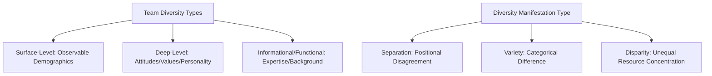
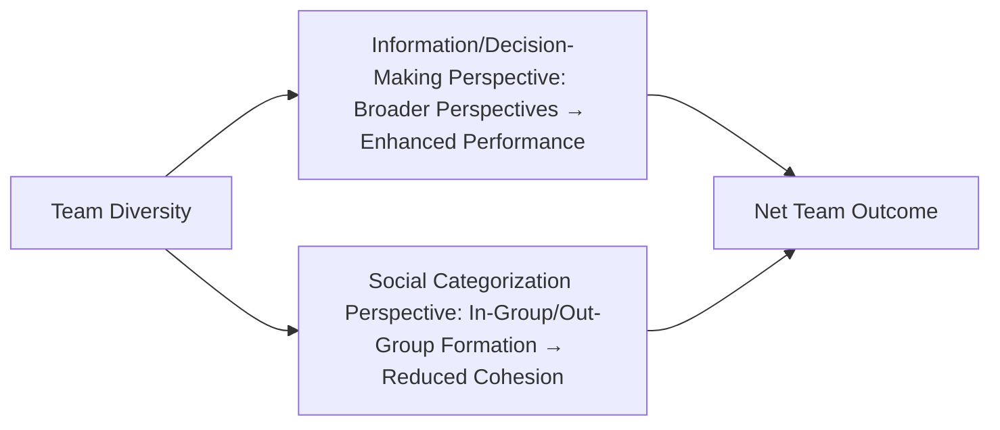
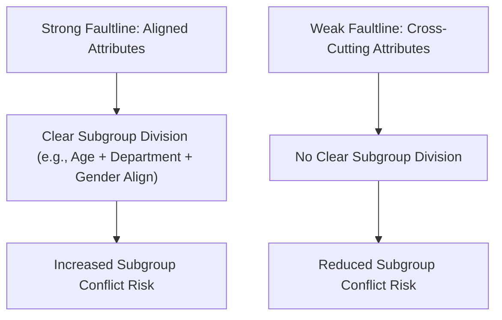
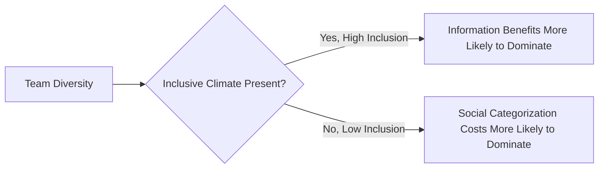

## Team Composition and Diversity

### Overview

Team composition research examines how the characteristics of individual team members — and the patterns of similarity and difference among them — shape team processes and outcomes. This domain addresses a question distinct from group *development* (how groups evolve over time) or team *cohesion* (how bonded a group becomes): given a fixed or forming set of individuals, what configurations of member attributes (skills, personality, demographic characteristics, values) tend to produce more or less effective team functioning?

Diversity research within this domain has produced a body of findings frequently described as containing a fundamental **paradox**: diversity can simultaneously enhance team outcomes (by broadening the range of perspectives, information, and skills available) and undermine team outcomes (by increasing interpersonal friction, communication difficulty, and subgroup fragmentation), with the actual net effect substantially dependent on moderating conditions rather than following a simple, universal positive or negative relationship.

### Types of Team Diversity

Organizational behavior research typically distinguishes diversity along several conceptually and empirically distinct dimensions:

1. **Surface-Level (Demographic) Diversity** — differences in readily observable characteristics such as age, gender, race/ethnicity, and physical characteristics; these are typically detectable immediately upon meeting someone, before any actual interaction has revealed underlying attitudes or capabilities
2. **Deep-Level Diversity** — differences in psychological characteristics such as attitudes, values, beliefs, and personality traits; these typically become apparent only through interaction and communication over time, rather than being immediately visible
3. **Informational/Functional Diversity** — differences in knowledge, expertise, educational background, and functional area (e.g., engineering versus marketing versus finance), often referred to as task-related diversity since it directly bears on the range of information and perspectives available for task performance
4. **Separation, Variety, and Disparity** (Harrison and Klein, 2007) — a further refinement distinguishing *how* diversity manifests along any given attribute:
   - **Separation** — differences in position or opinion along a single continuum (e.g., disagreement about strategic direction), where maximum diversity means members are polarized at opposite extremes
   - **Variety** — differences in kind or category, not degree (e.g., differing functional backgrounds), where maximum diversity means members are spread evenly across many distinct categories
   - **Disparity** — differences in the concentration of a valued social asset or resource (e.g., pay, status, decision authority), where maximum diversity means a highly unequal, hierarchical concentration among a few members

**Key Points**

- The Harrison and Klein refinement is significant because separation, variety, and disparity are theorized to produce qualitatively *different* team outcomes and may even require different measurement approaches (e.g., variance-based measures may suit variety, while more complex measures are needed for disparity), meaning the common practice of measuring "diversity" as a single undifferentiated construct risks conflating meaningfully distinct phenomena
- Surface-level and deep-level diversity are theorized to have different temporal dynamics: surface-level diversity effects (e.g., initial subgroup formation along demographic lines) are often most salient early in a team's life, while deep-level diversity effects tend to become more influential as team members interact and get to know one another over time (paralleling Tuckman's forming-to-norming trajectory)

### The Diversity Paradox: Competing Theoretical Perspectives

Two influential and partially competing theoretical traditions explain how diversity affects team outcomes through different mechanisms:

#### Information/Decision-Making Perspective

This perspective (drawing on cognitive resource diversity theory) holds that diverse teams possess a broader range of knowledge, perspectives, networks, and problem-solving approaches, which can enhance creativity, decision quality, and innovation, particularly on complex, non-routine tasks requiring integration of varied information.

#### Social Categorization/Similarity-Attraction Perspective

This perspective (drawing on social identity theory and similarity-attraction theory) holds that individuals naturally categorize themselves and others into in-groups and out-groups based on salient characteristics (often surface-level demographics), and that diversity along these salient dimensions can trigger subgroup formation, reduced trust, communication breakdown, and increased relationship conflict, undermining team cohesion and effectiveness.

**Key Points**

- These two mechanisms are not mutually exclusive — they can, and often do, operate simultaneously within the same diverse team, which is precisely why diversity's net effect on performance is empirically inconsistent across studies: the information-processing benefits and the social-categorization costs can partially offset one another, with the net result depending on which mechanism dominates in a given context
- [Inference] This dual-mechanism structure implies that interventions aimed at capturing diversity's benefits while minimizing its costs should focus specifically on suppressing the social categorization mechanism (e.g., building superordinate team identity, emphasizing shared goals) rather than assuming diversity's benefits will automatically emerge simply by increasing compositional variety

### Faultline Theory

**Team faultlines** (Lau and Murnighan, 1998) represent a particularly influential refinement of the diversity-conflict relationship: rather than examining diversity along single attributes in isolation, faultline theory examines how multiple diversity attributes **align or cross-cut** one another within a team.

- A **strong faultline** exists when multiple demographic or attribute characteristics align to create clearly divided, homogeneous subgroups (e.g., a team where all older members are also from the same department and same gender, cleanly separated from all younger members who share a different department and gender) — strong faultlines are theorized to increase the risk of subgroup conflict and reduced information sharing across the divide
- A **weak or absent faultline** exists when diversity attributes cross-cut one another such that no clean subgroup division emerges (e.g., age, gender, and department are distributed independently across team members, preventing any single dividing line from cleanly separating the team) — weak faultlines are theorized to reduce the risk of subgroup polarization even when overall diversity levels are high

**Key Points**

- Faultline theory represents a significant advance over simple diversity-index measures because it captures the *configuration* of diversity, not merely its aggregate quantity — two teams with identical overall diversity scores can have very different faultline strength depending on whether their diversity attributes align or cross-cut
- [Inference] This suggests that practical diversity-oriented team composition decisions should consider not only how many different demographic or background categories are represented, but specifically how those categories are distributed relative to one another, since deliberately cross-cutting composition (rather than simply maximizing aggregate diversity) may reduce subgroup conflict risk while retaining informational diversity benefits

### Task Type as a Moderator

A consistently replicated moderating finding across the diversity-performance literature is that diversity's net effect depends substantially on **task characteristics**:

| Task Type | Diversity Effect Pattern |
| --- | --- |
| Complex, creative, non-routine tasks (e.g., innovation, strategic problem-solving) | Diversity (particularly informational/functional diversity) more consistently associated with positive performance outcomes, since the task benefits from a wide range of perspectives and knowledge |
| Simple, routine, well-defined tasks | Diversity shows weaker or even negative associations with performance, since the task does not require integrating varied perspectives and diversity's coordination and communication costs are not offset by informational benefits |

[Unverified] While this task-contingency finding is well-replicated at a general level, the precise threshold of task complexity at which diversity's benefits begin to outweigh its coordination costs is not precisely established and likely varies by diversity type (informational diversity showing this pattern more clearly than surface-level demographic diversity, which shows more consistently mixed effects even on complex tasks).

### Personality Composition Models

Beyond demographic and functional diversity, team composition research also examines the aggregation of individual personality traits (commonly the Big Five) across team members, generally through several composition models:

- **Mean/Average Composition** — the team's average level of a trait (e.g., average conscientiousness), theorized to predict team performance on tasks where the trait is broadly beneficial regardless of which specific member possesses it
- **Variance/Diversity Composition** — the degree of dispersion in a trait across members, relevant when trait variety itself (rather than aggregate level) matters
- **Minimum/Maximum Composition** — the lowest or highest individual score on a trait within the team, relevant when a single team member's extreme trait level disproportionately affects team outcomes (e.g., the team's lowest-conscientiousness member may create a performance bottleneck, following a "weakest link" logic)

**Key Points**

- Team conscientiousness (particularly minimum/lowest-member conscientiousness) and team emotional stability are among the more consistently supported personality composition predictors of team performance, since low scores on these traits in even a single member can disrupt team functioning disproportionately
- [Inference] The variation across these composition models implies that the appropriate way to aggregate individual personality data for team-performance prediction is not a single universal formula but depends on the specific trait and task context — team designers cannot simply assume that averaging individual scores captures the relevant compositional information for every trait

### Diversity and Inclusion: The Role of Team Climate

Contemporary research increasingly emphasizes that diversity's effects are not fixed but are substantially moderated by the **inclusiveness of team climate** — the degree to which diverse members feel genuinely valued, heard, and integrated into team processes, as opposed to merely present in a numerically diverse team.

- Research on **diversity climate** and inclusive leadership finds that the positive information-processing benefits of diversity are more likely to be realized when team members experience psychological safety and genuine inclusion, while the negative social-categorization costs are more likely to dominate in teams with a numerically diverse composition but low inclusive climate
- This connects directly to psychological safety research (Edmondson) and to authentic/servant leadership's emphasis on individualized consideration, suggesting that leadership behavior is a critical moderating factor determining whether diversity's benefits or costs predominate in a given team

### Criticisms and Limitations

- **Inconsistent and context-dependent empirical findings**: decades of meta-analytic research on demographic diversity and team performance have produced notably inconsistent results, with some meta-analyses finding weak positive associations, others weak negative associations, and most finding near-zero average effects once moderators are accounted for — this inconsistency itself is a significant and well-documented finding, cautioning against simple universal claims that "diversity improves performance" or "diversity harms performance"
- **Conflation of diversity types in popular discourse and some research**: much applied organizational practice and even some academic research treats "diversity" as a single undifferentiated construct, obscuring the theoretically and empirically important distinctions between surface-level, deep-level, informational, and configurational (faultline) diversity that this literature has established
- **Measurement challenges for faultline strength**: while conceptually compelling, faultline strength is more complex to calculate than simple diversity indices, requiring specialized statistical approaches, which may limit its adoption in applied organizational practice relative to simpler (though less precise) diversity metrics
- **Underspecification of causal mechanisms in field settings**: much of the foundational social categorization and information-processing theoretical work derives from controlled laboratory studies; the degree to which these specific mechanisms operate identically in real organizational teams with ongoing relationships, organizational incentives, and career stakes remains an area of continued field-based investigation
- **Risk of instrumentalizing diversity**: [Inference] framing diversity primarily in terms of its instrumental performance benefits (the "business case for diversity") rather than as an independent ethical or equity consideration risks organizational commitment to diversity becoming contingent on performance evidence remaining favorable, rather than being grounded in fairness and representation as values independent of demonstrated performance impact — a critique increasingly raised in the diversity management literature

### Practical Application in Organizations

- **Team composition and staffing decisions**: applying faultline theory, team designers can deliberately construct teams with cross-cutting rather than aligned diversity attributes (e.g., ensuring departmental background does not perfectly correlate with tenure or location) to reduce subgroup polarization risk while preserving informational diversity benefits
- **Matching diversity strategy to task type**: organizations assembling teams for complex, innovation-oriented work can deliberately prioritize functional and informational diversity, while teams for highly routine, standardized tasks may derive less benefit from diversity-maximizing composition strategies and should weigh coordination costs accordingly
- **Inclusive leadership training**: given the critical moderating role of team climate, leadership development for team leads increasingly emphasizes inclusive facilitation practices (ensuring equal voice, actively soliciting input from quieter or lower-status members) to help realize diversity's informational benefits while suppressing social-categorization costs
- **Personality-informed team design**: incorporating minimum-conscientiousness and team emotional stability screening into team composition decisions for tasks with significant interdependence, given the "weak link" logic associated with these particular traits
- **Diversity metrics beyond headcount**: moving organizational diversity measurement and reporting beyond simple aggregate representation percentages toward more sophisticated composition analysis (faultline strength, cross-cutting attribute distribution) to better anticipate and proactively manage subgroup dynamics in team and organizational design

**Related Topics**

- Group Formation and Development Stages
- Team Cohesion and Collective Efficacy
- Psychological Safety (Edmondson)
- Social Identity Theory and In-Group/Out-Group Dynamics
- Conflict Management and Negotiation
- Leader-Member Exchange Theory
- Inclusive Leadership Practices