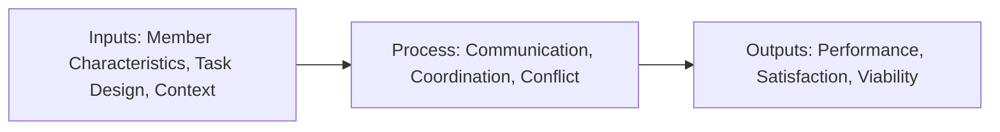
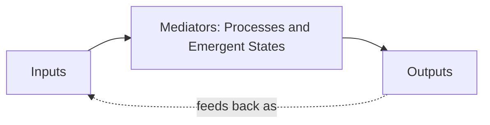
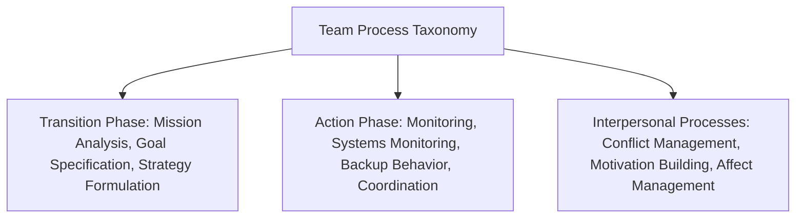
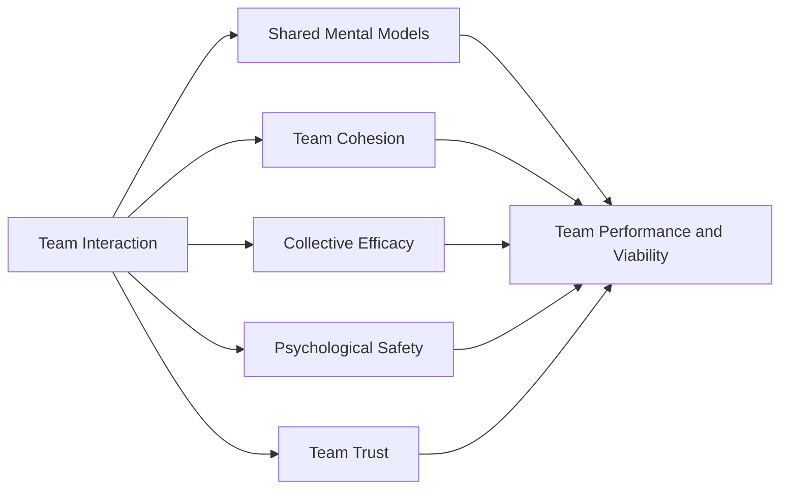
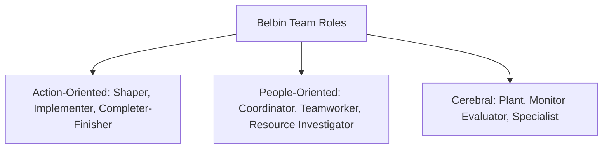
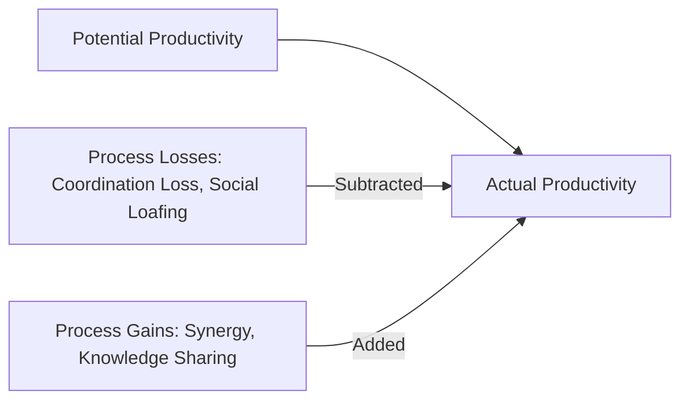

## Team Roles and Process

### Overview

Team roles and process research examines the internal functioning of teams once assembled — the differentiated behavioral patterns individual members adopt (roles) and the interaction patterns through which teams convert inputs (member characteristics, resources, task design) into outputs (performance, member satisfaction). This domain complements but is distinct from team composition research: composition asks "who is on the team," while roles and process ask "what do members actually do, and how do their behaviors combine to produce team functioning?"

The foundational organizing framework for this domain is the **Input-Process-Output (I-P-O) model**, later expanded to the **Input-Mediator-Output-Input (IMOI)** model to better capture the cyclical, non-linear nature of ongoing team functioning.

### The Input-Process-Output (I-P-O) Framework

The classic I-P-O model (McGrath, 1964) organizes team effectiveness research into three sequential categories:

1. **Inputs** — antecedent conditions that exist prior to or independent of team interaction: member characteristics (skills, personality, diversity), task design, organizational context, and available resources
2. **Process** — the interactions, behaviors, and dynamics through which members combine their individual inputs to accomplish collective work: communication patterns, coordination, conflict, decision-making
3. **Outputs** — the resulting outcomes of team functioning: performance, member satisfaction, team viability (the team's capacity to continue functioning effectively over time)

#### The IMOI Refinement

Ilgen, Hollenbeck, Johnson, and Jundt (2005) proposed replacing "Process" with the broader term **"Mediators"** (encompassing both behavioral processes and emergent states, discussed below) and explicitly reintroducing outputs as feeding back into subsequent inputs, reflecting the reality that most organizational teams operate cyclically over multiple task episodes rather than in a single linear pass.

**Key Points**

- The IMOI relabeling reflects an important theoretical distinction: not everything that mediates between inputs and outputs is a behavioral "process" in the strict sense — some mediating variables are **emergent states**, relatively stable psychological conditions that arise from team interaction (e.g., trust, cohesion, collective efficacy) rather than dynamic behaviors themselves
- The feedback loop in IMOI captures an important practical reality: a team's performance on one task episode becomes an input condition (via accumulated trust, established norms, or damaged relationships) shaping the team's subsequent functioning on future tasks

### Marks, Mathieu, and Zaccaro's Taxonomy of Team Processes

The most influential and comprehensive contemporary taxonomy of team processes (Marks, Mathieu, and Zaccaro, 2001) organizes team processes into three broad phases, recognizing that teams cycle between **action phases** (actively executing tasks toward goal accomplishment) and **transition phases** (evaluating past performance and planning for upcoming action periods).

#### Transition Phase Processes

1. **Mission Analysis** — interpreting and understanding the team's overall mission, task requirements, and environmental constraints
2. **Goal Specification** — identifying and prioritizing specific goals and objectives for the upcoming action period
3. **Strategy Formulation and Planning** — developing and organizing courses of action to achieve established goals

#### Action Phase Processes

4. **Monitoring Progress Toward Goals** — tracking progress, interpreting system/task information, and communicating status to team members
5. **Systems Monitoring** — tracking resources needed to complete the task and monitoring the internal and environmental conditions relevant to task accomplishment
6. **Team Monitoring and Backup Behavior** — assisting other team members in performing their tasks, including shifting workload among members to achieve balance
7. **Coordination** — orchestrating the sequence and timing of interdependent task activities among team members

#### Interpersonal Processes (Occurring Continuously Across Both Phases)

8. **Conflict Management** — preemptively establishing conditions to prevent counterproductive conflict and managing conflict that does arise
9. **Motivation and Confidence Building** — generating and preserving a shared sense of collective confidence, motivation, and task commitment
10. **Affect Management** — regulating members' emotions, including social cohesion and coping with stressful demands

**Key Points**

- This taxonomy explicitly recognizes that effective teams cycle repeatedly between transition and action phases across the lifespan of a project, rather than experiencing a single planning stage followed by a single execution stage
- **Backup behavior** is a particularly significant process construct, capturing the degree to which team members proactively monitor one another's workload and step in to assist when a colleague is overloaded or struggling — this behavior is closely associated with the concept of **shared mental models**, discussed below, since effective backup behavior requires members to understand enough about each other's roles to meaningfully assist

### Emergent States

Distinguished from behavioral processes, **emergent states** are relatively stable psychological or affective properties that develop as a result of team member interactions, experiences, and cognitions, and that in turn shape subsequent team processes and outcomes.

1. **Shared Mental Models** — a common understanding among team members regarding the task, equipment, roles, and interaction patterns needed for effective coordination; teams with well-developed shared mental models can coordinate implicitly (without explicit communication) because members accurately anticipate what others need or will do
2. **Team Cohesion** — the degree of interpersonal attraction and commitment members feel toward the team and one another, often distinguished into task cohesion (shared commitment to team goals) and social cohesion (interpersonal liking and bonding)
3. **Collective Efficacy** — the shared belief among team members in the team's collective capability to successfully execute a course of action required to produce a given level of performance, directly extending Bandura's individual self-efficacy construct to the team level
4. **Psychological Safety** — the shared belief that the team is safe for interpersonal risk-taking, such as admitting mistakes, asking questions, or challenging prevailing views, without fear of embarrassment or retaliation
5. **Team Trust** — the shared willingness among members to be vulnerable to one another's actions based on the expectation that other members will perform important actions and behave in a predictable, benevolent manner

**Key Points**

- Shared mental models are particularly critical for **implicit coordination** — the ability of teams to adjust behavior appropriately without explicit verbal communication, which becomes especially important under time pressure or high-workload conditions where explicit communication may be impractical
- Collective efficacy and self-efficacy, while conceptually parallel, are not simply the aggregate of individual members' self-efficacy — a team can have high collective efficacy even if individual members have moderate individual self-efficacy, since collective efficacy reflects beliefs specifically about the team's *combined* capability
- [Inference] Because emergent states develop through repeated interaction over time, teams facing significant membership turnover face a structural disadvantage in developing these states, since shared mental models, trust, and collective efficacy generally require accumulated shared experience rather than being achievable through initial team charter or training alone

### Team Role Theory: Belbin's Team Role Model

Beyond generic process categories, a distinct and widely applied practitioner-oriented framework addresses the specific behavioral **roles** individuals tend to adopt within teams. Meredith Belbin's model (1981), developed through extensive observational research on management teams, identifies nine team roles clustered into three broader categories:

| Category | Roles | Core Contribution |
| --- | --- | --- |
| Action-Oriented | Shaper, Implementer, Completer-Finisher | Driving task execution, converting ideas into action, ensuring quality and thoroughness |
| People-Oriented | Coordinator, Teamworker, Resource Investigator | Managing team relationships, ensuring cohesion, connecting the team to external resources and ideas |
| Cerebral (Thought-Oriented) | Plant, Monitor Evaluator, Specialist | Generating creative ideas, providing critical/analytical judgment, contributing deep expertise |

**Key Points**

- Belbin's model is explicitly practitioner-oriented and widely used in team-building and organizational development consulting practice; individuals typically complete a self-report and observer-report instrument to identify their preferred and secondary team roles
- Belbin's central prescriptive claim is that well-balanced teams — containing individuals who collectively cover the full range of roles, rather than being overloaded with similar role types — outperform imbalanced teams, since different roles address different functional needs across the team's task and interpersonal requirements
- [Unverified] Belbin's model, while extremely popular in applied organizational development practice, has received more mixed and limited support in rigorous academic psychometric validation studies compared to more empirically robust personality frameworks (e.g., the Big Five), and some researchers have raised concerns about the model's factor structure and predictive validity relative to its practical popularity

### Functional Role Differentiation: Task vs. Maintenance Roles

A simpler, older, and more empirically foundational distinction (originating in early group dynamics research, e.g., Benne and Sheats, 1948) separates team member roles into two broad functional categories:

1. **Task Roles** — behaviors directed at accomplishing the group's work (e.g., initiating discussion, seeking or giving information, clarifying, summarizing, evaluating proposals)
2. **Maintenance (Socioemotional) Roles** — behaviors directed at sustaining positive interpersonal relationships and group cohesion (e.g., encouraging participation, harmonizing conflict, gatekeeping to ensure balanced participation, relieving tension)

A third category, **dysfunctional/self-oriented roles** (e.g., blocking, seeking recognition, dominating discussion), captures behaviors that serve individual needs at the expense of group functioning.

[Inference] This older task/maintenance distinction maps conceptually onto the more elaborated Marks, Mathieu, and Zaccaro taxonomy's separation of action-phase/transition-phase processes (task-oriented) from interpersonal processes (maintenance-oriented), suggesting a durable conceptual thread running through team dynamics research across multiple decades and theoretical generations, even as specific taxonomies have grown more granular.

### Process Losses and Process Gains

A foundational concept from Steiner's (1972) group productivity model distinguishes potential team productivity (the theoretical maximum based on aggregating individual member resources) from actual team productivity:

$$\text{Actual Productivity} = \text{Potential Productivity} - \text{Process Losses} + \text{Process Gains}$$

- **Process Losses** — reductions in team performance below theoretical potential due to coordination difficulties (coordination loss) or reduced individual effort in group settings (motivation loss, most notably **social loafing** — the tendency for individuals to exert less effort on collective tasks than when working individually, particularly when individual contributions are not separately identifiable)
- **Process Gains** — increases in team performance above the simple sum of individual contributions, arising from effective processes such as knowledge sharing, mutual error-checking, motivational synergy, and the emergent states discussed above (shared mental models enabling more efficient coordination than any individual could achieve alone)

**Key Points**

- Social loafing is one of the most extensively replicated findings in group dynamics research, with a large body of evidence showing effort reduction increases with team size and decreases when individual contributions are identifiable or evaluated separately (directly informing practical team design recommendations discussed below)
- Effective team process design (clear individual accountability, well-structured coordination mechanisms, strong emergent states like trust and psychological safety) is the primary lever through which organizations can minimize process losses and maximize process gains, since input factors (member quality) alone do not guarantee that potential productivity will be realized

### Criticisms and Limitations

- **Overlapping and inconsistent process taxonomies**: multiple competing process frameworks exist across the literature (Marks, Mathieu, and Zaccaro's taxonomy; Belbin's role model; the older task/maintenance distinction), with substantial conceptual overlap but inconsistent terminology, complicating cross-study synthesis and creating some redundancy in how team functioning is measured and discussed
- **Belbin's limited psychometric validation**: as noted, Belbin's widely applied practitioner model has faced more sustained academic scrutiny regarding its factor structure and predictive validity than its popularity in organizational practice might suggest, representing a notable gap between applied adoption and rigorous empirical support
- **Difficulty isolating process effects from composition and context**: because team processes, emergent states, and member composition are deeply intertwined and mutually influential (as the IMOI feedback loop suggests), isolating the independent causal contribution of process variables from input variables remains methodologically challenging in field research
- **Static role assumptions**: role-based frameworks (Belbin, task/maintenance) can understate the degree to which effective team members flexibly shift between roles depending on situational needs, rather than consistently enacting a single fixed role — a critique that parallels the constructionist critique of fixed leader/follower identity discussed in the followership domain

### Practical Application in Organizations

- **Team charter and process design**: applying the Marks, Mathieu, and Zaccaro taxonomy, team leads can deliberately schedule transition-phase activities (mission analysis, goal-setting, strategy planning) between action phases rather than treating planning as a one-time initial event, ensuring teams periodically reassess and adjust as projects unfold
- **Building shared mental models**: cross-training team members on each other's roles and responsibilities, conducting structured after-action reviews, and using standardized communication protocols can accelerate the development of shared mental models, particularly valuable for teams facing high time pressure or membership turnover
- **Mitigating social loafing**: designing tasks and evaluation systems that preserve individual accountability (identifiable individual contributions, individual performance tracking alongside team metrics) directly addresses one of the most well-established process losses in team settings
- **Balanced team composition using role frameworks**: while approaching Belbin's specific model with appropriate awareness of its psychometric limitations, many organizations still find value in using structured role-awareness exercises to ensure teams are not inadvertently overloaded with similar behavioral tendencies (e.g., all idea-generators and no implementers)
- **Investing in emergent states directly**: since psychological safety, trust, and collective efficacy function as critical mediators between team inputs and outputs, team development interventions (structured trust-building exercises, psychological safety training for team leads, deliberate early-stage relationship investment) can be understood as investments in these specific emergent states rather than generic "team building" without a clear theoretical target

**Related Topics**

- Group Formation and Development Stages
- Team Composition and Diversity
- Psychological Safety (Edmondson)
- Social Loafing and Free-Rider Effects
- Self-Efficacy and Social Cognitive Theory (Bandura)
- Conflict Management and Negotiation
- Virtual and Distributed Team Dynamics