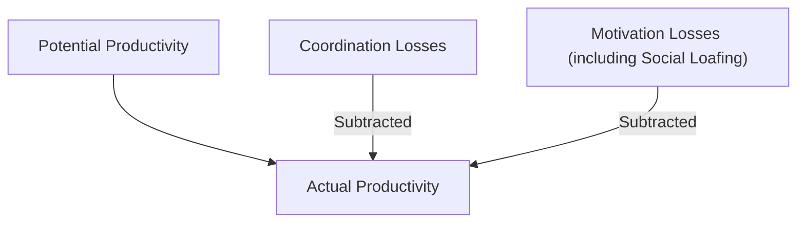
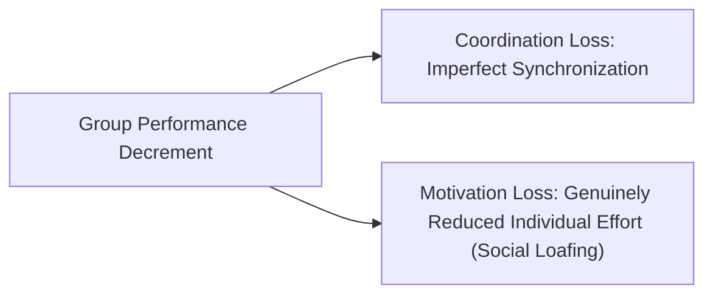
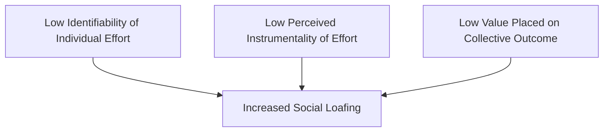
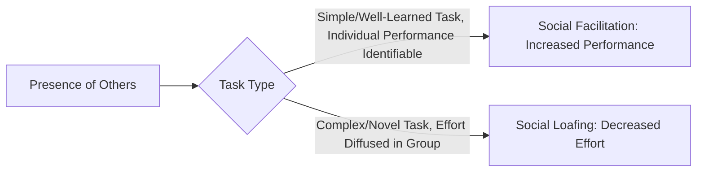

## Social Loafing and Process Losses

### Overview

Social loafing and process losses address a core problem in group dynamics research: why do groups so often perform below their theoretical potential, and specifically, why do individuals sometimes exert less effort when working collectively than when working alone? This domain provides the conceptual foundation that was introduced briefly under "Team Roles and Process" (via Steiner's productivity model) but is examined here in its own right as a distinct and extensively researched phenomenon, given its practical significance for team design, accountability structures, and performance management.

The central theoretical contribution uniting this literature is the recognition that group performance is not simply the sum of individual capabilities — the process of converting individual inputs into collective output is itself a variable that can systematically degrade (or occasionally enhance) performance relative to what individual capabilities alone would predict.

### Steiner's Model of Group Productivity

Ivan Steiner's (1972) foundational model provides the formal framework within which social loafing is theoretically situated:

$$\text{Actual Productivity} = \text{Potential Productivity} - \text{Process Losses}$$

- **Potential Productivity** — the theoretical maximum output a group could achieve given the resources (skills, knowledge, effort capacity) of its individual members, essentially the sum of what members could contribute under ideal coordination and motivation conditions
- **Process Losses** — reductions in actual output below potential productivity, arising from two broad sources:
  1. **Coordination Losses** — inefficiencies arising from the difficulty of synchronizing and integrating individual efforts (e.g., communication overhead, scheduling conflicts, duplicated or misaligned work)
  2. **Motivation Losses** — reductions in individual effort exerted in group settings compared to individual settings, of which social loafing is the most extensively studied form

**Key Points**

- Steiner's model also implies the possibility of **process gains** (increases above potential productivity through synergy, discussed in the Team Roles and Process domain), meaning process is not universally a source of loss — but empirical research finds process losses are considerably more commonly and reliably documented than process gains across most task types
- Task type moderates which loss category dominates: highly interdependent, complex tasks tend to suffer more from coordination losses, while simple, additive tasks (where individual contributions are simply summed) tend to be more susceptible to motivation losses like social loafing

### Social Loafing: Definition and Foundational Research

**Social loafing** is defined as the tendency for individuals to exert less effort when working collectively on a task than when working individually on the same task. The phenomenon was first empirically documented by Max Ringelmann (a French agricultural engineer) in the late 19th century, in research now referred to as the **Ringelmann Effect**.

#### The Ringelmann Effect

Ringelmann's original rope-pulling studies found that as group size increased, the average individual force exerted decreased — groups of eight pulled with less than half the force that would be predicted by simply summing each individual's solo pulling force. Ringelmann's work predates and is distinct from, but closely related to, the specific psychological construct of social loafing later formalized by Latané, Williams, and Harkins.

#### Latané, Williams, and Harkins (1979)

This research team's foundational studies (using tasks like shouting and clapping) experimentally distinguished the *coordination loss* explanation (Ringelmann's original hypothesis, that force is lost due to imperfect synchronization of physical effort) from a distinct *motivational* explanation. By comparing actual groups to "pseudo-groups" (individuals who believed they were performing collectively but were actually performing alone, with no possibility of coordination loss), the researchers demonstrated that a substantial portion of the performance decrement was attributable to genuinely reduced individual effort — establishing social loafing as a real motivational phenomenon distinct from mere coordination difficulty.

**Key Points**

- This experimental separation of coordination loss from motivation loss represents one of the more methodologically elegant demonstrations in group dynamics research, since it isolated a purely psychological effect from a purely mechanical/logistical one
- Karau and Williams' (1993) meta-analysis, synthesizing dozens of subsequent studies across various tasks and cultures, confirmed social loafing as a robust and highly replicable phenomenon, while also identifying the moderating conditions discussed below

### The Collective Effort Model (Karau and Williams)

Karau and Williams' (1993) **Collective Effort Model** provides the leading theoretical explanation for *why* social loafing occurs, grounded in expectancy theory. The model proposes that individuals will reduce effort in collective settings specifically when they perceive that their individual effort is:

1. **Not identifiable** — their specific contribution cannot be distinguished from the group's aggregate output, reducing accountability
2. **Not necessary or instrumental** — they perceive that the group's outcome does not depend meaningfully on their specific individual effort, either because the task is additive and others can compensate, or because the outcome feels evaluatively meaningless to them personally
3. **Not connected to a valued outcome** — even if identifiable and instrumental, the individual may not sufficiently value the collective outcome to be motivated to exert full effort toward it

[Inference] This expectancy-theory grounding directly implies that social loafing is not simply a fixed trait of "lazy" individuals but a rational, situationally responsive response to specific structural conditions — meaning it should, in principle, be substantially reducible through deliberate task and accountability redesign rather than requiring individual-level motivational intervention alone.

### Key Moderators of Social Loafing

Extensive research has identified conditions that reliably increase or decrease the magnitude of social loafing:

| Moderator | Effect on Social Loafing |
| --- | --- |
| Group size | Larger groups → increased loafing (identifiability and perceived instrumentality both decrease as group size grows) |
| Individual identifiability of contribution | Higher identifiability → reduced loafing |
| Task meaningfulness/personal involvement | Higher perceived meaningfulness → reduced loafing |
| Task complexity | Complex, engaging tasks → generally reduced loafing compared to simple, tedious tasks |
| Group cohesion | Higher cohesion → generally reduced loafing |
| Expectation that others will loaf ("sucker effect") | Expectation of others' low effort → increased own loafing, as individuals avoid feeling exploited for exerting full effort while others coast |
| Cultural individualism/collectivism | [Unverified] Some cross-cultural research (notably Earley, 1989) has found social loafing to be less pronounced or even reversed (a "social striving" pattern) in more collectivist cultural contexts, where group membership and in-group performance carry greater personal identity significance, though this cross-cultural moderation has not been uniformly replicated across all subsequent studies |
| Gender | [Unverified] Some meta-analytic evidence suggests social loafing may be somewhat more pronounced among men than women on average, though effect sizes for this moderator are generally smaller and less consistently documented than for structural moderators like identifiability and group size |

**Key Points**

- The **"sucker effect"** is a particularly important secondary mechanism: even individuals who are not initially inclined to loaf may reduce their own effort if they come to believe other group members are loafing, since continuing to exert full effort under those conditions feels like being exploited — this creates a potential downward spiral in group effort norms once loafing becomes visible or suspected
- Group cohesion's protective effect against social loafing connects directly to the emergent states literature (Team Roles and Process domain): cohesive teams appear to sustain higher individual accountability and mutual monitoring, partially through informal social pressure and genuine care about letting fellow members down

### Distinguishing Social Loafing from Related Constructs

| Concept | Distinguishing Feature |
| --- | --- |
| Social Loafing | Reduced individual effort specifically in collective/group settings compared to individual settings |
| Free-Riding | A closely related but conceptually distinct phenomenon in which an individual deliberately relies on others' efforts to obtain a shared benefit, often used interchangeably with social loafing in applied contexts but originating from different theoretical traditions (public goods/economic theory versus social psychology) |
| Diffusion of Responsibility | A broader social psychological phenomenon (most associated with bystander intervention research) in which individuals feel less personal responsibility to act as the number of people present increases; social loafing can be understood as a specific manifestation of this broader principle applied to effort exertion on tasks |
| Coordination Loss | A distinct, non-motivational source of process loss arising from difficulty synchronizing individual contributions, as distinguished experimentally by Latané, Williams, and Harkins |
| Shirking (Organizational/Economic Framing) | A related concept from organizational economics and principal-agent theory, emphasizing the information asymmetry and monitoring costs that allow reduced effort to go undetected, offering a complementary economic lens to the psychological social loafing construct |

### Additional Sources of Motivation Loss

Beyond social loafing specifically, the broader motivation loss category encompasses related but distinct phenomena:

- **Free-Rider Effect** — as noted, closely related to social loafing but emphasizing the deliberate, calculated decision to rely on others' contributions rather than a more diffuse motivational reduction
- **Sucker Effect** — discussed above as a moderator, but also recognized as a distinct source of motivation loss in its own right, since it represents effort withdrawal triggered specifically by perceived unfairness rather than reduced accountability per se

### Social Facilitation: A Contrasting Phenomenon

An important theoretical counterpoint to social loafing is **social facilitation** (Zajonc, 1965) — the finding that the mere presence of others can, under certain conditions, *increase* individual performance rather than decrease it, particularly for well-learned, simple, or dominant-response tasks, while potentially still impairing performance on complex, novel tasks requiring careful, effortful cognitive processing.

[Inference] The apparent tension between social facilitation (presence of others increases effort/performance) and social loafing (group membership decreases effort) is generally reconciled by recognizing that the critical distinguishing variable is not mere presence of others but **evaluative identifiability**: social facilitation research typically involves individual performance remaining separately observable even in the presence of others (e.g., being watched while performing alone), while social loafing research specifically involves individual contributions becoming pooled and indistinguishable within a collective output — reinforcing the Collective Effort Model's emphasis on identifiability as a central causal mechanism.

### Criticisms and Limitations

- **Predominantly laboratory-based evidence base**: much of the foundational social loafing research (Ringelmann, Latané, Williams, and Harkins, and much subsequent work) relies on artificial laboratory tasks (rope-pulling, shouting, clapping, brainstorming) with relatively low ecological validity; the degree to which findings generalize precisely to complex, long-term, real-world organizational team tasks with career and relational stakes involved is less thoroughly established than the robust laboratory evidence base might suggest
- **Cross-cultural replication inconsistency**: as noted, the individualism/collectivism moderation proposed by Earley and others has not been uniformly replicated, leaving some uncertainty about the universality of social loafing versus its potential to be culturally contingent or even reversed under specific collectivist conditions
- **Conflation with related but distinct constructs**: the applied and even some academic literature sometimes uses "social loafing," "free-riding," and "shirking" interchangeably despite their distinct theoretical origins and subtly different implied mechanisms, which can obscure precisely which underlying process is being addressed by a given intervention
- **Limited longitudinal research on loafing dynamics over time**: most social loafing research examines effort in single-session tasks; less is known about how loafing patterns develop, stabilize, or change over the lifespan of ongoing organizational teams, where reputational and relational consequences of loafing may operate quite differently than in one-time laboratory studies

### Practical Application in Organizations

- **Preserving individual accountability in task design**: applying the Collective Effort Model directly, task and performance management systems that maintain identifiable individual contributions within group work (e.g., tracking specific deliverables per team member even within a shared project) substantially reduce the conditions that enable social loafing
- **Enhancing perceived instrumentality**: structuring team tasks so that individual contributions are genuinely necessary and visible to final outcomes (rather than fully substitutable or redundant) increases perceived instrumentality and reduces the rational basis for reduced effort
- **Managing group size deliberately**: given the robust group-size effect, organizations should be cautious about defaulting to large team sizes for tasks that do not genuinely require broad participation, since unnecessarily large groups increase loafing risk without a corresponding task-based justification
- **Building cohesion and addressing the sucker effect proactively**: fostering team cohesion and establishing clear, visible norms of mutual effort (potentially through transparent progress-sharing or peer accountability structures) can reduce both baseline loafing and the risk of a "sucker effect" spiral once any perceived under-contribution becomes visible
- **Task meaningfulness and framing**: connecting collective tasks to outcomes team members personally value, and clearly communicating why the task matters, addresses the third Collective Effort Model condition (valued outcomes), complementing structural accountability measures with motivational framing
- **Peer evaluation and 360-degree contribution assessment**: incorporating structured peer assessment of individual contribution within team-based work (common in academic group projects and increasingly in organizational team performance reviews) directly operationalizes the identifiability principle at scale

**Related Topics**

- Team Roles and Process
- Group Formation and Development Stages
- Team Composition and Diversity
- Expectancy Theory of Motivation
- Diffusion of Responsibility and Bystander Effect
- Performance Appraisal Systems and Rating Bias
- Virtual and Distributed Team Dynamics