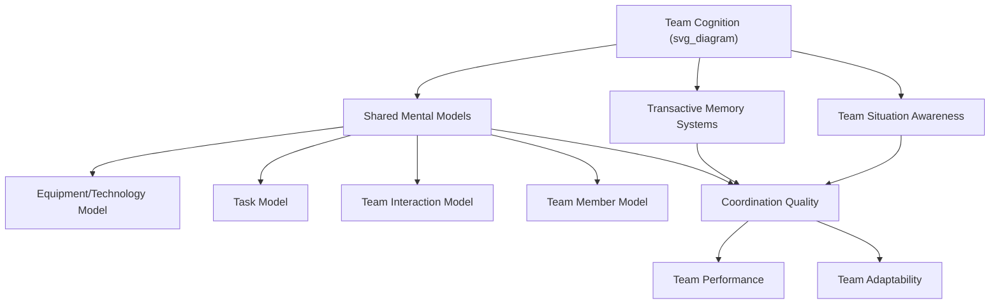

## Shared Mental Models and Team Cognition

### Definition and Conceptual Overview

Team cognition refers to the manner in which knowledge important to team functioning is mentally organized, represented, and distributed among team members, and how that cognition emerges from and shapes team processes. **Shared mental models (SMMs)** are a central construct within this domain, defined as organized knowledge structures that are shared, to some meaningful degree, among team members, allowing them to form accurate explanations and expectations for tasks and to coordinate their actions accordingly (Cannon-Bowers, Salas, & Converse, 1993).

The core theoretical premise: teams whose members hold compatible mental representations of the task, tools, roles, and each other can coordinate more efficiently—particularly under conditions where explicit communication is limited, time-pressured, or impossible (e.g., surgical teams, flight crews, military units).

### Taxonomy of Shared Mental Model Content

Cannon-Bowers et al. (1993) proposed four content types teams may hold shared models about:

- **Equipment/technology model**: Shared understanding of tools, equipment, and technology used to perform the task (how systems operate, their functions and limitations)
- **Task model**: Shared understanding of task procedures, strategies, likely contingencies, and environmental constraints
- **Team interaction model**: Shared knowledge of roles and responsibilities, interaction patterns, communication channels, and information flow among members
- **Team member model** (also called teammate model): Knowledge of teammates' individual knowledge, skills, abilities, preferences, and tendencies

**Key Points**

- Task and equipment models are often described as more **taskwork-oriented**, while team interaction and team member models are more **teamwork-oriented**
- **[Inference]** This taskwork/teamwork distinction is analytically useful but the two categories are not fully independent in practice—accurate teammate models frequently depend on and interact with shared task understanding

### Convergent vs. Compatible Sharedness

An important theoretical refinement distinguishes between two ways mental models can be "shared":

- **Similarity/convergence**: Team members hold nearly identical content in their mental models
- **Complementarity/compatibility**: Team members hold different but complementary knowledge that, together, forms a coherent and coordinated understanding (relevant especially for cross-functional or highly specialized teams, where full content overlap is neither feasible nor desirable)

**[Inference]** For teams with highly differentiated expertise (e.g., a surgical team combining a surgeon, anesthesiologist, and nurses), compatibility of team-interaction and team-member models may matter more than convergence of task-specific technical knowledge, since each member's specialized task knowledge is expected to differ by design.

### Related Constructs in Team Cognition

**Transactive Memory Systems (TMS)**

A distinct but related construct (Wegner, 1987) describing a shared system for encoding, storing, and retrieving information across team members, built on differentiated (not necessarily identical) knowledge combined with accurate meta-knowledge of "who knows what." TMS is typically characterized by three components:

- **Specialization**: Differentiated, non-redundant expertise across members
- **Credibility**: Trust in teammates' expertise
- **Coordination**: Smooth, efficient enactment of specialized knowledge in task execution

**Team Situation Awareness**

Refers to the degree to which team members possess accurate, congruent perceptions of the current situation/environment as it evolves, extending individual situation awareness models (Endsley, 1995) to the team level.

**Cognitive Consensus vs. Cognitive Accuracy**

A measurement/theoretical distinction: consensus refers to the degree of agreement among team members' mental models regardless of correctness, while accuracy refers to how well a shared model matches an expert or "true" referent model. High consensus without high accuracy can produce **groupthink-like coordination on an incorrect shared understanding**.

### Formation and Antecedents of Shared Mental Models

- **Team training interventions**: Cross-training (where members are trained on teammates' roles/tasks), team leader briefings, and simulation-based training have shown effectiveness for building SMMs
- **Team stability and shared experience**: Longer-tenured, more stable teams tend to develop richer and more convergent shared models through accumulated joint experience
- **Communication processes**: Explicit communication (briefings, debriefings) and implicit coordination behaviors both contribute, though their relative contribution likely shifts as SMMs mature (early-stage teams may rely more on explicit communication; mature teams increasingly coordinate implicitly)
- **Leadership behaviors**: Team leaders who engage in explicit strategizing, briefing, and shared-vision communication facilitate SMM formation

### Measurement Approaches

**Key Points**

- **Pathfinder/network-based methods**: Elicit individual members' perceived relationships among key task-relevant concepts, then compute similarity indices (e.g., via graph-theoretic distance measures) across members' networks
- **Concept-mapping and card-sorting tasks**: Members sort or map task-relevant concepts; researchers compute inter-member similarity
- **Interpositional Knowledge (IPK) measures**: Assess the degree to which members understand teammates' roles and tasks, often via knowledge tests about other positions
- **Rating-scale surveys**: Self-report perceptions of shared understanding within the team (simpler to administer, but conflates perceived sharedness with actual cognitive overlap)

**[Unverified]** The convergent validity across these differing measurement approaches (e.g., whether network-based similarity scores and self-report sharedness ratings converge on the same underlying construct) is not fully established and appears to vary by study and task domain.

### Consequences of Shared Mental Models

Meta-analytic and empirical research links SMMs to:

- **Team performance**: Positive relationship, generally stronger for taskwork-related SMM content than for teamwork-related content, though both matter
- **Coordination quality**: Teams with more accurate/convergent SMMs display smoother implicit coordination, particularly valuable under high workload or time pressure when explicit communication is constrained
- **Team adaptability**: Shared models help teams adjust coordinated action rapidly when task demands shift unexpectedly
- **Reduced coordination errors**: Especially documented in high-reliability domains (aviation crew resource management, surgical teams, military command-and-control)

### Illustrative Example

**Example**

An emergency-room resuscitation team responding to a cardiac arrest must coordinate rapidly with minimal verbal communication. A team with a well-developed shared task model anticipates the next step in the resuscitation algorithm without needing explicit instruction (e.g., the nurse prepares the defibrillator as soon as the physician calls for a rhythm check, without being told). A team with a well-developed team-member model also knows, without discussion, that a particular physician prefers to lead airway management personally, allowing others to reallocate their attention accordingly. In contrast, a team lacking these shared models would need to rely on constant explicit verbal coordination, introducing delay and increasing the risk of error during a time-critical event.

### Team Cognition Framework Diagram

### Conclusion

Shared mental models represent a foundational construct in the team cognition literature, explaining how teams achieve coordinated action, particularly when explicit communication is limited. The taxonomy of task, equipment, team-interaction, and team-member models—combined with the convergence/compatibility distinction—provides a nuanced framework for understanding what, exactly, needs to be "shared" and how. Related constructs like transactive memory systems and team situation awareness extend this framework to differentiated-knowledge teams and dynamic environments respectively, together forming a robust theoretical basis for team training and design interventions aimed at improving coordination and performance.

**Related Topics**

- Transactive Memory Systems in Detail
- Team Situation Awareness and Dynamic Decision-Making
- Cross-Training Interventions for Team Coordination
- Implicit vs. Explicit Coordination Mechanisms
- Team Adaptability and Resilience
- Crew Resource Management (CRM) in Aviation and Healthcare
- Groupthink and Consensus Without Accuracy
- Team Composition and Diversity Effects on Shared Cognition