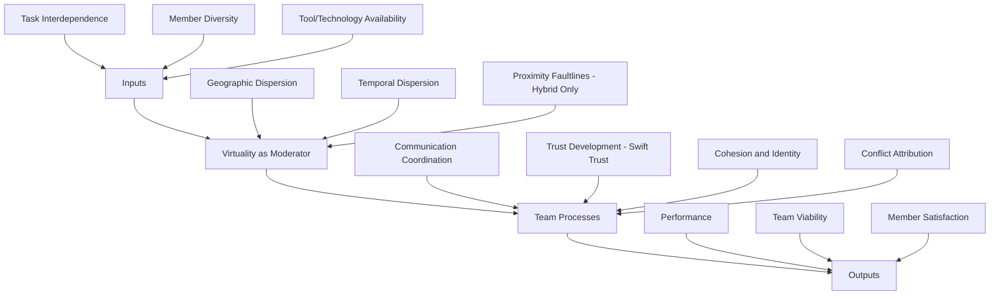

## Virtual and Hybrid Team Dynamics

### Definition and Scope

Virtual teams are groups of individuals who collaborate primarily or exclusively through electronic communication technologies across geographic, organizational, or temporal boundaries, with little or no face-to-face interaction. Hybrid teams combine co-located and remote members, or alternate between in-person and remote work arrangements, creating a mixed interaction structure within a single team. Both configurations are distinguished from traditional co-located teams along several dimensions: geographic dispersion, temporal dispersion (time zone differences), electronic dependence (reliance on technology-mediated communication), and configurational dynamism (fluidity of team membership and structure over time).

Organizational psychology treats virtuality as a continuum rather than a binary category. A team's degree of virtuality is a function of the proportion of communication that is technology-mediated, the extent of geographic and temporal dispersion, and the cultural/organizational diversity of members. This continuum framing matters because most contemporary teams are partially virtual, making "virtualness" a variable to be measured and managed rather than a fixed team type.

### Key Points

- Virtual and hybrid arrangements alter, but do not eliminate, the core processes described by general team-effectiveness models (input-process-output and IMOI frameworks); virtuality acts primarily as a moderator that changes the strength and nature of relationships between inputs and outputs
- Communication media differ in richness, and the fit between task requirements and media richness affects coordination quality (Media Richness Theory)
- Hybrid teams introduce a distinct problem not present in fully virtual or fully co-located teams: subgroup faultlines between office-based and remote-based members
- Trust in virtual teams often develops through a different pathway than in co-located teams, with implications for early team formation practices
- Technology is not a neutral conduit; tool affordances shape what coordination behaviors are easy or difficult (Media Synchronicity Theory, Adaptive Structuration Theory)

### Theoretical Foundations

**Media Richness Theory** (Daft & Lengel) ranks communication channels by their capacity to convey cues: face-to-face is richest (multiple cues, immediate feedback, natural language, personalization), followed by video, phone, and text-based channels in descending order. The theory predicts that equivocal or ambiguous tasks (negotiating conflicting interpretations, resolving interpersonal tension) require richer media, while unequivocal tasks (status updates, simple data transfer) can be handled efficiently through leaner channels. A common failure mode in virtual teams is media-task mismatch: using lean channels (email, asynchronous chat) for emotionally or interpretively complex exchanges, which increases misunderstanding.

**Media Synchronicity Theory** (Dennis, Fulk, & Valacich) refines this by separating two communication processes — conveyance (transmitting new information) and convergence (reaching shared understanding) — and argues that different media properties support each. High-synchronicity media (video, phone) support convergence processes; lower-synchronicity, more asynchronous media (email, shared documents) support conveyance processes where information can be processed at the receiver's own pace. This reframes the "richness is always better" intuition: for straightforward information transfer, asynchronous tools can outperform synchronous meetings.

**Adaptive Structuration Theory** (DeSanctis & Poole) treats technology as providing "structures" (rules and resources) that groups appropriate in practice, sometimes as designers intended and sometimes not. Applied to virtual teams, this explains why identical collaboration software produces different coordination patterns across teams — the technology's effect is mediated by the social practices the team develops around it.

**Temporal Coordination Theory / Entrainment** addresses how distributed teams synchronize activity across time zones. Teams develop rhythms (recurring meeting times, deadline cadences) that entrain members to a shared temporal structure even when they are not simultaneously present, reducing coordination costs over time as these rhythms become routine.

### Core Processes Affected by Virtuality

**Communication and Coordination**

Virtual teams rely heavily on explicit coordination mechanisms (schedules, protocols, documented procedures) because they lack the implicit coordination that arises from physical co-presence (overhearing conversations, observing body language, spontaneous check-ins). This is sometimes described as a shift from *implicit* to *explicit* coordination. Explicit coordination is more effortful to establish but, once routinized, can be highly efficient; the transition period before routines stabilize is where virtual teams are most vulnerable to coordination failures.

Asynchronous communication introduces coordination lag — delays between a message being sent and a response being available — which can slow decision cycles and, without careful process design, produce fragmented conversation threads where responses to different sub-topics interleave confusingly.

**Trust Development**

Co-located teams typically build trust incrementally through repeated interpersonal interaction (calculus-based trust maturing into relational trust). Virtual teams, especially short-lived or project-based ones, often cannot rely on this slow accumulation. Research on **swift trust** (Meyerson, Weick, & Kramer) describes an alternative pathway: virtual team members extend a provisional, role-based trust at the outset, assuming competence and good faith based on organizational role or professional identity rather than personal history. Swift trust is fragile — it depends on early positive signals (prompt responses, followed-through commitments) and can collapse quickly if those signals are absent, since there is little relational history to buffer a violation.

**Cohesion and Identity**

Virtual teams face elevated risk of reduced social cohesion because informal relationship-building opportunities (hallway conversations, shared meals, incidental social contact) are diminished. Team identity — the sense of "we-ness" — must be more deliberately cultivated through structured practices (virtual social time, explicit team charters, shared symbols/rituals) rather than emerging organically.

**Conflict**

Virtual teams tend to experience more task conflict misattributed as relationship conflict, because lean media strip out tone and nonverbal cues that would otherwise disambiguate intent. A blunt text message may be read as hostile when it was simply terse. This is sometimes called the **attribution problem** in mediated communication: reduced cue availability increases reliance on dispositional (person-based) rather than situational (context-based) explanations for others' behavior.

### The Hybrid-Specific Problem: Proximity Faultlines

Hybrid teams introduce a structural risk absent in both fully co-located and fully virtual teams: a **faultline** (Lau & Murnighan) between subgroups defined by location — those in the office and those remote. This is distinct from virtual-team challenges because it creates asymmetric information and inclusion:

- Office-based members have access to spontaneous information exchange, informal influence opportunities, and visibility to leadership that remote members lack
- Meetings with mixed in-person and remote attendees often structurally favor in-room participants (who can read the room, interject more easily, and are seen more) unless deliberately designed for equity — a pattern sometimes termed the **"two-tier" or proximity bias** problem
- Faultline strength increases when location correlates with other demographic or role variables (e.g., seniority, tenure, function), because overlapping category boundaries reinforce subgroup distinctness
- Left unmanaged, proximity faultlines can produce in-group favoritism, information asymmetry in decision-making, and perceived unfairness in evaluation or advancement

Mitigating proximity faultlines typically requires structural interventions: "one screen, one voice" meeting norms (each participant on an individual video feed rather than a room camera), rotating meeting formats so no subgroup is permanently advantaged, deliberate documentation of decisions made informally in-office so remote members have equal access, and evaluation practices audited for location-based bias.

### Leadership in Virtual and Hybrid Teams

Effective virtual/hybrid leadership research identifies several distinguishing demands relative to co-located leadership:

- **Structuring role**: greater emphasis on establishing explicit norms, communication protocols, and role clarity early, since ambiguity is costlier when it cannot be resolved through casual clarification
- **Boundary-spanning role**: actively managing the team's interface with the rest of the organization, since dispersed members have less organic visibility into organizational context
- **Relational monitoring**: more deliberate attention to relationship health indicators (response patterns, engagement in meetings, sentiment) since passive cues available in person are absent
- **E-leadership** (Avolio, Kahai, & Dodge): the broader construct describing leadership processes mediated by information technology, encompassing how leaders adapt influence tactics when interactions are technology-mediated

Shared/distributed leadership — where leadership functions rotate among team members rather than residing solely in a formal leader — is more common and often more necessary in virtual teams, since no single leader can monitor all activity across dispersed, asynchronous work.

### Technology and Tool Fit

Tool selection should map to the conveyance/convergence distinction from Media Synchronicity Theory:

| Team Need | Tool Category | Rationale |
| --- | --- | --- |
| Status updates, documentation, information sharing | Asynchronous (shared docs, wikis, async messaging) | Conveyance-oriented; allows self-paced processing |
| Negotiation, conflict resolution, brainstorming | Synchronous (video calls) | Convergence-oriented; benefits from immediate feedback |
| Ongoing awareness of team activity | Persistent chat channels | Low-friction ambient visibility |
| Complex decision-making with high equivocality | Video, ideally with structured facilitation | Richest available cues reduce misinterpretation |

Over-reliance on synchronous meetings for tasks that could be asynchronous is a common inefficiency ("meeting overload"), while over-reliance on lean asynchronous channels for emotionally charged or ambiguous matters increases the attribution problem described above.

### Team Effectiveness Diagram

### Empirical Findings and Moderators

Meta-analytic work on virtuality and team performance generally finds **small, often non-significant direct effects of virtuality alone** on performance — the relationship is heavily moderated rather than direct. Key moderators include:

- **Task type**: virtuality is more costly for tasks high in interdependence and equivocality (creative problem-solving, negotiation) than for tasks that are more additive or routine
- **Team lifespan**: short-lived virtual teams rely more heavily on swift trust and structural scaffolding; long-lived virtual teams can develop relational trust similar to co-located teams given sufficient interaction history
- **Communication technology fit**: teams that match media richness to task equivocality outperform those with mismatched tool use
- **Leadership behaviors**: structuring and boundary-spanning leadership behaviors substantially attenuate the negative effects of dispersion

[Inference] Because virtual and hybrid work arrangements have expanded rapidly since 2020, much of the most recent empirical literature reflects a period of unusually high organizational adaptation pressure; effect sizes reported in this literature may shift as arrangements stabilize into more mature organizational practice.

### Practical Interventions

**Team Charters**: Explicit, co-created documents specifying communication norms (expected response times, which channel for which purpose), meeting cadences, and decision-making protocols. Charters substitute for the implicit norms that develop naturally in co-located teams.

**Structured Onboarding for Swift Trust**: Front-loading early interactions with activities that signal competence and reliability (clear role definition, visible early wins, responsive communication) accelerates the swift-trust pathway.

**Meeting Equity Practices**: For hybrid meetings — individual video feeds regardless of location, rotating who joins remotely versus in-person for recurring meetings, and explicit facilitation practices (e.g., calling on remote participants) to counter proximity bias.

**Asynchronous-First Documentation**: Treating written records (decisions, rationale, action items) as the primary source of truth reduces the information asymmetry that disadvantages remote or differently-timezoned members.

**Deliberate Social Time**: Scheduling non-task-focused virtual interaction (informal check-ins, virtual coffee chats) to substitute for the incidental relationship-building that occurs naturally in shared physical space.

### Example

A globally distributed software team spans three time zones with no full overlap window longer than two hours. Applying the frameworks above: the team adopts asynchronous-first documentation (design decisions recorded in a shared wiki rather than discussed only in meetings, addressing conveyance needs), reserves the narrow overlap window for synchronous discussion of genuinely equivocal issues (architecture disagreements, conflict resolution), and rotates the "on-call synchronous liaison" role weekly so no single time zone consistently bears the burden of off-hours meetings. A team charter specifies a 24-hour response norm for non-urgent async messages, reducing coordination lag ambiguity. Swift trust is scaffolded during onboarding through a structured first-two-weeks plan with clearly defined, visible early deliverables for new members.

### Common Pitfalls

- Treating virtual/hybrid team management as a pure technology problem rather than a process-and-structure problem
- Applying co-located meeting norms unchanged to hybrid settings, entrenching proximity faultlines
- Defaulting to synchronous video for all communication, producing meeting overload and eroding the efficiency advantages of asynchronous work
- Assuming trust will develop passively over time without early structural scaffolding, particularly in short-duration project teams
- Failing to document informally-reached decisions, creating information asymmetry that disadvantages remote members

**Related Topics**

- Swift Trust Theory and Its Boundary Conditions
- Media Richness Theory and Media Synchronicity Theory (Comparative Treatment)
- Faultline Theory in Team Composition
- E-Leadership and Distributed Leadership Models
- Team Charters and Explicit Coordination Mechanisms
- Temporal Coordination and Entrainment in Distributed Work
- Proximity Bias in Performance Evaluation