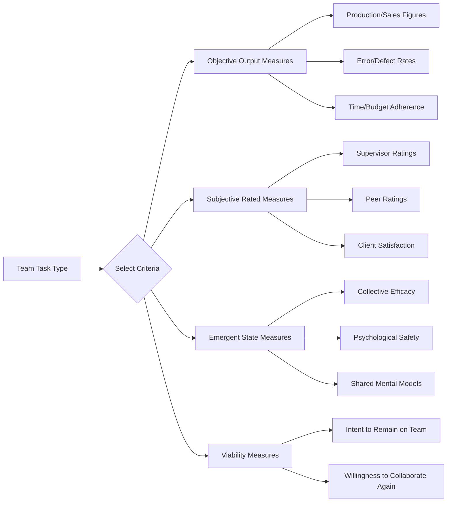

## Measuring Team Performance

### Definition and Scope

Measuring team performance refers to the systematic assessment of how well a team achieves its intended outcomes, encompassing the selection of appropriate criteria, the timing and level of measurement, and the methodological challenges introduced when the unit of analysis is a group rather than an individual. Team performance measurement sits at the "output" end of team-effectiveness frameworks (Input-Process-Output and Input-Mediator-Output-Input models) but is conceptually and methodologically distinct from simply aggregating individual performance scores, because team-level phenomena (coordination quality, collective efficacy, emergent states) are not always reducible to the sum of individual contributions.

A foundational distinction in this domain is between **team effectiveness** (a broader construct encompassing performance, viability, and member outcomes) and **team performance** specifically (the narrower construct of task accomplishment against defined criteria). This chapter item focuses on performance measurement while situating it within the broader effectiveness literature.

### Key Points

- Team performance is multidimensional; no single metric captures it fully, and criterion choice should be driven by team task type and organizational purpose
- The classic Input-Process-Output (IPO) model has been substantially revised to Input-Mediator-Output-Input (IMOI) to reflect that processes are not strictly linear and that outputs feed back into future inputs
- Level-of-analysis problems (individual vs. team vs. organizational) create measurement and aggregation challenges that must be resolved explicitly, not assumed
- Objective and subjective performance measures often diverge and capture different aspects of effectiveness
- Timing matters: performance can be measured at different stages (in-process indicators vs. end-state outcomes), and these can suggest different conclusions

### Theoretical Frameworks

**Input-Process-Output (IPO) Model** (McGrath): The original foundational framework treats team performance as the output of a linear sequence — inputs (member characteristics, task design, organizational context) shape processes (communication, coordination, conflict management), which produce outputs (performance, satisfaction, viability). While influential, the strict linearity and treatment of "process" as a single undifferentiated stage have been widely criticized as oversimplified.

**Input-Mediator-Output-Input (IMOI) Model** (Ilgen, Hollenbeck, Johnson, & Jundt): The dominant contemporary revision. Two key changes: first, "mediator" replaces "process" to explicitly include **emergent states** — psychological or attitudinal constructs that arise from team member interaction (e.g., collective efficacy, shared mental models, psychological safety, team cohesion) — alongside behavioral processes; second, the model is recast as cyclical rather than linear, with outputs from one performance episode becoming inputs to the next (recognizing that teams often work across multiple task episodes over time, and success or failure in one episode shapes team states entering the next).

**Multi-Level Theory** (Kozlowski & Klein): Provides the formal logic for how constructs and measures should be aggregated across levels of analysis. Distinguishes between:

- **Composition models**: where a team-level construct is functionally similar in nature at the individual level and is aggregated via consensus (e.g., team efficacy averaged from individual efficacy ratings, justified when within-team agreement is demonstrated) — often via addition, averaging, or consensus-based aggregation, contingent on statistical justification (e.g., $r_{wg}$, ICC)
- **Compilation models**: where the team-level construct emerges from the configuration or pattern of individual-level inputs and is not simply their average (e.g., team performance as a nonlinear function of the weakest link, or of complementary skill distribution)

Choosing the wrong aggregation logic — for example, simply averaging individual scores when the underlying construct is actually configural — produces measurement error and can mask real team-level phenomena.

### Performance Criteria: What to Measure

**Objective/Quantitative measures**: Production output, error rates, sales figures, project completion time, budget adherence, defect rates. Advantages: verifiable, comparable across teams and time, less susceptible to rater bias. Limitations: often only available for certain task types (production, sales), may not capture quality or process aspects of performance, and can create measurement myopia if teams optimize the metric rather than the underlying goal (a form of **Goodhart's Law** applied to team metrics).

**Subjective/Rated measures**: Supervisor ratings, peer ratings, self-ratings, client/customer satisfaction ratings. Advantages: applicable to virtually any task type, can capture quality and process dimensions objective measures miss. Limitations: susceptible to rater biases (halo effects, leniency, in-group favoritism), and different raters (supervisors vs. peers vs. self) often show only moderate agreement, raising questions about which perspective is most valid for a given purpose.

**Behavioral process measures**: Direct observation or coding of team interaction behaviors (communication frequency, coordination behaviors, backup behavior, conflict episodes). Often used in research settings via structured observation protocols or communication coding schemes; less common in applied organizational measurement due to resource intensity, but increasingly feasible via digital trace data (meeting transcripts, messaging logs, calendar data) in technology-mediated teams.

**Emergent state measures**: Survey-based assessment of team-level psychological states (collective efficacy, psychological safety, shared mental model accuracy, team cohesion), typically via validated multi-item scales administered to team members and aggregated per composition-model logic. These function as **leading indicators** — they often predict later performance outcomes and can be measured before task completion, offering diagnostic and early-warning value that outcome measures (available only after the fact) cannot.

**Viability measures**: Team members' willingness and capacity to continue working together effectively on future tasks. Distinct from current-task performance; a team can perform well on an immediate task while eroding the relational capital needed for future collaboration (e.g., through unsustainable conflict or burnout), making viability an important complementary criterion, especially for standing/intact teams rather than one-off project teams.

### Criterion Selection Diagram

### Level-of-Analysis Issues

A central methodological challenge is ensuring that the level at which a construct is theorized matches the level at which it is measured and analyzed — a mismatch is sometimes termed a **level of analysis fallacy**. Two specific errors:

- **Atomistic fallacy**: drawing team-level conclusions from individual-level data without appropriate aggregation justification (e.g., concluding "this team is high in collective efficacy" from one member's individual efficacy score)
- **Ecological fallacy**: the reverse error, applying team-level findings to individual members without justification (e.g., assuming every member of a high-performing team individually performed well)

Before aggregating individual responses (e.g., survey items) into a team-level score, researchers and practitioners typically assess **within-group agreement**, most commonly via $r_{wg}$ (James, Demaree, & Wolf) or the intraclass correlation coefficient (ICC1, ICC2). Low within-group agreement on a construct intended to represent shared team perception (a composition model) signals that aggregation may not be justified — the team may not actually share that perception, and averaging would obscure meaningful within-team variance rather than represent a genuine team-level property.

$$r_{wg} = 1 - \frac{S_x^2}{\sigma_{EU}^2}$$

where $S_x^2$ is the observed variance of ratings within the group and $\sigma_{EU}^2$ is the expected variance under a null (random response) distribution, commonly a uniform distribution for Likert-type items.

### Timing of Measurement

**Process/formative measurement**: assessing team functioning during task execution (e.g., mid-project check-ins on coordination quality or emergent states), useful for diagnosis and intervention while there is still time to affect the outcome.

**Outcome/summative measurement**: assessing results after task or project completion, useful for accountability, comparison across teams, and organizational decision-making, but offers no opportunity for corrective action within that performance episode.

[Inference] Organizations that rely exclusively on summative, end-state metrics may be systematically slower to detect emerging coordination problems than those that also track process-level and emergent-state indicators, since the latter can signal risk before it manifests in final output — though the appropriate balance between formative and summative measurement likely depends on task cycle length and the cost of course-correction.

### Common Methodological Pitfalls

- **Single-criterion reliance**: using one measure (often the most administratively convenient, such as a single supervisor rating) as a proxy for overall team effectiveness, ignoring the multidimensionality of the construct
- **Inappropriate aggregation**: averaging individual scores into a team score without checking whether the underlying construct is genuinely shared (composition logic) versus configural (compilation logic)
- **Confounding performance with viability**: treating a team's current output as the full picture of effectiveness while ignoring whether the team's process is sustainable
- **Rater source neglect**: using only one rating source (e.g., supervisor) when different sources (peers, self, clients) may have access to different, non-redundant information about team functioning
- **Static measurement in dynamic teams**: measuring performance only once at project end, missing the cyclical IMOI dynamic where earlier episode outcomes shape later-episode inputs

### Example

A hospital surgical team is evaluated using a multi-method approach consistent with the frameworks above: objective measures include surgical complication rates and case completion times; subjective measures include post-case debrief ratings from the attending surgeon and 360-degree peer ratings collected quarterly; emergent-state measures include a validated psychological safety survey administered every six months to detect erosion in team members' willingness to speak up about errors (a known leading indicator of surgical performance problems); and viability is tracked via staff retention and voluntary team-transfer requests. Before averaging the psychological safety survey into a team-level score, the hospital's OD team checks $r_{wg}$ values to confirm sufficient within-team agreement, flagging teams with high dispersion for qualitative follow-up rather than treating the average as meaningful on its own.

**Related Topics**

- Input-Mediator-Output-Input (IMOI) Model in Depth
- Emergent States: Collective Efficacy, Psychological Safety, and Shared Mental Models
- Multi-Level Theory and Aggregation Statistics ($r_{wg}$, ICC)
- Team Viability as a Distinct Effectiveness Criterion
- 360-Degree Feedback Systems for Teams
- Digital Trace Data and Computational Methods for Team Process Measurement