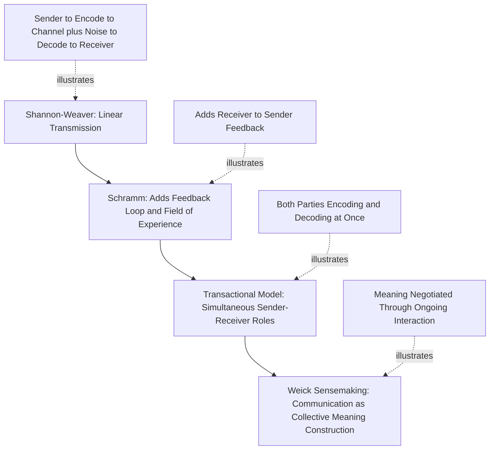

## Communication Models and Channels

### Definition and Scope

Organizational communication refers to the process by which information, meaning, and understanding are created and exchanged among members within and across organizational boundaries. This item covers the foundational **models** used to conceptualize how communication occurs (the structural and process logic of communication itself) and the **channels** — the media and pathways through which communication travels — along with how the two interact to shape organizational functioning. This foundational material underpins later, more specific topics in the chapter (e.g., virtual team communication, organizational communication networks, communication and conflict).

### Key Points

- Communication models have evolved from simple linear transmission models to interactive and transactional models that treat communication as a mutual, simultaneous process rather than a one-way transfer
- Channel choice is not incidental; mismatches between channel richness and message complexity are a common source of organizational miscommunication
- Formal and informal channels coexist in every organization, and informal channels (the "grapevine") carry substantial, often underappreciated informational weight
- Noise — a foundational concept from the earliest communication models — remains central to understanding communication failure, and organizational psychology extends it beyond literal signal interference to psychological and semantic noise
- Communication direction (downward, upward, horizontal, diagonal) shapes both the function and the typical distortion pattern of organizational messages

### Foundational Communication Models

**Shannon-Weaver Model (1949)**: The originating model from information theory, developed for telecommunications engineering but widely adopted as a starting point in organizational communication theory. Depicts communication as linear transmission: a sender encodes a message, which travels through a channel subject to noise, and is decoded by a receiver. Its core lasting contribution is the formal concept of **noise** — anything that distorts the signal between sender and receiver. Its principal limitation, extensively critiqued in later organizational communication theory, is its one-directional structure: it has no built-in mechanism for feedback or for the receiver's role in actively constructing meaning.

**Schramm's Interactive Model**: Extended the linear model by adding a feedback loop, making communication cyclical rather than one-way, and introduced the concept of a **field of experience** — the sender and receiver each interpret messages through their own accumulated knowledge, culture, and experience, and successful communication depends on the overlap between these fields. Where the fields of experience of sender and receiver diverge significantly (e.g., across departments with different technical vocabularies, or across hierarchical levels with different priorities), message fidelity decreases even absent any literal channel noise.

**Transactional Model** (Barnlund and related theorists): The dominant contemporary framing. Treats sender and receiver roles as simultaneous and continuously reversible rather than sequential — both parties are encoding and decoding at the same time (e.g., a listener's facial expressions are themselves a message being sent back to the speaker in real time, not just a response after the speaker finishes). This model better captures face-to-face and synchronous organizational communication, where meaning is co-constructed dynamically rather than transmitted and then separately responded to.

**Weick's Model of Organizing / Sensemaking**: A distinct, more constructivist tradition within organizational communication theory (Karl Weick) that treats communication not merely as information transfer but as the primary mechanism through which organizational members collectively construct and negotiate shared meaning about ambiguous situations — organizations are, in this view, communicatively constituted rather than communication being simply a tool organizations use. This model is particularly influential in explaining how organizations respond to novel or ambiguous events, where no pre-existing shared interpretation is available and meaning must be actively negotiated through communicative interaction.

### Model Comparison Diagram

### Communication Channels

**Formal channels** follow the organization's official structure and are typically categorized by direction:

- **Downward communication**: flows from higher to lower hierarchical levels (directives, policy, performance feedback, strategic goals). Prone to information loss and delay as it passes through multiple hierarchical layers, a phenomenon related to but distinct from the "telephone game" distortion seen in lateral transmission.
- **Upward communication**: flows from lower to higher levels (status reports, concerns, suggestions, grievances). Particularly susceptible to **filtering** — subordinates strategically shaping what information reaches superiors, often minimizing bad news (a pattern with documented links to organizational silence and psychological safety literature).
- **Horizontal/lateral communication**: flows between peers or units at the same hierarchical level (coordination, problem-solving, information sharing across departments). Essential for cross-functional coordination but often lacks formal structure, leaving it dependent on informal relationship networks.
- **Diagonal communication**: flows across both hierarchical levels and functional boundaries simultaneously (e.g., a project manager coordinating directly with a specialist in another department at a different level). Increasingly common in matrix and project-based organizational structures.

**Informal channels** operate outside official organizational structure, most notably the **grapevine** — informal information networks based on social relationships rather than organizational chart position. Classic organizational communication research (Davis) identified several grapevine transmission patterns (single-strand, gossip, probability, and cluster chains), with the **cluster chain** — where information passes through a small number of selective relayers to multiple others — generally found to be the most common pattern in organizational settings. The grapevine is often faster than formal channels and can carry meaningful information (sometimes more accurate than assumed), but is also a common vector for rumor and distortion, particularly in conditions of high uncertainty or low trust in formal communication sources.

### Channel Richness and Selection

Building on Media Richness Theory (Daft & Lengel), channels can be arrayed by their capacity to convey multiple cues, provide immediate feedback, and support natural language and personalization:

| Channel | Relative Richness | Best Suited For |
| --- | --- | --- |
| Face-to-face | Highest | Ambiguous, emotionally sensitive, or negotiation-heavy messages |
| Video call | High | Complex discussions requiring visual cues, distributed teams |
| Phone call | Medium-High | Time-sensitive but less visually dependent exchanges |
| Instant messaging/chat | Medium | Quick clarifications, ongoing informal coordination |
| Email | Medium-Low | Documented, moderately complex, non-urgent information |
| Formal written memo/report | Low | Unambiguous, formal, or officially recorded information |

Channel-task mismatch — using lean channels for equivocal or emotionally charged messages, or over-using rich synchronous channels for simple informational transfer — is a well-documented source of organizational communication failure and inefficiency, echoing the same principle discussed in virtual/hybrid team contexts.

### Noise and Distortion

Organizational communication theory extends Shannon and Weaver's original engineering concept of noise into several organizationally relevant categories:

- **Physical noise**: literal environmental interference (poor audio connection, loud workspace)
- **Semantic noise**: distortion arising from different interpretations of words, jargon, or technical vocabulary between sender and receiver (closely related to Schramm's field-of-experience concept)
- **Psychological noise**: distortion from the receiver's internal state — stress, preconceptions, emotional reactivity — that colors interpretation independent of the message's actual content
- **Organizational noise**: distortion introduced by the structure itself, such as excessive hierarchical layers, siloed departments, or conflicting formal and informal reporting lines

### Example

A manufacturing firm's plant-floor safety incident needs to be communicated upward to executive leadership. Applying the frameworks above: a supervisor observes a near-miss (upward communication), and organizational research on filtering predicts a nontrivial risk that the severity gets minimized as it passes through middle management layers en route to executives (organizational noise compounding at each hierarchical transfer point). To counteract this, the firm implements a direct, unfiltered incident-reporting channel (bypassing intermediate hierarchical relay) alongside a rich, synchronous debrief (video call) rather than a written summary alone, since the emotional and safety-critical nature of the message is highly equivocal and benefits from immediate feedback and clarification — consistent with Media Richness Theory's prediction that high-equivocality content requires richer channels than routine status updates.

### Common Pitfalls

- Assuming richer channels are always superior, ignoring that lean asynchronous channels are often more efficient for straightforward conveyance tasks
- Treating the grapevine purely as a problem to suppress rather than an information source to understand and, where possible, leverage
- Underestimating cumulative distortion across multiple hierarchical relay points in both downward and upward communication
- Applying a purely linear (Shannon-Weaver) mental model to face-to-face or synchronous exchanges where transactional, simultaneous dynamics are actually at play
- Neglecting semantic and psychological noise when troubleshooting communication failures, focusing only on literal channel/technical noise

**Related Topics**

- Media Richness Theory and Media Synchronicity Theory in Organizational Contexts
- Organizational Silence and Upward Communication Filtering
- Communication Networks and Organizational Structure
- Nonverbal Communication in Organizational Settings
- Crisis Communication and Sensemaking Under Ambiguity
- Cross-Cultural Communication in Multinational Organizations