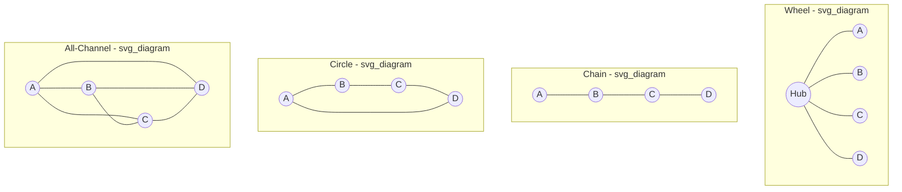

## Formal and Informal Communication Networks

### Definition and Scope

Communication networks are the patterned pathways through which information actually flows among members of an organization, as distinct from the communication models and channels covered previously (which address *how* messages are encoded/transmitted and *through what media*). Network analysis shifts the unit of focus to *structure*: who communicates with whom, how frequently, and in what configuration, independent of message content. Formal networks are those prescribed by the organization's official structure (org chart, reporting lines, designated workflows); informal networks emerge organically from social relationships, proximity, shared interests, and trust, and frequently diverge substantially from the formal structure they overlay.

This item draws primarily on **Social Network Analysis (SNA)**, a methodology and theoretical tradition applying graph-theoretic concepts to map and quantify relational structures within organizations.

### Key Points

- Formal networks describe intended/sanctioned communication pathways; informal networks describe actual communication behavior, and the gap between the two is itself diagnostically important
- Network position (not just individual attributes) predicts influence, access to information, and career outcomes — a core finding distinguishing network approaches from purely individual-level organizational behavior research
- Classic small-group network structures (wheel, chain, circle, all-channel) differ systematically in speed, accuracy, and member satisfaction depending on task type
- Key structural roles — central connectors, brokers/boundary spanners, and peripheral members — have distinct and well-documented organizational consequences
- Network density, centralization, and the presence of structural holes are measurable properties that predict information diffusion speed and innovation potential

### Formal Communication Network Structures

Classic small-group research (Bavelas, Leavitt) identified distinct network topologies and tested their effects on task performance, using laboratory groups solving simple problems under experimentally imposed communication restrictions:

- **Wheel (star)**: All communication passes through one central member; others cannot communicate directly with each other. Fast and accurate for simple tasks with a clear coordinating hub; central member reports high satisfaction, peripheral members report low satisfaction; the central member becomes a bottleneck as task complexity increases.
- **Chain**: Linear sequence where each member communicates only with adjacent members. Moderate speed and accuracy; information degrades over the chain length (an organizational analogue of the "telephone game" distortion referenced in the communication-models item); functions similarly to strict hierarchical relay.
- **Circle**: Each member communicates with two adjacent members in a closed loop, with no central hub. Slower for simple tasks but more balanced participation and satisfaction; no single bottleneck point.
- **All-channel (fully connected)**: Every member can communicate directly with every other member. Slowest for simple, unambiguous tasks (too many redundant exchanges) but superior for complex, ambiguous tasks requiring input integration from all members; highest overall satisfaction due to full participation.

The general finding from this line of research: **centralized networks (wheel, chain) outperform decentralized networks (circle, all-channel) for simple tasks, while decentralized networks outperform centralized ones for complex tasks** — because complex tasks benefit from parallel information processing and multiple perspectives, which centralized structures bottleneck at the hub.

### Network Structure Diagram

### Social Network Analysis: Core Concepts

**Nodes and Ties**: Nodes represent individuals (or units/departments in a macro-level analysis); ties represent a defined relationship (communication frequency, advice-seeking, friendship, information exchange). Ties can be directed (A reports to B, but not vice versa) or undirected (mutual communication), and weighted (frequency/strength) or unweighted (presence/absence only).

**Centrality Measures**: Quantify a node's structural importance within the network.

- **Degree centrality**: number of direct ties a node has; captures immediate connectedness and activity level
- **Betweenness centrality**: the extent to which a node lies on the shortest paths between other pairs of nodes; captures brokerage potential and control over information flow between otherwise unconnected parts of the network
- **Closeness centrality**: the inverse of the average distance from a node to all other nodes; captures how quickly a node can access or disseminate information across the whole network
- **Eigenvector centrality**: a node's importance weighted by the importance of the nodes it is connected to; captures influence via connection to other well-connected actors, not just raw connection count

$$C_D(i) = \sum_{j \neq i} x_{ij}$$

where $C_D(i)$ is the degree centrality of node $i$ and $x_{ij}$ indicates the presence (1) or absence (0) of a tie between nodes $i$ and $j$.

**Density**: The proportion of all *possible* ties in a network that are actually present. High-density networks tend to enable rapid, redundant information diffusion and strong normative pressure/cohesion; low-density networks allow for more diverse, non-redundant information access but weaker cohesive pressure.

$$\text{Density} = \frac{2L}{n(n-1)}$$

where $L$ is the number of actual ties and $n$ is the number of nodes, for an undirected network.

**Structural Holes** (Burt): Gaps in a network where two otherwise-unconnected clusters or individuals are not directly tied. Actors who bridge structural holes — connecting otherwise disconnected parts of the network — occupy **brokerage** positions with disproportionate access to novel, non-redundant information and correspondingly elevated influence, a phenomenon well-documented in research linking brokerage position to career advancement, promotion rates, and idea generation/innovation credit within organizations.

**Weak Ties** (Granovetter): Building on related logic, Granovetter's foundational "strength of weak ties" argument holds that infrequent, less emotionally close relationships (weak ties) are disproportionately valuable for accessing *novel* information, because strong ties (close, frequent relationships) tend to cluster among people who already share largely overlapping information; weak ties are more likely to bridge into different social/informational clusters entirely.

### Key Structural Roles

- **Central connectors / hubs**: High-degree-centrality individuals with many direct ties; important for information dissemination speed but represent single points of failure/bottleneck risk if overloaded or removed
- **Brokers / boundary spanners**: High-betweenness individuals connecting otherwise-separate clusters (departments, formal/informal networks, or the organization and its external environment); critical for cross-unit coordination and innovation diffusion, but can also become informational chokepoints or, in dysfunctional cases, gatekeep information for personal advantage
- **Peripheral members**: Low-centrality individuals with few ties; may be newer members, disengaged members, or specialists whose expertise is narrowly but not broadly connected — peripheral position is not inherently negative but warrants investigation as to cause
- **Isolates**: Individuals with no or minimal ties to the broader network; strongly associated with risk of disengagement, turnover intention, and exclusion from informal advancement opportunities

### Formal-Informal Network Divergence

A central diagnostic use of network analysis in organizational psychology practice is comparing the formal (org-chart-prescribed) network against the empirically observed informal (actual communication) network. Significant divergence signals:

- **Workarounds**: informal ties bypassing formal reporting lines often indicate the formal structure is too slow, restrictive, or misaligned with actual workflow needs
- **Shadow influence structures**: individuals with high informal centrality but low formal authority (e.g., a senior individual contributor who is the de facto go-to problem-solver) represent informal influence that formal org charts do not capture, with implications for succession planning, retention risk, and change-management strategy (informal influencers are often more effective change agents than formally designated ones)
- **Silo detection**: low cross-unit tie density in the informal network, even where formal structure nominally requires cross-unit collaboration, signals coordination failure risk

### Example

An organization restructures into cross-functional product teams, and leadership wants to assess whether the new formal structure is functioning as intended before the next planning cycle. A network analysis is conducted using survey-based tie elicitation (asking employees who they go to for work-related information at least weekly). Results show that formal reporting lines (org chart) predict roughly the expected communication ties within newly formed teams, but betweenness centrality analysis reveals that cross-team coordination is disproportionately routed through two individuals who happen to have long-tenured informal relationships from the prior organizational structure — rather than through the formally designated cross-team liaison roles. This indicates the new formal structure has not yet been fully adopted in practice; the two high-betweenness informal brokers represent both a currently valuable coordination resource and a structural risk (single points of failure) if either departs, prompting a targeted intervention to formally recognize and back up their brokerage function.

### Common Pitfalls

- Assuming the org chart accurately reflects actual communication and influence patterns without empirical verification
- Treating high centrality as uniformly positive without considering overload risk to central connectors and brokers
- Ignoring peripheral members or isolates as simply low performers, without investigating structural causes (onboarding gaps, exclusion, remote/hybrid disadvantage as covered in virtual team dynamics)
- Applying findings from small, laboratory-derived network structures (wheel/chain/circle/all-channel) uncritically to large, complex real-world organizational networks without accounting for scale effects
- Collecting network data once and treating it as static, when informal networks evolve continuously with organizational change, turnover, and shifting task demands

**Related Topics**

- Social Network Analysis Methodology and Data Collection (Sociometric Surveys, Digital Trace Data)
- Burt's Structural Holes Theory and Brokerage in Detail
- Granovetter's Strength of Weak Ties: Empirical Applications
- Informal Influence and Succession Planning
- Network Approaches to Innovation Diffusion in Organizations
- Onboarding and Network Integration of New Employees