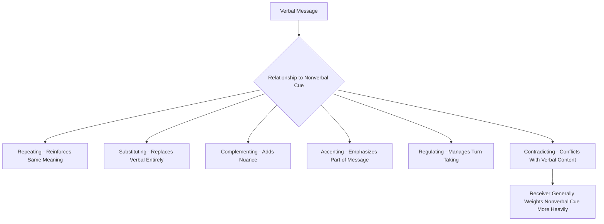

## Nonverbal Communication at Work

### Definition and Scope

Nonverbal communication (NVC) encompasses all communicative behavior other than the literal words spoken or written — facial expressions, gestures, posture, eye contact, physical proximity, touch, vocal qualities independent of word content (paralanguage), physical appearance, and use of time and space. In organizational settings, nonverbal cues are estimated across multiple lines of communication research to carry a substantial share of the emotional and relational meaning in face-to-face exchanges, often functioning to reinforce, contradict, substitute for, or regulate verbal communication rather than operating as an independent channel. This item covers the major categories of workplace nonverbal behavior, their organizational functions, and the specific complications introduced by cross-cultural contexts and technology-mediated communication.

### Key Points

- Nonverbal cues serve distinct functions relative to verbal content: repeating, contradicting, substituting, complementing, accenting, and regulating
- When verbal and nonverbal messages conflict, receivers generally weight the nonverbal channel more heavily in judging sincerity and emotional meaning — a robust finding in interpersonal communication research, though the degree varies by context and channel
- Nonverbal norms are substantially culture-bound; behaviors read as appropriate or positive in one cultural context may be read as inappropriate or negative in another, with direct implications for multinational and diverse organizations
- Technology-mediated communication systematically strips out most nonverbal channels, which is a core mechanism behind several virtual-team challenges covered elsewhere in this chapter (attribution problems, reduced trust cues)
- Nonverbal behavior functions in workplace assessment contexts (interviews, performance conversations) as a consequential, if often unconsciously weighted, input into evaluative judgments — raising both practical and fairness considerations

### Categories of Nonverbal Communication

**Kinesics** (body movement): Facial expressions, gestures, posture, and body orientation. Paul Ekman's research on facial expressions identified a set of expressions (including happiness, sadness, anger, fear, surprise, and disgust) with substantial cross-cultural recognizability, though the *display rules* governing when and how intensely these expressions are shown in public are culturally variable [Unverified: the degree of universality versus cultural specificity in facial expression research remains an active area of academic debate, and Claude's coverage here reflects the traditional Ekman framing rather than a settled consensus]. In organizational contexts, posture and gesture are commonly read (accurately or not) as cues to confidence, engagement, and status.

**Oculesics** (eye contact/gaze): Patterns of eye contact carry strong organizational signaling value — sustained eye contact is often read (in many Western organizational contexts) as confidence, honesty, and engagement, while its absence may be read as evasiveness or disinterest. This interpretation is not universal: in a number of other cultural contexts, sustained direct eye contact with a superior can be read as disrespectful or confrontational, making oculesics a frequent site of cross-cultural misattribution in multinational organizations.

**Haptics** (touch): Physical contact norms (handshakes, pats on the back) vary considerably by organizational culture, national culture, and increasingly by explicit workplace policy given heightened sensitivity to appropriate physical boundaries; handshake norms themselves vary in firmness and duration expectations across cultural contexts.

**Proxemics** (use of physical space): Hall's classic framework distinguishes zones of interpersonal distance (intimate, personal, social, public), with the appropriate zone for a given interaction varying by relationship and cultural context. In organizational settings, proxemics manifests in office layout and seating norms (e.g., proximity to power centers, open-plan versus enclosed offices) as well as in interpersonal spacing during conversations; violations of expected proxemic norms can produce discomfort that affects communication quality independent of message content.

**Paralanguage** (vocal qualities apart from words): Tone, pitch, volume, pace, and pauses. Paralanguage strongly shapes how identical verbal content is interpreted — the same words delivered with a rising, uncertain tone versus a flat, assertive tone can produce substantially different listener judgments about the speaker's confidence or the message's certainty. Paralanguage is a significant factor in phone-based organizational communication, where visual nonverbal cues are entirely absent and paralanguage becomes one of the few remaining nonverbal channels available.

**Chronemics** (use of time): How time is used and valued as a communicative signal — punctuality norms, response-time expectations, and the perceived meaning of waiting. Organizational chronemics interacts with the temporal coordination challenges discussed in virtual/hybrid team contexts: delayed responses in asynchronous settings can be nonverbally "read" as low priority or disengagement, even when the delay reflects only time-zone or workload factors rather than any relational signal.

**Physical appearance and artifacts**: Dress, grooming, and object display (office decor, technology visibly in use) function as nonverbal signals of status, professionalism, and organizational identity/belonging, and are frequently governed by explicit or implicit organizational norms (dress codes) precisely because of their communicative weight.

### Functions of Nonverbal Communication Relative to Verbal Content

| Function | Description | Workplace Example |
| --- | --- | --- |
| Repeating | Nonverbal cue reinforces verbal content | Nodding while saying "yes, I agree" |
| Substituting | Nonverbal cue replaces verbal content entirely | A raised hand instead of saying "wait" in a meeting |
| Complementing | Nonverbal cue adds nuance to verbal content | Warm tone accompanying positive feedback, softening or reinforcing it |
| Accenting | Nonverbal cue emphasizes part of the verbal message | Pounding a table to stress a point |
| Regulating | Nonverbal cue manages conversational turn-taking | Eye contact or a pause signaling it is another person's turn to speak |
| Contradicting | Nonverbal cue conflicts with verbal content | Saying "I'm fine" with a flat tone and averted gaze |

### Nonverbal Communication Function Diagram

### Cross-Cultural Considerations

Because most specific nonverbal behaviors (as opposed to a small set of largely recognizable facial expressions) are governed by learned, culturally variable **display rules** and interpretive norms, multinational and culturally diverse organizations face elevated risk of nonverbal miscommunication:

- **High-context vs. low-context cultures** (Hall): High-context cultures (many East Asian, Middle Eastern, and Latin American organizational contexts, among others) rely more heavily on nonverbal and contextual cues to convey meaning, with verbal content often intentionally indirect; low-context cultures (many North American and Northern European organizational contexts) rely more heavily on explicit verbal content, with nonverbal cues playing a comparatively smaller interpretive role. Cross-context miscommunication often arises when a low-context communicator misses indirect nonverbal signaling intended to convey disagreement or discomfort, or when a high-context communicator perceives low-context directness as unnecessarily blunt.
- **Gesture and eye-contact norm variation**: Specific gestures and eye-contact conventions that are positive or neutral in one cultural context can be neutral, confusing, or offensive in another, making generic "read the room" advice insufficient without cultural-context-specific training.
- [Inference] As organizations become more culturally diverse and more globally distributed, reliance on nonverbal cues calibrated to a single cultural default likely becomes a growing source of systematic (rather than random) miscommunication risk, though the magnitude of this effect in any specific organization depends heavily on its particular composition and existing cross-cultural competency practices.

### Nonverbal Communication in Technology-Mediated Settings

This item connects directly to virtual/hybrid team dynamics covered earlier in the chapter. Different communication technologies strip out different subsets of the nonverbal channel:

- **Video calls**: Retain facial expression and some gesture/posture cues but typically lose full-body posture, proxemics, and can distort eye-contact cues (camera-versus-screen gaze mismatch often makes video-call eye contact read as slightly "off" relative to in-person interaction)
- **Phone calls**: Retain only paralanguage (tone, pace, pauses); all visual nonverbal channels are lost
- **Text-based channels** (email, chat): Retain no live nonverbal channel at all; users often compensate with substitute cues (emoji, punctuation emphasis, response latency) that only partially and imperfectly approximate lost nonverbal information

This loss of nonverbal bandwidth is a primary mechanism behind the **attribution problem** described in virtual team communication: without tone and facial cues to disambiguate intent, receivers fall back more heavily on dispositional inference, increasing the risk that a terse or ambiguous message is misread as hostile or dismissive.

### Nonverbal Behavior in Evaluative Contexts

Nonverbal cues measurably influence organizationally consequential judgments, including interview evaluations and performance-related impressions, frequently below the level of conscious awareness of the evaluator. This raises both a practical concern (evaluators may be responding to nonverbal fluency or confidence signaling rather than substantive content) and a fairness concern (nonverbal display norms are not culturally or neurologically uniform, meaning nonverbal-influenced evaluation can systematically disadvantage candidates or employees whose nonverbal presentation differs from evaluator expectations for reasons unrelated to job-relevant competence — including cultural background, disability, and neurodivergence). Organizational psychology practice increasingly recommends structured evaluation protocols (standardized questions, explicit competency-anchored rating criteria) partly as a mechanism to reduce the undue influence of nonverbal impression management on evaluative decisions.

### Example

A manager conducts a difficult performance conversation over video call rather than in person. Applying the frameworks above: the manager is aware that video strips out full-body posture and proxemic cues, retaining only facial expression, a partial/imperfect approximation of eye contact, and paralanguage. To compensate, the manager deliberately attends to and modulates paralanguage (a measured, warm tone) since it is one of the few fully intact nonverbal channels available, and follows up with a written summary afterward — since chronemics research suggests a delayed or purely verbal follow-up alone could be nonverbally "read" as dismissiveness, the manager ensures prompt follow-through to avoid an unintended chronemic signal undermining the conversation's verbal content.

### Common Pitfalls

- Treating nonverbal cue interpretation as universal rather than substantially culture-bound
- Assuming video calls fully substitute for in-person nonverbal richness, when several nonverbal channels (proxemics, full posture, unmediated eye contact) remain unavailable
- Allowing unconscious nonverbal impressions to influence structured evaluative judgments (interviews, performance ratings) without procedural safeguards
- Overgeneralizing from a small set of largely recognizable facial expressions to claims of universality across all nonverbal behavior categories
- Ignoring paralanguage and chronemics as "minor" nonverbal channels, despite their outsized role in phone-based and asynchronous organizational communication respectively

**Related Topics**

- High-Context vs. Low-Context Communication Cultures in Global Organizations
- Nonverbal Cues and Bias in Selection Interviews
- Emotional Labor and Display Rules in Service Work
- Attribution Theory and Misattribution in Lean-Channel Communication
- Proxemics and Office Design as Organizational Communication
- Cross-Cultural Training and Nonverbal Competency Development