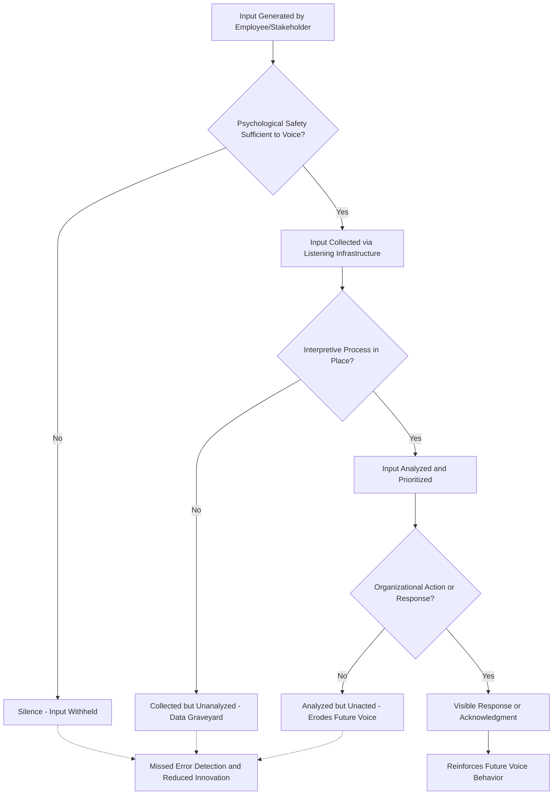

## Organizational Listening

### Definition and Scope

Organizational listening refers to the systematic processes, structures, and practices through which an organization attends to, interprets, and responds to information from its members and stakeholders — distinguishing it from individual-level listening (a interpersonal communication skill) by treating listening as an organizational-level capability that can be designed, measured, and improved. Organizational listening theory (most substantially developed by Macnamara) reframes listening from a passive receiving act into an active organizational competency comprising distinct architectural components: infrastructure for capturing input, processes for interpreting it, and mechanisms for demonstrating responsiveness.

This item is closely linked to upward communication (covered under Communication Models and Channels) but extends beyond it: upward communication describes the directional flow of messages, while organizational listening describes the organization's *capacity and practice* of genuinely attending and responding to that flow, addressing the well-documented gap between organizations *receiving* upward communication and organizations *actually listening* to it.

### Key Points

- Organizational listening is distinct from simply having upward communication channels available; channel availability does not guarantee that input is attended to, interpreted accurately, or acted upon
- **Organizational silence** — the systematic withholding of information, concerns, or ideas by employees — is the most consequential failure mode of poor organizational listening and has been linked to significant negative organizational outcomes (missed error detection, reduced innovation, disengagement)
- Listening failures occur at multiple distinct stages (non-collection, collection without analysis, analysis without action, action without follow-up communication), and diagnosing which stage is failing matters for intervention design
- Psychological safety is a well-established precondition for employees' willingness to voice concerns, making it foundational to effective organizational listening
- Formal listening mechanisms (surveys, suggestion systems, town halls) and informal listening (leader accessibility, day-to-day responsiveness) are complementary, and formal mechanisms alone are commonly insufficient if informal responsiveness is weak

### Theoretical Frameworks

**Macnamara's Organizational Listening Architecture**: Proposes that genuine organizational listening requires infrastructure across multiple components — a listening architecture (technologies and channels for input collection, e.g., surveys, feedback platforms, open-door practices), an interpretive process (staff and processes for making sense of and prioritizing collected input, since raw collected data does not translate itself into insight or action), and a demonstrated response loop (visible organizational action or at minimum acknowledgment in response to input, since unacknowledged input rapidly extinguishes future voice behavior through basic reinforcement-learning logic — employees who perceive their input goes nowhere gradually stop providing it).

**Employee Voice Theory** (Morrison; Van Dyne & LePine): Distinguishes between the antecedent conditions and forms of employee **voice** — discretionary communication of ideas, concerns, or opinions intended to improve organizational functioning. Key distinctions within voice behavior:

- **Promotive voice**: proactively suggesting improvements or new ideas
- **Prohibitive voice**: raising concerns about problems, risks, or wrongdoing
- **Voice vs. silence** are conceptualized as distinct behavioral choices rather than simple opposites — an employee can have relevant input and choose either to voice it or withhold it, and the decision is shaped by perceived psychological safety, perceived efficacy (will speaking up actually change anything), and perceived risk (will speaking up incur social or career cost)

**Organizational Silence Theory** (Morrison & Milliken): Identifies structural and cultural conditions that produce widespread employee silence, including centralized decision-making structures that signal employee input is not valued, fear of negative feedback from management, and a general climate belief (sometimes termed a **"shared silence climate"**) that speaking up is futile or risky — a perception that, once established, tends to be self-reinforcing across the organization even in the absence of any single dramatic negative incident, since the absence of visible counter-examples (people voicing and being rewarded for it) sustains the belief.

**Psychological Safety** (Edmondson): A team or organizational climate in which members believe they can take interpersonal risks — voicing concerns, admitting mistakes, asking questions — without fear of punishment or humiliation. Extensive research links psychological safety to increased voice behavior and, consequently, to organizational learning and error detection; it is widely treated as a necessary (though not sufficient on its own) precondition for effective organizational listening, since even well-designed listening infrastructure will yield limited genuine input if employees do not feel safe using it.

### Organizational Listening Process Diagram

### Formal Listening Mechanisms

- **Employee engagement/climate surveys**: Periodic, often annual or semi-annual, structured surveys capturing broad organizational sentiment; strengths include standardization and trend tracking over time; limitations include infrequency (missing time-sensitive concerns) and often-low perceived action-orientation if results are not visibly followed up on
- **Pulse surveys**: Shorter, more frequent surveys (weekly/monthly) designed to capture more real-time sentiment and detect emerging issues faster than annual instruments, at the cost of shallower depth per administration
- **Suggestion systems**: Formal channels (physical or digital) for submitting ideas or concerns, historically a foundational organizational listening mechanism, with effectiveness highly dependent on whether submissions receive visible follow-up
- **Town halls / open forums**: Synchronous, often leader-facilitated sessions for open questions and dialogue; richness advantages consistent with Media Richness Theory (covered under Communication Models and Channels) but participation can be inhibited by psychological safety concerns in large or hierarchically visible settings
- **Skip-level meetings**: Structured meetings between employees and leaders two or more hierarchical levels above their direct manager, designed specifically to counteract the upward-communication filtering risk associated with passing concerns through intermediate management layers
- **Exit and stay interviews**: Structured listening at employee departure (exit) or proactively before departure risk materializes (stay interviews), capturing information — particularly about problems — that may not have surfaced through ongoing channels due to perceived career risk while still employed

### Informal Listening Practices

Beyond formal mechanisms, day-to-day leader behaviors substantially shape whether employees perceive genuine organizational listening:

- **Leader accessibility and responsiveness**: Consistent, visible responsiveness to informal input (in hallway conversations, casual check-ins) signals that listening is a genuine organizational value rather than a formal-mechanism-only performance
- **Management by walking around (MBWA)**: Deliberate informal presence and observation by leaders in day-to-day work settings, providing listening input that structured formal mechanisms may miss
- **Active listening behaviors in one-on-one interactions**: Individual-level listening skill (attending fully, paraphrasing for understanding, withholding premature judgment) aggregated across many leader-employee interactions constitutes a meaningful component of overall organizational listening capacity, connecting the organizational-level construct back to individual interpersonal skill

### Consequences of Listening Failure

Poor organizational listening, and the resulting organizational silence, has been empirically and theoretically linked to several significant organizational risks:

- **Error and safety-incident propagation**: In high-reliability contexts (healthcare, aviation, manufacturing), suppressed voice about observed problems is a well-documented contributor to escalating incidents that earlier disclosure could have prevented
- **Reduced innovation**: Promotive voice (new ideas) is directly suppressed under low-listening conditions, reducing the flow of improvement ideas from those closest to operational work
- **Disengagement and turnover**: Employees who perceive their voice as ineffective show documented associations with reduced engagement and elevated turnover intention
- **Delayed detection of misconduct or unethical behavior**: Suppressed prohibitive voice is a contributing factor identified in numerous organizational misconduct case analyses, where employees who had relevant concerns did not raise them due to perceived futility or risk

[Inference] Because voice-suppression effects compound gradually through repeated non-response cycles rather than through any single triggering event, organizations experiencing a listening failure may not observe visible symptoms (disengagement, missed errors) until the underlying silence climate has already become well-established, making early, proactive listening-infrastructure investment more valuable than reactive intervention after symptoms surface — though the precise time lag likely varies considerably by organizational context and cannot be treated as a fixed, universal figure.

### Example

A hospital system observes a rise in near-miss safety incidents and, upon investigation, finds that formal error-reporting rates have remained flat despite the rise — suggesting underreporting rather than an actual absence of near-misses. Applying the frameworks above: rather than assuming the reporting *channel* itself (formal upward communication infrastructure) is the problem, leadership investigates the *listening* side — specifically whether prior reports received visible follow-up. They find that a backlog of previously submitted incident reports had gone without acknowledgment or follow-up action for several months, consistent with the "analyzed but unacted" failure stage in the listening architecture, which had begun eroding staff willingness to submit new reports (voice suppression through non-response, per Macnamara's response-loop component). The intervention focuses not on adding a new reporting channel but on closing the existing response loop — implementing a service standard for acknowledging every report within 48 hours and visibly communicating resulting actions — directly targeting the identified failure point rather than the collection infrastructure, which was already functioning adequately.

### Common Pitfalls

- Equating the existence of upward communication channels with actual organizational listening, without verifying interpretation and response stages are functioning
- Investing in formal listening infrastructure (surveys, suggestion systems) while neglecting the informal, day-to-day responsiveness that substantially shapes employee perception of whether listening is genuine
- Collecting survey or feedback data without a defined interpretive/analytic process, producing a "data graveyard" of unused input
- Failing to close the loop with visible response or acknowledgment, which extinguishes future voice behavior even when input was genuinely valued internally
- Treating organizational silence as a sign that there are no problems to report, rather than investigating it as a potential listening-failure symptom in its own right

**Related Topics**

- Employee Voice Behavior: Promotive vs. Prohibitive Voice
- Psychological Safety as an Antecedent of Voice
- Organizational Silence Theory and Its Structural Antecedents
- Upward Communication Filtering and Skip-Level Practices
- High-Reliability Organizations and Safety Voice
- Survey Design and Action-Planning for Employee Engagement Data