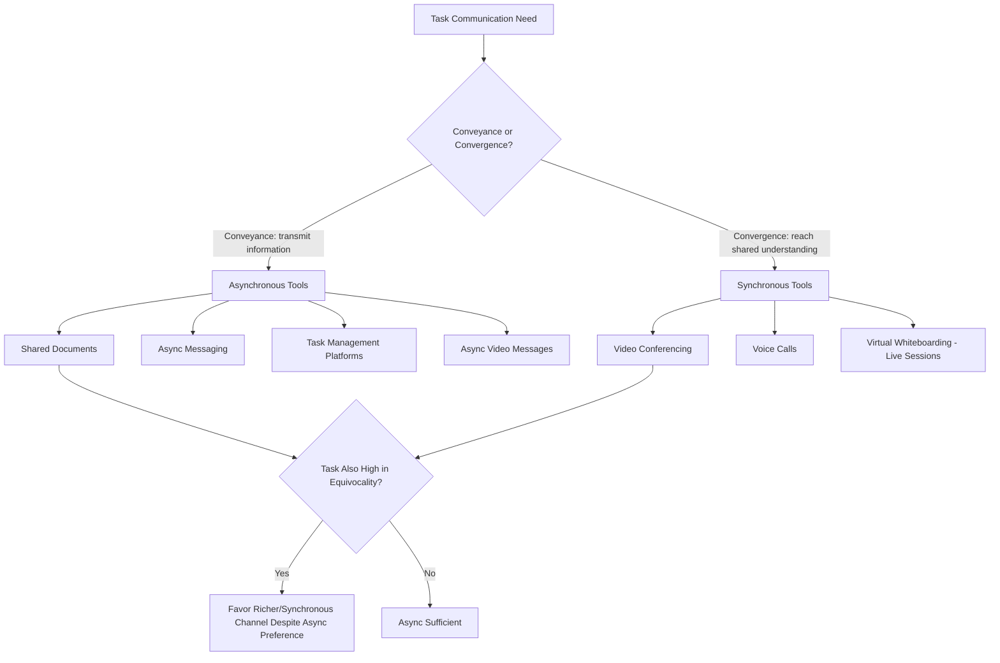

## Digital Collaboration Technology

### Definition and Scope

Digital collaboration technology refers to the software platforms, tools, and systems that mediate work-related communication, coordination, and joint task execution among organizational members, particularly (though not exclusively) in geographically or temporally distributed work arrangements. This item covers the major categories of collaboration technology, the psychological and organizational-behavior frameworks used to evaluate their fit and effects, and the well-documented risks (technostress, overload, always-on norms) that accompany their organizational adoption. It builds directly on Communication Models and Channels (media richness/synchronicity foundations) and connects forward to Virtual and Hybrid Team Dynamics, applying those frameworks specifically to the technology layer itself.

### Key Points

- Collaboration technologies are not interchangeable; different tool categories support different combinations of conveyance and convergence needs (per Media Synchronicity Theory), and mismatched tool selection for a given task is a persistent source of coordination inefficiency
- Tool affordances shape emergent usage patterns in ways not always intended by designers (Adaptive Structuration Theory), meaning identical software can produce different organizational communication cultures depending on how norms develop around it
- The proliferation of always-available digital channels has generated well-documented negative effects — technostress, communication overload, and blurred work-nonwork boundaries — that organizational psychology treats as a genuine occupational health concern, not merely an adjustment cost
- Tool consolidation versus tool proliferation is a live organizational design tradeoff: more specialized tools can better fit specific task needs but increase context-switching costs and fragment information across platforms
- Successful technology adoption depends heavily on established norms and governance (explicit agreements about which tool for which purpose, response-time expectations) rather than on tool capability alone

### Categories of Digital Collaboration Technology

**Synchronous communication tools**: Video conferencing and voice-call platforms supporting real-time, high-richness interaction. Best suited, per Media Synchronicity Theory, to convergence-oriented tasks — negotiation, ambiguous problem-solving, relationship-building, conflict resolution — where immediate feedback reduces the misinterpretation risk inherent in leaner channels.

**Asynchronous messaging tools**: Persistent chat/channel-based platforms (organized around channels, threads, or direct messages) supporting near-real-time but not strictly synchronous exchange. Occupy a middle position on the richness spectrum — richer than email in immediacy and informality, leaner than video in cue availability — and are well suited to ongoing team awareness, quick clarifications, and lightweight coordination.

**Shared document and co-authoring platforms**: Real-time or near-real-time collaborative editing of shared documents, spreadsheets, and files. Support conveyance-oriented work (information compilation, collaborative drafting) and, notably, enable a distinctive coordination mode not well captured by classic richness theory — parallel, asynchronous contribution to a shared artifact, where coordination occurs through the evolving document itself rather than through direct messaging about the document.

**Project and task management platforms**: Structured systems for tracking work items, assignments, deadlines, and workflow status (kanban boards, task lists, Gantt-style views). Function primarily as **coordination infrastructure** rather than communication channels per se — they reduce the need for explicit status-update communication by making work state visibly available, substituting structural transparency for repeated verbal/written coordination.

**Video/async video and recorded communication**: Asynchronous video messaging tools sit at an interesting intersection — retaining some nonverbal richness (tone, facial expression, per the Nonverbal Communication item) while allowing the temporal flexibility of asynchronous consumption, potentially offering a partial resolution to the richness-versus-flexibility tradeoff for distributed teams spanning incompatible time zones.

**Virtual whiteboarding and ideation tools**: Digital canvases supporting spatial, visual collaboration (brainstorming, diagramming, workshop facilitation) — attempting to replicate a specific co-located collaboration affordance (shared physical whiteboard/wall space) that is otherwise difficult to reproduce in distributed settings.

**Integrated/all-in-one collaboration suites**: Platforms bundling multiple categories above (messaging, video, document collaboration, task management) into a unified environment, trading some best-in-class specialization for reduced context-switching and information fragmentation.

### Tool Selection Framework Diagram

### Theoretical Application: Structuration and Emergent Use

Adaptive Structuration Theory (introduced under Communication Models and Channels) is particularly relevant to digital collaboration technology because the same platform is frequently observed to produce divergent organizational communication cultures across different teams or organizations, depending on the norms that develop around its use. For example, identical messaging-platform software may, in one organization, develop a norm of rapid always-on responsiveness (an emergent structure the tool's designers did not mandate but its always-available affordance made possible), while in another organization the same software develops a norm of scheduled, batch-checked usage. This underscores a recurring theme: **technology adoption outcomes are governed as much by socially negotiated usage norms as by the tool's designed capabilities**, meaning organizational interventions aimed at technology-related problems (overload, miscommunication) should target norm-setting and governance, not only tool selection or replacement.

### Technostress and Digital Overload

**Technostress** (Tarafdar and related organizational-technology researchers) is a recognized construct describing stress arising specifically from an individual's inability to cope adaptively with organizational information and communication technology demands. Commonly identified sub-dimensions include:

- **Techno-overload**: being forced to work faster and longer due to technology-enabled demands (e.g., expectation of rapid response across multiple simultaneous channels)
- **Techno-invasion**: technology's blurring of work and personal boundaries, particularly through always-available mobile access enabling work intrusion into non-work time and space
- **Techno-complexity**: the cognitive burden of learning and maintaining competence across an increasing number of tools and platforms
- **Techno-insecurity**: threat perceptions related to technology (e.g., job displacement concern, fear of being replaced by more technologically adept colleagues)
- **Techno-uncertainty**: stress from continuous, unpredictable technology change requiring ongoing adaptation

**Communication overload**: A related but distinct construct describing the state in which the volume of incoming communication (messages, notifications, meeting requests across multiple platforms) exceeds an individual's capacity to process it effectively, associated with documented negative outcomes including increased error rates, decision fatigue, and reduced job satisfaction.

**Always-on culture and boundary blurring**: The proliferation of mobile-accessible, persistent-notification collaboration tools has been extensively linked in the organizational psychology and occupational health literature to erosion of psychological detachment from work during nonwork hours — itself an established predictor of burnout and reduced recovery — making explicit organizational norms around after-hours availability (rather than leaving expectations implicit and technology-enabled by default) an increasingly common intervention.

### Governance and Norm-Setting Practices

Given the structuration-theory insight that tool effects depend heavily on emergent usage norms, effective organizational management of digital collaboration technology typically involves deliberate governance rather than relying on default tool behavior:

- **Channel-purpose mapping**: Explicit team or organizational agreements about which tool is used for which type of communication (e.g., "urgent matters via phone/call, status updates via task platform, non-urgent discussion via async messaging"), directly operationalizing the conveyance/convergence fit principle
- **Response-time norms**: Explicit expectations about acceptable response latency per channel, reducing the ambiguity that otherwise drives always-on anxiety (employees uncertain whether delayed response will be perceived negatively tend to default to faster, more stress-inducing response patterns)
- **Notification and availability governance**: Organizational or team-level norms (or technical defaults) around notification settings, "do not disturb" windows, and after-hours expectations, addressing techno-invasion directly
- **Tool rationalization**: Periodic organizational review of the collaboration tool portfolio to counteract tool proliferation, which increases both techno-complexity and information fragmentation across platforms

### Example

A distributed software organization observes rising reports of burnout and complaints about "meeting and message fatigue." Applying the frameworks above: rather than assuming the underlying collaboration tools themselves are the root problem, the organization audits actual usage norms against the tools' intended affordances. They find that synchronous video meetings are being used for routine status updates (a conveyance-oriented task better suited to asynchronous documentation, per Media Synchronicity Theory) while genuinely ambiguous design discussions are frequently deferred to asynchronous chat threads, requiring lengthy back-and-forth exchanges to reach understanding that a single synchronous conversation would resolve faster — an inverted mismatch relative to optimal fit. Independently, notification defaults across the messaging platform are set to alert all members for all channels, contributing to techno-overload. The intervention combines explicit channel-purpose governance (moving status updates to the async task platform, reserving synchronous time for genuinely equivocal discussions) with a technical and normative change to notification defaults and after-hours expectations, targeting both the structuration/norms layer and the techno-overload dimension simultaneously.

### Common Pitfalls

- Selecting or replacing collaboration tools based on feature comparison alone, without attention to the usage norms that will actually determine organizational outcomes
- Defaulting to synchronous meetings for conveyance-oriented tasks that asynchronous tools would handle more efficiently, and vice versa for genuinely equivocal discussions
- Treating technostress and communication overload as individual coping deficiencies rather than as organizationally-influenced conditions responsive to governance intervention
- Allowing notification and availability defaults to remain unexamined, permitting always-on norms to emerge unintentionally through technical default rather than deliberate organizational choice
- Adding new specialized tools without corresponding governance or consolidation review, compounding tool proliferation and technostress over time

**Related Topics**

- Media Synchronicity Theory Applied to Tool Selection (Cross-Reference)
- Technostress: Measurement and Organizational Interventions
- Psychological Detachment and Recovery from Work
- Adaptive Structuration Theory in Digital Workplace Design
- Meeting Overload and Meeting Design Best Practices
- Digital Boundary Management Policies