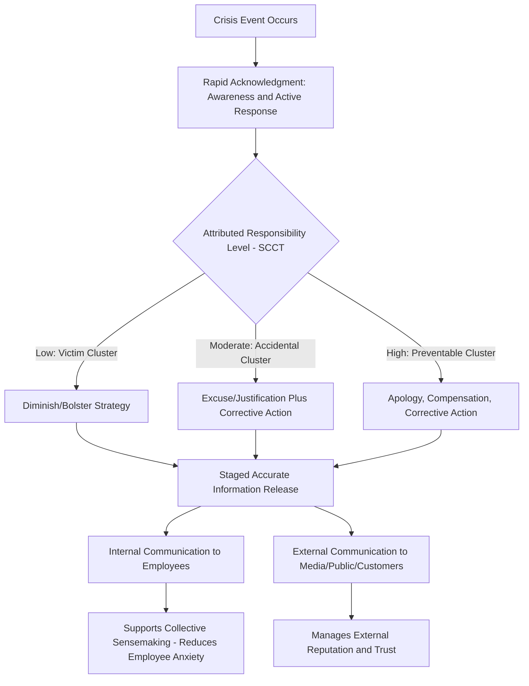

## Crisis Communication

### Definition and Scope

Crisis communication refers to the strategic management of information flow, messaging, and stakeholder engagement during events that threaten an organization's operations, reputation, financial stability, or the safety and wellbeing of its members and stakeholders. Within organizational psychology, crisis communication is examined both as an organizational-level strategic function (how organizations formally plan and execute crisis response) and through the lens of sensemaking (how organizational members collectively interpret and construct meaning under conditions of acute ambiguity and threat, drawing directly on Weick's model introduced under Communication Models and Channels). Crisis communication is distinguished from routine organizational communication by compressed decision timeframes, elevated stakeholder attention and scrutiny, high uncertainty, and disproportionate reputational and psychological stakes.

### Key Points

- Weick's sensemaking framework is especially applicable to crisis contexts because crises are, by definition, situations lacking pre-existing shared interpretation — meaning must be actively and rapidly constructed under conditions where existing organizational scripts often do not apply
- Speed and accuracy exist in genuine tension during crisis response; premature communication risks factual error, while delayed communication risks an information vacuum that stakeholders fill with speculation, rumor, or externally-sourced (and potentially inaccurate or unfavorable) narratives
- Situational Crisis Communication Theory (SCCT) provides an evidence-based framework for matching response strategy to the organization's attributed level of crisis responsibility
- Internal crisis communication (to employees) and external crisis communication (to media, customers, public) require coordinated but distinct strategies, and internal communication failures during crisis have direct employee psychological and behavioral consequences
- Leader communication behavior during crisis substantially shapes employee trust, anxiety levels, and post-crisis organizational commitment, extending well beyond the immediate crisis-response function

### Theoretical Frameworks

**Situational Crisis Communication Theory (SCCT)** (Coombs): The dominant contemporary framework for strategic crisis response selection. SCCT holds that the appropriate communication strategy depends substantially on the **attributed level of organizational responsibility** for the crisis, which is itself shaped by crisis type:

- **Victim clusters** (low attributed responsibility): natural disasters, rumors, workplace violence by external actors — the organization is itself a victim of the crisis, and diminish/bolstering strategies are typically appropriate
- **Accidental clusters** (moderate attributed responsibility): technical/equipment failures, challenges arising from unforeseeable product issues — a mix of excuse and justification strategies, combined with corrective action, is typically appropriate
- **Preventable clusters** (high attributed responsibility): human error, organizational misconduct, negligence — apology, compensation, and corrective action strategies are typically necessary, since audiences attribute the crisis directly to organizational failure and minimizing responsibility strategies tend to backfire, compounding reputational damage

SCCT further identifies a set of response strategy postures ranging from **denial** (no crisis exists, or the organization is not responsible) through **diminishment** (minimizing responsibility or severity) to **rebuilding** (compensation, apology) and **bolstering** (reminding stakeholders of the organization's positive track record, typically used as a supplement to other strategies rather than a standalone response). Strategy-crisis type mismatch — for example, deploying denial or diminishment strategies for a preventable-cluster crisis where organizational responsibility is clear — is strongly associated with worsened stakeholder trust and reputational outcomes in the SCCT research literature.

**Weick's Sensemaking Applied to Crisis**: Crises are, almost definitionally, high-ambiguity events for which existing organizational scripts and routines are insufficient — precisely the condition under which sensemaking processes become most consequential. Weick's foundational case analyses (notably of the Mann Gulch wildfire disaster) demonstrated that under acute crisis conditions, breakdowns in collective sensemaking (loss of shared role structure, inability to construct a coherent shared interpretation of a rapidly evolving threat) can directly contribute to catastrophic outcomes, independent of any individual's technical competence. Applied to organizational crisis communication, this suggests that a core function of crisis communication is not only conveying facts but actively supporting collective sensemaking — providing interpretive structure that helps organizational members and stakeholders construct a coherent, actionable understanding of a rapidly evolving and inherently ambiguous situation.

**Image Restoration Theory** (Benoit): A related, partially overlapping framework focused specifically on reputational repair strategies (denial, evasion of responsibility, reducing offensiveness, corrective action, mortification/apology), historically influential and substantially incorporated into SCCT's broader, more empirically validated framework.

### The Speed-Accuracy Tension

A central practical and theoretical tension in crisis communication is the tradeoff between **response speed** and **informational accuracy/completeness**:

- Delayed communication creates an **information vacuum**, which stakeholders (employees, media, public) tend to fill with speculation, rumor (connecting to the grapevine dynamics covered under Formal and Informal Communication Networks), or externally sourced narratives the organization does not control — and once external narratives take hold, subsequent organizational correction becomes substantially more difficult
- Premature communication, particularly before facts are verified, risks factual error requiring later correction — and correction itself carries reputational cost, as audiences may interpret revision as evidence of either incompetence or initial dishonesty, independent of whether the correction was made in good faith
- The generally recommended resolution in crisis communication practice is **rapid acknowledgment paired with staged information release**: communicating promptly that the organization is aware of the situation and is actively investigating/responding (satisfying the urgency need and reducing vacuum risk) without prematurely committing to unverified specifics, followed by accurate substantive updates as information is confirmed

### Crisis Communication Response Flow Diagram

### Internal Crisis Communication

Internal crisis communication — communication directed at employees rather than external stakeholders — carries distinct psychological stakes often under-addressed relative to external/media-facing crisis communication:

- **Employee anxiety and uncertainty reduction**: Employees experiencing organizational crisis face direct personal uncertainty (job security, safety, organizational stability) alongside professional uncertainty, and clear, honest internal communication functions to reduce anxiety by supporting the same sensemaking function Weick's framework describes at the collective level
- **Trust and psychological contract implications**: How leadership communicates during crisis — transparency, honesty about uncertainty, timeliness — substantially shapes employees' broader trust in leadership and their psychological contract with the organization, with effects that persist well beyond crisis resolution
- **Internal-external message coordination**: Employees who learn crisis information from external media before or instead of internal channels experience a documented erosion of trust and a sense of organizational disregard; internal communication should generally precede or at minimum coincide with external communication where feasible, reversing the historical default (in many organizations) of prioritizing external/media response first
- **Leader visibility and accessibility during crisis**: Consistent with organizational listening principles covered earlier in the chapter, leader accessibility (visible presence, availability for questions) during crisis is associated with stronger employee trust outcomes than purely top-down, one-way crisis messaging

### Common Crisis Communication Failure Modes

- **Strategy-responsibility mismatch**: Deploying denial or minimization strategies for clearly preventable-cluster crises, contrary to SCCT's evidence-based guidance, typically compounding rather than mitigating reputational damage
- **Excessive delay**: Allowing an information vacuum to persist long enough for external or informal (grapevine) narratives to become entrenched before organizational communication arrives
- **Internal-external sequencing failure**: Employees learning of crisis developments via external media rather than internal channels, damaging trust independent of the crisis's substantive resolution
- **Overcommitment to unverified facts**: Premature specificity that later requires correction, creating a secondary credibility crisis layered atop the original event
- **Treating crisis communication as purely reputational**: Focusing exclusively on external image management while neglecting the internal sensemaking and psychological support function for employees directly affected

### Example

A manufacturing organization experiences a significant workplace safety incident resulting in employee injury. Applying SCCT, initial investigation suggests the incident falls into the accidental cluster (equipment malfunction rather than clear negligence), but as investigation proceeds, evidence emerges that a known maintenance issue had been previously flagged and not addressed — shifting the situation toward the preventable cluster. Consistent with SCCT's guidance, the organization's communication strategy shifts accordingly: initial rapid acknowledgment (transparent that an incident occurred and is under investigation, without over-committing to responsibility attribution before the facts are established) is followed, once the maintenance history is confirmed, by a strategy shift toward acknowledgment of organizational responsibility, corrective action commitments, and support for the affected employee — avoiding the common failure mode of anchoring to an initial diminished-responsibility framing that later factual developments contradict. Internally, leadership communicates directly with affected-area employees before the incident becomes public through external channels, consistent with internal-external sequencing best practice, directly supporting collective sensemaking and mitigating the anxiety and trust erosion that delayed or externally-sourced disclosure would otherwise risk.

**Related Topics**

- Weick's Sensemaking Theory and the Mann Gulch Case Study in Depth
- Situational Crisis Communication Theory: Full Strategy Taxonomy
- Psychological Contract Violation and Organizational Trust
- Organizational Silence and Its Interaction with Crisis Disclosure
- Leader Communication Behavior and Employee Anxiety Regulation
- Post-Crisis Organizational Learning and Communication Debriefs