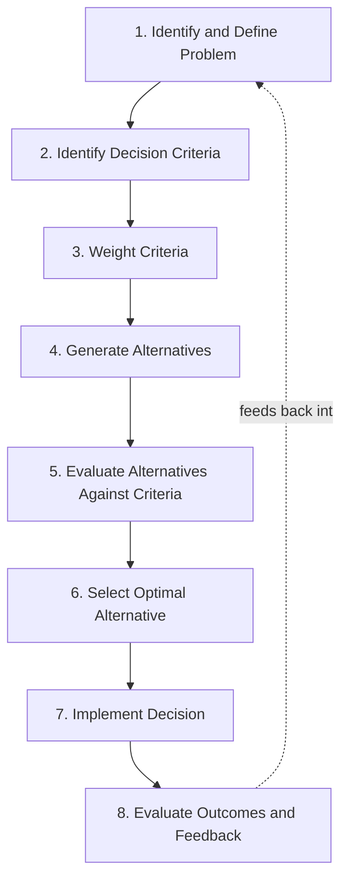

## Rational Decision-Making Models

### Definition and Scope

Rational decision-making models describe normative and descriptive frameworks for how individuals and organizations should (normative) or do (descriptive, as a baseline for comparison) select among alternative courses of action to maximize expected value or utility. Within organizational psychology and behavioral decision theory, "rational" models function primarily as an idealized benchmark — a formal standard against which actual organizational decision-making is measured — rather than as an empirically accurate description of typical decision behavior, a distinction that becomes central to later items in this chapter covering bounded rationality and cognitive biases. This item establishes that benchmark: the classical rational actor framework, its formal decomposition into sequential stages, and its foundational assumptions.

### Key Points

- The classical rational decision-making model assumes complete information, stable and consistent preferences, and unlimited cognitive processing capacity to identify the utility-maximizing alternative among all possible options
- Rational models decompose decision-making into a sequence of discrete stages, providing a structured framework even though real decision processes frequently violate the strict linear sequence
- Expected Utility Theory provides the formal mathematical foundation for rational choice under conditions of risk (known probabilities), extending simple expected-value maximization to account for risk attitudes
- The rational model's primary organizational value is prescriptive/diagnostic — it identifies where and how real decision processes deviate from the idealized standard, which is foundational to understanding subsequent bounded-rationality and heuristics-and-biases material
- Multi-attribute utility theory extends single-criterion rational choice to the more organizationally realistic case of decisions involving multiple, potentially competing evaluation criteria

### The Classical Rational Decision-Making Process

The canonical rational model decomposes decision-making into a sequence of formally distinct stages:

1. **Problem identification and definition**: Recognizing that a decision is required and accurately defining the nature and scope of the problem — the rational model assumes this definition is objective and complete, an assumption heavily challenged in later problem-framing and cognitive-bias literature
2. **Identification of decision criteria**: Determining the relevant dimensions along which alternatives will be evaluated (cost, quality, time, risk, strategic fit, etc.)
3. **Weighting of criteria**: Assigning relative importance weights to each identified criterion, reflecting the decision-maker's (assumed stable and known) preference structure
4. **Generation of alternatives**: Identifying the full, or a sufficiently comprehensive, set of possible courses of action — the rational model in its strict form assumes exhaustive alternative generation, a requirement virtually never met in practice and a key point of departure for bounded rationality
5. **Evaluation of alternatives against criteria**: Systematically assessing each alternative's performance on each weighted criterion
6. **Selection of the optimal alternative**: Choosing the alternative that maximizes expected utility given the weighted criteria — this is the formal decision point in the classical model
7. **Implementation**: Executing the selected alternative
8. **Evaluation and feedback**: Assessing outcomes against expectations, ideally feeding back into future decision processes (echoing the cyclical, feedback-incorporating logic seen in the IMOI team-effectiveness model covered earlier in the curriculum)

This staged decomposition is valuable as an analytical and diagnostic tool even where real organizational decisions do not follow it linearly or exhaustively — it provides a common vocabulary for identifying at which specific stage a given real-world decision process deviated from or fell short of the rational standard (e.g., insufficient alternative generation at stage 4, versus inconsistent criteria weighting at stage 3).

### Rational Decision Process Diagram

### Formal Foundations: Expected Value and Expected Utility

**Expected Value (EV)**: The foundational formalization of rational choice under conditions of known risk (as opposed to full uncertainty, where probabilities are unknown), defined as the probability-weighted sum of outcomes:

$$EV = \sum_{i=1}^{n} p_i \cdot x_i$$

where $p_i$ is the probability of outcome $i$ and $x_i$ is the value of outcome $i$. Strict expected-value maximization assumes decision-makers are risk-neutral — indifferent between a certain outcome and a risky gamble with equal expected value — an assumption widely violated in observed human and organizational decision behavior.

**Expected Utility Theory** (von Neumann & Morgenstern): Extends expected value by substituting a **utility function** $u(x)$ for raw outcome value $x$, allowing the model to formally represent risk attitudes (risk-averse, risk-neutral, risk-seeking) via the curvature of the utility function:

$$EU = \sum_{i=1}^{n} p_i \cdot u(x_i)$$

A concave utility function ($u''(x) < 0$) represents risk aversion (diminishing marginal utility of gains), a linear utility function represents risk neutrality, and a convex utility function ($u''(x) > 0$) represents risk-seeking behavior. Expected Utility Theory remains the normative benchmark in rational choice theory, even though its descriptive accuracy is extensively challenged by Prospect Theory and related behavioral decision research (covered in a later chapter item on cognitive biases in decision-making).

### Multi-Attribute Utility Theory (MAUT)

Organizational decisions rarely involve a single evaluation criterion; Multi-Attribute Utility Theory formalizes rational choice across multiple, weighted criteria simultaneously:

$$U(A) = \sum_{j=1}^{m} w_j \cdot u_j(A)$$

where $U(A)$ is the total utility of alternative $A$, $w_j$ is the weight assigned to criterion $j$ (with weights typically normalized to sum to 1), and $u_j(A)$ is alternative $A$'s utility score on criterion $j$. MAUT underlies many practical organizational decision-support tools (structured vendor selection matrices, weighted scoring models for hiring or project prioritization decisions) and requires several conditions to be formally valid: criteria must be **preferentially independent** (the desirability of an outcome on one criterion does not depend on the level of another criterion) and weights must accurately reflect genuine trade-off preferences rather than arbitrary or post-hoc assignment.

### Assumptions and Their Organizational Implications

The classical rational model rests on several strong assumptions, each of which becomes a focal point for critique in subsequent decision-making chapter items:

- **Complete and accurate information availability**: Assumes decision-makers have full access to all relevant information about alternatives and outcomes, an assumption routinely violated in organizational contexts characterized by information asymmetry, time pressure, and genuine uncertainty
- **Stable, consistent, and complete preferences**: Assumes decision-makers possess a well-defined, transitive preference ordering across all possible outcomes, known in advance of the decision process — organizational and individual preferences are frequently constructed or discovered during the decision process itself rather than pre-existing it
- **Unlimited cognitive processing capacity**: Assumes decision-makers can costlessly generate, evaluate, and compare an exhaustive or near-exhaustive alternative set, disregarding the genuine cognitive and time costs of information search and evaluation that Herbert Simon's bounded rationality framework directly challenges
- **Utility maximization as the decision objective**: Assumes decision-makers seek the single optimal alternative, as opposed to a merely acceptable one — the maximizing-versus-satisficing distinction central to bounded rationality theory

### The Rational Model as Diagnostic Benchmark

Within contemporary organizational psychology, the rational model is generally not presented as an accurate descriptive account of how organizational decisions actually unfold — that role is filled by bounded rationality, naturalistic decision-making, and heuristics-and-biases frameworks covered elsewhere in this chapter. Instead, its primary contemporary value is **diagnostic and prescriptive**: it provides a formal standard against which specific organizational decision failures can be located and analyzed (e.g., "this decision failed at the alternative-generation stage, having considered only two options when a wider search was feasible," or "criteria weights were not made explicit, allowing post-hoc rationalization of a preferred alternative"). Structured decision-support techniques used in applied organizational settings (decision matrices, weighted scoring models, formal cost-benefit analysis) represent deliberate attempts to operationalize rational-model principles as a corrective to the biases and shortcuts that unaided decision-making tends toward.

### Example

A company must select a new enterprise software vendor from among several competing options. Applying the rational model explicitly: the decision team first defines the problem precisely (replacing a system with specific identified limitations, not merely "getting new software"), then identifies evaluation criteria (implementation cost, ongoing licensing cost, integration compatibility, vendor support quality, scalability), assigns explicit weights to each criterion reflecting the organization's actual priorities (e.g., integration compatibility weighted most heavily given known technical constraints), generates a reasonably exhaustive set of vendor alternatives rather than stopping at the first acceptable option, scores each vendor against each weighted criterion using a formal MAUT-style scoring matrix, and selects the alternative with the highest total weighted utility score rather than the alternative favored by the most senior stakeholder in the room. This structured process does not guarantee a correct outcome, but it makes the decision's logic auditable and reduces (without eliminating) the influence of unexamined biases relative to an unstructured discussion-based decision process.

### Common Pitfalls

- Treating the rational model as a literal description of how organizational decisions do occur, rather than as a normative benchmark and diagnostic tool
- Assigning criteria weights post-hoc to justify an already-preferred alternative, undermining the model's core objectivity assumption without formally abandoning its structure
- Stopping alternative generation prematurely (often at the first acceptable option) while still claiming to have followed a rational process
- Assuming criteria are preferentially independent in MAUT applications without verifying this, producing systematically distorted weighted scores
- Applying strict expected-value maximization in contexts involving substantial risk, ignoring documented risk-attitude effects that expected utility theory was specifically developed to accommodate

**Related Topics**

- Bounded Rationality and Satisficing (Herbert Simon)
- Prospect Theory and Departures from Expected Utility
- Heuristics and Cognitive Biases in Organizational Decision-Making
- Naturalistic Decision-Making and Recognition-Primed Decisions
- Group Decision-Making Processes and Groupthink
- Weighted Scoring Models and Decision-Support Tools in Practice