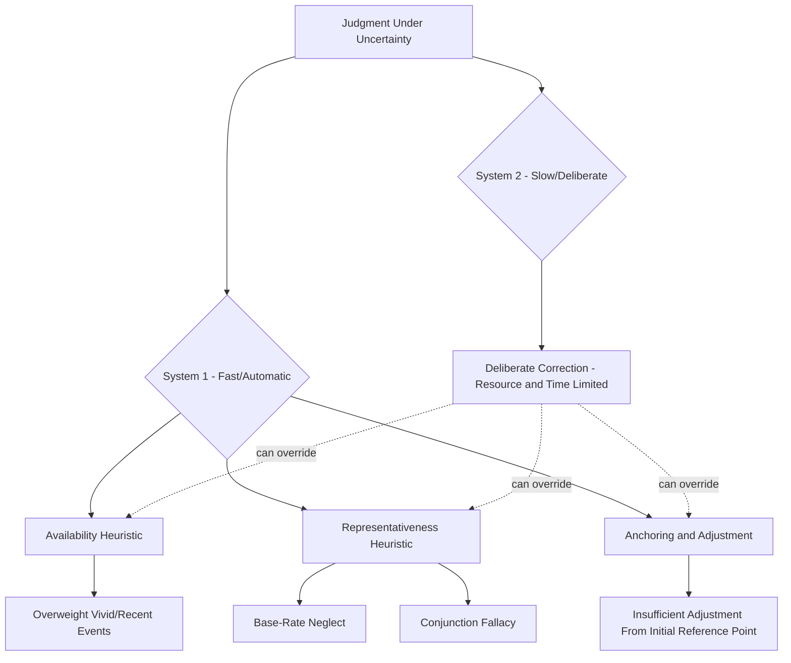

## Bounded Rationality and Heuristics

### Definition and Scope

This item extends the bounded rationality foundation introduced in Rational Decision-Making Models into its most empirically developed application: the **heuristics and biases** research program, which catalogs the specific mental shortcuts (heuristics) that decision-makers employ under bounded-rationality conditions, and the systematic, predictable errors (biases) these shortcuts produce. Where the previous item established *why* full rationality is unachievable (cognitive, informational, and temporal limits) and introduced satisficing as one behavioral adaptation, this item details *how* bounded rationality manifests in specific, well-documented cognitive processes, primarily through the foundational work of Tversky and Kahneman.

### Key Points

- Heuristics are efficient, generally adaptive mental shortcuts that reduce complex probabilistic and evaluative judgments to simpler operations, and are not inherently irrational — they represent an evolved and largely functional response to bounded cognitive capacity
- The heuristics and biases research program demonstrates that while these shortcuts are usually adaptive, they produce systematic (not random) errors in specific, predictable, and well-documented circumstances
- The three foundational heuristics identified by Tversky and Kahneman — availability, representativeness, and anchoring-and-adjustment — remain the core building blocks of the broader behavioral decision-making literature applied throughout organizational contexts
- Organizational decision-making contexts (hiring, performance evaluation, strategic forecasting, risk assessment) are particularly susceptible to specific, identifiable heuristic-driven biases, making awareness of this literature directly actionable for organizational practice
- Dual-process theory (System 1 / System 2) provides the broader cognitive-architecture framework within which heuristic-based judgment is typically situated in contemporary behavioral decision research

### Dual-Process Theory: Cognitive Architecture of Heuristic Judgment

Contemporary behavioral decision theory, most prominently articulated by Kahneman, situates heuristic processing within a **dual-process** cognitive architecture:

- **System 1**: Fast, automatic, effortless, associative, and largely unconscious processing. Heuristics operate predominantly through System 1 — they are the mechanism by which System 1 generates rapid judgments under uncertainty without deliberate, effortful reasoning
- **System 2**: Slow, deliberate, effortful, and consciously controlled processing, capable of the more exhaustive evaluation the classical rational model presupposes, but limited by available cognitive resources and susceptible to depletion under fatigue, time pressure, or cognitive load

Heuristic-driven biases are more likely to dominate judgment when System 2 engagement is low — under time pressure, high cognitive load, fatigue, or low perceived decision importance — conditions common in many routine organizational decision contexts (rapid hiring screens, quick performance impressions, routine risk assessments), making organizational settings a particularly relevant application domain for this research.

### The Three Foundational Heuristics

**Availability Heuristic**: Individuals judge the probability or frequency of an event based on the ease with which relevant instances come to mind, rather than on actual statistical frequency. Events that are recent, vivid, emotionally salient, or personally experienced are more "available" in memory and are consequently judged as more probable or frequent than base rates justify.

*Organizational manifestation*: A manager who recently dealt with a high-profile project failure may overestimate the general probability of project failure across the organization, disproportionately influencing subsequent risk-averse decision-making; a recent, vivid safety incident may drive disproportionate resource reallocation toward that specific risk category relative to statistically more significant but less memorable risks.

**Representativeness Heuristic**: Individuals judge the probability that an object or event belongs to a category based on how similar or "representative" it appears of that category's stereotype, often while neglecting relevant statistical base rates. This heuristic underlies several well-documented sub-biases:

- **Base-rate neglect**: Disregarding known population base rates in favor of case-specific, representativeness-based judgment (e.g., judging a job candidate as an excellent fit primarily because their profile matches a stereotyped image of a "successful" employee, independent of actual base rates of success for candidates with similar profiles)
- **Conjunction fallacy**: Judging a conjunction of two events (A and B) as more probable than one of the constituent events alone (A), a logical impossibility, because the conjunction is more representative of a salient narrative or stereotype
- **Insensitivity to sample size**: Failing to adjust confidence in a judgment based on the size of the sample it is drawn from, treating small-sample evidence with the same confidence as large-sample evidence when the small sample happens to be vivid or representative-seeming

*Organizational manifestation*: Evaluating a new hire's likely long-term performance based primarily on how closely their background resembles a prototype of a previously successful employee, rather than on base-rate predictive validity of the actual selection criteria being used.

**Anchoring and Adjustment Heuristic**: Judgments under uncertainty are made by starting from an initial reference point (an "anchor," which may be arbitrary or only weakly relevant) and adjusting from that starting point — but adjustments are typically insufficient, leaving the final judgment biased toward the initial anchor even when the anchor is known to be uninformative or irrelevant.

*Organizational manifestation*: Salary negotiations are strongly influenced by whichever party's initial number is stated first, since subsequent counter-offers tend to adjust insufficiently away from that anchor; initial budget or timeline estimates in project planning often persist as anchors influencing final figures even after substantial new information emerges that would justify a much larger revision.

### Heuristics and Biases Framework Diagram

### Additional Organizationally Relevant Heuristics and Biases

Building on the three foundational heuristics, subsequent research has identified numerous derivative biases with substantial organizational relevance:

- **Confirmation bias**: The tendency to search for, interpret, and recall information in ways that confirm pre-existing beliefs or hypotheses, while discounting disconfirming evidence — highly relevant to organizational strategic planning, where initial strategic hypotheses can become self-reinforcing as decision-makers selectively attend to supportive market signals
- **Overconfidence bias**: A well-documented tendency for individuals to overestimate the accuracy of their own judgments and forecasts, particularly pronounced in domains of genuine expertise where confidence can outpace actual predictive accuracy — with direct relevance to managerial forecasting and strategic risk assessment
- **Hindsight bias**: The tendency, after an outcome is known, to perceive that outcome as having been more predictable beforehand than it actually was ("I knew it all along") — with organizational relevance to post-mortem/retrospective analyses, where hindsight bias can distort accurate learning from both successes and failures by overstating how foreseeable outcomes actually were at decision time
- **Sunk cost fallacy**: Continuing to invest in a failing course of action because of resources already committed (which are, rationally, no longer recoverable regardless of the future decision), rather than evaluating the decision purely on its prospective merits — a well-documented driver of organizational escalation of commitment to failing projects
- **Framing effects**: Judgments and choices shift depending on how logically equivalent information is presented (e.g., described in terms of gains versus losses), directly violating the invariance axiom the classical rational model presupposes, and closely connected to Prospect Theory's loss-aversion findings

### Organizational Contexts Particularly Susceptible to Heuristic-Driven Bias

- **Selection and hiring decisions**: Representativeness-driven stereotype matching and availability-driven overweighting of recent or vivid candidate impressions are well-documented contributors to selection decisions departing from criterion-valid, structured assessment
- **Performance evaluation**: Availability (recent performance overweighted relative to full-period performance, sometimes termed *recency bias* in applied performance-management contexts) and representativeness (stereotype-consistent evaluation) both affect rating accuracy
- **Strategic forecasting and planning**: Anchoring on initial estimates, overconfidence in forecast accuracy, and confirmation bias in evaluating market signals collectively affect the quality of strategic planning processes
- **Risk assessment and safety management**: Availability-driven overweighting of recent, vivid incidents can distort resource allocation away from statistically more significant but less salient risk categories
- **Project and budget planning**: Anchoring on initial estimates and optimism-related planning biases (closely related to overconfidence) are well-documented contributors to systematic project cost and timeline underestimation

### Debiasing Approaches

Organizational psychology and behavioral decision research have identified several categories of intervention aimed at mitigating heuristic-driven bias, with varying degrees of empirically demonstrated effectiveness:

- **Structured decision processes**: Formal checklists, structured evaluation criteria (connecting back to the classical rational model's value as a corrective structure), and pre-registration of evaluation criteria before alternative-specific information is reviewed, directly counteracting confirmation bias and criteria drift
- **Devil's advocacy and structured dissent**: Deliberately assigning a group member to argue against the emerging consensus position, intended to counteract confirmation-bias-driven groupthink (connecting forward to group decision-making processes covered later in this chapter)
- **Base-rate anchoring/statistical training**: Deliberately introducing relevant base-rate statistical information into judgment processes to counteract representativeness-driven base-rate neglect
- **Pre-mortem analysis**: Structured exercises imagining a decision has already failed and working backward to identify why, intended to counteract overconfidence and surface risks that confirmation bias would otherwise suppress
- **Slowing decision processes / forcing System 2 engagement**: Deliberately introducing structured pauses, cooling-off periods, or explicit prompts to reconsider under conditions that would otherwise favor System 1 dominance (time pressure, high cognitive load)

[Inference] Debiasing interventions are generally more effective at the process level (structuring decisions to reduce reliance on unaided intuitive judgment) than at the level of simply informing individuals about the existence of biases, since awareness of a bias does not reliably prevent its operation — though the specific comparative effectiveness of different debiasing techniques likely varies by bias type, decision domain, and organizational context, and should not be treated as uniformly established across all applications.

### Example

A hiring committee is evaluating finalist candidates for a senior technical role. Aware of representativeness-driven bias risk, the organization has implemented structured interviewing with pre-established, criterion-validated evaluation dimensions scored independently by each interviewer before group discussion — directly countering the risk that an early, vivid impression (availability) or a strong resemblance to a previously successful employee (representativeness) would disproportionately drive the final decision through unstructured group discussion. During calibration discussion, one interviewer notes that their initial impression was strongly anchored by the candidate's confident presentation early in the interview; because scores were recorded independently beforehand rather than being formed during open-ended group discussion, this anchoring effect on that individual rater is identifiable and can be explicitly discussed and weighed against the other interviewers' independently-formed and differently-anchored impressions, rather than the group converging prematurely around whichever anchor was introduced first and loudest in an unstructured discussion.

**Related Topics**

- Dual-Process Theory (System 1/System 2) in Organizational Judgment
- Prospect Theory and Loss Aversion in Managerial Decision-Making
- Escalation of Commitment and the Sunk Cost Fallacy in Organizations
- Groupthink and Structured Dissent Techniques
- Debiasing Interventions: Evidence and Limitations
- Recency Bias and Rater Effects in Performance Appraisal