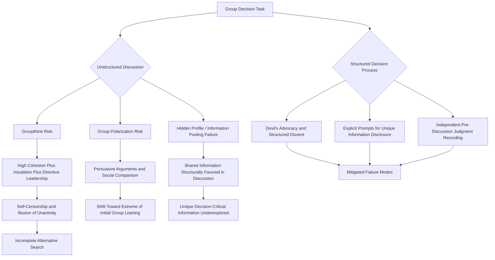

## Group Decision-Making Processes

### Definition and Scope

Group decision-making processes examine how the addition of multiple decision-makers to a decision task changes outcomes relative to individual decision-making — sometimes improving decision quality through pooled information and diverse perspectives, and sometimes degrading it through well-documented social and cognitive dynamics specific to group contexts. This item extends the individual-level bounded rationality and heuristics foundation from prior items into the group setting, where additional phenomena — information pooling failures, social conformity pressures, and polarization dynamics — operate alongside (and sometimes amplify) individual-level biases.

### Key Points

- Groups possess a genuine theoretical advantage over individuals for many decision tasks — access to a broader information and expertise pool, error-correction through mutual critique — but this advantage is frequently not realized in practice due to well-documented process losses
- **Groupthink** (Janis) describes a specific, extensively documented failure mode in which excessive concurrence-seeking overrides realistic appraisal of alternatives, particularly in cohesive, insulated groups under external threat or directive leadership
- **Group polarization** describes the tendency for group discussion to shift the group's post-discussion position toward a more extreme version of its pre-discussion average tendency, rather than toward moderation
- **Hidden profile** research demonstrates that group discussion systematically favors shared information (known to all members) over unique information (known to only one member), even when unique information is decision-critical — undermining the theoretical information-pooling advantage groups are assumed to possess
- Structural interventions (devil's advocacy, structured dissent, decision-process design) can substantially mitigate these group-level failure modes, connecting directly to the debiasing literature from the previous item

### Groupthink

**Groupthink** (Janis) describes a mode of group thinking that occurs when the desire for consensus and cohesion overrides members' motivation to realistically appraise alternative courses of action. Janis's foundational research, developed through analysis of major historical policy-decision fiascoes, identified a set of antecedent conditions and observable symptoms:

**Antecedent conditions**:

- High group cohesiveness, particularly when cohesion is valued more highly than accurate decision-making
- Structural insulation of the group from outside, dissenting viewpoints
- Directive leadership that signals a preferred outcome, discouraging open exploration of alternatives
- High stress combined with low perceived probability of finding a better solution than the leader's preferred option
- Lack of established, impartial decision-making procedures (norms for systematic alternative evaluation)

**Observable symptoms** (commonly grouped into three categories):

- *Overestimation of the group*: illusions of invulnerability, unquestioned belief in the group's inherent morality
- *Closed-mindedness*: collective rationalization discounting warnings, stereotyped views of out-group members or opposing perspectives as too weak or evil to warrant genuine consideration
- *Pressures toward uniformity*: self-censorship of doubts, an illusion of unanimity (partly sustained by that self-censorship, since silence is misread as agreement), direct pressure on dissenters to conform, and the emergence of **self-appointed "mindguards"** — members who actively shield the group from dissenting or disconfirming information

Groupthink's consequences include incomplete survey of alternatives, failure to examine risks of the preferred choice, poor information search, selective information processing (a group-level parallel to individual confirmation bias), and failure to develop contingency plans — collectively producing decision quality substantially below what the group's aggregate information and expertise should theoretically support.

### Group Polarization

**Group polarization** describes the empirically robust finding that group discussion tends to shift the group's collective position toward a more extreme version of the average individual pre-discussion inclination, rather than toward a moderated compromise position — occurring in both risk-averse and risk-seeking directions depending on the group's initial leaning (the phenomenon was originally identified as "risky shift" before the broader, bidirectional polarization pattern was established). Two primary explanatory mechanisms are generally offered:

- **Persuasive arguments theory**: Group discussion exposes members to a pool of arguments supporting the majority-leaning position that individual members had not previously considered, and this additional persuasive input shifts individual positions further in that direction
- **Social comparison theory**: Members, wishing to be seen favorably relative to the group's apparent normative position, shift their expressed position to align with or slightly exceed what they perceive as the group's valued direction, producing a self-reinforcing extremity shift as members compete somewhat to signal alignment

*Organizational manifestation*: A management team initially cautiously favorable toward a risky strategic initiative may, following group discussion, converge on a substantially more aggressive version of that initiative than any individual member's starting position — not because new disconfirming information was surfaced and rejected (as in groupthink), but through the polarizing dynamics of the discussion process itself.

### Hidden Profiles and Information Pooling Failure

The **hidden profile paradigm** (Stasser & Titus) is an experimental research design in which decision-relevant information is deliberately distributed across group members such that the objectively best decision option is identifiable only if members pool their individually-held unique information; some information is shared (known to all members before discussion) while other information is unique (known to only one member).

The consistent and robust finding across this research program: **group discussion disproportionately focuses on shared information and systematically underexplores unique information**, even though unique information is often precisely what would reveal the hidden profile and lead to the objectively superior decision. This occurs for several compounding reasons:

- Shared information has a structural advantage in discussion simply because more members can independently raise or corroborate it, increasing its likelihood of being mentioned and repeated
- Corroborated, repeated information (shared) tends to be perceived as more credible than single-source information (unique), even when the unique information is equally or more valid
- Group discussion time and cognitive attention are finite, and the structural bias toward shared information means unique information frequently receives disproportionately less discussion time regardless of its actual decision relevance

This directly undermines the classical theoretical rationale for group decision-making (that pooling diverse members' unique information and perspectives should improve decision quality relative to any individual alone) — the *potential* advantage exists, but unstructured group discussion frequently fails to realize it in practice.

### Group Decision Failure Modes Diagram

### Structural Interventions and Mitigation

Building directly on the debiasing literature from the previous item, several structured group-process interventions have research support for mitigating groupthink, polarization, and hidden-profile pooling failures:

- **Devil's advocacy / structured dissent**: Formally assigning one or more members the explicit role of challenging the emerging consensus, providing organizational legitimacy to dissent that unstructured discussion's uniformity pressures would otherwise suppress
- **Dialectical inquiry**: A related but more elaborate technique in which two subgroups are assigned to develop and argue genuinely opposing recommendations before the full group deliberates, more thoroughly surfacing alternative framings than single-devil's-advocate approaches
- **Independent pre-discussion judgment recording**: Requiring each member to independently record their assessment or unique information *before* group discussion begins (directly addressing hidden-profile pooling failure by ensuring unique information is captured and available for consideration rather than lost to shared-information dominance in live discussion)
- **Explicit process norms for leadership**: Leaders deliberately withholding their own preferred position until after other members have expressed views, directly countering the directive-leadership antecedent condition identified in Janis's groupthink research
- **Structured turn-taking / nominal group technique**: Formal processes requiring each member to contribute ideas independently (often in writing) before open discussion, structurally guaranteeing that quieter members' or minority-held unique information is surfaced rather than dominated by more vocal members or majority-shared information
- **Second-chance meetings**: Explicitly scheduling a follow-up discussion after an initial consensus has formed, providing structured opportunity to surface lingering doubts that self-censorship suppressed in the original discussion

### Example

A product development team is deciding whether to proceed with a major feature launch. Each team member has been independently monitoring different aspects of the pre-launch data (a hidden-profile-style information distribution), but in an unstructured discussion, conversation naturally gravitates toward the positive user-testing results known to and repeatedly corroborated by most team members (shared information), while a single engineer's unique knowledge of an unresolved scalability risk — known only to them — receives comparatively little discussion time despite being decision-critical. Recognizing the hidden-profile risk, the team lead implements a structured pre-discussion step: each member independently submits their key data points and concerns in writing before the group meeting. This surfaces the scalability risk explicitly and ensures it receives dedicated discussion time rather than being crowded out by more widely corroborated but less individually decision-critical shared information, directly countering the structural bias the hidden-profile research documents.

### Common Pitfalls

- Assuming groups automatically outperform individuals in decision quality simply by virtue of pooling more people, without accounting for the well-documented process losses that frequently offset this theoretical advantage
- Mistaking apparent consensus for genuine agreement, when unstructured group settings can produce an illusion of unanimity sustained by self-censorship rather than actual shared conviction
- Allowing directive or high-status leaders to state preferences early in discussion, structurally priming groupthink-style conformity pressure
- Relying exclusively on open, unstructured discussion formats for decisions where relevant information is likely distributed unevenly across members (a hidden-profile-prone situation)
- Treating group polarization as evidence of genuine persuasion toward a better-reasoned position, when it may instead reflect social-comparison-driven extremity-seeking independent of decision quality

**Related Topics**

- Janis's Groupthink Case Studies in Historical Policy Fiascoes
- Nominal Group Technique and the Delphi Method
- Team Diversity and Information Elaboration
- Psychological Safety and Dissent (Cross-Reference to Organizational Listening)
- Risky Shift and the Persuasive Arguments/Social Comparison Debate
- Structured Decision-Making Techniques in High-Stakes Organizational Contexts