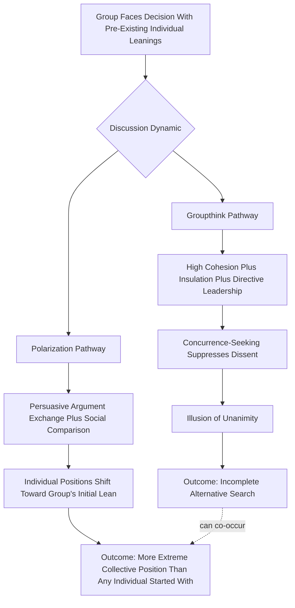

## Groupthink and Group Polarization

### Definition and Scope

This item provides a focused, deeper treatment of the two phenomena introduced at overview level in Group Decision-Making Processes — groupthink and group polarization — examining their theoretical mechanisms, empirical status, boundary conditions, and organizational intervention strategies in greater depth. While the prior item situated both phenomena within the broader landscape of group decision failure modes (alongside hidden profiles), this item treats them as the chapter's primary case studies in how group-level social dynamics produce systematic, predictable departures from the decision quality that pooled group information and expertise should theoretically support.

### Key Points

- Groupthink and group polarization are distinct phenomena with different mechanisms, different antecedent conditions, and different characteristic outcomes, despite both being social-dynamic group failure modes
- Groupthink is fundamentally about *premature consensus-seeking suppressing critical evaluation*; group polarization is fundamentally about discussion *shifting the group's substantive position toward extremity*, and a group can polarize without exhibiting groupthink's suppression-of-dissent symptoms, or vice versa
- Empirical support for groupthink's full antecedent-symptom-outcome causal chain, as originally specified by Janis, has been more mixed and contested in subsequent research than its widespread popular and applied use suggests — later work has more strongly supported some components (particularly directive leadership and self-censorship) than others (cohesion's role is more contested and context-dependent than Janis's original formulation implied)
- Group polarization has substantially stronger and more consistent experimental replication support than the full groupthink model, though its underlying dual mechanisms (persuasive arguments vs. social comparison) remain an active area of ongoing theoretical refinement
- Both phenomena have distinct, evidence-supported organizational mitigation strategies, though the interventions are not fully interchangeable given their different underlying mechanisms

### Groupthink: Mechanism and Evidence Status

Janis's original groupthink model specifies a causal chain: certain antecedent conditions (high cohesion, insulation, directive leadership, high stress with low decisional hope, absent procedural norms) produce the concurrence-seeking tendency, which produces observable symptoms (illusion of invulnerability, self-censorship, mindguards, illusion of unanimity, among others), which in turn produce specific defective decision-making outcomes (incomplete alternative search, failure to examine risks, poor contingency planning).

**Empirical status**: [Unverified: the following characterization reflects the general trajectory of the post-Janis empirical literature but should not be treated as a fully settled, unanimous scientific consensus] Subsequent empirical and experimental research testing Janis's model, largely conducted through controlled laboratory studies and systematic case-study reanalysis, has produced a more mixed picture than the model's widespread applied popularity might suggest:

- **Directive leadership** has received comparatively strong and consistent support as a groupthink antecedent — groups whose leaders state a preference early and discourage dissent show more groupthink-consistent symptoms and worse decision outcomes than groups with more neutral, exploratory leadership
- **Group cohesion**'s role has proven more contested than Janis's original formulation implied; some research suggests cohesion alone is a comparatively weak predictor of groupthink symptoms absent the other antecedent conditions (directive leadership, insulation), and that cohesion can under some conditions actually support more open dissent (in highly cohesive groups where trust is high, members may feel *safer* voicing disagreement, connecting to the psychological safety literature covered in Organizational Listening) rather than uniformly suppressing it
- **Insulation from outside information** has generally received reasonably consistent support as a contributing antecedent
- The full, specific chain from antecedents through all of Janis's specified symptoms to defective decision-making outcomes has proven difficult to fully replicate as a unified causal package, though individual components (particularly self-censorship and directive-leadership effects) have more robust individual support than the complete original model taken as a whole

This more nuanced empirical status does not diminish groupthink's practical utility as an organizationally recognizable pattern and a useful diagnostic vocabulary, but it does mean the mechanism should be understood as a well-evidenced *general risk pattern with contested specific boundary conditions* rather than a fully validated, universally-applicable causal law.

### Group Polarization: Mechanism and Evidence Status

Group polarization has substantially more consistent experimental support across a large body of replicated studies than groupthink's complete causal model, though the *relative* contribution of its two proposed mechanisms remains an active area of refinement rather than fully resolved:

- **Persuasive arguments theory** proposes polarization results from genuine informational exchange — discussion exposes members to novel arguments supporting the majority-leaning direction that they had not individually considered, and updating on this new argument pool produces genuine (if directionally biased) belief revision
- **Social comparison theory** proposes polarization results from self-presentational motivation — members shift their *expressed* position to align with or favorably exceed the group's perceived normative direction, independent of any genuine belief change from new arguments

Contemporary treatments generally regard both mechanisms as contributing, with their relative weight varying by context — tasks involving substantial genuinely novel factual/argumentative content available for exchange favor a larger persuasive-arguments contribution, while tasks where social standing and normative signaling are particularly salient (e.g., politically or ideologically charged organizational discussions) favor a larger social-comparison contribution.

*Organizational manifestation*: Group polarization is particularly relevant to organizational risk-taking decisions (as originally identified through the "risky shift" research tradition), strategic planning discussions, and any group evaluative context where individual members enter with a directional leaning before formal discussion begins.

### Distinguishing the Two Phenomena

| Dimension | Groupthink | Group Polarization |
| --- | --- | --- |
| Core mechanism | Suppression of dissent via concurrence-seeking | Discussion shifts position toward extremity |
| Primary driver | Social/motivational (desire for cohesion, avoiding conflict) | Informational (persuasive arguments) and social (comparison-seeking), both contributing |
| Typical antecedent | High cohesion, insulation, directive leadership | Any group holding a shared directional pre-discussion leaning |
| Characteristic symptom | Illusion of unanimity, self-censorship, mindguards | Post-discussion position more extreme than pre-discussion average |
| Can occur without the other | Yes — a group can suppress dissent without polarizing toward extremity | Yes — a group can polarize through genuine open debate without groupthink's suppression symptoms |
| Empirical replication strength | More mixed/contested for full original model | Comparatively robust and consistently replicated |

### Groupthink vs. Polarization Comparative Diagram

### Boundary Conditions and Moderators

**Groupthink boundary conditions**: Groups with established, impartial procedural norms for alternative evaluation (connecting to the classical rational model and structured decision-process interventions from prior items) show reduced groupthink susceptibility even under otherwise-favorable antecedent conditions (high cohesion, some insulation). Leadership behavior — specifically whether the leader withholds their preference and actively solicits dissenting views — functions as a particularly strong moderator, in some analyses more strongly predictive of groupthink-consistent outcomes than cohesion itself.

**Group polarization boundary conditions**: Polarization effects are attenuated when the group is more informationally diverse (reducing the pool of one-sided persuasive arguments favoring a single direction) and when the group's normative reference point is genuinely ambiguous or contested (reducing the social-comparison mechanism's directional pull, since members have no single clear direction to comparison-shift toward). Polarization is more pronounced in groups with strong pre-existing shared identity or in-group cohesion, where social-comparison motivation to align with the perceived group norm is heightened.

### Organizational Mitigation Strategies

Building on the structured-intervention approaches introduced in Group Decision-Making Processes, mitigation strategies differ somewhat by mechanism:

**For groupthink**: Leadership withholding preference until after open discussion; formally assigned devil's advocate or dialectical inquiry roles; deliberately including outside or dissenting perspectives to counteract insulation; establishing explicit procedural norms for systematic alternative evaluation before any convergence toward consensus is permitted; periodic "second-chance" meetings explicitly inviting reconsideration of an apparent consensus.

**For group polarization**: Deliberately increasing informational diversity within the group (reducing the one-sided persuasive-argument pool available to drive a single directional shift); structuring discussion to explicitly surface counter-arguments to the group's apparent leaning rather than allowing organic discussion to reinforce it; where social-comparison dynamics are suspected as the dominant mechanism, structuring for anonymous or independent input (reducing the self-presentational incentive to visibly align with the group's perceived normative direction) — connecting to nominal group technique approaches introduced in the previous item.

### Example

A venture investment committee is evaluating whether to increase exposure to a high-growth but high-risk sector. Individually, most committee members enter with a mildly favorable but cautious pre-discussion leaning. During open discussion, this item's frameworks predict a meaningful risk that the committee's post-discussion position shifts toward a substantially more aggressive commitment than any individual member's starting position — via group polarization mechanisms (persuasive arguments favoring the sector are exchanged and mutually reinforcing, and members may be motivated to signal conviction rather than appear overly cautious relative to the group's emerging tone). Separately, if the committee's chair has a known strong prior preference for the investment and states it early, groupthink-consistent dynamics become an additional independent risk — dissenting concerns may be self-censored not because of a polarizing discussion dynamic but because of a distinct desire to avoid conflict with a directive leader. Recognizing these as related but mechanistically distinct risks, the committee implements two separate, targeted safeguards: the chair commits to withholding their view until after open discussion (targeting groupthink specifically), and a designated member is assigned to present the strongest available counter-case to the sector investment before any convergence discussion begins (targeting polarization specifically, by ensuring the persuasive-argument pool is not one-sided).

### Common Pitfalls

- Using "groupthink" as a catch-all label for any poor group decision, when the term specifically denotes the concurrence-seeking/dissent-suppression mechanism rather than group decision failure generally
- Assuming high cohesion alone reliably predicts groupthink, when the more nuanced contemporary evidence suggests directive leadership and insulation are comparatively stronger and more consistent predictors
- Conflating group polarization with groupthink, when a group can polarize through genuinely open, non-suppressive discussion, and the appropriate mitigation strategy accordingly differs
- Assuming interventions effective against one phenomenon (e.g., devil's advocacy for groupthink) are automatically equally effective against the other without considering the differing underlying mechanisms
- Treating Janis's original full causal model as fully empirically settled, rather than as a highly influential framework with a more mixed and evolving contemporary evidentiary record

**Related Topics**

- Janis's Original Case Studies: Bay of Pigs, Pearl Harbor, and Subsequent Reanalyses
- Leadership Behavior as a Groupthink Moderator
- Risky Shift Research Tradition and Its Evolution Into Group Polarization Theory
- Psychological Safety and Dissent (Cross-Reference to Organizational Listening)
- Informational Diversity and Its Effect on Polarization Magnitude
- Nominal Group Technique as a Polarization and Groupthink Countermeasure