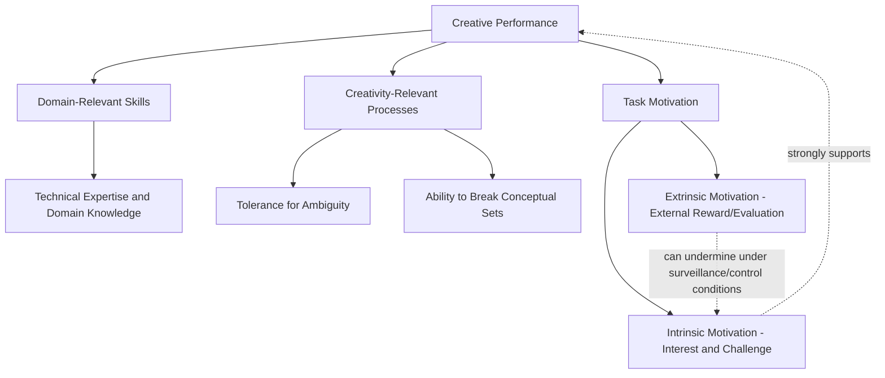

## Creativity and Innovation in Organizations

### Definition and Scope

Organizational creativity and innovation research examines how novel and useful ideas are generated (creativity) and how those ideas are successfully developed, adopted, and implemented within organizational systems (innovation). While closely related and often treated together, the two constructs are conceptually distinct: **creativity** refers to the generation of ideas that are both novel and useful/appropriate to the context, while **innovation** refers to the successful implementation of creative ideas within an organization — a broader process encompassing generation, but also adoption, development, and diffusion. This item examines individual and team-level antecedents of creative performance, the organizational and leadership conditions that support or suppress it, and the connection between this literature and the broader decision-making chapter, since creative idea generation is itself a decision-relevant process (expanding the alternative-generation stage that both classical rational models and bounded-rationality/satisficing frameworks address).

### Key Points

- Creativity (novel and useful idea generation) and innovation (successful implementation of those ideas) are distinct but related constructs, and organizations can fail at either stage independently — generating abundant creative ideas that are never successfully implemented, or implementing processes efficiently while generating few genuinely novel ideas
- The **componential model of creativity** (Amabile) identifies domain-relevant skills, creativity-relevant processes, and task motivation as the three core individual-level components, with intrinsic motivation playing a particularly well-evidenced and central role
- Team-level creativity depends heavily on the group-decision-making dynamics covered earlier in this chapter — hidden-profile-style information pooling and groupthink-related conformity pressure directly and negatively affect team creative output, connecting this item to prior chapter items
- Psychological safety (introduced under Organizational Listening) functions as a well-documented precondition for creative risk-taking, since proposing novel ideas inherently carries social risk of critique or failure
- Organizational climate factors — autonomy, resource availability, workload pressure, and reward structures — substantially moderate whether individual and team creative potential translates into actual creative output

### Amabile's Componential Model of Creativity

Teresa Amabile's componential model remains among the most influential and empirically supported frameworks for individual and small-group creativity, identifying three necessary components that jointly determine creative performance:

- **Domain-relevant skills**: The individual's expertise, technical knowledge, and talent within the specific domain in question — a necessary foundation, since novel-but-useful ideas require sufficient domain knowledge to be both genuinely novel (not simply unaware of existing solutions) and genuinely useful (technically viable within the domain's constraints)
- **Creativity-relevant processes**: Cognitive style and work habits that facilitate novel idea generation — including tolerance for ambiguity, willingness to take intellectual risks, and skill at breaking perceptual or conceptual sets (habitual ways of thinking about a problem)
- **Task motivation**: The individual's motivational orientation toward the specific task, with a critical distinction between **intrinsic motivation** (engaging in the task for its own inherent interest, enjoyment, or challenge) and **extrinsic motivation** (engaging in the task for external rewards, evaluation, or recognition)

Amabile's model, and a substantial subsequent body of research, holds that **intrinsic motivation is particularly central to creative performance** — individuals tend to produce more creative output when task engagement is driven primarily by genuine interest rather than by external reward or evaluation pressure. This finding has a specific and organizationally consequential corollary sometimes termed the **intrinsic motivation principle of creativity**: certain common organizational practices intended to *incentivize* creative output — close evaluation/surveillance during idea generation, tightly constrained choice in how a task is approached, and reward structures that make external evaluation especially salient — can, under some conditions, *undermine* creative performance by shifting the individual's motivational orientation from intrinsic toward extrinsic, even when the extrinsic incentive is nominally aligned with encouraging creativity. [Inference] This does not imply that all extrinsic incentives universally undermine creativity — the relationship is more nuanced and context-dependent than a simple intrinsic-good/extrinsic-bad framing, with factors such as whether the reward is informational versus controlling in character mattering substantially; this remains an active area of refinement within the broader motivation literature rather than a fully settled, universal principle.

### Componential Model Diagram

### Creativity vs. Innovation: The Implementation Gap

The distinction between creativity (idea generation) and innovation (idea implementation) matters organizationally because the two stages face different obstacles and require different organizational conditions:

- **Idea generation stage**: Primarily constrained by the individual and team-level factors above (domain skill, creative process, intrinsic motivation) and by psychological safety enabling the risk of proposing untested ideas
- **Idea implementation stage**: Primarily constrained by organizational-level factors — resource allocation processes, political/coalition-building requirements to secure organizational buy-in, resistance to change from stakeholders invested in existing approaches, and structural/process barriers to moving a novel idea through organizational approval and development pipelines

A common organizational failure pattern is investing heavily in generation-stage interventions (brainstorming sessions, innovation workshops, idea-suggestion platforms) while under-investing in implementation-stage organizational infrastructure (resourcing mechanisms, sponsorship processes, structured pathways from idea to pilot to scaled adoption) — producing an **implementation gap** where abundant creative ideas accumulate without translating into realized organizational innovation.

### Team-Level Creativity and Its Connection to Group Decision-Making

Team creative output depends substantially on the same group-process dynamics examined in the Group Decision-Making Processes and Groupthink/Polarization items:

- **Hidden-profile dynamics applied to idea generation**: Just as groups underexplore unique decision-relevant information in favor of shared information, team brainstorming and ideation discussions can similarly underexplore novel, individually-held perspectives in favor of ideas that are more immediately recognizable or resonant with the group's existing shared frame — a direct extension of the information-pooling failure mechanism to the creative-generation context
- **Conformity pressure and creative risk**: Groupthink-related conformity pressures directly suppress creative risk-taking, since proposing a genuinely novel or unconventional idea inherently risks group disapproval or critique — connecting directly to psychological safety's role as a precondition for voice behavior (Organizational Listening) and, here, for creative idea contribution specifically
- **Production blocking**: A well-documented phenomenon specific to verbal/synchronous group brainstorming in which members must wait for turns to speak, during which time some generated ideas are forgotten or suppressed before they can be voiced — a structural, non-motivational barrier to group creative output distinct from conformity-pressure effects, and a primary reason **nominal group technique** and written/asynchronous brainstorming approaches (having members independently generate ideas in writing before group sharing, directly paralleling the hidden-profile mitigation strategy from the prior item) frequently outperform traditional open verbal brainstorming in controlled comparisons
- **Team diversity and creative elaboration**: Cognitively and functionally diverse teams generally show a documented association with higher creative output than homogeneous teams, but this advantage is contingent on the team's information-elaboration processes (deliberate, effortful exchange and integration of members' distinct perspectives) actually occurring — diversity alone, absent genuine elaboration (itself connected to the hidden-profile information-pooling challenge), does not reliably translate into realized creative advantage

### Organizational Climate Factors Supporting Innovation

Beyond individual and team-level factors, organizational climate research identifies several structural and cultural conditions associated with sustained innovation output:

- **Autonomy and job control**: Greater discretion over how work is approached is consistently associated with higher creative output, connecting to the intrinsic-motivation component of Amabile's model — autonomy supports the sense of genuine task engagement rather than externally controlled compliance
- **Resource availability**: Sufficient (though not necessarily maximal) resource availability supports creative risk-taking and idea development; both severe resource scarcity and, in some analyses, excessive resource abundance (reducing the constraint-driven ingenuity that moderate scarcity can sometimes stimulate) have been associated with reduced innovation in different ways, suggesting a more nuanced relationship than "more resources always help"
- **Workload and time pressure**: High, sustained time pressure is generally associated with reduced creative output, since creative cognitive processes (incubation, exploration of unconventional approaches) typically require cognitive slack that acute time pressure eliminates — though some research distinguishes between chronically high pressure (consistently detrimental) and moderate, time-bounded pressure with clear creative purpose (more mixed effects)
- **Psychological safety**: As established under Organizational Listening, a climate in which proposing untested or unconventional ideas does not carry excessive social risk is a well-documented precondition for both individual creative voice and team-level creative elaboration
- **Reward and evaluation structure**: Consistent with the intrinsic motivation principle, reward and evaluation systems that emphasize close monitoring, competitive individual evaluation, or narrowly output-contingent rewards for the generation stage specifically can undermine the intrinsic motivation Amabile's model identifies as central, while reward structures emphasizing informational feedback and implementation-stage recognition are more consistently supportive

### Example

A technology organization observes that its quarterly innovation workshops reliably generate large volumes of creative proposals, but very few are ever implemented — an implementation-gap pattern. Applying the frameworks above, the organization diagnoses two separate contributing issues. First, workshop brainstorming sessions use traditional open verbal format, which — consistent with production-blocking and hidden-profile-style dynamics — likely causes some genuinely novel ideas to be lost or underexplored relative to more immediately shareable, conventional suggestions; the organization shifts to a written, independent-idea-generation format before group discussion, directly paralleling nominal group technique. Second, and more fundamentally, the organization recognizes it has invested almost exclusively in generation-stage infrastructure (the workshops themselves) while providing no structured resourcing or sponsorship pathway for promising ideas to move toward implementation — the classic creativity/innovation implementation gap. The intervention accordingly pairs the improved generation-stage process with a new structured evaluation and resourcing pipeline connecting workshop output to pilot funding, directly addressing the previously neglected implementation-stage organizational barrier.

### Common Pitfalls

- Conflating creativity (idea generation) with innovation (successful implementation), leading organizations to invest exclusively in generation-stage activities while neglecting implementation infrastructure
- Introducing close monitoring or narrowly output-contingent extrinsic rewards intended to incentivize creativity, inadvertently undermining the intrinsic motivation Amabile's model identifies as central
- Relying on traditional open verbal brainstorming without accounting for production blocking and conformity-pressure effects that written/independent generation methods can substantially mitigate
- Assuming team diversity alone reliably produces creative advantage, without ensuring the genuine information-elaboration processes required to realize that advantage actually occur
- Treating high time pressure as uniformly motivating for creative work, when sustained pressure is more consistently associated with reduced rather than enhanced creative output

**Related Topics**

- Amabile's Componential Model: Extended Empirical Evidence
- Intrinsic vs. Extrinsic Motivation in Creative and Knowledge Work
- Nominal Group Technique and Production Blocking in Brainstorming Research
- Psychological Safety and Creative Risk-Taking (Cross-Reference to Organizational Listening)
- Diffusion of Innovation Theory (Rogers) and Organizational Adoption Pathways
- Design Thinking and Structured Innovation Processes