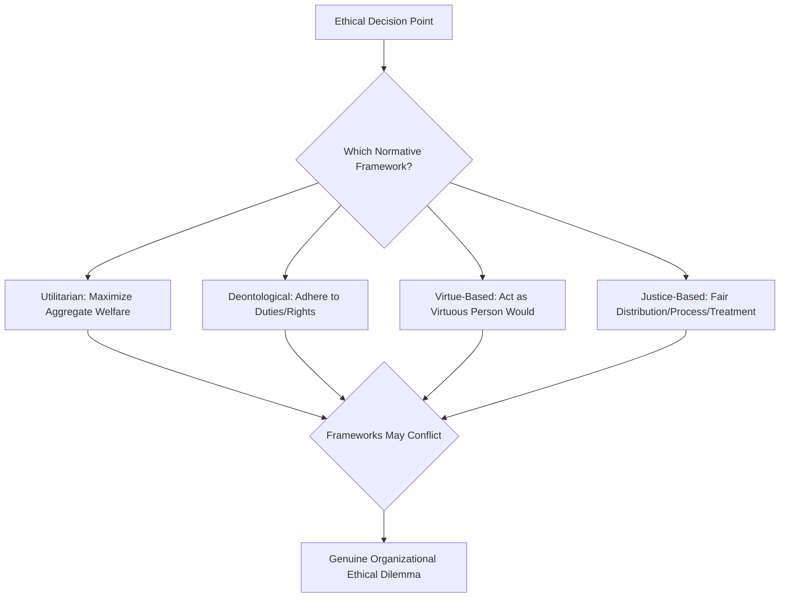
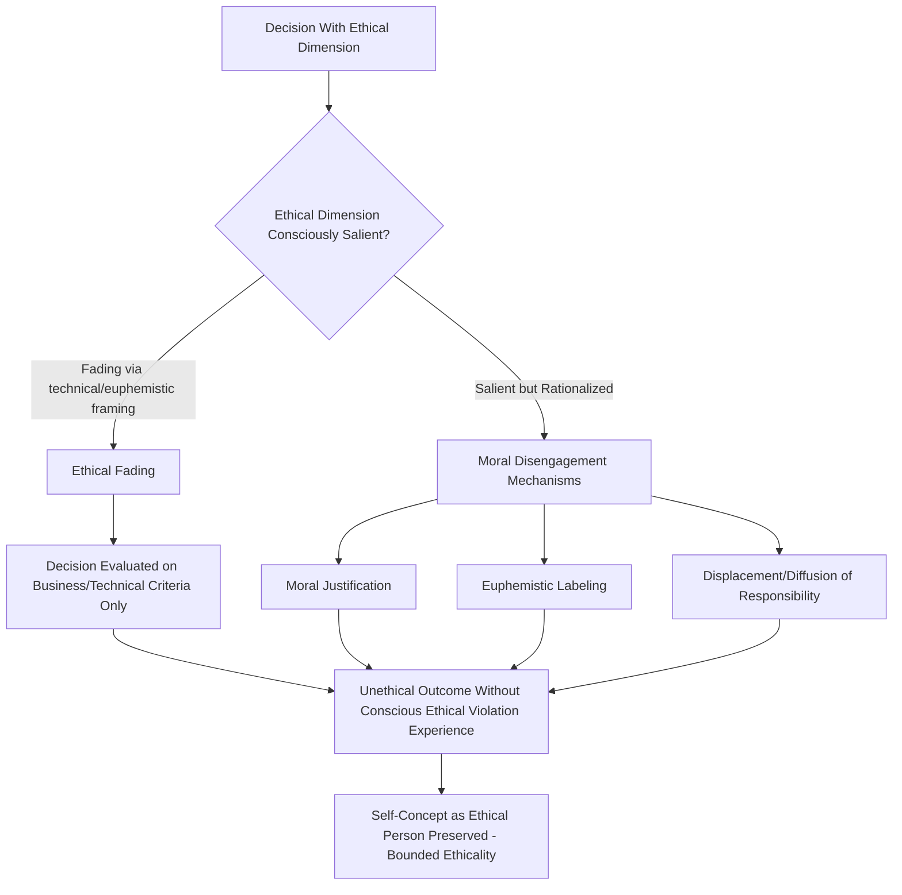

## Ethical Decision-Making Frameworks

### Definition and Scope

Ethical decision-making frameworks examine how organizational members reason through — and frequently fail to fully reason through — decisions with moral or ethical dimensions, integrating normative philosophical traditions with descriptive behavioral-ethics research on how ethical judgment actually operates under real organizational conditions. This item connects directly to the chapter's broader arc: just as the classical rational decision-making model provides a normative benchmark against which bounded rationality and heuristic-driven departures are measured, normative ethical frameworks (utilitarianism, deontology, virtue ethics, justice-based approaches) provide philosophical benchmarks against which the substantial descriptive behavioral-ethics literature on bounded ethicality and ethical fading documents systematic real-world departures.

### Key Points

- Normative ethical frameworks (utilitarian, deontological, virtue-based, justice-based) offer differing, sometimes conflicting decision criteria, and organizational ethical dilemmas frequently arise precisely because these frameworks yield different recommended actions for the same situation
- **Bounded ethicality** (Chugh, Bazerman, Banaji) extends the bounded rationality concept directly into the ethical domain — much unethical organizational behavior results not from deliberate, calculated wrongdoing but from systematic, often unconscious cognitive processes that allow individuals to behave unethically while maintaining a positive self-concept as ethical actors
- **Moral disengagement** (Bandura) identifies specific cognitive mechanisms through which individuals rationalize or reframe unethical conduct in ways that deactivate normal self-regulatory moral standards
- **Ethical fading** describes the process by which the ethical dimension of a decision gradually recedes from conscious consideration, often through reframing a decision in purely business, technical, or financial terms
- Organizational climate and structural factors (leadership modeling, reward systems, ethical infrastructure) substantially moderate whether individual ethical reasoning translates into actual ethical organizational behavior

### Normative Ethical Frameworks

**Utilitarianism/Consequentialism**: Evaluates the ethicality of a decision based on its outcomes — specifically, the aggregate welfare or utility produced across all affected parties, with the ethically correct choice being the one that maximizes net positive outcomes (or minimizes net negative outcomes) across stakeholders. In organizational application, utilitarian reasoning underlies cost-benefit-style ethical analysis (e.g., weighing aggregate stakeholder welfare in decisions affecting employees, customers, shareholders, and community). Critiques center on the framework's potential to justify harming a minority of stakeholders if aggregate welfare across the majority is sufficiently improved, and on the practical difficulty of accurately measuring and comparing welfare across diverse stakeholder groups.

**Deontology**: Evaluates ethicality based on adherence to moral duties, rules, or rights, independent of consequences — certain actions are held to be inherently right or wrong regardless of their outcomes (e.g., honesty, promise-keeping, respect for individual rights as duties that should not be violated even if violation would produce a better aggregate outcome). In organizational application, deontological reasoning underlies rule-based compliance frameworks, codes of conduct, and rights-based arguments (e.g., employee privacy rights, informed consent) that resist pure cost-benefit override. Critiques center on the difficulty of resolving conflicts between competing duties and the framework's comparative inflexibility when strict rule adherence produces poor outcomes in unusual circumstances.

**Virtue Ethics**: Evaluates ethicality based on the character and virtues of the decision-maker rather than on rules or consequences — the ethically correct action is the one a person of genuinely good character (possessing virtues such as honesty, fairness, courage, and practical wisdom) would take in the given situation. In organizational application, virtue ethics underlies leadership-character-focused approaches to ethics (selecting and developing leaders for genuine ethical character rather than relying solely on rule compliance) and organizational culture-building efforts aimed at cultivating virtuous dispositions broadly. Critiques center on the framework's comparative vagueness in providing concrete guidance for specific dilemmas and its dependence on potentially culturally variable conceptions of virtue.

**Justice-Based Approaches**: Evaluate ethicality based on fairness in distribution of outcomes (**distributive justice**), fairness of the processes used to reach decisions (**procedural justice**), and fairness of interpersonal treatment during decision implementation (**interactional justice**). This framework has particularly deep integration into organizational behavior research specifically (compared to the more general-purpose frameworks above), given its direct applicability to organizationally central concerns such as compensation fairness, promotion decisions, and layoff processes.

### Framework Comparison Diagram

### Bounded Ethicality

**Bounded ethicality** extends Herbert Simon's bounded rationality concept directly into the moral domain, proposing that much organizationally significant unethical behavior arises not from deliberate, consciously calculated wrongdoing but from systematic, often non-conscious cognitive processes that permit individuals to act unethically while continuing to perceive themselves as fundamentally ethical people. Key mechanisms identified in this literature include:

- **In-group favoritism**: Unconscious preferential treatment of in-group members in decisions that should, by formal organizational standards, be evaluated on individual merit alone — occurring without the decision-maker consciously experiencing the choice as unethical or discriminatory
- **Implicit attitudes and bias**: Automatic, non-conscious associations (connecting to System 1 processing from the heuristics-and-biases item) that influence ethically consequential judgments — hiring, promotion, resource allocation — without the decision-maker's conscious awareness or intent
- **Motivated blindness**: A tendency to fail to notice or fully process ethically relevant information when it conflicts with one's own interests or the interests of parties one is motivated to favor (e.g., auditors' documented difficulty fully perceiving problems in the financial statements of clients on whom their own compensation depends)
- **Overclaiming credit**: A well-documented tendency to overestimate one's own contribution relative to others' in collaborative work, generally interpreted as arising from genuinely differential availability of one's own effort in memory (connecting to the availability heuristic) rather than deliberate misrepresentation

### Moral Disengagement

**Moral disengagement** (Bandura) identifies a specific set of cognitive mechanisms through which individuals rationalize or reframe their own or others' conduct in ways that deactivate normal internal moral self-sanctions, permitting unethical behavior without the accompanying self-condemnation that would typically follow. Commonly identified mechanisms include:

- **Moral justification**: Reframing harmful conduct as serving a higher, morally worthy purpose (e.g., justifying aggressive competitive tactics as necessary to "protect jobs" or "serve shareholders")
- **Euphemistic labeling**: Using sanitized, non-morally-charged language to describe harmful conduct (e.g., "restructuring" for layoffs, "collateral damage" for unintended harm), reducing the conduct's perceived moral weight through linguistic reframing
- **Displacement of responsibility**: Attributing responsibility for one's own conduct to a legitimate authority who directed or sanctioned it (a mechanism with close conceptual ties to classic obedience-to-authority research), diffusing personal moral accountability
- **Diffusion of responsibility**: Attributing responsibility across a large group or collective process such that no individual perceives themselves as sufficiently personally responsible for the outcome
- **Distortion of consequences**: Minimizing, ignoring, or disbelieving the actual harmful effects of one's actions
- **Dehumanization or attribution of blame to the victim**: Reframing those harmed by a decision as deserving of that harm, or as not warranting full moral consideration, reducing the psychological weight of the harm caused

### Ethical Fading

**Ethical fading** (Tenbrunsel & Messick) describes the process by which the ethical dimension of a decision gradually recedes from an individual's or group's conscious awareness, often as a decision becomes reframed in purely technical, financial, or business terms that do not explicitly invoke ethical language or framing at all. Mechanisms contributing to ethical fading include:

- **Euphemistic and technical framing**: Business, legal, or technical vocabulary can displace explicitly ethical vocabulary in how a decision is discussed, reducing the salience of its moral dimension even when the underlying substance is unchanged
- **Slippery slope dynamics**: Gradual, incremental departures from prior ethical standards, where each individual step is small enough to seem non-consequential relative to the immediately preceding step, but the cumulative departure over time is substantial — a pattern with documented relevance to organizational fraud escalation, where initial minor infractions gradually normalize progressively larger ones
- **Role-based moral disengagement**: Professional or organizational role identities (e.g., "I am just doing my job," "this is simply standard industry practice") can psychologically substitute for direct ethical evaluation of the specific action being taken

### Bounded Ethicality Process Diagram

### Organizational Climate and Structural Moderators

Whether individual susceptibility to bounded ethicality, moral disengagement, and ethical fading translates into actual organizational unethical behavior is substantially shaped by organizational-level conditions:

- **Leadership modeling and ethical tone at the top**: Leader behavior functions as a powerful signal of genuine organizational ethical norms, often more influential than formal, written codes of conduct alone; directive leadership that implicitly or explicitly signals results-at-any-cost priorities creates conditions favorable to moral disengagement and ethical fading, echoing the directive-leadership antecedent identified in groupthink research
- **Reward systems and incentive structure**: Incentive structures that narrowly reward outcomes without regard to means create conditions under which ethical fading (reframing decisions in purely results-oriented terms) is more likely, and can create pressure environments that facilitate slippery-slope-style incremental ethical erosion
- **Ethical infrastructure**: Formal organizational mechanisms — codes of conduct, ethics training, ethics hotlines/reporting channels, and structured ethical decision-review processes — provide some counterweight to individual-level bounded ethicality, though their effectiveness depends substantially on genuine organizational commitment (connecting to the ethical-tone-at-the-top point above) rather than functioning as symbolic compliance exercises alone
- **Psychological safety and voice**: Consistent with Organizational Listening, a climate in which raising ethical concerns does not carry excessive career or social risk is a well-documented precondition for ethical concerns surfacing before they escalate into significant organizational harm, directly connecting ethical decision-making to the broader organizational listening and voice literature

### Example

A financial services firm's sales team faces mounting pressure to meet aggressive quarterly targets. Applying the frameworks above: rather than any individual employee consciously deciding to defraud customers, the organization observes a gradual pattern consistent with ethical fading and slippery-slope dynamics — initial minor liberties in how products are described to customers (each individually minor and framed in sales-technique rather than ethical language) incrementally normalize progressively less accurate representations over successive quarters, with no single step appearing, in isolation, as a clear ethical violation to those involved. Leadership's response, informed by this diagnosis, targets the structural and climate conditions identified as moderators rather than treating the pattern as a matter of individual employee dishonesty alone: incentive structures are revised to reduce narrow, means-blind outcome pressure; leadership explicitly and visibly reinforces ethical standards in team communications (addressing tone-at-the-top); and a structured, psychologically safe channel for raising concerns about sales practices is established, directly countering the ethical-fading risk that gradual, unexamined incremental drift had previously enabled.

### Common Pitfalls

- Assuming organizational unethical behavior necessarily reflects deliberate, consciously calculated bad intent, when bounded ethicality research suggests much such behavior occurs through non-conscious cognitive processes instead
- Relying exclusively on formal ethical infrastructure (codes of conduct, training) without addressing the leadership-modeling and incentive-structure conditions that substantially determine whether that infrastructure translates into actual behavior
- Failing to recognize slippery-slope, incremental ethical drift until cumulative departure from original standards has become substantial, since each individual incremental step may not trigger conscious ethical evaluation
- Applying a single normative ethical framework (e.g., purely utilitarian cost-benefit reasoning) without recognizing that genuine organizational ethical dilemmas frequently arise precisely from legitimate conflicts between different normative frameworks
- Treating euphemistic or technical reframing of ethically consequential decisions as neutral language choice rather than recognizing its documented role in ethical fading

**Related Topics**

- Bounded Ethicality: Extended Mechanisms and Organizational Applications
- Moral Disengagement Theory: Bandura's Original Framework in Depth
- Organizational Justice: Distributive, Procedural, and Interactional Dimensions
- Whistleblowing and Ethical Voice Behavior (Cross-Reference to Organizational Listening)
- Ethical Leadership and Tone at the Top
- Slippery Slope Dynamics in Organizational Fraud Escalation