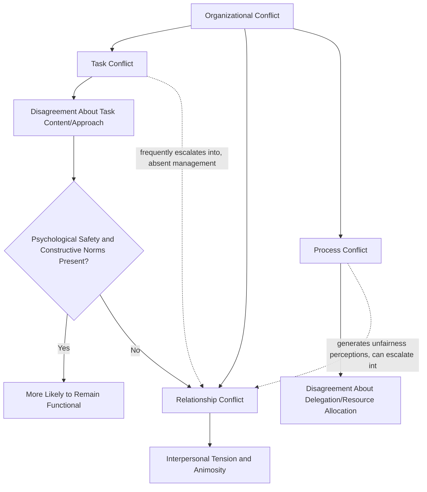

## Sources and Types of Organizational Conflict

### Definition and Scope

Organizational conflict refers to a process that begins when one party perceives that another party has negatively affected, or is about to negatively affect, something the first party cares about. This definition, central to contemporary organizational conflict theory, deliberately centers *perception* rather than objective incompatibility — conflict is a subjectively experienced process, meaning conflict can exist even absent genuine objective incompatibility of interests, and genuine objective incompatibility can exist without producing perceived, experienced conflict. This item establishes the foundational taxonomy of conflict types and sources that subsequent items in this chapter (conflict-handling styles, negotiation strategies, mediation) build upon.

### Key Points

- Contemporary conflict theory has moved decisively away from the historical assumption that all organizational conflict is inherently dysfunctional, distinguishing task conflict (which can be functional in moderate amounts) from relationship conflict (which is consistently associated with negative outcomes)
- The traditional **task/relationship/process** conflict taxonomy remains foundational, though subsequent research has substantially qualified the originally optimistic view of task conflict's benefits
- Conflict sources can be categorized across structural, communication-based, and personal/interpersonal origins, with structural sources (interdependence, scarce resources, goal incompatibility) generally showing the strongest and most consistent links to organizational conflict frequency
- The **conflict process model** conceptualizes conflict as a multi-stage sequence (from latent conditions through perceived and felt conflict to manifest behavior and outcomes) rather than a single discrete event
- Task and relationship conflict are empirically correlated in practice even though conceptually distinct — task conflict frequently escalates into relationship conflict absent effective management, a finding with direct implications for how the "task conflict can be functional" claim should be qualified

### The Task/Relationship/Process Conflict Taxonomy

**Task conflict**: Disagreement among group or team members regarding the content of the task being performed, including differences in viewpoints, ideas, and opinions about how to accomplish task-related goals. Early research (notably Jehn) suggested moderate levels of task conflict could be functional, improving decision quality through more thorough consideration of alternatives — directly connecting to the hidden-profile and group-decision-making literature from the previous chapter, where genuine airing of differing perspectives can surface unique information that unstructured consensus-seeking would otherwise suppress.

**Relationship conflict** (also termed affective conflict): Interpersonal incompatibilities among group members, typically involving tension, animosity, and annoyance among members independent of the task itself — disagreements rooted in personality clashes, differing values, or interpersonal friction rather than substantive task disagreement. Relationship conflict is consistently and robustly associated with negative outcomes across the organizational conflict literature: reduced team satisfaction, reduced group performance, and reduced member commitment, with substantially more consistent negative findings than task conflict's more contested effects.

**Process conflict**: Disagreement about how task accomplishment should proceed — specifically disagreements about delegation of duties and resources, and about who should be responsible for what within the group's task execution. Process conflict is generally found to be associated with negative outcomes, particularly around issues of duty and resource allocation disagreements, which tend to generate feelings of unfairness and can readily escalate toward relationship conflict.

### Qualifying the "Functional Task Conflict" Claim

While early conflict research (particularly Jehn's foundational work) suggested task conflict could improve group decision quality, subsequent research has substantially qualified this claim in several important ways:

- **Task and relationship conflict are empirically correlated**: Despite being conceptually distinct constructs, task conflict frequently co-occurs with or escalates into relationship conflict in practice, particularly in teams lacking strong psychological safety or effective conflict-management norms — meaning the theoretical benefit of task conflict is frequently offset or reversed by its tendency to generate accompanying relationship conflict
- **Curvilinear rather than linear relationship**: More recent meta-analytic work suggests the task-conflict-to-performance relationship may be curvilinear rather than simply positive — very low task conflict (insufficient critical evaluation, connecting to groupthink risk) and very high task conflict (overwhelming, unproductive disagreement) both underperform a moderate level, though the precise shape and generalizability of this curvilinear relationship remains an area of ongoing empirical refinement
- **Moderating conditions matter substantially**: The conditions under which task conflict remains functional rather than escalating into relationship conflict appear to depend heavily on team psychological safety, established norms for constructive disagreement, and whether conflict-handling processes (covered in the next chapter item) are effective — meaning task conflict's functionality is conditional rather than a universal, context-independent property

[Inference] Given these qualifications, organizational guidance encouraging teams to simply "increase task conflict" to improve decision quality likely oversimplifies a more conditional relationship; the more defensible practical implication is that teams should cultivate the psychological safety and constructive conflict-handling norms under which task disagreement is more likely to remain productive rather than escalating into relationship conflict, though the specific practices most effective for maintaining this distinction likely vary across team and organizational contexts.

### Conflict Taxonomy Diagram

### Sources of Organizational Conflict

**Structural sources**: Arise from the formal organizational structure and task arrangement rather than from individual personalities or communication failures, and generally show the strongest, most consistent empirical links to conflict frequency:

- **Interdependence**: Higher task interdependence among individuals or units increases both the frequency of interaction (more opportunities for conflict to arise) and the stakes of coordination failure, making highly interdependent work arrangements structurally more conflict-prone than more autonomous, low-interdependence arrangements
- **Scarce resources**: Competition for limited budget, staffing, equipment, or other resources across individuals or units is a well-documented structural conflict driver, directly connecting to realistic conflict theory traditions in the broader social-psychological literature
- **Goal incompatibility**: When units or individuals hold genuinely or perceivedly incompatible goals (e.g., a sales unit incentivized to close deals quickly versus a legal/compliance unit incentivized toward risk-averse thoroughness), structurally embedded goal conflict is likely even absent any interpersonal friction
- **Ambiguous jurisdiction/role ambiguity**: Unclear boundaries regarding responsibility, authority, or decision rights between individuals or units create structural conditions favorable to conflict, closely related to the process-conflict category above
- **Reward system design**: Reward structures that create zero-sum or competitive dynamics between individuals or units who must also collaborate structurally embed conflict-generating incentives into the organization's formal design

**Communication-based sources**: Arise from breakdowns, distortions, or misunderstandings in the communication process itself, connecting directly to the earlier Communication in Organizations chapter:

- **Semantic and interpretive differences**: Differing interpretations of the same message (semantic noise, differing fields of experience — both covered under Communication Models and Channels) can generate conflict from genuine misunderstanding rather than actual substantive disagreement
- **Insufficient or excessive communication**: Both communication scarcity (insufficient information sharing, leaving gaps that speculation and misunderstanding fill) and communication overload (connecting to the Digital Collaboration Technology item) can independently contribute to conflict-generating conditions
- **Filtering and distortion in upward/downward communication**: Information filtering across hierarchical levels (covered under Communication Models and Channels and Organizational Listening) can generate conflict when different levels of the organization end up operating on divergent understandings of the same situation

**Personal and interpersonal sources**: Arise from individual differences and interpersonal dynamics rather than structural or communication factors:

- **Value and personality differences**: Genuine differences in values, working styles, or personality can generate friction independent of any structural or communication factor, though this category overlaps substantially with relationship conflict as defined above
- **Perceived unfairness**: Perceptions of inequitable treatment (connecting to organizational justice, covered under Ethical Decision-Making Frameworks) are a well-documented interpersonal conflict driver
- **Emotional and identity-based factors**: Threats to identity, status, or self-concept can generate conflict responses disproportionate to the objective stakes of the precipitating issue, since the conflict becomes as much about identity protection as about the substantive matter at hand

### The Conflict Process Model

Contemporary organizational conflict theory (building substantially on Pondy's foundational stage model) conceptualizes conflict not as a single discrete event but as a multi-stage process:

1. **Latent conflict**: Underlying conditions exist (structural, communication-based, or interpersonal sources as above) that have the *potential* to generate conflict, but no conflict has yet been perceived or experienced
2. **Perceived conflict**: One or more parties becomes cognitively aware that a conflict-generating condition exists — perception can occur even without the underlying objective condition being especially severe, and conversely, objectively significant conditions can persist without being perceived
3. **Felt conflict**: The conflict acquires an emotional or affective dimension — anxiety, tension, frustration, or anger — marking the transition from a purely cognitive awareness to an experienced, felt state
4. **Manifest conflict**: The conflict becomes behaviorally observable — through open disagreement, withdrawal, sabotage, or other conflict-handling behaviors (covered in depth in the next chapter item)
5. **Conflict outcomes/aftermath**: The conflict episode's resolution (or non-resolution) shapes subsequent latent conditions for future interaction — successfully resolved conflict can strengthen relationships and improve future collaboration, while poorly resolved conflict can generate new latent conditions that increase the likelihood of future conflict episodes, creating a cyclical rather than strictly linear process

### Example

A product organization experiences recurring friction between its engineering and sales departments. Applying the source taxonomy above, diagnosis reveals multiple contributing sources operating simultaneously rather than a single cause: a structural source (goal incompatibility, since sales is incentivized toward rapid feature commitments to close deals while engineering is incentivized toward technical stability and quality), a communication-based source (insufficient information sharing about technical constraints reaching sales before commitments are made to customers), and — as friction has persisted over multiple quarters without effective resolution — an emerging relationship-conflict dimension (increasing interpersonal frustration and stereotyping between the two departments that now extends beyond the original substantive task disagreement). Applying the conflict process model, this suggests the conflict has progressed from an initially structural, latent condition through perceived and felt stages into manifest, and — critically — the accumulated unresolved aftermath from previous episodes has itself become a new latent condition amplifying the intensity of each subsequent episode, illustrating the cyclical rather than one-off nature of the process model.

### Common Pitfalls

- Assuming all organizational conflict is uniformly dysfunctional and should be eliminated entirely, rather than recognizing task conflict's conditional potential functionality under appropriate psychological-safety and process conditions
- Overgeneralizing the "task conflict can be functional" finding without accounting for its empirical correlation with, and tendency to escalate into, relationship conflict
- Treating conflict as a single discrete event rather than a multi-stage process, missing intervention opportunities available earlier in the latent or perceived stages before conflict becomes manifest
- Misdiagnosing a structurally-rooted conflict (goal incompatibility, resource scarcity) as purely an interpersonal or personality issue, leading to interventions (interpersonal mediation alone) that do not address the underlying structural driver
- Failing to recognize that unresolved conflict aftermath becomes a new latent condition, expecting each conflict episode to be independent rather than cumulative

**Related Topics**

- Jehn's Original Task/Relationship Conflict Research and Subsequent Meta-Analytic Refinement
- Pondy's Conflict Process Model in Depth
- Conflict-Handling Styles and the Dual Concern Model
- Organizational Justice as a Conflict Source (Cross-Reference to Ethical Decision-Making Frameworks)
- Realistic Conflict Theory and Resource Competition
- Interdependence Theory and Structural Conflict Design