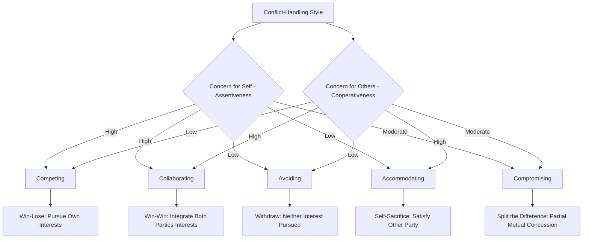

## Conflict Resolution Styles

### Definition and Scope

Conflict resolution styles (also termed conflict-handling styles or conflict management styles) refer to the characteristic behavioral orientations individuals adopt when engaging with interpersonal or organizational conflict, once that conflict has moved from the latent/perceived/felt stages into the manifest stage described in the conflict process model from the previous item. This item examines the dominant theoretical framework for classifying these styles — the **dual concern model** — along with its behavioral manifestations, situational appropriateness, and organizational assessment applications.

### Key Points

- The **dual concern model** (Blake & Mouton; further developed by Rahim, Thomas, and Kilmann) organizes conflict-handling behavior along two independent dimensions — concern for self (assertiveness) and concern for others (cooperativeness) — yielding five characteristic styles rather than a single continuum from passive to aggressive
- No single conflict-handling style is universally optimal; contemporary conflict theory emphasizes **contingency/situational appropriateness**, where the effectiveness of a given style depends on the specific conflict context, stakes, relationship, and time constraints
- Individuals typically show a dominant style preference but are capable of style flexibility depending on situational demands, and this behavioral flexibility is itself associated with more effective conflict management than rigid adherence to a single preferred style
- The Thomas-Kilmann Conflict Mode Instrument (TKI) is the most widely used applied assessment operationalizing the dual concern model in organizational practice
- Collaborating and compromising styles are generally, though not universally, associated with more favorable long-term relationship and outcome measures than avoiding, accommodating, or competing, though each style has genuine situational value

### The Dual Concern Model

The dual concern model organizes conflict-handling behavior along two orthogonal dimensions:

- **Concern for self (assertiveness)**: The degree to which an individual attempts to satisfy their own interests and concerns in the conflict
- **Concern for others (cooperativeness)**: The degree to which an individual attempts to satisfy the other party's interests and concerns in the conflict

Crossing these two dimensions produces five distinct conflict-handling styles, each representing a different combination of assertiveness and cooperativeness rather than points along a single continuum:

**Competing (high assertiveness, low cooperativeness)**: Pursuing one's own interests at the other party's expense, characterized by a win-lose orientation. Appropriate when quick, decisive action is required (emergencies), on issues where the decision-maker has clear expertise or authority and confidence in being correct, or when protecting against parties who would otherwise exploit a more cooperative approach. Overuse is associated with relationship damage and can suppress the voice behaviors covered under Organizational Listening, discouraging others from raising future concerns.

**Accommodating (low assertiveness, high cooperativeness)**: Sacrificing one's own interests to satisfy the other party's interests, characterized by self-sacrifice. Appropriate when the issue matters substantially more to the other party than to oneself, when preserving the relationship is a higher priority than the specific substantive issue at stake, or when one recognizes one may be in the wrong. Overuse is associated with the accommodating party's own interests being chronically under-served, with potential downstream resentment or disengagement risk.

**Avoiding (low assertiveness, low cooperativeness)**: Withdrawing from or sidestepping the conflict entirely, neither pursuing one's own interests nor the other party's. Appropriate when the issue is trivial relative to the cost of addressing it, when emotions are running too high for productive engagement (a cooling-off period), when more information is needed before productive engagement is possible, or when the potential relationship damage from confrontation outweighs the issue's substantive importance. Overuse is associated with unresolved issues accumulating (connecting to the conflict-process-model's aftermath/latent-condition cycle from the previous item) and can itself constitute a form of the self-censorship documented in groupthink and organizational silence research.

**Compromising (moderate assertiveness, moderate cooperativeness)**: Seeking a mutually acceptable middle-ground solution in which each party makes some concessions, characterized by a "split the difference" orientation. Appropriate when parties have roughly equal power and are committed to mutually exclusive goals, as a temporary solution when time pressure precludes the more effortful collaborating approach, or as a fallback when collaboration attempts fail. Critiqued as potentially producing suboptimal outcomes relative to genuine collaboration, since compromise-driven concessions may leave value unrealized that a more thorough, integrative exploration of underlying interests (rather than positions) could have captured.

**Collaborating (high assertiveness, high cooperativeness)**: Working together to find a solution that fully satisfies both parties' underlying interests and concerns, characterized by a win-win orientation and typically requiring the most time and effort of the five styles. Appropriate when both parties' interests are too important to be compromised away, when the relationship's long-term health matters significantly, when sufficient time is available for the more effortful integrative process, and when the issue is complex enough that a genuinely integrative solution (rather than a simple positional split) may exist. Requires genuine information exchange about underlying interests rather than just stated positions, connecting directly to the hidden-profile information-pooling literature from the Group Decision-Making Processes item — collaborative conflict resolution depends on surfacing information that a purely positional negotiating stance would leave hidden.

### Dual Concern Model Diagram

### Situational Contingency and Style Effectiveness

Contemporary conflict management theory rejects the notion of a single universally optimal style in favor of a **contingency approach**, holding that appropriateness depends on contextual factors including:

- **Stakes and issue importance**: Higher-stakes issues generally warrant the greater investment of collaborating (or, when time genuinely precludes it, competing on issues of clear expertise/correctness) over avoiding or accommodating
- **Time availability**: Collaborating requires substantially more time investment than the other four styles; under genuine time pressure, compromising or, in urgent/emergency circumstances, competing may be more situationally appropriate despite collaborating's generally more favorable long-term outcomes
- **Relationship importance and duration**: Ongoing, valued relationships (long-term colleague or business relationships) generally warrant greater investment in collaborating or accommodating relative to one-off, transactional interactions where a purely competing or compromising approach carries less relationship risk
- **Relative power balance**: Compromising is particularly suited to roughly power-balanced situations; significant power imbalances can make competing behaviorally available to the higher-power party regardless of theoretical appropriateness, and can constrain the lower-power party toward accommodating or avoiding regardless of their genuine underlying preference — an important qualification to purely individual-differences-based accounts of style selection, since situational power constraints can override personal style preference
- **Emotional state**: High emotional arousal (connecting to the "felt conflict" stage of the conflict process model) often warrants at least temporary avoiding (a cooling-off period) before productive collaborating or compromising becomes behaviorally feasible

**Style flexibility**, the capacity to adapt one's conflict-handling approach to situational demands rather than rigidly defaulting to a single preferred style regardless of context, is itself associated in the organizational conflict literature with more effective conflict management outcomes than consistent reliance on any single style, including collaborating — since even generally favorable styles can be situationally mismatched (e.g., attempting effortful collaboration when genuine time constraints make it infeasible, or when the issue is genuinely trivial and not worth the investment).

### Applied Assessment: The Thomas-Kilmann Conflict Mode Instrument

The **Thomas-Kilmann Conflict Mode Instrument (TKI)** is the most widely used applied psychometric assessment operationalizing the dual concern model in organizational training and development contexts. It presents respondents with paired statements reflecting different conflict-handling approaches, from which relative preference scores across the five styles are derived, typically used for individual self-awareness development (helping individuals recognize their default style tendencies and the situational conditions under which alternative styles might be more effective) rather than as a selection or evaluative instrument. [Unverified: as with many widely-used organizational assessment instruments, the TKI's specific psychometric properties (reliability, validity evidence) have received more academic scrutiny and mixed evaluation in the broader assessment literature than its widespread organizational adoption might suggest, and Claude's coverage here reflects its common applied use rather than an endorsement of its psychometric rigor relative to more rigorously validated organizational assessment tools.]

### Connection to Prior Chapter Concepts

Conflict-handling style selection interacts meaningfully with concepts from earlier in this chapter and the preceding Communication chapter:

- **Avoiding and organizational silence**: Habitual avoiding, particularly when driven by low psychological safety rather than genuine situational appropriateness, closely parallels the organizational silence dynamics covered under Organizational Listening — both represent withholding of legitimate concerns, with similar downstream risks of unresolved issue accumulation
- **Competing and groupthink-adjacent dynamics**: Consistent reliance on competing by higher-status or directive individuals can replicate the directive-leadership antecedent condition associated with groupthink, suppressing the constructive task conflict that the previous item identified as conditionally functional
- **Collaborating and hidden-profile resolution**: Effective collaborating requires genuine disclosure of underlying interests and information, directly paralleling the information-pooling challenge from hidden-profile research — collaborating conflict resolution and effective group decision-making share a common underlying requirement for genuine information exchange rather than positional entrenchment

### Example

A cross-functional project team encounters a dispute between the engineering lead (who wants additional testing time before launch) and the product lead (who is under commercial pressure to meet a fixed launch date). Applying the dual concern model, an initial instinct toward compromising (splitting the difference on timeline) is considered but recognized as potentially suboptimal — the engineering lead's underlying interest may be specific to certain unresolved technical risks rather than raw testing time generally, and the product lead's underlying interest may be specific to a particular customer commitment rather than the exact stated date. Rather than defaulting to compromise on the surface positions (timeline), the team facilitator encourages a collaborating approach: surfacing each party's underlying interests reveals that a targeted risk-mitigation plan addressing the engineering lead's specific technical concerns, combined with a staged rollout meeting the product lead's core customer commitment without requiring the full original timeline, satisfies both parties' genuine underlying interests more fully than a simple timeline compromise would have — illustrating collaborating's potential to identify integrative solutions that positional compromise alone would have left undiscovered.

### Common Pitfalls

- Assuming one conflict-handling style (often collaborating, given its generally favorable reputation) is universally correct regardless of situational stakes, time constraints, and relationship context
- Treating rigid adherence to a single preferred style as a strength, when situational style flexibility is more consistently associated with effective conflict management
- Overlooking how power imbalances constrain style selection in practice, misattributing a lower-power party's accommodating or avoiding behavior purely to individual disposition rather than situational power constraint
- Defaulting to compromising on stated positions without exploring underlying interests, potentially leaving integrative, mutually superior solutions undiscovered
- Failing to recognize habitual avoiding driven by low psychological safety as a form of organizational silence with similar accumulating risks, rather than as a neutral or appropriate style choice

**Related Topics**

- Interest-Based vs. Positional Negotiation (Cross-Reference to Negotiation Strategies)
- Power Dynamics and Their Effect on Conflict-Handling Style Selection
- Psychological Safety and Avoiding as a Silence Behavior (Cross-Reference to Organizational Listening)
- Thomas-Kilmann Instrument: Psychometric Evaluation and Critiques
- Emotional Regulation During High-Arousal Conflict Episodes
- Mediation and Third-Party Conflict Intervention