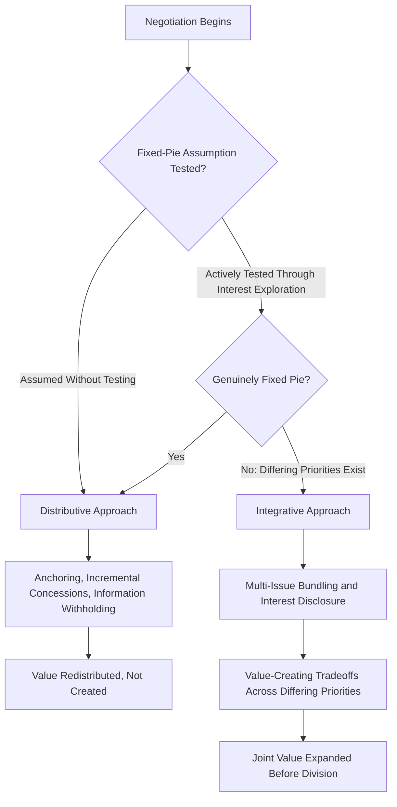

## Negotiation Strategies and Tactics

### Definition and Scope

Negotiation refers to a structured interpersonal process through which two or more interdependent parties attempt to reach a joint agreement on a matter of shared interest despite some degree of conflicting preferences. This item builds directly on the previous item's conflict-handling styles framework — negotiation can be understood as the specific tactical and strategic behavior enacted within a broadly collaborating, compromising, or competing conflict-handling orientation — and examines the foundational distinction between distributive and integrative negotiation, along with the psychological factors (anchoring, framing, and related heuristics from the earlier Bounded Rationality and Heuristics item) that shape negotiation behavior and outcomes.

### Key Points

- The **distributive versus integrative** distinction is the foundational organizing framework for negotiation strategy, corresponding closely to the competing/compromising versus collaborating orientations from the conflict-handling styles item
- **BATNA** (Best Alternative to a Negotiated Agreement) is the single most influential applied concept in negotiation theory, functioning as the reference point determining a party's walk-away threshold and relative negotiating power
- Integrative negotiation depends on distinguishing **positions** (stated demands) from **interests** (underlying needs and motivations), directly paralleling the interest-based collaborating approach and the hidden-profile information-disclosure challenge from earlier chapter items
- Anchoring effects (introduced under Bounded Rationality and Heuristics) are particularly consequential in negotiation contexts, since initial offers function as anchors that measurably influence final settlement points even when parties are aware of the anchoring mechanism
- Preparation — researching the other party's likely interests and BATNA, and clarifying one's own — is consistently identified as a primary driver of negotiation outcome quality, more so than in-the-moment tactical skill alone

### Distributive vs. Integrative Negotiation

**Distributive negotiation** (also termed positional or win-lose negotiation): Treats the negotiation as involving a fixed amount of value to be divided between parties (a "fixed pie" assumption), such that one party's gain necessarily corresponds to the other party's loss. Characteristic tactics include anchoring with an aggressive opening offer, making incremental concessions, and withholding information about one's own reservation point (the least favorable outcome one would still accept) and true priorities. Appropriate for genuinely single-issue, one-time transactions where no ongoing relationship value is at stake (e.g., a one-off purchase with no repeat-interaction prospect) and where the fixed-pie assumption is, in fact, largely accurate.

**Integrative negotiation** (also termed interest-based or win-win negotiation): Seeks to expand the total value available before dividing it, based on the recognition that the fixed-pie assumption is frequently — though not universally — inaccurate, since parties often hold differing priorities across multiple issues, meaning trades that satisfy each party's higher-priority interests at comparatively low cost to the other party's lower-priority interests can create genuine joint value ("expanding the pie") rather than simply redistributing a fixed amount. Characteristic practices include multi-issue bundling (negotiating several issues simultaneously rather than sequentially, enabling value-creating tradeoffs across issues of differing priority to each party), genuine information exchange about underlying interests and priorities, and collaborative problem-solving to identify mutually beneficial options before committing to a final allocation.

The fixed-pie assumption's frequent inaccuracy is itself a well-documented cognitive bias in negotiation research — negotiators, absent deliberate effort to test the assumption, tend to default toward treating negotiations as more purely distributive than the actual underlying interest structure warrants, missing integrative opportunities that genuine interest exploration would have revealed. This connects directly to the hidden-profile literature from Group Decision-Making Processes: just as group discussion systematically underexplores unique information in favor of shared information, negotiators systematically underexplore each other's differing priorities in favor of assuming a simple, single-dimension, purely distributive conflict.

### Distributive vs. Integrative Diagram

### BATNA and Reservation Points

**BATNA (Best Alternative to a Negotiated Agreement)** (Fisher & Ury) is the outcome a party would obtain if the current negotiation fails to reach agreement — functionally, the party's walk-away alternative. BATNA is the central determinant of negotiating power in contemporary negotiation theory: a party with a strong BATNA (an attractive alternative available if negotiation fails) can credibly walk away from an unfavorable deal, while a party with a weak BATNA (a poor or nonexistent alternative) faces strong pressure to accept unfavorable terms rather than risk the negotiation's failure.

The **reservation point** is the specific value derived from a party's BATNA — the minimum (for a seller) or maximum (for a buyer) terms a party would accept before preferring their BATNA alternative instead. The overlap (or absence of overlap) between two parties' reservation points defines the **ZOPA (Zone of Possible Agreement)** — the range of outcomes, if any, that both parties would prefer to their respective BATNAs. If reservation points do not overlap (each party's minimum acceptable outcome exceeds what the other party is willing to offer), no ZOPA exists and no mutually acceptable agreement is possible regardless of negotiating skill.

Applied negotiation practice emphasizes deliberate **BATNA development** — actively working to strengthen one's own alternative before and during negotiation (e.g., cultivating alternative suppliers, alternative job offers, alternative buyers) — since a stronger BATNA directly and predictably improves negotiating power and expected outcomes, independent of in-the-moment tactical skill.

### Anchoring in Negotiation

Building directly on the anchoring-and-adjustment heuristic from the Bounded Rationality and Heuristics item, negotiation research provides some of the most robust and consistently replicated demonstrations of anchoring effects: the party who makes the first offer in a negotiation systematically and measurably influences the final settlement point, since subsequent counter-offers and adjustments tend to remain insufficiently distant from that initial anchor — an effect that persists even among negotiators who are explicitly aware of the anchoring mechanism and are actively attempting to correct for it.

This produces a documented, if situationally qualified, strategic implication: **making the first offer, when a party has reasonably good information about the appropriate range, tends to favor that party** by anchoring subsequent discussion around their preferred reference point. This first-offer advantage is qualified by several boundary conditions: it depends on having sufficient information to set a credible (not wildly unrealistic) anchor, since an anchor perceived as absurd can be discounted or trigger negotiation breakdown rather than functioning as an effective reference point; and it can be situationally reversed when the responding party has substantially superior information, allowing them to more effectively resist or reframe an unfavorable anchor.

### Framing Effects in Negotiation

Connecting to the framing-effects concept introduced under Bounded Rationality and Heuristics, how a negotiation issue is framed — particularly in terms of gains versus losses relative to a reference point — measurably affects negotiator behavior, generally consistent with Prospect Theory's loss-aversion findings: negotiators tend to behave more aggressively and be more resistant to concession when an issue is framed as avoiding a loss relative to a reference point, compared to when logically equivalent terms are framed as securing a gain. This has practical implications for how negotiators present offers and concessions — framing a concession as "giving up" something relative to an anchor tends to be experienced differently, and can produce different negotiating dynamics, than framing the same substantive outcome relative to a different reference point.

### Preparation as a Primary Outcome Driver

Across the negotiation research literature, thorough preparation is consistently identified as a stronger predictor of favorable negotiation outcomes than in-the-moment tactical sophistication alone. Key preparation components include:

- **Researching the counterparty's likely interests, priorities, and BATNA**: Since integrative value creation depends on identifying differing priorities across issues, and distributive positioning depends on understanding the counterparty's likely reservation point, informed preparation directly supports both negotiation modes
- **Clarifying one's own interests, priorities, and BATNA**: Negotiators frequently enter negotiations with less clarity about their own true priorities (as distinct from initial positions) than they assume, and deliberate pre-negotiation reflection on genuine underlying interests supports more effective integrative exploration during the negotiation itself
- **Identifying multiple issues for potential bundling**: Since integrative value creation depends on trading across issues of differing priority, preparation that identifies a broader set of negotiable issues (rather than treating the negotiation as narrowly single-issue) expands the potential for integrative, value-creating tradeoffs

### Connection to Conflict-Handling Styles

Negotiation strategy selection maps closely onto the dual concern model's conflict-handling styles from the previous item: distributive negotiation tactics correspond most closely to a **competing** orientation (high concern for self, low concern for other), while integrative negotiation corresponds most closely to a **collaborating** orientation (high concern for both self and other), requiring the genuine interest disclosure that effective collaborating depends upon. A negotiator defaulting to accommodating (conceding readily to preserve relationship harmony) risks leaving value on the table that a more assertive, interest-clarifying approach — even one still oriented toward integrative, mutually beneficial outcomes — would have captured.

### Example

Two departments within an organization are negotiating shared access to a limited pool of specialized engineering talent for the upcoming quarter. An initial distributive framing (treating available engineer-hours as a strictly fixed pie to be divided) risks an anchoring-driven, zero-sum outcome favoring whichever department states its demand first and most assertively. Applying the integrative framework instead, the negotiating parties invest in preparation — clarifying that one department's priority is calendar-quarter timing flexibility (they need the engineers at some point in the quarter but are flexible on exactly when) while the other department's priority is total hours committed (they need a guaranteed minimum allocation but have more flexibility on scheduling specifics). This interest-clarification reveals the negotiation is not, in fact, purely single-dimension and fixed-pie: a bundled agreement — the first department receiving scheduling priority in exchange for the second department receiving a larger total-hours guarantee — satisfies each department's actual higher-priority interest more fully than a simple 50/50 split of engineer-hours would have, illustrating integrative value creation made possible by the interest-disclosure preparation process.

### Common Pitfalls

- Defaulting to a distributive, fixed-pie framing without testing whether genuinely differing priorities across multiple issues might enable integrative value creation instead
- Entering negotiation without a clearly developed BATNA, weakening negotiating power and increasing vulnerability to accepting unfavorable terms under negotiation-failure pressure
- Underestimating anchoring's influence on final settlement points, including in oneself, despite explicit awareness that the mechanism exists
- Disclosing positions (stated demands) without ever surfacing underlying interests, foreclosing integrative tradeoffs that genuine interest exploration might have revealed
- Prioritizing in-the-moment tactical maneuvering over thorough pre-negotiation preparation, despite preparation's consistently stronger association with favorable outcomes

**Related Topics**

- BATNA Development and Alternative-Strengthening Strategies
- Prospect Theory and Loss Aversion in Negotiation Framing (Cross-Reference to Bounded Rationality and Heuristics)
- Multi-Issue Bundling and Log-Rolling Techniques
- Cross-Cultural Negotiation and Differing Negotiation Norms
- Third-Party Mediation and Arbitration Processes
- Ethical Boundaries in Negotiation Tactics (Cross-Reference to Ethical Decision-Making Frameworks)