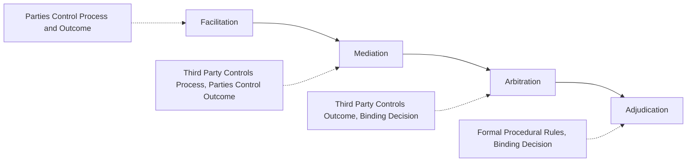

## Mediation and Third-Party Intervention

### Definition and Scope

Third-party intervention refers to the involvement of an individual who is not a principal party to a conflict in facilitating its resolution — ranging across a spectrum of intervention approaches distinguished primarily by how much decision-making control remains with the disputing parties versus is transferred to the third party. This item examines that intervention spectrum, with particular focus on **mediation** as the most extensively studied and organizationally prevalent form, along with the mediator behaviors, process design choices, and effectiveness research that inform organizational practice. It builds directly on the preceding items in this chapter: third-party intervention typically becomes relevant precisely when the conflict-handling styles and negotiation strategies covered previously have failed to produce resolution between the principal parties themselves.

### Key Points

- Third-party interventions exist along a spectrum of process and outcome control, from low-control facilitation through mediation to high-control arbitration and adjudication, and organizations should match intervention type to conflict characteristics rather than defaulting to a single approach
- **Mediation** is distinguished from arbitration by a critical property: the mediator has no binding decision-making authority — the mediator facilitates the parties' own negotiation process, but the parties themselves retain control over whether and on what terms to settle
- Mediator behavior can be broadly categorized as **facilitative** (process-focused, helping parties communicate and negotiate more effectively themselves) versus **evaluative** (content-focused, offering the mediator's own assessment of likely outcomes or the merits of each party's position), representing genuinely different mediator role conceptions with different appropriate use cases
- Procedural justice — parties' perception that the intervention process itself was fair — is a well-documented predictor of party satisfaction and durable resolution, often independent of and sometimes more influential than the specific substantive outcome achieved
- Organizational mediation programs (formal internal mediation, ombudsperson functions) represent a structural intervention connecting directly to the organizational listening and voice infrastructure covered earlier in the broader syllabus

### The Third-Party Intervention Spectrum

Third-party interventions vary systematically in how much control over the *process* (how the conflict is discussed and explored) and the *outcome* (what the final resolution is) remains with the disputing parties versus is exercised by the third party:

- **Facilitation**: The lowest-control-transfer intervention; a facilitator helps structure and guide discussion (e.g., managing turn-taking, ensuring both parties are heard, maintaining constructive discussion norms) without offering substantive input on the conflict's content or likely resolution — parties retain full control over both process specifics and outcome
- **Mediation**: A more structured intervention in which the mediator actively facilitates negotiation between the parties, often employing specific techniques (reframing, identifying underlying interests, proposing options for consideration) to help parties reach their own agreement — the mediator exercises meaningful process control but no binding outcome authority; parties retain final decision-making control over whether to accept any proposed resolution
- **Arbitration**: The third party (arbitrator) hears both parties' positions and evidence and then renders a binding decision — parties surrender outcome control to the arbitrator, though they typically retain control over whether to enter arbitration in the first place (and, in some organizational contexts, arbitration is mandatory rather than voluntary)
- **Adjudication**: The most formal, highest-control-transfer intervention (e.g., formal legal proceedings, formal organizational disciplinary hearings), typically governed by extensive procedural rules, with a judge or formal decision-maker exercising binding authority over both significant aspects of process and the ultimate outcome

### Third-Party Intervention Spectrum Diagram

### Mediator Roles and Behaviors

**Facilitative mediation**: The mediator's primary role is to improve the *process* of communication and negotiation between the parties, without offering substantive judgment on the merits of either party's position or predicting likely outcomes. Facilitative techniques commonly include: structuring turn-taking to ensure balanced participation, actively reframing positional statements into underlying-interest language (directly connecting to the positions-versus-interests distinction from the Negotiation Strategies item), asking probing questions to help parties clarify their own priorities, and managing emotional escalation (connecting to the "felt conflict" stage from the conflict process model) to keep discussion within a productive range. Facilitative mediation is generally favored when preserving the parties' sense of ownership over the resolution and the ongoing working relationship between them are both high priorities, since a facilitatively-reached agreement is one the parties constructed themselves rather than one recommended by an external evaluator.

**Evaluative mediation**: The mediator, in addition to facilitating process, offers their own substantive assessment — for example, an opinion on the relative merits of each party's position, a prediction of likely outcomes if the dispute proceeded to a more formal process (such as arbitration or litigation), or a specific proposed settlement. Evaluative mediation is generally favored when parties are relatively entrenched in positional disagreement and would benefit from an external, credible assessment to help calibrate realistic expectations, or when the underlying issue involves technical or legal complexity where the mediator's substantive expertise adds genuine value beyond pure process facilitation.

**Boundary condition**: Most mediators and mediation training draw meaningfully on both facilitative and evaluative techniques depending on the specific moment within a mediation session, rather than adhering to one pure mode throughout — the facilitative/evaluative distinction functions more as a spectrum of emphasis and a useful analytical framework than as two mutually exclusive mediator archetypes in actual practice.

### Mediator Behaviors and Techniques

Beyond the broad facilitative/evaluative orientation, specific mediator techniques with substantial research and practice support include:

- **Reframing**: Restating a party's positional or emotionally charged statement in more neutral, interest-focused language, reducing the statement's adversarial charge while preserving its substantive content — directly supporting the transition from positional to interest-based negotiation
- **Caucusing**: Meeting privately and separately with each party (rather than only in joint session), allowing more candid disclosure of underlying interests, priorities, or settlement flexibility than a party might be willing to reveal in the other party's presence — a practice with particular value for surfacing information relevant to identifying a ZOPA that joint-session positional posturing might otherwise obscure
- **Reality-testing**: Helping a party realistically assess their own BATNA and the likely consequences of failing to reach agreement, particularly useful when a party's expectations appear substantially miscalibrated relative to their actual alternatives
- **Agenda-setting and issue identification**: Structuring which issues will be addressed and in what order, connecting to the multi-issue bundling techniques from the Negotiation Strategies item — effective agenda-setting can create opportunities for integrative tradeoffs that an unstructured, single-issue-at-a-time discussion might miss

### Procedural Justice in Third-Party Intervention

A substantial body of organizational and legal-psychology research establishes that parties' perception of **procedural justice** — whether the intervention process itself felt fair, whether they had adequate voice/opportunity to be heard, and whether the third party appeared neutral and treated them with respect — is a strong and consistent predictor of party satisfaction with the intervention and of durable, lasting resolution, often independent of the specific substantive outcome achieved. This connects directly to organizational justice concepts introduced under Ethical Decision-Making Frameworks: even a substantively unfavorable outcome is more likely to be accepted and sustained if the party perceives the process that produced it as fair, while even a substantively favorable outcome reached through a process perceived as unfair or one-sided risks generating lingering resentment (connecting back to the conflict-process-model's aftermath/latent-condition cycle) that can resurface in future interactions.

Key procedural justice components particularly relevant to mediator practice include: ensuring both parties genuinely have adequate opportunity to voice their perspective (directly paralleling the voice/organizational-listening literature), maintaining and visibly demonstrating third-party neutrality (avoiding even the appearance of favoring one party), and providing a transparent, understandable process that parties can follow and trust.

### Organizational Mediation Infrastructure

Beyond ad hoc, dispute-specific mediation, some organizations establish formal internal mediation infrastructure:

- **Internal mediation programs**: Trained internal staff (sometimes HR-affiliated, sometimes a dedicated function) available to mediate workplace disputes, offering a lower-cost, faster, and typically more organizationally-attuned alternative to external mediation or formal grievance/legal processes
- **Ombudsperson functions**: A related but distinct organizational role, typically operating under strict confidentiality and independence from formal organizational decision-making authority, providing employees an informal, low-risk channel to raise concerns and explore options — including but not limited to formal mediation — connecting directly to the organizational listening infrastructure covered earlier in the broader syllabus, since ombudsperson functions specifically address the perceived-risk barrier that suppresses voice behavior in more formal, less confidential channels

### Example

Two senior managers in different departments have an escalating conflict over shared budget allocation that has begun affecting their teams' willingness to collaborate on joint initiatives — a conflict that has progressed, per the conflict process model, well into the manifest and aftermath stages, with each party's attempted direct negotiation (largely competing-oriented, per the conflict-handling-styles framework) having failed to produce resolution. HR arranges internal facilitative mediation. The mediator begins with separate caucus sessions with each manager, revealing that one manager's stated position (a specific budget percentage) actually reflects an underlying interest in demonstrating their department's growth trajectory to senior leadership, while the other manager's stated position reflects an underlying interest in maintaining flexible reserve funding for an anticipated but not-yet-finalized initiative. This caucus-derived interest information, which neither manager had disclosed to the other directly given their entrenched positional conflict, allows the mediator to reframe the subsequent joint session around these underlying interests rather than the original fixed-budget-percentage positions, surfacing a bundled solution (a smaller immediate allocation with an explicit, documented commitment to revisit reserve funding once the anticipated initiative is finalized) that satisfies both underlying interests more fully than continued positional negotiation over the original fixed figure had allowed.

### Common Pitfalls

- Defaulting to a single intervention type (e.g., always mediation, or always formal arbitration) regardless of conflict characteristics, rather than matching intervention type to the specific dispute's stakes, complexity, and relationship considerations
- Treating facilitative and evaluative mediation as rigidly separate modes rather than recognizing that effective mediators typically draw on both depending on the moment
- Underweighting procedural justice, focusing exclusively on securing a substantively favorable outcome while neglecting whether the process itself will be perceived as fair by the parties involved
- Conducting mediation without adequate caucusing, missing opportunities to surface underlying interests that entrenched positional posturing in joint session would otherwise obscure
- Establishing formal organizational mediation infrastructure without corresponding confidentiality and independence safeguards, undermining the psychological safety necessary for parties to genuinely engage with the process

**Related Topics**

- Procedural Justice Theory in Depth (Cross-Reference to Ethical Decision-Making Frameworks)
- Ombudsperson Functions and Organizational Voice Infrastructure (Cross-Reference to Organizational Listening)
- Arbitration Design in Organizational Dispute Resolution Systems
- Caucusing Techniques and Confidentiality in Mediation Practice
- Conflict Process Model and Aftermath Effects (Cross-Reference to Sources and Types of Organizational Conflict)
- Alternative Dispute Resolution (ADR) Systems Design in Organizations