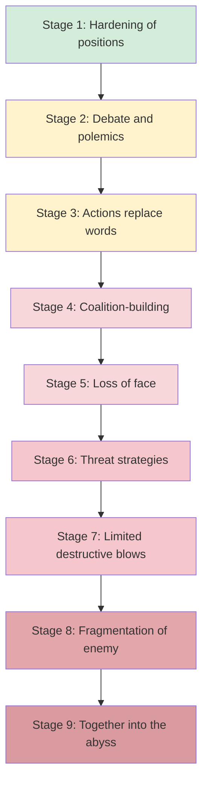

## Workplace Bullying and Harassment Dynamics

### Definitional Foundations

**Workplace bullying** is typically defined as repeated, persistent exposure to negative acts (verbal, physical, or relational) directed at one or more individuals, where the target experiences difficulty defending themselves due to a real or perceived power imbalance. Three criteria are commonly used to distinguish bullying from ordinary conflict:

- **Repetition and duration**: Acts occur regularly (often operationalized as weekly) over an extended period (commonly six months or more) in research instruments such as the Negative Acts Questionnaire-Revised (NAQ-R).
- **Power imbalance**: The target perceives an inability to retaliate or defend themselves, whether due to formal hierarchy (supervisor-subordinate), numerical disadvantage (group vs. individual), informational asymmetry, or social capital differences.
- **Escalation**: Many models describe bullying as an escalating process rather than a discrete event, beginning with minor friction and intensifying as conflict resolution fails.

**Workplace harassment** is a related but legally and conceptually distinct construct. Harassment is more often protected-class-based: unwelcome conduct connected to a legally protected characteristic (sex, race, age, disability, religion, national origin, etc.) that creates a hostile work environment or is used as a condition of employment (quid pro quo). [Inference] The degree of legal overlap between "bullying" and "harassment" varies substantially by jurisdiction, since many countries lack bullying-specific statutes and route claims through harassment, discrimination, or occupational health and safety law instead.

**Key distinction**: Bullying can occur without any protected-class nexus (e.g., targeting based on personality, performance, or interpersonal dynamics), while harassment as a legal category typically requires a connection to a protected characteristic. Organizational psychology treats both under the broader umbrella of workplace mistreatment or counterproductive interpersonal behavior.

---

### Typologies of Negative Acts

Research (notably Einarsen, Hoel, and colleagues) categorizes bullying behaviors into overlapping clusters:

- **Work-related bullying**: Unmanageable workload, impossible deadlines, removal of responsibilities, withholding of information necessary for task performance, persistent criticism of work.
- **Person-related bullying**: Ridicule, insulting remarks, gossip and rumor-spreading, social exclusion, ignoring or "silent treatment."
- **Physically intimidating bullying**: Less common in white-collar contexts but includes threatening gestures, invasion of personal space, or actual physical aggression.

A separate axis distinguishes **direct** (overt confrontation, explicit insults) from **indirect** bullying (exclusion, sabotage, spreading rumors, withholding cooperation), the latter being harder to detect and document, which has implications for both victims seeking recourse and organizations attempting to measure prevalence.

**Cyberbullying** and digital harassment (harassment via email, chat platforms, social media) have become a distinct sub-literature, characterized by persistence beyond physical workspace boundaries, potential anonymity, and asynchronous escalation (e.g., CC'ing supervisors on hostile emails as a form of public humiliation).

---

### Theoretical Models of Etiology

#### Work Environment Hypothesis

Einarsen's work environment hypothesis argues that bullying is primarily a symptom of poor organizational conditions rather than individual pathology alone. Contributing environmental factors include:

- Role ambiguity and role conflict
- Poor leadership and laissez-faire management styles (leaders who avoid intervening in conflict)
- High workload and time pressure
- Destructive organizational culture or reward structures that tacitly reward aggressive behavior
- Restructuring, downsizing, and organizational change, which increase competition for scarce resources and status

#### Individual Disposition Models

A competing (though not mutually exclusive) perspective examines perpetrator and target characteristics:

- **Perpetrator traits**: Research has associated bullying perpetration with dispositions such as high trait aggression, low agreeableness, narcissistic or Machiavellian tendencies, and in some studies, subclinical psychopathy — collectively discussed under the "dark triad" framework. [Inference] The strength and consistency of these associations vary across studies, and dispositional explanations remain contested relative to situational ones.
- **Target vulnerability factors**: Some studies associate target status with high conscientiousness combined with low assertiveness, being perceived as a threat (competence-based envy), or belonging to a numerical minority group. Caution is warranted here: framing that emphasizes "victim characteristics" risks victim-blaming and is a genuinely contested area in the literature.

#### Escalation and Conflict Spiral Models

Bullying is frequently modeled as an escalating conflict process (drawing on Glasl's conflict escalation model):

1. **Hardening** — positions harden but remain rational; occasional tension.
2. **Debate and polemics** — black-and-white thinking begins; verbal sparring increases.
3. **Actions replace words** — communication breaks down; nonverbal signaling of hostility.
4. **Coalition-building** — third parties recruited; image campaigns against the target.
5. **Loss of face** — public attacks aimed at humiliation and reputational damage.
6. **Threat strategies** — explicit or implicit threats.
7. **Limited destructive blows** — target is treated as an object, not a person; sabotage.
8. **Fragmentation** — attacks on the target's support systems (isolating them from allies).
9. **Together into the abyss** — mutual destruction, disregarding self-cost.

Bullying dynamics rarely progress to the latter stages within organizational settings before intervention (formal or through target exit), but the model is useful for understanding why early-stage intervention is disproportionately effective compared to late-stage remediation.

---

### The Bystander Role

Bystanders are increasingly central to bullying research because they mediate whether an incident escalates or resolves. Common bystander roles (adapted from bullying and harassment literature broadly):

- **Passive bystanders**: Witness but do nothing, often due to fear of retaliation, diffusion of responsibility, or normalization of the behavior ("that's just how the manager is").
- **Reinforcers**: Encourage the perpetrator through laughter, agreement, or silent complicity, inadvertently rewarding the behavior.
- **Defenders/upstanders**: Intervene directly, support the target, or report the behavior through formal channels.
- **Outsiders**: Actively avoid the situation, sometimes physically removing themselves from the vicinity.

**[Inference]** Organizational climate strongly shapes which role bystanders adopt; where reporting structures are perceived as ineffective or retaliatory, passive bystanding is more likely to dominate, independent of individual moral disposition.

---

### Organizational and Individual Consequences

#### Individual outcomes (targets)

- **Psychological**: Elevated rates of anxiety, depression, post-traumatic stress symptoms, burnout, and reduced self-esteem. Longitudinal studies (e.g., Nielsen & Einarsen's work) support a dose-response relationship between exposure duration/intensity and symptom severity.
- **Physical**: Sleep disturbance, cardiovascular strain, musculoskeletal complaints associated with chronic stress.
- **Behavioral**: Increased absenteeism, presenteeism (attending work while unwell/disengaged), and turnover intention.

#### Organizational outcomes

- Reduced job satisfaction and organizational commitment, not only among direct targets but among bystanders who witness bullying (a "second-hand" or "ambient" bullying effect).
- Increased litigation exposure, regulatory penalties, and reputational damage.
- Productivity loss through defensive behaviors (documentation-heavy "cover-yourself" work practices), reduced knowledge-sharing, and psychological withdrawal.
- Elevated turnover costs, particularly loss of high performers who have external options and choose exit over prolonged conflict.

$$\text{Total Organizational Cost} = C_{turnover} + C_{absenteeism} + C_{litigation} + C_{productivity\_loss} + C_{reputational}$$

Each cost component is empirically estimable in isolation but rarely aggregated with precision in practice; most published cost estimates are illustrative rather than derived from a single validated costing model. [Unverified]

---

### Measurement Instruments

- **Negative Acts Questionnaire-Revised (NAQ-R)**: 22-item self-report inventory measuring exposure to negative acts over the past six months, without requiring respondents to self-label as "bullied." This avoids the self-labeling problem, where individuals experiencing objectively severe mistreatment decline to identify as victims due to stigma.
- **Leymann Inventory of Psychological Terror (LIPT)**: An earlier instrument (45 items) developed by Heinz Leymann, one of the field's founding researchers, organized around categories such as attacks on communication, social relations, reputation, and health.
- **Self-labeling method**: Directly asking respondents whether they consider themselves bullied, typically after providing a working definition. This method tends to yield lower prevalence estimates than behavioral checklists like the NAQ-R, since it requires the respondent to cognitively frame their experience as victimization.

---

### Formal Investigation and Intervention Frameworks

#### Organizational response ladder

- **Informal resolution**: Direct conversation between parties, sometimes facilitated by a manager or HR, appropriate for early-stage, ambiguous, or lower-severity conflict.
- **Mediation**: Structured, facilitated dialogue with a neutral third party; generally contraindicated for cases involving significant power imbalance or where physical/psychological safety is at risk, since mediation presumes a degree of parity between parties.
- **Formal investigation**: Triggered by written complaint; typically involves evidence gathering, structured interviews with complainant, respondent, and witnesses, and a documented findings report against a defined policy standard.
- **Disciplinary or corrective action**: Ranges from coaching and performance management to termination, contingent on investigation findings and severity.

**Key Points** for investigation design:

- Investigators should be perceived as neutral (organizationally and psychologically independent of both parties' reporting lines where feasible).
- Confidentiality should be maximized but not guaranteed as absolute, since natural justice generally requires the respondent to know the substance of allegations against them.
- Non-retaliation protections must be explicit and monitored post-investigation, as retaliation is one of the most common secondary harms reported by complainants.

#### Preventive/systemic interventions

- Leadership training targeting laissez-faire and destructive leadership styles, given the strong empirical link between leadership behavior and bullying prevalence.
- Clear, accessible, multi-channel reporting mechanisms (avoiding sole reliance on direct-supervisor reporting, since supervisors are frequently implicated).
- Climate surveys incorporating validated instruments (e.g., NAQ-R items) to detect prevalence independent of formal complaint volume, since complaint volume alone systematically undercounts actual incidence.
- Job design interventions addressing role clarity, workload, and change-management communication during restructuring periods.

---

### Legal and Regulatory Landscape (Illustrative, Non-Exhaustive)

Regulatory approaches vary considerably by jurisdiction:

- Some jurisdictions (e.g., several EU member states, Australia under work health and safety law) have codified bullying-specific psychosocial hazard obligations, sometimes requiring risk assessments analogous to physical safety hazard assessments.
- Other jurisdictions (notably the United States at the federal level) lack a generalized anti-bullying statute; claims are typically routed through Title VII (protected-class harassment), state-level "healthy workplace" bills (mostly proposed, few enacted), or common-law tort claims (intentional infliction of emotional distress).

[Unverified] Because employment law changes frequently and varies by jurisdiction, readers should confirm current statutory requirements against official government or licensed legal sources rather than relying solely on this overview.

---

### Manager's Diagnostic Checklist (Practical Application)

**Example** scenario: A manager notices a high-performing employee has become withdrawn, is CC'd out of meetings, and colleagues avoid sitting near them at team functions.

Diagnostic questions a manager or HR professional might apply:

1. Is there a **pattern** (repetition/duration) or an isolated incident?
2. Is there a discernible **power differential** (formal or informal) between the parties?
3. Are the behaviors **work-related, person-related, or both**?
4. Are there **bystanders** who could corroborate or who are reinforcing the dynamic?
5. Has the target attempted **informal resolution**, and if so, what was the outcome?
6. Does the behavior pattern intersect with a **protected characteristic**, triggering harassment/discrimination obligations in addition to bullying policy?

---

### Illustrative Diagram: Power Imbalance and Escalation Interaction

<svg xmlns="http://www.w3.org/2000/svg" viewBox="0 0 700 420">
<text x="350" y="30" text-anchor="middle" font-size="18" font-weight="bold" fill="#222">Bullying Risk Surface: Power Imbalance × Escalation (svg_diagram)</text>
<line x1="80" y1="370" x2="650" y2="370" stroke="#333" stroke-width="2" />
<line x1="80" y1="370" x2="80" y2="60" stroke="#333" stroke-width="2" />

<text x="365" y="405" text-anchor="middle" font-size="14" fill="#333">Escalation Stage (Glasl 1–9)</text>

<text x="30" y="215" text-anchor="middle" font-size="14" fill="#333" transform="rotate(-90 30 215)">Power Imbalance</text>

<rect x="90" y="330" width="180" height="30" fill="#d4edda" />
<rect x="280" y="280" width="180" height="80" fill="#fff3cd" />
<rect x="470" y="120" width="170" height="240" fill="#f5c6cb" />

<text x="180" y="350" text-anchor="middle" font-size="12" fill="#222">Ordinary Conflict</text>

<text x="370" y="325" text-anchor="middle" font-size="12" fill="#222">Emerging Risk Zone</text>

<text x="555" y="230" text-anchor="middle" font-size="12" fill="#222" font-weight="bold">Bullying Risk Zone</text>

<circle cx="200" cy="345" r="6" fill="#28a745" />
<circle cx="380" cy="300" r="6" fill="#e0a800" />
<circle cx="560" cy="150" r="6" fill="#c82333" />

<text x="655" y="375" font-size="12" fill="#333">High</text>

<text x="80" y="385" font-size="12" fill="#333">Low</text>

<text x="65" y="65" font-size="12" fill="#333">High</text>

</svg>

---

### Prevalence Considerations and Measurement Caveats

Reported prevalence rates vary widely across studies (commonly cited ranges fall between roughly 5% and 20% of employees reporting bullying exposure in a given period), largely as an artifact of methodology (self-labeling vs. behavioral checklist), time-frame definitions, sample industry, and cultural context. [Unverified] Cross-national prevalence comparisons should be treated cautiously since instruments, legal definitions, and cultural thresholds for what counts as "negative acts" differ substantially.

---

**Related Topics**

- Psychological Safety and Team Climate
- Toxic Leadership and Destructive Leadership Styles
- Organizational Justice Theory (Procedural, Distributive, Interactional)
- Whistleblower Protection and Retaliation Dynamics
- Burnout and Occupational Stress Models (JD-R Model, Effort-Reward Imbalance)
- Restorative Justice Approaches in Workplace Conflict
- Psychosocial Risk Assessment Frameworks (ISO 45003)
- Power Dynamics and Social Exchange Theory in Organizations