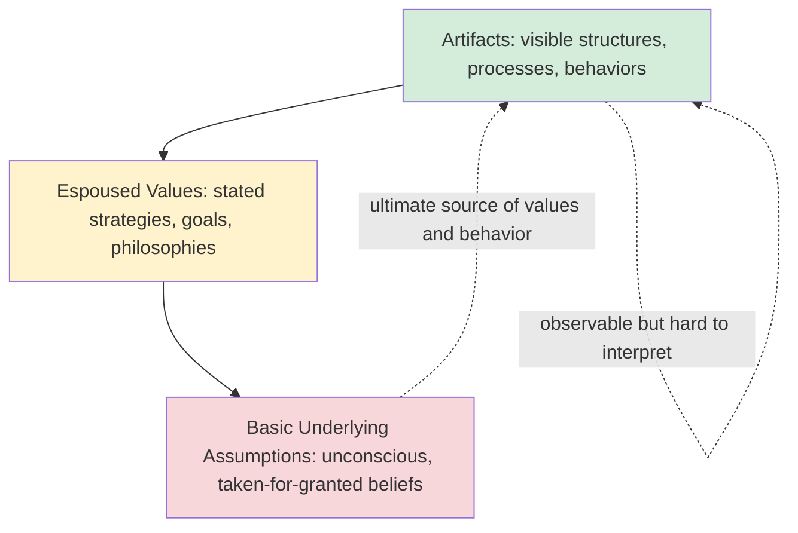
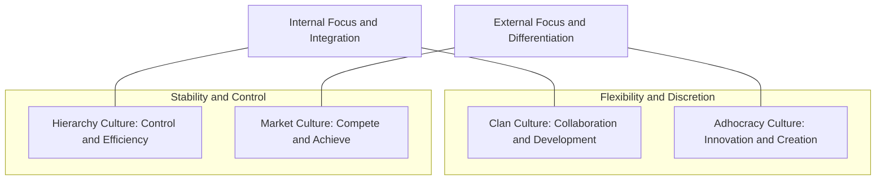

## Models and Definitions of Organizational Culture

### Defining Organizational Culture

Organizational culture lacks a single universally accepted definition, but most formulations converge on a shared core: culture is a **set of shared assumptions, values, beliefs, and norms** that guide behavior within an organization and are transmitted to new members as the correct way to perceive, think, and feel in relation to organizational problems.

Several influential definitions illustrate different emphases:

- **Edgar Schein**: Culture is "a pattern of shared basic assumptions that was learned by a group as it solved its problems of external adaptation and internal integration, that has worked well enough to be considered valid and, therefore, to be taught to new members as the correct way to perceive, think, and feel in relation to those problems." This definition emphasizes culture as a *learned, adaptive, and largely unconscious* solution set.
- **Geert Hofstede**: Describes culture as "the collective programming of the mind that distinguishes the members of one group or category of people from another," originally developed for national culture but widely extended to organizational contexts.
- **Deal and Kennedy**: Frame culture more colloquially as "the way we do things around here," emphasizing observable behavioral norms over deep cognitive structures.

**Key distinction**: Culture is often contrasted with **climate**. Climate refers to shared *perceptions* of policies, practices, and procedures at a given point in time (more surface-level, measurable via survey, and more malleable), while culture refers to the deeper, more stable *assumptions and values* that produce those perceptions. Climate is sometimes described as the manifestation of culture as experienced by employees in the present.

---

### Schein's Three-Level Model

Schein's model remains the most widely taught framework for the structure of organizational culture, decomposing it into three layers of increasing depth and decreasing visibility:

1. **Artifacts** — The most visible layer: physical environment, dress codes, office layout, rituals, language, published values statements, org charts, technology in use, and observable behaviors. Artifacts are easy to observe but hard to interpret correctly without deeper layers, since the same artifact (e.g., an open-plan office) can signal different underlying values across organizations (collaboration vs. cost reduction vs. surveillance).
2. **Espoused values** — The strategies, goals, and philosophies that members explicitly articulate, often codified in mission statements or value posters. Espoused values represent what an organization *says* it values.
3. **Basic underlying assumptions** — Unconscious, taken-for-granted beliefs that determine perception, thought, and feeling. These are the ultimate source of values and actions but are typically invisible even to organizational members, having become so ingrained that alternatives are literally not considered.

**[Inference]** A frequently cited practical implication of this model is that culture change efforts focused solely on artifacts (e.g., redesigning office space, rewriting a values poster) tend to fail or produce superficial change if the underlying assumptions are not addressed, since assumptions will continue to generate behaviors inconsistent with newly stated values.

Schein's model also emphasizes the **origin** of assumptions: they typically form through a group's early problem-solving experiences (often traceable to founder beliefs), and persist because they successfully reduce anxiety and provide a shared frame of reference, making them resistant to change even when they become dysfunctional.

---

### Competing Values Framework (Cameron and Quinn)

The Competing Values Framework (CVF), developed by Cameron and Quinn, organizes culture along two orthogonal dimensions:

- **Flexibility and discretion** vs. **stability and control**
- **Internal focus and integration** vs. **external focus and differentiation**

These two axes produce four quadrant culture types:

| Culture Type | Orientation | Core Values | Leadership Style |
| --- | --- | --- | --- |
| **Clan** | Internal + Flexible | Collaboration, mentoring, employee development | Facilitator, mentor, team-builder |
| **Adhocracy** | External + Flexible | Innovation, risk-taking, entrepreneurship | Innovator, visionary, risk-taker |
| **Hierarchy** | Internal + Stable | Efficiency, consistency, formalized processes | Coordinator, monitor, organizer |
| **Market** | External + Stable | Competitiveness, goal achievement, results | Driver, competitor, producer |

The associated diagnostic instrument, the **Organizational Culture Assessment Instrument (OCAI)**, uses an ipsative (forced-choice) rating format across six content dimensions (dominant characteristics, organizational leadership, management of employees, organizational glue, strategic emphases, criteria of success), asking respondents to distribute 100 points across the four culture types for both current and preferred states. The gap between current and preferred profiles is used diagnostically to identify desired culture change direction.

**[Inference]** No single quadrant is presented as universally superior; the framework's practical value lies in diagnosing *fit* between culture type and strategic context (e.g., adhocracy culture may suit high-innovation industries but create inefficiency in highly regulated, safety-critical industries better served by hierarchy characteristics).

---

### Hofstede's Cultural Dimensions (as Applied Organizationally)

While originally developed to explain *national* culture differences, Hofstede's dimensions are frequently applied to organizational and cross-cultural management contexts:

- **Power Distance**: Degree to which unequal power distribution is accepted by less powerful members.
- **Individualism vs. Collectivism**: Degree to which individuals are integrated into groups.
- **Masculinity vs. Femininity**: Distribution of emotional roles; achievement/assertiveness vs. cooperation/quality-of-life orientation.
- **Uncertainty Avoidance**: Tolerance for ambiguity and unstructured situations.
- **Long-Term vs. Short-Term Orientation**: Focus on future rewards (perseverance, thrift) vs. past/present (tradition, social obligations).
- **Indulgence vs. Restraint**: Degree of gratification vs. suppression of human desires.

Hofstede also separately researched **organizational** (as opposed to national) culture via the IBM-derived and later independent studies, finding that organizational-level culture differences were driven more by *practices* (shared perceptions of daily behaviors) than by *values*, which contrasts with his national-culture findings where values differences dominate. This distinction is frequently cited as a caution against directly importing national-culture dimensional models onto organizational-level analysis without adjustment. [Inference]

---

### Denison Model

The Denison Organizational Culture Model links culture directly to organizational effectiveness through four traits, each with three underlying indices:

1. **Involvement** — Empowerment, team orientation, capability development.
2. **Consistency** — Core values, agreement, coordination and integration.
3. **Adaptability** — Creating change, customer focus, organizational learning.
4. **Mission** — Strategic direction and intent, goals and objectives, vision.

These four traits are further organized along two axes: **internal vs. external focus** and **flexible vs. stable**, producing a circular model conceptually related to (though independently developed from) the Competing Values Framework. The Denison model is distinctive for its explicit empirical grounding in organizational performance data, marketed and validated through the Denison Organizational Culture Survey (DOCS) against financial and operational performance metrics across client organizations. [Unverified] The strength of the culture-performance correlation reported in proprietary normative databases should be treated cautiously without access to the underlying peer-reviewed methodology.

---

### Competing Conceptual Debates in the Literature

#### Integration, Differentiation, and Fragmentation Perspectives (Martin)

Joanne Martin's three-perspective framework challenges the assumption that organizations have a single, unified culture:

- **Integration perspective**: Assumes organization-wide consensus; culture is consistent, clear, and shared by all members (the traditional/classical view).
- **Differentiation perspective**: Recognizes subcultures (departmental, occupational, hierarchical) that may hold inconsistent or even conflicting values; consensus exists only within subgroups, not organization-wide.
- **Fragmentation perspective**: Views culture as inherently ambiguous, fluid, and issue-specific; consensus is transient and consistency is the exception rather than the rule.

**Key Points**: Martin's framework is a meta-theoretical critique rather than a measurement tool — it argues that any given organizational culture study implicitly adopts one of these three lenses, and results (and recommended interventions) will differ substantially depending on which lens is applied to the same organization.

#### Culture as Variable vs. Culture as Root Metaphor

A foundational epistemological debate (traced to Smircich's work) distinguishes two ways of conceptualizing culture:

- **Culture as an organizational variable**: Culture is something an organization *has* — a manageable, measurable attribute that can be diagnosed and deliberately changed (the dominant view in applied/practitioner literature, underlying instruments like OCAI and DOCS).
- **Culture as a root metaphor**: Culture is something an organization *is* — an emergent, socially constructed phenomenon that cannot be simply engineered from the top down, requiring interpretive (often ethnographic) methods to understand rather than survey-based measurement.

This debate has direct practical implications: practitioners operating from the "variable" view pursue culture change through structured interventions (training, restructured incentives, leadership modeling), while those informed by the "root metaphor" view are more skeptical that culture can be directly manipulated and instead focus on understanding emergent meaning-making processes.

---

### Culture Strength and the Strong Culture Thesis

A separate stream of research (associated with Kotter and Heskett, and earlier Peters and Waterman's *In Search of Excellence*) examined whether **culture strength** (degree of consensus and intensity around shared values) predicts organizational performance.

- The **strong culture thesis** posits that strong, widely shared cultures produce superior performance by reducing behavioral variance, improving coordination, and increasing motivation through goal alignment.
- Subsequent critiques and empirical work identified an important caveat: strong culture is only performance-enhancing when the culture's content is *adaptive* to the environment. A strong but rigid, internally-focused culture can become a liability under environmental change (sometimes discussed as the "success trap" or cultural inertia problem), since strong cultures resist the very adaptation that changing markets may require.

$$P_{org} = f(\text{Culture Strength} \times \text{Strategic Fit})$$

Where $P_{org}$ denotes organizational performance; this functional relationship is illustrative rather than a formally validated equation, intended to convey that culture strength alone is an insufficient predictor absent alignment with environmental and strategic context.

---

### Measurement Approaches Compared

| Method | Approach | Strengths | Limitations |
| --- | --- | --- | --- |
| **OCAI (Cameron & Quinn)** | Ipsative quadrant scoring | Simple, intuitive quadrant visualization; good for culture-change dialogue | Forced-choice format limits statistical flexibility; four-quadrant reduction may oversimplify |
| **DOCS (Denison)** | Likert-scale, linked to performance benchmarks | Strong practitioner adoption; explicit performance linkage | Proprietary normative database limits independent verification |
| **Organizational Culture Inventory (OCI, Cooke & Lafferty)** | Measures behavioral norms across constructive, passive/defensive, aggressive/defensive styles | Behaviorally specific; strong psychometric development history | Focused more on behavioral norms than deep assumptions |
| **Ethnographic/qualitative methods** | Observation, interviews, artifact analysis (Schein-style) | Captures depth, nuance, subcultures, and unconscious assumptions | Time-intensive, less scalable, harder to benchmark quantitatively |

---

### Practical Application: Diagnosing Culture-Strategy Misalignment

**Example**: A technology company built on an adhocracy culture (rapid experimentation, high autonomy) acquires a mature manufacturing subsidiary operating under a strong hierarchy culture (standardized processes, safety compliance). Post-merger culture clashes are common in this scenario because:

1. Reward systems that incentivize risk-taking in the parent conflict with compliance-oriented incentives in the subsidiary.
2. Communication norms (informal, fast-paced vs. formal, documented) create friction in coordination.
3. Leadership styles that succeed in one context (visionary risk-taker) may be perceived as reckless or destabilizing in the other (where a coordinator/monitor style is expected).

Applying the CVF diagnostically here would involve mapping both units' OCAI current-state profiles, identifying the specific quadrant gaps driving friction, and designing integration mechanisms (dual operating structures, culture-bridging roles, differentiated incentive systems) rather than assuming one culture should simply overwrite the other.

---

**Related Topics**

- Organizational Climate and Its Measurement (Distinguishing Climate from Culture)
- Schein's Model of Culture Change and Unlearning
- Subcultures and Countercultures in Organizations
- Culture Change Management and Resistance to Change
- Cross-Cultural Management and Global Team Dynamics
- Person-Organization (P-O) Fit Theory
- Organizational Socialization and Onboarding as Culture Transmission
- Psychological Safety as a Cultural Construct