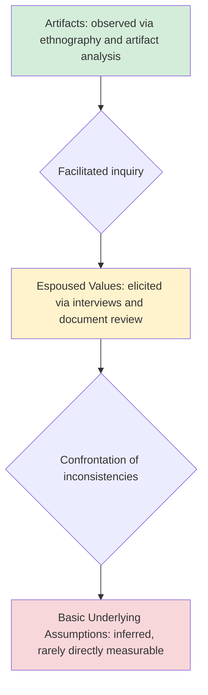

## Culture Assessment and Measurement

### Purpose and Scope of Culture Assessment

Culture assessment refers to the systematic process of measuring, diagnosing, and interpreting an organization's shared values, assumptions, norms, and behavioral patterns. Assessment serves several distinct organizational purposes, and the appropriate methodology often depends on which purpose is primary:

- **Diagnostic**: Understanding the current-state culture to identify sources of dysfunction, misalignment, or risk (e.g., pre-merger due diligence, post-incident investigation).
- **Benchmarking**: Comparing culture across units, time periods, or against external normative databases.
- **Change management**: Establishing a baseline against which culture change interventions can be evaluated over time.
- **Selection and fit**: Informing hiring, onboarding, or team composition decisions based on person-organization fit.
- **Regulatory/compliance**: Increasingly relevant in regulated industries (e.g., financial services "conduct risk" culture assessments mandated by some regulators) where culture is treated as a leading indicator of misconduct risk.

**Key distinction**: Culture assessment differs from **climate surveys**, which measure shared *perceptions* of current practices and policies (more actionable, more frequently administered, closer to the surface). Culture assessment aims at deeper, more stable values and assumptions, and is typically conducted less frequently and with more triangulated methods.

---

### Quantitative Measurement Instruments

#### Organizational Culture Assessment Instrument (OCAI)

Built on the Competing Values Framework (Cameron and Quinn), the OCAI uses an **ipsative** (forced-distribution) format: respondents allocate 100 points across four culture-type descriptions (Clan, Adhocracy, Market, Hierarchy) for each of six content dimensions, once for the *current* culture and once for the *preferred* culture.

- **Six content dimensions**: Dominant characteristics, organizational leadership, management of employees, organizational glue, strategic emphases, criteria of success.
- **Output**: A radar/spider diagram comparing current vs. preferred profiles across the four quadrants; the gap analysis identifies desired direction of culture change.
- **Strengths**: Quick to administer, intuitive visualization, strong track record in change-management workshops for generating dialogue.
- **Limitations**: The forced-choice (ipsative) scoring format constrains standard parametric statistical analysis (scores are not independent, since increasing one quadrant's score necessarily decreases others), limiting comparability across some multivariate techniques that assume independent variables.

#### Denison Organizational Culture Survey (DOCS)

A Likert-scale instrument measuring four traits (Involvement, Consistency, Adaptability, Mission), each decomposed into three indices, for a total of 60 items. Distinctive features:

- Explicitly linked to a proprietary normative database correlating survey results with financial and operational performance metrics across client organizations.
- Produces a circumplex-style visual report positioning the organization along internal/external and flexible/stable axes.
- [Unverified] The strength of publicized culture-performance correlations should be treated cautiously absent access to the underlying peer-reviewed methodology, since the normative database and scoring algorithms are proprietary.

#### Organizational Culture Inventory (OCI) — Cooke and Lafferty

Measures behavioral norms (not underlying values directly) across twelve styles grouped into three clusters:

- **Constructive styles**: Achievement, self-actualizing, humanistic-encouraging, affiliative — associated with satisfaction, quality, and effective problem-solving.
- **Passive/defensive styles**: Approval, conventional, dependent, avoidance — associated with excessive conformity and risk-aversion.
- **Aggressive/defensive styles**: Oppositional, power, competitive, perfectionistic — associated with internal competition and stress.

The OCI has a strong psychometric development history (decades of normative data across large samples) and is frequently paired with the **Organizational Effectiveness Inventory (OEI)**, which measures the *causal factors* (structures, systems, leadership practices) believed to produce the culture patterns identified by the OCI — allowing a diagnostic chain from root cause to behavioral norm to organizational outcome.

#### Hofstede's Organizational Culture Survey Module

Distinct from Hofstede's national culture dimensions, this instrument measures organizational-level "practices" (perceived organizational behaviors) across six independent dimensions (e.g., process-oriented vs. results-oriented, employee-oriented vs. job-oriented, parochial vs. professional). Hofstede's own comparative research found organizational culture differences were driven predominantly by shared *practices* rather than shared *values* — a finding that has methodological implications for instrument design, since it suggests organizational-culture surveys should emphasize behavioral/practice items over abstract value-endorsement items. [Inference]

---

### Comparison Table: Major Quantitative Instruments

| Instrument | Underlying Model | Scoring Format | Primary Output | Best Suited For |
| --- | --- | --- | --- | --- |
| OCAI | Competing Values Framework | Ipsative (100-point split) | Current vs. preferred quadrant profile | Workshop-based change dialogue |
| DOCS | Denison Model | Likert scale | Circumplex report + performance linkage | Performance-linked diagnostics |
| OCI/OEI | Cooke & Lafferty behavioral norms | Likert scale | 12-style behavioral profile + causal factors | Root-cause behavioral diagnosis |
| Hofstede OCS Module | Practices-based dimensions | Likert scale | Six independent practice dimensions | Cross-unit/cross-national comparison |

---

### Qualitative and Mixed-Method Approaches

Quantitative instruments are efficient at scale but are widely acknowledged to under-capture Schein's deepest layer (basic underlying assumptions), which are by definition largely unconscious and not directly accessible via self-report survey. Qualitative methods are typically used to complement or triangulate against survey data:

- **Schein's iterative clinical interview method**: A structured group interview process in which a facilitator works with organizational insiders to move from artifacts (observed) to espoused values (articulated) to underlying assumptions (inferred through iterative questioning and confrontation of inconsistencies, e.g., "you say X, but I observed Y — help me understand the connection").
- **Ethnographic observation**: Extended, embedded observation of organizational life (meetings, informal interactions, physical space use) to identify unstated norms.
- **Artifact analysis**: Systematic review of physical and symbolic artifacts (office layout, dress norms, internal communications, org charts, ritual events) as indirect evidence of underlying values.
- **Focus groups and narrative/story analysis**: Eliciting organizational stories, myths, and "war stories" that reveal what behaviors are celebrated or punished in organizational lore.
- **Document and archival analysis**: Reviewing historical records, founder writings, strategic plans, and internal communications for evidence of value evolution over time.

**Key Points** on method selection:

- Quantitative instruments are efficient, scalable, and comparable across time/units but risk surface-level measurement.
- Qualitative methods access deeper assumptions but are resource-intensive, less scalable, and more dependent on skilled facilitation.
- **Mixed-method triangulation** (survey followed by focus groups to interpret unexpected quantitative patterns, or ethnographic pre-work informing survey item customization) is widely recommended in the applied literature as best practice, particularly for high-stakes assessments such as M&A due diligence.

---

### Methodological Considerations and Common Pitfalls

#### Level of Analysis Problem

Culture can be measured and aggregated at multiple levels — individual, team, department, business unit, or entire organization — and findings do not automatically generalize across levels. A common pitfall is **aggregation bias**: averaging individual survey responses into an organization-level score can mask important subculture variation identified in Martin's differentiation perspective (see prior chapter item). High within-group variance in survey responses is itself diagnostically meaningful and should be reported alongside means, not discarded.

#### Response Bias

- **Social desirability bias**: Respondents may report espoused/idealized values rather than actual lived experience, particularly in company-branded (non-anonymous) surveys.
- **Common method bias**: Using a single method (e.g., only self-report survey) to measure both predictor and outcome variables can inflate observed relationships artificially.
- **Self-labeling and framing effects**: The wording of survey items (as discussed in bullying/harassment measurement) can significantly shift reported prevalence of specific cultural patterns.

#### Timing and Snapshot Limitations

Most survey-based assessments are cross-sectional snapshots, but culture is dynamic. [Inference] Point-in-time assessments conducted immediately following a significant organizational event (layoffs, leadership change, crisis) may reflect a transient climate reaction rather than stable underlying culture, and practitioners commonly recommend either delaying assessment or explicitly noting this context when interpreting results.

#### Cross-Cultural and Cross-National Comparability

When comparing culture assessment results across national contexts (e.g., a multinational comparing subsidiaries), measurement invariance becomes a serious concern: survey items may not carry equivalent meaning across languages and cultural contexts (translation/back-translation is necessary but not sufficient), and national culture is a confound that can be difficult to statistically separate from organizational culture proper.

---

### Emerging and Digital Approaches

- **Natural language processing (NLP) of internal communications**: Analysis of employee surveys' open-text responses, internal chat/email metadata (subject to privacy and legal constraints), or exit interview transcripts using sentiment analysis and topic modeling to infer cultural themes at scale.
- **Glassdoor/external review mining**: Using publicly available employee review text as an external, less curated data source for culture signal, though subject to well-documented selection bias (reviews skew toward strongly positive or negative experiences).
- **Pulse surveys**: Short, frequent (weekly/biweekly) survey instruments intended primarily for climate tracking, sometimes used as a leading-indicator proxy for culture drift between full formal assessments.
- **People analytics dashboards**: Combining survey data with behavioral/HR system data (turnover patterns, internal mobility, engagement metrics) to build composite culture-health indices.

[Speculation] The long-term validity and construct legitimacy of NLP-derived culture metrics (as opposed to validated survey instruments) remains an active and unsettled area of organizational research, and such methods are best treated as supplementary signals rather than validated replacements for established instruments.

---

### Practical Application: Designing an Assessment Protocol

**Example** scenario: An HR/OD team is asked to assess culture ahead of a planned merger integration.

**Next Steps** for a typical mixed-method protocol:

1. **Scoping**: Define assessment purpose (due diligence vs. ongoing tracking) and level of analysis (business unit vs. enterprise-wide).
2. **Quantitative baseline**: Administer a validated instrument (e.g., OCAI for quadrant-level fit diagnosis, or DOCS if performance linkage is a priority) across both merging entities.
3. **Qualitative triangulation**: Conduct structured interviews or focus groups with a stratified sample (varying tenure, level, function) to interpret quantitative gaps and surface subcultures.
4. **Artifact review**: Analyze internal communications, values statements, and physical/organizational artifacts for consistency with survey findings.
5. **Gap and risk analysis**: Identify specific dimensions of misalignment (e.g., decision-making speed, risk tolerance, feedback norms) most likely to produce integration friction.
6. **Reporting with caveats**: Present findings with explicit acknowledgment of response bias, sampling limitations, and the point-in-time nature of the data, avoiding overclaiming precision about "the" culture as a fixed, fully-known quantity.

---

**Related Topics**

- Models and Definitions of Organizational Culture (Schein, CVF, Denison)
- Climate Surveys and Employee Engagement Measurement
- Culture Due Diligence in Mergers and Acquisitions
- Subcultures, Differentiation, and Fragmentation Perspectives
- Culture Change Management and Intervention Design
- Psychometric Validity and Reliability in Organizational Instruments
- People Analytics and HR Data Infrastructure
- Conduct Risk and Regulatory Culture Assessment (Financial Services)