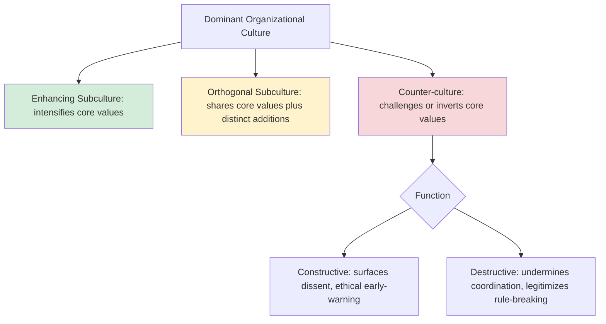
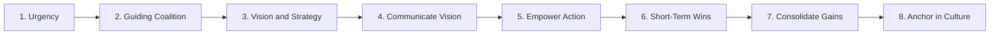

## Subcultures and Culture Change

### Defining Subcultures

A **subculture** is a subset of organizational members who share a distinct set of values, assumptions, or norms that differ in some respect from the dominant organizational culture, while typically still operating within it rather than in outright opposition to it. Subcultures are the empirical basis for Martin's **differentiation perspective** (discussed under Models and Definitions of Organizational Culture): rather than assuming organization-wide consensus, this view holds that consensus exists primarily *within* subgroups, with meaningful — sometimes conflicting — variation *between* them.

Subcultures commonly form along several structural lines:

- **Occupational/functional**: Engineering, sales, legal, and finance functions frequently develop distinct professional norms, vocabularies, and risk tolerances, often reinforced by external professional bodies and training pipelines that predate organizational membership.
- **Hierarchical**: Executive, middle-management, and frontline employee groups may hold different perceptions of the same formal culture, particularly regarding transparency, psychological safety, and the credibility of espoused values ("culture at the top" vs. "culture on the floor").
- **Geographic/business unit**: Multinational organizations or those formed through acquisition often retain location- or unit-specific cultural inheritance long after formal integration.
- **Generational/tenure-based**: Long-tenured employees who experienced the organization's founding period may hold assumptions inconsistent with newer cohorts socialized under different leadership or strategic conditions.
- **Demographic/identity-based**: Employee resource groups and identity-based networks can develop distinct subcultural norms around psychological safety and voice, particularly in organizations with uneven inclusion practices.

---

### Typology of Subculture Relationships to the Dominant Culture

Organizational culture research (building on Martin, and separately on typologies developed in the change-management literature) distinguishes subcultures by their relationship to dominant values:

- **Enhancing subcultures**: Hold the dominant culture's core values even more intensely than the mainstream (e.g., an elite sales team that embodies the company's "customer obsession" value to an exceptional degree).
- **Orthogonal subcultures**: Accept the dominant culture's core values while simultaneously holding an additional, non-conflicting set of values specific to their function (e.g., an engineering team that shares company-wide customer focus but additionally prizes technical elegance in ways not emphasized elsewhere).
- **Counter-cultures**: Directly challenge or invert one or more core values of the dominant culture, often emerging in response to perceived organizational failures, ethical concerns, or unaddressed grievances. Countercultures can serve either a constructive function (surfacing legitimate dissent, acting as an early-warning system for cultural drift or ethical erosion) or a destructive one (undermining coordinated strategy execution, legitimizing rule-breaking).

**[Inference]** Whether a given counterculture is ultimately constructive or destructive for the organization is not always determinable at the time it emerges, and often depends on how leadership responds — suppression tends to drive countercultures underground (increasing risk of destructive expression), while structured engagement can convert legitimate grievances into productive organizational learning.

---

### Why Subcultures Matter for Practice

Ignoring subcultural variation creates several practical risks:

- **False consensus in survey data**: Aggregate, organization-wide culture scores can mask sharply divergent subcultural experiences, particularly across hierarchical levels. A mean engagement or values-alignment score can look acceptable while concealing a severely disaffected frontline subculture.
- **Failed culture-change initiatives**: Change programs designed and communicated from a single dominant-culture vantage point (typically headquarters/executive) frequently fail to account for how the intended change will be interpreted, resisted, or reshaped within distinct subcultures, particularly strong occupational subcultures with independent professional identities (e.g., clinicians in healthcare organizations, engineers in technology firms).
- **M&A integration friction**: Merging organizations effectively merge multiple, often incompatible, subculture systems simultaneously; treating "Company A culture" vs. "Company B culture" as single monolithic entities oversimplifies the integration challenge, since each entity likely contains its own internal subcultural variation as well.

---

### Culture Change: Theoretical Foundations

#### Lewin's Three-Stage Model

Kurt Lewin's foundational change model, though originally developed for group-level change broadly, remains widely applied to culture change specifically:

1. **Unfreezing**: Disrupting existing equilibrium by creating motivation for change — typically through evidence that current assumptions are no longer producing successful outcomes (a "burning platform"), reducing psychological safety around the status quo just enough to open readiness for new approaches without triggering pure defensive resistance.
2. **Changing (Moving)**: Introducing new values, structures, and behaviors, often through role modeling by leadership, revised reward systems, restructured processes, and targeted communication.
3. **Refreezing**: Institutionalizing new patterns until they become the new taken-for-granted norm, through reinforcement mechanisms (updated onboarding, revised performance criteria, embedded rituals) that prevent regression to prior assumptions.

**[Inference]** Critics of the refreezing stage argue it implies an inappropriately static end-state in what is, in practice, a continuously evolving process, particularly in high-change-velocity industries; some contemporary change literature substitutes an ongoing "adapting" stage rather than a fixed refreeze.

#### Schein's Culture Change Mechanisms

Schein identified specific mechanisms through which leaders embed and transmit culture, which by extension are the primary levers available for deliberate culture change:

- **Primary embedding mechanisms** (high-leverage, most powerful):
  - What leaders pay attention to, measure, and control on a regular basis.
  - How leaders react to critical incidents and organizational crises.
  - Observed criteria for resource allocation.
  - Deliberate role modeling, teaching, and coaching by leaders.
  - Observed criteria for rewards and status allocation.
  - Observed criteria for recruitment, selection, promotion, and (critically) termination.
- **Secondary reinforcement mechanisms** (lower-leverage, but reinforcing once primary mechanisms are aligned):
  - Organizational design and structure.
  - Systems and procedures.
  - Physical space, facades, and buildings.
  - Stories, legends, and myths about people and events.
  - Formal statements of philosophy, values, and creed.

**Key Points**: Schein's framework implies that formal statements (mission/values posters) are among the *weakest* levers for culture change, while what leaders actually attend to, reward, and tolerate in practice are the *strongest* — a frequent explanation for why espoused values that are not backed by consistent leadership behavior and reward alignment fail to shift underlying assumptions.

#### Kotter's Eight-Step Change Model (Applied to Culture)

John Kotter's model, though general-purpose for organizational change, is frequently applied specifically to culture change initiatives:

1. Establish a sense of urgency
2. Create a guiding coalition
3. Develop a vision and strategy
4. Communicate the change vision
5. Empower broad-based action (removing obstacles)
6. Generate short-term wins
7. Consolidate gains and produce more change
8. Anchor new approaches in the culture

Kotter's model explicitly treats "anchoring in the culture" as the *final* step rather than a starting condition — culture change is positioned as the durable *outcome* of successfully executed behavioral and structural change, not something that can be directly targeted first through communication alone.

---

### Resistance to Culture Change

Resistance is a well-documented and largely expected feature of culture change efforts rather than an anomaly to be eliminated. Common sources include:

- **Anxiety reduction function of existing assumptions**: As per Schein, basic assumptions persist because they successfully reduce anxiety; proposed change threatens this psychological function, generating "learning anxiety" that can trigger defensive avoidance even when members intellectually accept the need for change.
- **Sunk-cost and identity investment**: Long-tenured employees, particularly founders or early members, may have significant personal and professional identity invested in existing cultural patterns.
- **Power redistribution**: Culture change frequently redistributes informal power and status (e.g., shifting from seniority-based to merit-based advancement criteria); those advantaged under the prior system have rational incentive to resist.
- **Subcultural friction**: As above, change initiatives designed around dominant-culture assumptions may be actively reinterpreted or resisted by distinct occupational or hierarchical subcultures whose professional identity is threatened by the proposed change.
- **Leadership inconsistency**: When Schein's primary embedding mechanisms (what leaders actually reward, tolerate, and model) contradict the officially communicated change narrative, employees rationally trust the primary mechanisms over the stated narrative, producing cynicism and change fatigue.

**[Inference]** Change literature broadly suggests resistance is best treated as diagnostic information (revealing where anxiety, power stakes, or subcultural conflict are concentrated) rather than purely an obstacle to be overcome through communication volume alone.

---

### Practical Application: Managing Subcultural Variation in a Change Initiative

**Example** scenario: A hospital system attempting to shift from a hierarchical, physician-authority-centered safety culture toward a "just culture" model emphasizing systemic error reporting over individual blame.

Key subcultural considerations in this scenario:

1. **Physician subculture**: Often carries strong professional autonomy norms reinforced by medical training predating organizational tenure; framing the change as undermining clinical authority (rather than improving systemic safety) risks triggering counterculture resistance from this high-status, high-leverage group.
2. **Nursing subculture**: May have historically borne disproportionate blame under the prior culture; successful change requires credible signals (per Schein's primary mechanisms) that reporting will not result in punitive consequences — a signal best delivered through demonstrated leadership response to actual reported incidents, not policy language alone.
3. **Administrative/executive subculture**: Change framed primarily in risk-management or liability-reduction terms (an administrative priority) may fail to resonate with clinical staff whose primary professional identity is patient-care-centered rather than institutional-risk-centered; message framing needs subculture-specific translation, not a single organization-wide narrative.

**Next Steps** for the change team would typically include piloting the new reporting system within a single unit to generate an observable short-term win (Kotter step 6), ensuring leadership visibly and consistently responds to early reports in a genuinely non-punitive manner (Schein's "reaction to critical incidents" mechanism), and using unit-level rather than hospital-wide culture surveys to detect subculture-specific resistance patterns before broader rollout.

---

**Related Topics**

- Models and Definitions of Organizational Culture (Schein, CVF, Denison)
- Culture Assessment and Measurement
- Organizational Socialization and Onboarding
- Leadership Styles and Their Cultural Influence
- Change Management Models (Kotter, ADKAR, Lewin) in Broader Organizational Contexts
- Psychological Safety and Just Culture Frameworks
- Mergers and Acquisitions: Culture Due Diligence and Integration
- Organizational Identity and Identity Threat Theory