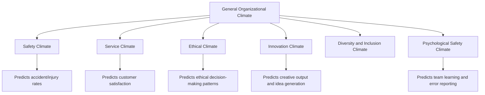
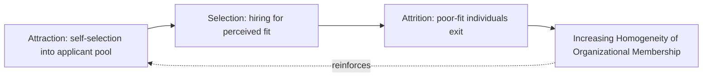

## Organizational Climate Research

### Defining Organizational Climate

**Organizational climate** refers to employees' shared perceptions of the policies, practices, procedures, and behaviors that are rewarded, supported, and expected within a given work setting, as experienced at a relatively specific point in time. Climate is fundamentally a perceptual construct — it exists in the shared meaning employees construct from organizational events and practices, rather than in the events and practices themselves.

**Key distinction from culture**: Climate and culture are related but analytically distinct constructs, and the literature has debated their relationship extensively:

- **Climate** is typically described as more surface-level, more directly measurable via structured survey, more malleable in the short term, and often studied for its *specific* (X) form — e.g., safety climate, service climate, ethical climate — rather than as a monolithic whole.
- **Culture** (per Schein and others) is deeper, encompasses largely unconscious basic assumptions, is more stable, and typically requires longer time horizons and more varied methods (including qualitative/ethnographic approaches) to fully characterize.

A widely cited formulation treats climate as **"the surface manifestation of culture"** — employees' perceptions (climate) are shaped by, and offer indirect evidence of, deeper underlying cultural assumptions, but the two are not interchangeable and can diverge (e.g., a strong espoused safety culture with actual observed climate indicating inconsistent enforcement).

---

### Psychological Climate vs. Organizational Climate

An important measurement-level distinction, developed extensively by Benjamin Schneider and colleagues:

- **Psychological climate**: An individual-level construct — a single employee's personal perception of their work environment, influenced by their unique role, relationships, and cognitive interpretation.
- **Organizational climate**: The *aggregated, shared* perception across a meaningful group of employees (team, unit, or organization), justified statistically and theoretically only when individual perceptions demonstrate sufficient within-group agreement to be treated as a group-level (rather than purely individual) phenomenon.

This distinction has direct methodological implications: aggregating individual psychological climate scores into an organizational climate score requires empirical justification (commonly via within-group agreement indices such as $r_{wg}$, or intraclass correlation coefficients such as ICC(1) and ICC(2)) rather than being assumed by default. Aggregating without this justification risks the same aggregation-bias problem discussed in culture measurement — masking meaningful subgroup variation under a misleadingly unified organizational score.

$$r_{wg} = 1 - \frac{S_x^2}{\sigma_{EU}^2}$$

Where $S_x^2$ is the observed variance in a group's ratings and $\sigma_{EU}^2$ is the expected variance under a null distribution (typically a uniform or specified random-response distribution); values approaching 1.0 support aggregation, while low values suggest perceptions are too heterogeneous within the group to be meaningfully treated as a shared climate.

---

### The "Climate for X" Approach

A defining feature of contemporary climate research (strongly associated with Schneider's work) is the argument that climate is most usefully studied and measured with respect to a **specific strategic focus**, rather than as an undifferentiated general construct. Organizations simultaneously host multiple, potentially distinct climates depending on which outcome is being examined. Well-established examples include:

- **Safety climate**: Shared perceptions regarding the priority, communication, and enforcement of safety practices; extensively studied in high-risk industries (construction, healthcare, aviation, manufacturing) and consistently linked to accident and injury rates.
- **Service climate**: Shared perceptions of the practices, procedures, and behaviors rewarded with respect to customer service quality; robustly linked in the literature to customer satisfaction outcomes, forming part of the well-established "climate-service-profit chain" logic in service management research.
- **Ethical climate**: Shared perceptions of what constitutes ethically correct behavior and how ethical issues should be handled, often assessed via Victor and Cullen's Ethical Climate Questionnaire, which identifies climate types along egoism/benevolence/principle and individual/local/cosmopolitan dimensions.
- **Innovation climate**: Shared perceptions of support for creativity, risk-taking, and idea generation.
- **Diversity/inclusion climate**: Shared perceptions of fairness, respect, and value placed on diverse identities and perspectives; increasingly measured as a distinct construct given its demonstrated links to retention and psychological safety outcomes for underrepresented groups.
- **Psychological safety climate**: Team- or unit-level shared belief that the environment is safe for interpersonal risk-taking (raising concerns, admitting mistakes, offering dissenting views) without fear of punishment or humiliation — heavily influenced by Amy Edmondson's team-level research.

**[Inference]** The "climate for X" approach is generally favored in contemporary research over general/molar climate measures because specific climates demonstrate stronger, more theoretically coherent predictive relationships with correspondingly specific outcomes, whereas general climate measures tend to show weaker, more diffuse correlations across a wide range of outcomes.

---

### Foundational Theoretical Models

#### Litwin and Stringer's Model

An early foundational framework (1968) proposing that organizational climate mediates the relationship between organizational structure/practices and individual motivation and behavior, drawing on McClelland's needs theory (achievement, affiliation, power). Climate was operationalized across dimensions such as structure, responsibility, reward, warmth, support, standards, conflict, and identity.

#### James and Jones's Cognitive Schema Approach

James and Jones argued climate perceptions function as cognitive schemas — organized mental representations that individuals use to interpret and make sense of organizational events, drawing on individual attributes (values, needs) interacting with situational cues. This framing helped establish the psychological-climate-as-individual-cognition perspective later distinguished from aggregated organizational climate.

#### Schneider's Attraction-Selection-Attrition (ASA) Model

A highly influential model explaining *why* organizations develop distinctive, relatively homogeneous climates over time, independent of formal socialization processes:

1. **Attraction**: Individuals are drawn to organizations whose perceived values and characteristics align with their own (self-selection into applicant pools).
2. **Selection**: Organizations select candidates who fit existing norms and values, whether through explicit fit-based hiring criteria or implicit interviewer bias toward similarity.
3. **Attrition**: Individuals who are poor fits with the prevailing climate are more likely to leave voluntarily (or be exited involuntarily) over time.

The cumulative effect of ASA across many hiring cycles is that organizations become progressively more homogeneous in the values, personalities, and preferences of their membership — climate, on this account, emerges substantially from *who ends up working there* rather than solely from deliberate top-down cultural engineering.

**[Inference]** A frequently discussed implication of the ASA model is that it can produce unintended homogeneity risks (e.g., reduced cognitive diversity, entrenchment of existing biases in selection criteria) even absent any deliberately discriminatory intent, since the mechanism operates through accumulated small preferences at each of the three stages rather than a single overt decision.

---

### Measurement Methodology

#### Common Instruments

- **Safety Climate Questionnaire (various versions, e.g., Zohar's)**: Assesses perceived management commitment to safety, communication practices, and enforcement consistency.
- **Ethical Climate Questionnaire (Victor & Cullen)**: Measures ethical climate types along the egoism/benevolence/principle × individual/local/cosmopolitan matrix.
- **Team Psychological Safety Scale (Edmondson)**: A widely used seven-item scale assessing team-level beliefs about interpersonal risk-taking safety.
- **Organizational Climate Measure (Patterson et al.)**: A broader, seventeen-dimension instrument drawing on the Competing Values Framework quadrants, intended to bridge general and specific climate measurement.

#### Level-of-Analysis and Aggregation Statistics

Because climate is theoretically a *shared* group-level perception, rigorous climate research requires demonstrating that individual-level survey responses justify aggregation to the team/unit/organization level before computing and reporting group means:

- **$r_{wg}$ (within-group agreement)**: Assesses interrater agreement within a single group relative to a specified null distribution.
- **ICC(1)**: Estimates the proportion of total variance in individual ratings attributable to group membership — a measure of non-independence justifying multilevel treatment.
- **ICC(2)**: Estimates the reliability of the group *mean* as an estimate of the group's true climate score, sensitive to group size (larger groups yield more reliable means, all else equal).

**Key Points**: Failing to establish aggregation statistics before reporting group-level climate scores is a recognized methodological weakness; a low $r_{wg}$ or ICC(1) suggests that what appears to be "organizational climate" may actually be substantial unexplained individual-level variance, undermining claims of a genuinely shared perception.

---

### Climate-Outcome Relationships

Climate research has generated substantial and generally robust evidence linking specific climates to correspondingly specific organizational outcomes:

| Climate Type | Commonly Studied Outcomes |
| --- | --- |
| Safety climate | Workplace accident/injury rates, near-miss reporting frequency |
| Service climate | Customer satisfaction, service quality ratings, customer retention |
| Ethical climate | Unethical behavior/misconduct rates, whistleblowing likelihood |
| Innovation climate | Patent output, new product development speed, idea submission rates |
| Psychological safety climate | Team learning behavior, error reporting, voice behavior |
| Diversity/inclusion climate | Turnover intention among underrepresented groups, perceived fairness |

[Unverified] Effect sizes reported across individual studies vary considerably by industry, measurement instrument, and study design; readers should consult specific meta-analyses (e.g., Christian et al.'s meta-analysis on safety climate and safety performance, or Zohar's body of work) for quantitative effect-size estimates rather than treating the general directional relationships summarized above as fixed magnitudes.

---

### Practical Application: Multi-Climate Diagnostic in a Hospital Setting

**Example** scenario: A hospital experiencing both elevated clinical error rates and high nursing turnover commissions a climate assessment.

Rather than administering a single general climate survey, a "climate for X" approach would likely deploy multiple targeted instruments simultaneously:

1. **Safety climate survey** at the unit level, to assess perceived management commitment to reporting systems and non-punitive error handling.
2. **Psychological safety scale** at the team level, since error reporting is heavily dependent on interpersonal risk perception within the immediate work team rather than hospital-wide policy alone.
3. **Ethical climate assessment**, given potential tension between patient-care principles and cost/efficiency pressures.

Aggregation statistics ($r_{wg}$, ICC) would be computed at the unit level before reporting unit-level scores, since prior sections of this reference note that averaging across units with genuinely different local management practices would obscure the specific units driving elevated error rates — a diagnostically critical distinction that a single hospital-wide climate score would not reveal.

---

**Related Topics**

- Models and Definitions of Organizational Culture
- Culture Assessment and Measurement
- Psychological Safety and Team Learning Behavior
- Safety Climate and Occupational Safety Performance
- Person-Organization Fit and the Attraction-Selection-Attrition Model
- Service Climate and the Service-Profit Chain
- Ethical Decision-Making Frameworks in Organizations
- Multilevel Modeling Methods in Organizational Research