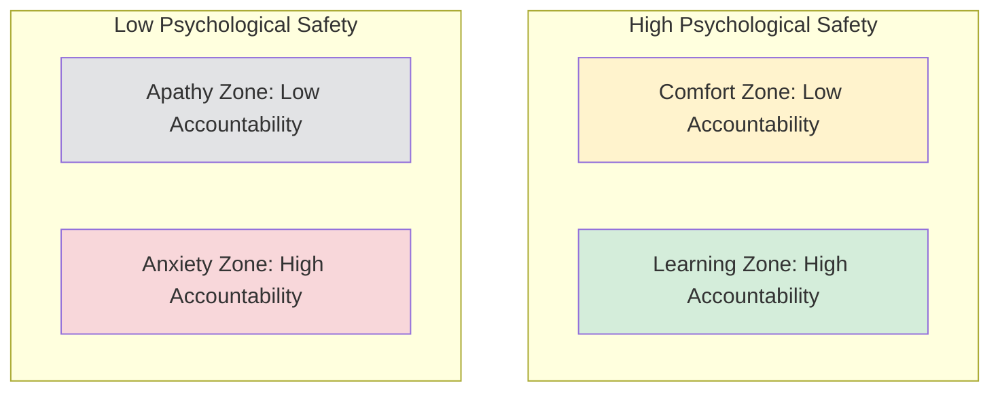

## Psychological Safety

### Defining Psychological Safety

**Psychological safety** is a shared belief held by members of a team that the team is safe for interpersonal risk-taking — that one will not be punished, humiliated, or rejected for speaking up with ideas, questions, concerns, or mistakes. The construct was most influentially operationalized at the **team level** by Amy Edmondson, building on earlier organizational-level work by Schein and Bennis, and separately on Kahn's foundational concept of psychological safety as a condition for personal engagement at work.

**Key distinction from related constructs**:

- **Trust** typically refers to a dyadic (person-to-person) expectation that another individual will act in good faith; psychological safety is a *group-level climate property* describing the shared perception of the team environment as a whole, though trust and psychological safety are theoretically and empirically related.
- **Psychological safety is not the same as being "nice" or conflict-avoidant**. Edmondson explicitly distinguishes psychologically safe teams (which surface disagreement, admit error, and challenge ideas directly) from superficially harmonious teams that suppress dissent to maintain comfort — the latter is arguably a marker of *low* psychological safety, since genuine disagreement is being withheld rather than safely expressed.
- **Not the same as low performance standards**: Edmondson's later work explicitly frames psychological safety and accountability/performance standards as two independent axes, not substitutes for one another (see the Learning Zone Model below).

---

### Theoretical Foundations

#### Kahn's Conditions for Engagement

William Kahn's foundational 1990 work identified psychological safety as one of three psychological conditions (alongside meaningfulness and availability) necessary for employees to bring their "full selves" to work roles — to be personally engaged rather than psychologically withdrawn. Kahn's psychological safety centered on feeling able to show and employ one's self without fear of negative consequences to self-image, status, or career.

#### Edmondson's Team-Level Operationalization

Edmondson's 1999 study (notably conducted in hospital nursing teams) reframed psychological safety as a **team-level climate construct** predicting team learning behavior. Her key theoretical contribution was demonstrating that psychological safety mediates the relationship between team characteristics (leadership behavior, team structure) and learning-oriented behaviors such as error reporting, help-seeking, and experimentation.

A frequently cited and counterintuitive finding from Edmondson's original study: units with *better* team leadership and higher psychological safety sometimes showed *higher reported* error rates — not because more errors actually occurred, but because psychologically safe teams were more willing to report errors openly rather than conceal them, illustrating a key measurement caveat for any climate research relying on self-reported behavioral outcomes. [Inference] This finding is widely cited as evidence that psychological safety affects *reporting* behavior distinctly from actual *incidence* of the underlying behavior, a distinction that has implications for interpreting any climate-linked outcome data.

#### The Seven-Item Team Psychological Safety Scale

Edmondson's most widely used measurement instrument asks team members to rate agreement with items such as: if you make a mistake on this team, it is often held against you (reverse-scored); members of this team are able to bring up problems and tough issues; people on this team sometimes reject others for being different (reverse-scored); it is safe to take a risk on this team; it is difficult to ask other members of this team for help (reverse-scored); no one on this team would deliberately act in a way that undermines my efforts; working with members of this team, my unique skills and talents are valued and utilized.

---

### The Learning Zone Model (Psychological Safety × Accountability)

A widely used two-by-two framework (popularized in Edmondson's later work, notably *The Fearless Organization*) crosses psychological safety with performance standards/accountability to describe four distinct team zones:

|  | **Low Accountability** | **High Accountability** |
| --- | --- | --- |
| **High Psychological Safety** | **Comfort Zone** — pleasant but low urgency; limited drive toward excellence | **Learning Zone** — high performance combined with candor, experimentation, and error surfacing |
| **Low Psychological Safety** | **Apathy Zone** — disengagement; low investment in either speaking up or performance | **Anxiety Zone** — fear-driven compliance; information withheld, mistakes hidden, innovation suppressed |

**Key Points**: This model directly addresses a common misconception — that psychological safety is about lowering standards or avoiding difficult conversations. The model's central claim is the opposite: psychological safety is presented as a *precondition* for sustaining high accountability without triggering defensive, information-concealing behavior; the "Learning Zone" requires *both* dimensions simultaneously, not psychological safety in place of accountability.

---

### Antecedents of Team Psychological Safety

Research has identified several consistent predictors:

- **Leader inclusiveness and behavior**: Leaders who explicitly invite input, respond non-punitively to bad news, and admit their own fallibility/mistakes are among the most robust predictors identified in the literature. Edmondson's concept of **situational humility** — a leader explicitly acknowledging uncertainty or the limits of their own knowledge — is frequently cited as a specific behavioral lever.
- **Team stability and familiarity**: Longer-tenured, more stable team composition is generally associated with higher psychological safety, plausibly through accumulated positive interpersonal risk-taking history.
- **Organizational/climate context**: Broader organizational climate for voice, fairness, and non-punitive error handling shapes the baseline conditions within which team-level psychological safety develops.
- **Interpersonal trust and relationship quality**: Pre-existing trust among team members lowers the perceived risk of interpersonal exposure.
- **Diversity and inclusion dynamics**: [Inference] Some research suggests psychologically safety can vary meaningfully by subgroup identity within the same team (e.g., a team may be highly psychologically safe for majority-status members while being substantially less safe for minority-status members), indicating that team-level aggregate scores may obscure important individual-level heterogeneity, consistent with aggregation-bias concerns raised in climate measurement more broadly.

---

### Consequences of Psychological Safety

Psychological safety has been linked across a substantial body of research to a range of team and organizational outcomes:

- **Learning behavior**: Increased help-seeking, feedback-seeking, error reporting, and experimentation.
- **Innovation and creativity**: Greater willingness to propose novel or unconventional ideas without fear of ridicule.
- **Error prevention and safety outcomes**: Particularly well-documented in healthcare and aviation contexts, where suppressed voice around safety concerns has been implicated in numerous high-profile organizational failure case studies.
- **Team performance**: Generally positive associations, though [Inference] the strength of this relationship appears to be moderated by task type — psychological safety's performance benefits are most pronounced in complex, interdependent, non-routine work where information-sharing and error-correction are performance-critical, and less consequential for simple, low-interdependence tasks.
- **Employee well-being and engagement**: Reduced burnout risk and increased engagement, consistent with Kahn's original engagement framework.

$$\text{Team Learning Behavior} = f(\text{Psychological Safety}) \times \text{Leader Inclusiveness}$$

This functional relationship is illustrative of the mediating role frequently proposed in the literature (leader behavior → psychological safety → learning behavior) rather than a formally validated equation.

---

### Common Misapplications and Critiques

- **Conflation with comfort or avoidance of conflict**: As noted, treating psychological safety as synonymous with a "nice," low-friction environment misapplies the construct and risks producing the Comfort Zone (or worse, an environment where genuine disagreement is suppressed under a veneer of niceness).
- **Treating it as a fixed trait rather than a dynamic climate**: Psychological safety can fluctuate across situations, topics, and even meetings within the same team; a team may be safe to discuss operational errors but unsafe to challenge a senior leader's strategic decisions.
- **Overgeneralizing from team to individual level**: As noted in antecedents above, aggregate team scores can mask meaningfully different individual experiences, particularly along status or identity lines.
- **Assuming psychological safety alone drives performance**: The Learning Zone model explicitly warns against this; psychological safety without accountability produces comfort, not necessarily improved outcomes.
- **[Speculation]** Some critics have raised concern that popularized, simplified versions of psychological safety in mainstream management discourse have drifted from Edmondson's original research-grounded construct toward a looser, more feel-good interpretation that understates the accountability component — this critique is more a commentary on practitioner discourse than a challenge to the underlying peer-reviewed research itself.

---

### Practical Application: Building Psychological Safety in a Team

**Example** scenario: A newly formed cross-functional product team consistently defers to the most senior engineer's opinions in meetings, with junior members rarely voicing dissenting views even when they identify potential issues.

**Next Steps** a team leader might apply, drawing on the antecedents discussed above:

1. **Model situational humility**: The leader explicitly states uncertainty about a decision and invites disconfirming input ("I might be wrong about this approach — what am I missing?").
2. **Respond non-punitively to raised concerns**: When a junior member does raise an issue, the leader visibly thanks them for surfacing it regardless of whether the concern proves substantive, reinforcing (per Schein's primary embedding mechanisms) that voice is rewarded rather than merely tolerated.
3. **Separate idea generation from evaluation**: Structuring discussion so that critique is explicitly deferred until after all input is gathered reduces the risk that early senior opinions anchor and suppress subsequent dissent.
4. **Normalize error disclosure**: Publicly and non-punitively discussing the leader's own past mistakes establishes that fallibility is treated as normal rather than shameful.
5. **Monitor for uneven safety across subgroups**: Periodically checking whether junior or minority-status members report different psychological safety levels than senior/majority-status members, rather than relying solely on an aggregate team score.

---

**Related Topics**

- Organizational Climate Research (Climate for X, ASA Model)
- Team Learning Behavior and Organizational Learning
- Leadership Styles and Leader Inclusiveness
- Voice Behavior and Silence in Organizations
- Just Culture Frameworks in High-Risk Industries
- Kahn's Model of Personal Engagement at Work
- Workplace Bullying and Harassment Dynamics
- Diversity, Equity, and Inclusion Climate