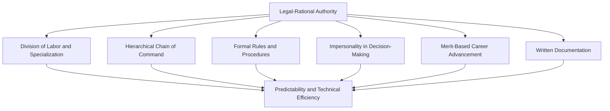
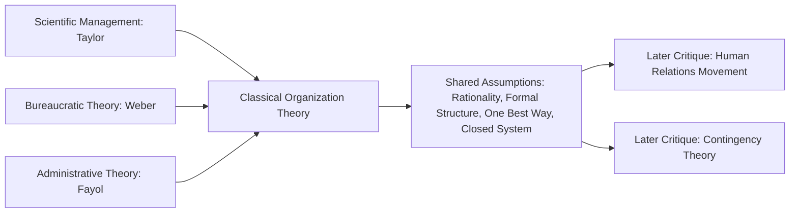

## Classical Organizational Design Theories

### Overview and Historical Context

Classical organizational design theories emerged primarily between the late 19th and early 20th centuries, coinciding with the industrialization of large-scale manufacturing and administrative bureaucracies. These theories share a common underlying assumption: that organizations function best when structured according to explicit, rational principles emphasizing specialization, hierarchy, formalization, and control — a set of assumptions later described as the **"machine model"** or **"closed-system"** view of organizations, since these theories generally did not account for environmental uncertainty or external contingency factors (addressed later by contingency theory).

Three major streams of classical thought are typically covered together under this heading: **Scientific Management** (Taylor), **Administrative/Bureaucratic Theory** (Weber and Fayol), and their combined legacy in what is now often called **classical organization theory**.

---

### Scientific Management (Taylorism)

Frederick Winslow Taylor's scientific management, developed in the late 1800s and formalized in his 1911 work *The Principles of Scientific Management*, was concerned primarily with maximizing efficiency at the level of individual task execution, applied predominantly to manufacturing and manual labor contexts.

#### Core Principles

1. **Scientific study of tasks ("time and motion study")**: Replace informal, rule-of-thumb work methods with a systematic, empirically derived "one best way" to perform each task, determined through detailed observation and measurement of worker movements and time.
2. **Scientific selection and training**: Systematically select and train workers for tasks based on measured capability, rather than allowing workers to choose their own tasks and self-train.
3. **Cooperation between management and workers**: Ensure work is carried out in accordance with the scientifically developed methods, with management taking responsibility for planning and workers responsible for execution — a deliberate separation of planning from doing.
4. **Division of work and responsibility between management and workers**: Management assumes responsibility for work planning, method design, and standard-setting; workers are responsible for executing the prescribed method.

#### Mechanisms and Practices

- **Piece-rate and differential pay systems**: Compensation tied directly to measured output against a scientifically derived standard, intended to align individual incentive with organizational efficiency goals.
- **Functional foremanship**: Taylor proposed replacing a single generalist foreman with multiple specialized functional foremen (each responsible for a distinct aspect of supervision, e.g., speed, quality, discipline), though this specific proposal saw limited adoption in practice compared to his broader efficiency principles.
- **Standardization of tools, equipment, and work conditions**: Physical work environment and equipment specifications derived from the same scientific efficiency logic applied to task methods.

#### Critiques

- **Dehumanization concerns**: Scientific management is frequently criticized for treating workers as interchangeable inputs to be optimized rather than as individuals with intrinsic motivation, social needs, or discretion — a critique that directly motivated the subsequent Human Relations movement (Hawthorne studies, Mayo) as a corrective response.
- **Narrow motivational assumptions**: Taylor's framework assumes primarily extrinsic, economically rational motivation (workers respond to piece-rate incentives), largely disregarding intrinsic motivation, social belonging, and psychological needs later emphasized in motivation theory.
- **Deskilling**: Critics (notably Braverman's later labor process theory) argue scientific management's separation of planning from execution systematically deskills labor, concentrating knowledge and control with management and reducing worker autonomy and craft knowledge.
- **[Inference]** Despite these critiques, elements of Taylorist logic persist in contemporary operational contexts (e.g., algorithmic task-timing and standardization in some warehouse and logistics operations), suggesting the underlying efficiency logic remains influential even as its overtly mechanistic framing has fallen out of favor in mainstream management theory.

---

### Bureaucratic Theory (Max Weber)

Max Weber, a sociologist rather than a management practitioner, developed bureaucratic theory as part of a broader analysis of legitimate authority structures. Weber identified bureaucracy as the purest and most technically efficient form of **legal-rational authority** (as distinguished from traditional authority based on custom, and charismatic authority based on personal qualities of a leader).

#### Core Characteristics of the Ideal-Type Bureaucracy

1. **Division of labor and specialization**: Clearly defined jurisdictional areas, with tasks distributed according to functional specialization.
2. **Hierarchical structure of authority**: A clearly defined chain of command in which each lower office is under the control and supervision of a higher one.
3. **Formal rules and procedures**: A consistent system of abstract rules governing decisions and actions, intended to ensure uniformity and predictability of operations regardless of which individual occupies a given role.
4. **Impersonality**: Official decisions and relationships are governed by formal rules and rational criteria rather than personal favoritism, emotional considerations, or particularistic loyalty.
5. **Career orientation and merit-based advancement**: Employment and promotion based on technical qualification and demonstrated competence, with employment as a lifelong career and protection from arbitrary dismissal.
6. **Written documentation**: Administrative acts, decisions, and rules are recorded in writing, creating an auditable, persistent record independent of any individual's memory or personal authority.

**Key Points**: Weber's model was intended as an **ideal type** — an analytical abstraction for comparison, not a literal blueprint or an endorsement — and Weber himself expressed ambivalence about bureaucracy's dehumanizing potential (his famous metaphor of bureaucracy as an "iron cage" constraining individual freedom and creativity), even while arguing for its technical superiority in efficiency and predictability terms relative to traditional or charismatic authority structures.

#### Critiques and the "Dysfunctions of Bureaucracy" Literature

Subsequent organizational sociologists extended and critiqued Weber's framework, identifying systematic dysfunctions that can emerge from strict bureaucratic implementation:

- **Robert Merton's "trained incapacity"**: Rigid adherence to rules, originally intended as a means to organizational ends, can become an end in itself ("goal displacement"), producing rule-rigidity that undermines the very organizational effectiveness the rules were meant to serve.
- **Goal displacement**: Related to Merton's concept — measurable proxies for organizational goals (e.g., processing volume, compliance rates) can substitute for the actual underlying goals they were designed to serve, particularly when incentive systems reward the proxy metric directly.
- **Red tape and slow responsiveness**: Extensive formal procedures, while intended to ensure consistency, can produce excessive administrative burden and slow adaptive responsiveness to novel or urgent situations not anticipated by existing rules.
- **Alienation**: Consistent with critiques of scientific management, strict role specialization and impersonality can produce worker alienation and reduced intrinsic engagement.

---

### Administrative Theory (Henri Fayol)

Henri Fayol, a French mining engineer and executive, developed administrative theory from a top-down managerial perspective (contrasting with Taylor's bottom-up, shop-floor focus), concerned with the general principles of *managing* an organization as a whole rather than optimizing individual task execution.

#### Fayol's Five Functions of Management

1. **Planning**: Forecasting future conditions and developing action plans to meet objectives.
2. **Organizing**: Structuring resources, tasks, and authority relationships to execute the plan.
3. **Commanding**: Directing and motivating subordinates toward organizational objectives.
4. **Coordinating**: Ensuring harmonization of activities and efforts across different organizational units.
5. **Controlling**: Monitoring performance against plans and taking corrective action as needed.

[Inference] These five functions are frequently cited as a direct historical antecedent of the modern management textbook framework of planning, organizing, leading, and controlling (P-O-L-C), with "commanding" and "coordinating" broadly consolidated into the contemporary "leading" function over subsequent decades of management theory development.

#### Fayol's Fourteen Principles of Management

Fayol proposed fourteen general administrative principles (presented by Fayol as flexible guidelines rather than rigid laws):

| Principle | Core Idea |
| --- | --- |
| Division of work | Specialization improves efficiency and output quality |
| Authority and responsibility | Authority to give orders must be matched with corresponding accountability |
| Discipline | Obedience and respect for organizational agreements |
| Unity of command | Each employee should receive orders from only one superior |
| Unity of direction | One plan and one head for activities with the same objective |
| Subordination of individual interest | Organizational interest takes precedence over individual interest |
| Remuneration | Fair compensation for effort |
| Centralization | Appropriate balance between centralized and decentralized decision authority |
| Scalar chain | A clear line of authority from top to bottom (though Fayol permitted lateral shortcuts, the "gangplank," for efficiency) |
| Order | Materials and people in the right place at the right time |
| Equity | Fair and kind treatment of employees |
| Stability of tenure | Excessive employee turnover undermines efficiency |
| Initiative | Employees should be encouraged to develop and execute plans |
| Esprit de corps | Promoting team spirit and unity |

**Key distinction from Weber**: Fayol's principles are more explicitly prescriptive and managerially oriented (practical guidance for practicing executives), while Weber's bureaucratic theory is more descriptive/analytical (a sociological ideal-type for understanding authority structures). Both converge, however, on core structural themes: hierarchy, specialization, unity of command, and formalized coordination.

---

### Synthesis: Shared Assumptions of Classical Theory

Despite differing origins and emphases, Taylor, Weber, and Fayol collectively share several foundational assumptions characteristic of "classical" organizational thought:

- **Rationality and predictability** are achievable and desirable organizational properties.
- **Formal structure** (rules, hierarchy, specialization) is the primary lever for achieving efficiency and control.
- **One best way**: An implicit assumption that optimal structures and methods can be identified and universally applied, largely independent of situational or environmental context — this "one best way" assumption is precisely what later **contingency theory** (Burns and Stalker, Lawrence and Lorsch, Woodward) would challenge, arguing instead that optimal structure depends on environmental uncertainty, technology, and task interdependence.
- **Closed-system perspective**: Classical theories generally analyze the organization as a largely self-contained system, with limited explicit theorization of environmental turbulence, competition, or external stakeholder influence — a limitation addressed by later open-systems and contingency approaches.

---

### Practical Application: Recognizing Classical Structures in Modern Organizations

**Example** scenario: A large government agency exhibits many classical bureaucratic features — standardized procedures manuals, strict chain-of-command approval processes, merit-based civil service hiring, and extensive written documentation requirements for administrative decisions.

Applying classical theory diagnostically:

- **Weberian strengths**: This structure plausibly supports high procedural consistency, resistance to favoritism/corruption (impersonality), and auditable accountability — properties particularly valued in public-sector contexts where fairness and legal defensibility are paramount.
- **Potential dysfunctions (per Merton)**: The same structure risks slow responsiveness to novel constituent needs not anticipated by existing procedure manuals, and risk of goal displacement if processing-volume metrics become organizationally prioritized over the substantive quality of service delivery.
- **Contingency lens (forward reference)**: Whether this bureaucratic design is appropriate depends substantially on environmental stability — classical/bureaucratic structures are generally better suited to stable, predictable task environments than to rapidly changing ones, a contingency-theoretic conclusion that classical theory itself did not explicitly incorporate.

---

**Related Topics**

- Contingency Theory of Organizational Design (Burns and Stalker, Lawrence and Lorsch)
- Human Relations Movement and the Hawthorne Studies
- Mechanistic vs. Organic Organizational Structures
- Mintzberg's Organizational Configurations
- Goal Displacement and Organizational Dysfunction
- Centralization vs. Decentralization in Decision-Making
- Formalization and Standardization in Organizational Structure
- Modern Bureaucracy Critiques and Post-Bureaucratic Organizational Forms