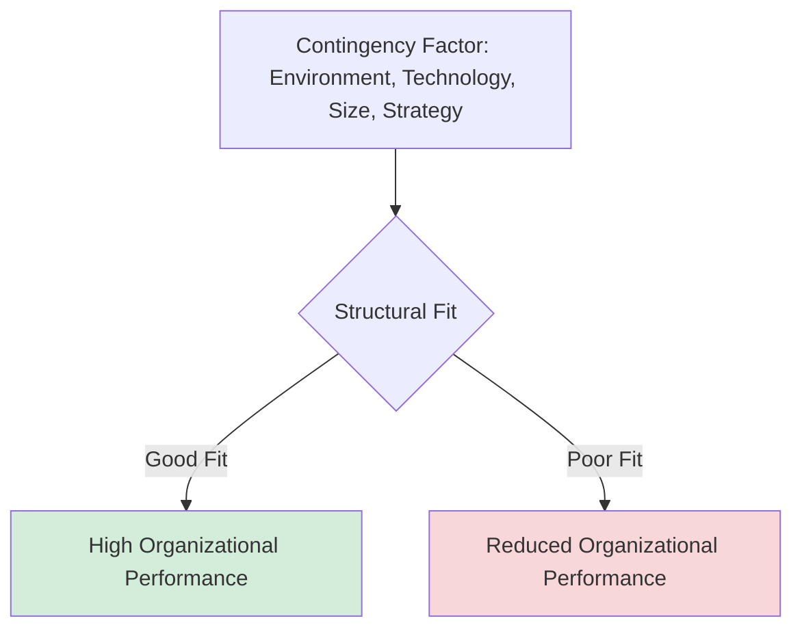
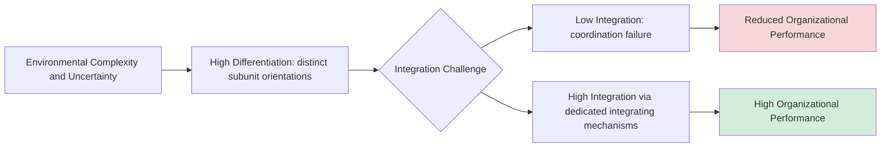
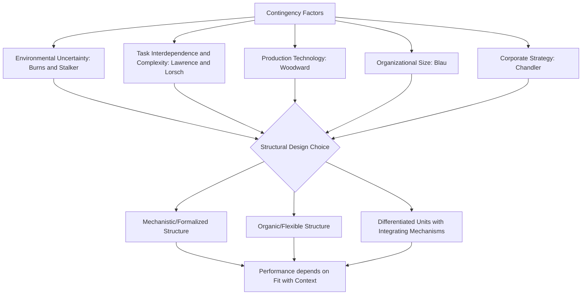

## Contingency Theory of Organizations

### Core Premise

Contingency theory emerged in the 1960s as a direct challenge to classical organization theory's implicit "one best way" assumption. Where Taylor, Weber, and Fayol proposed relatively universal structural principles, contingency theorists argued that **there is no single optimal organizational structure**; instead, the effectiveness of a given structure depends on ("is contingent upon") the fit between that structure and specific situational factors — most prominently environmental uncertainty, technology, size, and strategy.

**Key distinction from classical theory**: Contingency theory retains classical theory's underlying assumption that structure meaningfully affects performance and can be deliberately designed, but rejects the assumption that any structural configuration (e.g., bureaucratic formalization) is universally superior. The central contingency-theoretic claim is a **fit** or **alignment** proposition: performance is maximized when structural characteristics match situational demands, and misfit (structure poorly matched to context) produces performance penalties regardless of how well-designed the structure is in the abstract.

---

### Burns and Stalker: Mechanistic vs. Organic Structures

Tom Burns and G.M. Stalker's 1961 study of Scottish and English electronics firms is among the foundational contingency studies, examining how firms structured themselves differently depending on the stability of their external environment (specifically, rate of technological and market change).

#### Mechanistic Structures

Characteristics closely resembling the classical/bureaucratic model:

- High specialization and precise task definition
- Hierarchical structure of control, authority, and communication
- Vertical (top-down) interaction and communication predominant
- Behavior governed by formal rules and instructions from superiors
- Knowledge and information concentrated at the top of the hierarchy

**Best suited to**: Stable, predictable environments where task requirements change slowly, allowing formalized procedures to remain valid over extended periods.

#### Organic Structures

- Contribution to common organizational task valued over rigid role definition
- Continual adjustment and redefinition of individual tasks through interaction with others
- Network structure of control, authority, and communication (rather than strict hierarchy)
- Lateral (horizontal) communication emphasized alongside vertical
- Communication resembles consultation and information-sharing rather than command
- Commitment to organizational goals valued more than strict obedience to superiors

**Best suited to**: Unstable, rapidly changing environments (novel technology, volatile markets) where pre-specified rules and rigid hierarchy cannot anticipate the range of situations requiring rapid, decentralized response.

| Dimension | Mechanistic | Organic |
| --- | --- | --- |
| Task definition | Rigid, specialized | Fluid, continuously adjusted |
| Communication | Vertical, command-based | Lateral and vertical, consultative |
| Decision authority | Centralized, hierarchical | Decentralized, network-based |
| Best environmental fit | Stable | Unstable/turbulent |
| Formalization | High | Low |

**Key Points**: Burns and Stalker explicitly framed mechanistic and organic as **ideal-type poles on a continuum** rather than a strict binary, and — critically — did not present organic structures as universally superior. Their central finding was that firms attempting to apply mechanistic structures within highly turbulent environments experienced significant performance problems (an early empirical demonstration of the misfit penalty), while firms mismatching organic structures onto genuinely stable environments could also experience unnecessary coordination costs and ambiguity.

---

### Lawrence and Lorsch: Differentiation and Integration

Paul Lawrence and Jay Lorsch's contingency research (developed in the late 1960s, studying firms across plastics, food, and container industries with varying environmental complexity) introduced the complementary concepts of **differentiation** and **integration**, examining how organizations subdivide into specialized units while still coordinating across them.

- **Differentiation**: The degree to which different organizational subunits (e.g., R&D, sales, production) develop distinct cognitive and emotional orientations, formal structures, and time horizons appropriate to their specific subenvironment. Highly uncertain, fast-changing environments (e.g., R&D facing scientific uncertainty) were found to require different structural and cognitive orientations than more stable, predictable environments (e.g., production facing routine, repeatable processes) — differentiation is thus a *response* to environmental diversity across a firm's various subenvironments.
- **Integration**: The quality of collaboration and coordination achieved across these differentiated units, necessary to ensure organization-wide coherence despite subunit divergence.

Lawrence and Lorsch's key empirical finding was that **high-performing organizations in highly uncertain, complex environments achieved both high differentiation and high integration simultaneously** — a combination that is organizationally difficult to achieve, since greater differentiation (increasingly divergent subunit orientations) generally makes integration (cross-unit coordination) more challenging, not less. High-performing firms in these complex environments invested disproportionately in specific integrating mechanisms (dedicated integrator roles, cross-functional teams, formal liaison positions) precisely to resolve this tension.

**[Inference]** This finding is frequently cited as an early theoretical foundation for later organizational design concepts such as matrix structures and dedicated cross-functional integrator/liaison roles, which explicitly institutionalize integration mechanisms to counteract the coordination costs introduced by high subunit differentiation.

---

### Joan Woodward: Technology as a Contingency Factor

Joan Woodward's research (originally conducted in South Essex manufacturing firms in the 1950s, published 1965) was among the earliest contingency studies, examining how **production technology** shapes optimal structural characteristics — independent of, and originally somewhat orthogonal to, the environmental-uncertainty focus of Burns/Stalker and Lawrence/Lorsch.

Woodward classified firms into three technology types based on production complexity:

1. **Unit and small-batch production**: Custom or small-quantity manufacturing (e.g., bespoke machinery, prototypes).
2. **Large-batch and mass production**: Standardized, high-volume assembly-line manufacturing.
3. **Continuous-process production**: Highly automated, continuous-flow production (e.g., chemical processing, oil refining).

Woodward found that structural characteristics associated with high performance varied systematically by technology type — for instance, span of control, formalization levels, and the ratio of managerial-to-total staff differed in ways best explained by production technology complexity rather than by firm size or industry sector alone, and organizations whose structure matched their technology type generally outperformed those with structural characteristics poorly matched to their production technology.

**[Inference]** Woodward's technology-contingency findings are generally considered most directly applicable to manufacturing contexts; their generalizability to knowledge-work or service-sector "technology" (in the broader sense of core work processes rather than literal production machinery) has been explored in subsequent research but with less definitive consensus than the original manufacturing-sector findings.

---

### Additional Contingency Dimensions

Beyond environment (Burns/Stalker, Lawrence/Lorsch) and technology (Woodward), subsequent contingency research identified further situational variables affecting optimal structure:

- **Organizational size**: Larger organizations tend toward greater formalization, specialization, and vertical differentiation, partly as a functional response to the coordination challenges of managing larger and more numerous roles (associated with Peter Blau's structural contingency research).
- **Strategy** (Alfred Chandler's "structure follows strategy" thesis): Chandler's historical analysis of major U.S. corporations argued that organizational structure evolves as a response to changes in corporate strategy (e.g., diversification strategies driving adoption of multidivisional structures), positioning strategy as a further contingency variable shaping appropriate structural design.
- **Task interdependence**: The degree to which subunits or roles depend on one another for successful task completion (pooled, sequential, or reciprocal interdependence, per James D. Thompson's typology) shapes appropriate coordination mechanisms — pooled interdependence can be managed through standardization, while reciprocal interdependence generally requires more intensive, real-time mutual adjustment mechanisms.

---

### Synthesis: The Contingency Fit Logic

**Key Points**: The unifying contribution of contingency theory across these distinct research streams is the **fit proposition** itself — the claim that structural effectiveness is inherently relational (structure-to-context), not an absolute property of the structure in isolation. This reframing directly resolved the apparent contradiction between classical theory's endorsement of formalized bureaucracy and the Human Relations movement's critique of such structures: both could be correct, contingent on environmental and technological context.

---

### Critiques of Contingency Theory

- **Determinism concerns**: Some critics argue contingency theory implies an overly deterministic relationship between environment/technology and structure, understating the role of managerial choice, power dynamics, and institutional/cultural factors in shaping actual structural outcomes (a critique later developed by institutional theory and the "strategic choice" perspective, notably John Child's work).
- **Measurement and operationalization challenges**: Key contingency variables (environmental "uncertainty," technological "complexity") have proven difficult to operationalize consistently across studies, contributing to some inconsistency in empirical replication across the broader contingency literature. [Unverified] The degree of replication consistency varies by specific contingency variable and study; readers interested in precise meta-analytic effect sizes should consult dedicated organizational design meta-analyses rather than relying on the qualitative synthesis presented here.
- **Static snapshot limitation**: Much classical contingency research employed cross-sectional designs (single point-in-time comparison across firms), limiting causal inference about whether structure adapts to environment, environment is shaped by structural choices, or both evolve through more complex reciprocal or co-evolutionary processes over time.

---

### Practical Application: Diagnosing Structural Fit

**Example** scenario: A biotechnology startup operating in a highly uncertain, fast-evolving scientific and regulatory environment adopts a rigid, hierarchical, heavily formalized approval structure inherited from its founder's prior experience at a large pharmaceutical company.

Applying contingency logic diagnostically:

1. **Environmental assessment (Burns and Stalker lens)**: The startup's environment is highly unstable and uncertain (novel science, shifting regulatory pathways, rapidly evolving competitive landscape) — contingency theory would predict this context favors an organic structure (decentralized decision authority, lateral communication, continuously adjusted roles) rather than the mechanistic structure inherited from the founder's prior large-firm context.
2. **Technology assessment (Woodward lens)**: Early-stage biotech R&D more closely resembles unit/small-batch, highly customized experimental work rather than standardized mass production, further reinforcing the case against heavy formalization at this stage.
3. **Predicted misfit consequence**: Contingency theory would predict this structural misfit (mechanistic structure in an organic-appropriate context) manifests as slow decision-making, delayed response to emerging scientific findings, and reduced ability to pivot research direction — performance penalties attributable specifically to poor structure-environment fit rather than to any deficiency in the formal structure's internal design quality.
4. **Predicted future contingency shift**: As the company matures, scales production, and its core processes become more standardized and repeatable (e.g., transitioning from R&D-stage to manufacturing-stage biotech), contingency theory would predict a corresponding shift toward greater formalization becomes appropriate — illustrating that "correct" structure is not fixed but evolves with the underlying contingency factors.

---

**Related Topics**

- Classical Organizational Design Theories (Taylor, Weber, Fayol)
- Mintzberg's Organizational Configurations
- Matrix Structures and Cross-Functional Integration Mechanisms
- Chandler's Strategy-Structure Thesis
- Task Interdependence and Coordination Mechanisms (Thompson's Typology)
- Institutional Theory and Isomorphism
- Strategic Choice Theory (John Child)
- Organizational Life Cycle and Structural Evolution