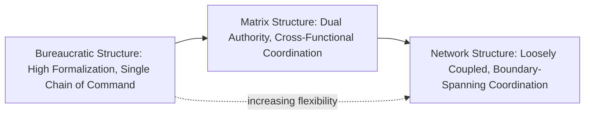
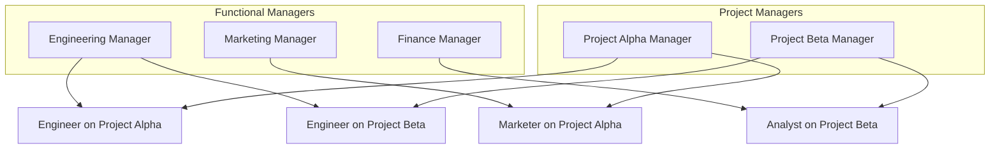
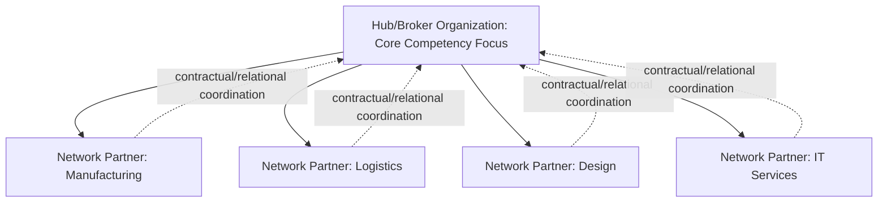

## Bureaucratic, Matrix, and Network Structures

### Overview and Positioning

This item examines three distinct organizational structural forms representing progressively different approaches to coordinating work across an organization's boundaries: **bureaucratic** structures (hierarchical, formalized, internally focused), **matrix** structures (dual-authority, cross-functional), and **network** structures (loosely coupled, boundary-spanning, often extending beyond a single legal entity). These forms can be usefully viewed along a rough continuum of increasing structural flexibility and decreasing hierarchical formalization, though in practice organizations frequently combine elements of more than one form simultaneously (a hybrid rarely captured cleanly by any single label).

---

### Bureaucratic Structure

The bureaucratic structure, formalized theoretically by Weber (covered under Classical Organizational Design Theories), remains a foundational and widely used structural form, particularly in large, stable organizations and public-sector institutions.

#### Core Design Features

- **Functional departmentalization**: Grouping of roles by common function or specialty (e.g., marketing, finance, operations, HR), enabling economies of specialization and deep functional expertise concentration.
- **Clear, single chain of command**: Each employee reports to exactly one direct supervisor, consistent with Fayol's unity-of-command principle, minimizing role ambiguity regarding who holds decision authority.
- **High formalization**: Extensive written rules, standard operating procedures, and documented policies govern most recurring decisions and processes.
- **Vertical hierarchy for coordination**: Cross-functional coordination is achieved primarily by escalating decisions upward to a common superior who has authority over the relevant functions, rather than through direct lateral negotiation between functions.

#### Strengths and Appropriate Contexts

- **Efficiency through specialization**: Deep functional expertise develops within each specialized unit.
- **Predictability and consistency**: Standardized rules ensure consistent treatment of similar cases, valuable in contexts requiring fairness, auditability, and legal defensibility (regulatory compliance, public administration).
- **Clear accountability**: Single-reporting-line structures minimize ambiguity about who is responsible for a given outcome.

Per contingency theory (covered in the prior chapter item), bureaucratic/functional structures are generally best suited to **stable environments with low task interdependence across functions and low need for rapid cross-functional adaptation** — conditions under which the coordination costs of a strict hierarchy are outweighed by the specialization and predictability benefits.

#### Limitations

- **Silos and cross-functional coordination difficulty**: Because lateral coordination must typically be routed upward through the hierarchy, functional bureaucracies can struggle with tasks requiring intensive, real-time collaboration across specialties (e.g., new product development requiring simultaneous engineering, marketing, and manufacturing input).
- **Slow responsiveness**: As discussed under classical theory's dysfunctions (Merton's trained incapacity, goal displacement), rigid rule-following can impede adaptive response to novel situations not anticipated by existing procedures.

---

### Matrix Structure

The matrix structure emerged in the 1960s–70s (notably in aerospace and defense contracting, e.g., NASA-affiliated firms) as a direct structural response to the cross-functional coordination limitations of pure functional bureaucracies, particularly for complex projects requiring simultaneous functional depth and project/product-focused integration.

#### Core Design Feature: Dual Authority

The defining and most distinctive characteristic of the matrix structure is that individual employees report to **two managers simultaneously**:

- A **functional manager**, responsible for technical/professional standards, skill development, and functional resource allocation (e.g., an engineering manager).
- A **project or product manager**, responsible for coordinating work toward a specific project, product line, or geographic market outcome, often cutting across multiple functional departments.

This dual-authority design directly operationalizes Lawrence and Lorsch's integration concept (covered under Contingency Theory): rather than relying solely on hierarchical escalation for cross-functional coordination, the matrix institutionalizes a dedicated integrating role (the project/product manager) with formal, ongoing authority over cross-functional resource allocation.

#### Variants

- **Weak/functional matrix**: The functional manager retains primary authority; the project manager role functions closer to a coordinator or facilitator with limited formal power (sometimes termed "expediter").
- **Balanced matrix**: Functional and project managers hold roughly equal, genuinely shared authority — the theoretically "pure" matrix form, though frequently identified in practice as the least stable variant due to persistent authority ambiguity.
- **Strong/project matrix**: The project manager holds primary authority, with functional managers serving a more consultative or resource-supply role.

#### Strengths and Appropriate Contexts

- **Simultaneous specialization and integration**: Enables organizations to maintain deep functional expertise (via functional managers) while achieving strong cross-functional coordination for specific projects or products (via project managers) — directly addressing the differentiation-integration tension identified by Lawrence and Lorsch.
- **Flexible resource allocation**: Skilled personnel can be shared and reallocated across multiple concurrent projects, improving resource utilization relative to structures requiring dedicated, siloed project teams.
- **Well-suited to complex, uncertain, project-based work**: Consistent with contingency theory, matrix structures are generally considered most appropriate for environments combining moderate-to-high uncertainty with high task interdependence across functions — conditions under which pure functional bureaucracy's coordination costs become prohibitive.

#### Limitations and Well-Documented Dysfunctions

- **Dual-authority conflict**: The core design feature is also the core source of dysfunction — employees can receive conflicting priorities or directives from their two managers, and resolving such conflicts consumes disproportionate managerial time and can generate significant role stress for affected employees.
- **Role ambiguity and role conflict**: Extensively documented in organizational behavior research as a direct consequence of dual reporting; employees in matrix structures frequently report higher role ambiguity and role conflict than those in single-chain-of-command structures.
- **Power struggles between functional and project managers**: Particularly acute in "balanced" matrix variants where authority is not clearly weighted toward one dimension, creating ongoing negotiation and potential turf conflict.
- **Slower decision-making in some cases**: Paradoxically, despite being designed for responsiveness, the need for functional-project manager negotiation on contested decisions can introduce its own coordination delay.
- **[Inference]** Given these well-documented dysfunctions, contemporary organizational design practice frequently favors *deliberately unbalanced* matrix variants (weak or strong matrix) over the theoretically pure balanced matrix, explicitly trading some integration benefit for reduced authority ambiguity.

---

### Network Structure

Network structures represent a further evolution beyond the matrix, characterized by loosely coupled, often legally distinct entities (internal units, external contractors, alliance partners, suppliers) coordinated through relational and contractual mechanisms rather than direct hierarchical authority.

#### Core Design Features

- **Modularity and boundary permeability**: The organization is decomposed into specialized modules (which may be internal business units, wholly external firms, or a hybrid), each contributing a specific capability, coordinated by a "hub" or "broker" organization that manages the overall network rather than directly commanding every function.
- **Contractual and relational coordination**: Because network partners are frequently outside a single firm's direct hierarchical authority, coordination relies on formal contracts, service-level agreements, shared information systems, and relational trust rather than command-and-control mechanisms.
- **Core competency focus**: The hub organization typically retains and concentrates internal effort on its core, differentiating competencies, while outsourcing or partnering for non-core functions to specialized external network members.

#### Common Sub-Variants

- **Internal network**: All units remain within a single legal entity (e.g., a single corporation) but are structured as quasi-autonomous, market-like units that transact with one another using internal pricing or resource-allocation mechanisms rather than pure hierarchical command.
- **Stable network**: A hub firm coordinates a relatively fixed, long-term set of external partners/suppliers (e.g., in automotive manufacturing supply chains), balancing efficiency benefits of specialization with reduced flexibility relative to more dynamic network forms.
- **Dynamic network**: A hub firm assembles and reconfigures a shifting set of external partners on a project-by-project or product-by-product basis (common in industries such as fashion, film production, and some technology/platform ecosystems), maximizing flexibility at the cost of reduced long-term relational stability and knowledge accumulation within any single partnership.

#### Strengths and Appropriate Contexts

- **Flexibility and rapid reconfiguration**: Particularly dynamic networks can assemble specialized capabilities rapidly for specific opportunities without the fixed cost and structural rigidity of internalizing every function.
- **Access to specialized external expertise**: Enables the hub organization to leverage best-in-class capabilities across multiple domains without needing to develop or maintain deep expertise internally in every function.
- **Reduced fixed overhead**: Externalizing non-core functions can reduce the hub organization's fixed cost base relative to a fully vertically integrated bureaucratic structure.

#### Limitations

- **Coordination and control challenges**: Absent direct hierarchical authority over network partners, the hub organization must rely on relational trust, contractual enforcement, and shared information systems, which can be less reliable than direct command in ensuring consistent quality or timely execution.
- **Reduced organizational learning and knowledge retention**: [Inference] Particularly in dynamic networks with frequently reconfigured partnerships, knowledge and capability developed through a given collaboration may not be retained or accumulated as effectively as within a stable internal hierarchy, since key expertise resides partly outside the hub organization's direct control.
- **Dependency and supply-chain risk**: Heavy reliance on external network partners for critical functions can expose the hub organization to disruption risk if a key partner fails, exits the relationship, or is acquired by a competitor.
- **Governance complexity**: Aligning incentives and quality standards across legally independent entities is generally more complex than enforcing internal policy compliance within a single hierarchical organization.

---

### Comparative Summary

| Dimension | Bureaucratic | Matrix | Network |
| --- | --- | --- | --- |
| Authority structure | Single chain of command | Dual authority (functional + project) | Distributed across hub and partners |
| Formalization | High | Moderate | Variable; often contract-based |
| Coordination mechanism | Hierarchical escalation | Direct functional-project negotiation | Contracts, relational trust, shared systems |
| Best environmental fit | Stable, predictable | Moderate-to-high uncertainty, high cross-functional interdependence | High uncertainty, need for rapid capability reconfiguration |
| Key risk | Silos, slow adaptation | Dual-authority conflict, role ambiguity | Coordination/control loss, dependency risk |

---

### Practical Application: Structural Choice for a Growing Technology Firm

**Example** scenario: A mid-sized software company initially organized functionally (engineering, sales, marketing departments) is launching three new product lines simultaneously and finds that cross-functional coordination for each product launch is bottlenecked through senior executives.

Applying the frameworks above:

1. **Diagnosis under contingency logic**: The firm's environment (competitive, fast-moving product launches) and task structure (high cross-functional interdependence between engineering, marketing, and sales for each launch) suggest the pure functional/bureaucratic structure is now poorly fit to current demands, consistent with the coordination-cost limitations discussed above.
2. **Matrix as an intermediate solution**: Introducing product-line managers with formal cross-functional authority (a matrix overlay on the existing functional structure) would institutionalize the integration mechanism this coordination bottleneck requires, though the firm should anticipate and proactively manage the dual-authority role-conflict risk well-documented in matrix implementations (e.g., through clearly defined decision rights between functional and product managers, rather than leaving authority boundaries ambiguous).
3. **Network structure as a complementary consideration**: For non-core functions (e.g., specialized QA testing, localization services for international launches), the firm might additionally adopt network-structure elements — contracting with specialized external partners rather than building full internal functional depth for capabilities not central to its core competitive differentiation.

---

**Related Topics**

- Classical Organizational Design Theories (Weber's Bureaucratic Model)
- Contingency Theory of Organizations (Lawrence and Lorsch's Differentiation-Integration)
- Mintzberg's Organizational Configurations
- Role Ambiguity and Role Conflict in Organizational Behavior
- Virtual and Boundaryless Organizations
- Outsourcing and Strategic Alliance Governance
- Project Management Structures and Project Manager Authority
- Organizational Life Cycle and Structural Evolution