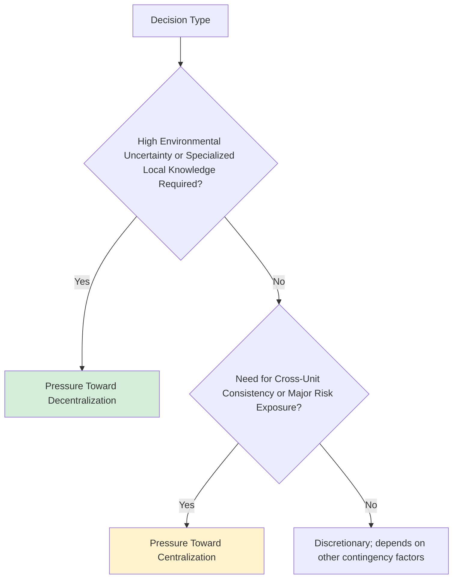
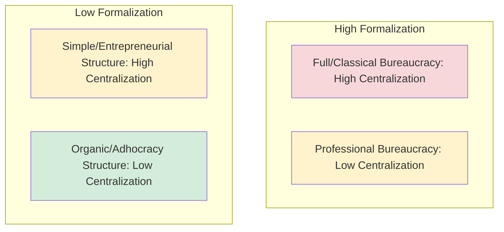

## Centralization and Formalization

### Overview and Positioning

Centralization and formalization are two of the most extensively studied **structural dimensions** in organizational design research, alongside complexity/differentiation (covered in prior items). Where earlier items in this chapter examined overall structural *forms* (bureaucratic, matrix, network), this item examines two of the underlying *dimensions* that vary continuously across and within any structural form — a bureaucratic structure can be more or less centralized, and a matrix structure can be more or less formalized, independent of the overarching structural type.

**Key distinction**: Centralization and formalization are conceptually and empirically distinct, though frequently correlated in practice (particularly in classical bureaucratic structures, where both tend to be high simultaneously):

- **Centralization** concerns *where decision authority resides* — the degree to which decision-making power is concentrated at upper levels of the hierarchy versus dispersed to lower levels.
- **Formalization** concerns *the degree to which rules, procedures, and roles are explicitly documented and standardized*, regardless of where decision authority for exceptions to those rules resides.

An organization can, in principle, be highly formalized (extensive documented procedures) while also being relatively decentralized (frontline employees hold authority to apply those procedures and make judgment calls within defined parameters) — a combination frequently observed in professional bureaucracies (discussed further under Mintzberg's configurations, referenced in Related Topics).

---

### Centralization

#### Definition and Measurement

Centralization is most commonly operationalized as the **locus of decision-making authority** within the organizational hierarchy. Empirical measurement approaches in classic structural contingency research (notably the Aston Group studies) typically assessed centralization by identifying, for a defined list of specific decision types (e.g., hiring decisions, budget approval thresholds, pricing decisions, capital expenditure authorization), the hierarchical level at which final authority for each decision formally resides. Aggregating across many decision types produces a centralization index for the organization as a whole.

#### Dimensions of Centralization

Centralization is not a single monolithic property but can vary across different decision domains within the same organization:

- **Vertical centralization**: The degree to which decision authority is concentrated at the top of the hierarchy versus dispersed to lower hierarchical levels.
- **Horizontal centralization**: The degree to which decision authority resides with line management/operational roles versus staff/specialist functions (e.g., whether operational decisions require sign-off from centralized specialist departments such as legal, finance, or HR).
- **Decision-domain specificity**: An organization might be highly centralized for strategic/financial decisions (e.g., capital expenditure) while being comparatively decentralized for operational decisions (e.g., daily scheduling, minor process adjustments) — meaning organization-wide centralization scores can mask meaningful decision-domain variation, analogous to the aggregation caveats discussed for climate and culture measurement.

#### Determinants and Contingency Factors

Drawing on the contingency theory covered earlier in this chapter, several factors are commonly associated with the appropriate degree of centralization:

- **Environmental uncertainty**: Consistent with Burns and Stalker's organic-structure findings, higher environmental uncertainty is generally associated with pressure toward decentralization, since centralized decision-makers cannot process the volume and speed of information required to respond adaptively to rapidly changing conditions — a specific instance of the broader concept of **bounded rationality** limiting centralized information-processing capacity as organizational or environmental complexity increases.
- **Organizational size**: Larger organizations often decentralize operational decisions out of practical necessity, since senior leadership cannot feasibly retain direct decision authority over the full volume of decisions generated by a large workforce, even while often retaining centralized authority over major strategic and financial decisions.
- **Task complexity and specialized knowledge location**: Decisions requiring specialized frontline knowledge (e.g., customer-facing service exceptions, technical troubleshooting) are frequently decentralized to the roles that hold the relevant expertise, since centralizing such decisions would require costly and potentially slow information transfer to a distant decision-maker who lacks direct situational knowledge.
- **Need for coordination and consistency**: Conversely, decisions with significant cross-unit externalities or requiring organization-wide consistency (e.g., pricing policy, brand standards, major risk exposures) are more commonly retained at centralized levels to prevent conflicting or inconsistent local decisions from undermining organization-wide coherence.

#### Consequences of Centralization Level

| Outcome | Centralized | Decentralized |
| --- | --- | --- |
| Decision speed for routine/local matters | Slower (requires escalation) | Faster |
| Consistency across units | Higher | Lower (unless offset by strong formalization) |
| Responsiveness to local conditions | Lower | Higher |
| Senior management workload/bottleneck risk | Higher | Lower |
| Employee autonomy and motivation | Generally lower | Generally higher (subject to individual variation) |
| Risk of duplicated effort across units | Lower | Higher (absent coordination mechanisms) |

**[Inference]** The motivational consequences of decentralization are generally positive on average (consistent with self-determination theory's emphasis on autonomy as a basic psychological need), but this relationship is moderated by individual differences and role characteristics — some employees or roles may experience decentralized decision authority as a welcome autonomy or as an unwelcome burden of unsupported responsibility, depending on their preparedness, risk tolerance, and available support structures.

---

### Formalization

#### Definition and Measurement

Formalization refers to the extent to which an organization relies on explicit, written rules, procedures, job descriptions, and policies to standardize behavior and decision-making, as opposed to relying on informal norms, individual judgment, or direct supervisory discretion. The Aston Group studies (Pugh and colleagues) operationalized formalization empirically by counting the presence and extent of documented materials such as organization charts, written job descriptions, procedure manuals, and formal policy documents.

#### Distinguishing Formalization from Related Constructs

- **Formalization vs. standardization**: Standardization refers to the degree to which activities are performed in a uniform, consistent manner; formalization refers specifically to whether the rules governing that standardization are documented in writing. In practice these are highly correlated (written rules are the primary mechanism producing behavioral standardization) but are conceptually separable — informal, unwritten norms can also produce a high degree of behavioral standardization without formal documentation (common in small organizations or strong-culture settings relying on socialization rather than written procedure).
- **Formalization vs. centralization**: As noted above, these are independent dimensions; formalization concerns *whether rules exist in writing*, while centralization concerns *who has authority to make exceptions or decisions not fully specified by those rules*.

#### Functions and Benefits of Formalization

- **Reduces role ambiguity**: Clearly documented job descriptions and procedures reduce uncertainty about expected behavior and decision authority, directly addressing a well-established source of workplace stress and reduced performance.
- **Enables consistency and fairness**: Written, applied-to-all rules reduce the risk of arbitrary or discriminatory treatment, an important consideration in contexts with legal fairness or compliance requirements (echoing Weber's impersonality principle).
- **Supports coordination at scale**: As organizations grow, informal, tacit coordination mechanisms (which rely on direct interpersonal familiarity) become increasingly infeasible; formalized procedures allow coordination among individuals who may never interact directly.
- **Facilitates knowledge retention and onboarding**: Documented procedures reduce dependency on specific individuals' tacit knowledge, supporting continuity through employee turnover and easing new-employee onboarding.
- **Supports auditability and risk management**: In regulated industries, documented procedures provide an evidentiary record supporting compliance verification and post-incident investigation.

#### Costs and Risks of Excessive Formalization

- **Reduced flexibility and adaptability**: Extensive rule systems, once established, are often slow to revise, and can become misaligned with evolving task or environmental requirements — directly echoing Merton's "trained incapacity" critique of bureaucracy covered under Classical Organizational Design Theories.
- **Goal displacement risk**: As previously discussed, formalized metrics and procedures intended as means to organizational ends can become ends in themselves, particularly when performance evaluation is tied directly to formal-rule compliance rather than to the substantive outcomes the rules were designed to serve.
- **Reduced intrinsic motivation and perceived autonomy**: Excessive rule-bound work can be experienced as constraining professional judgment and discretion, particularly for highly trained professional employees (e.g., in professional bureaucracies such as hospitals or law firms) who may resent formalized procedures perceived as substituting for their specialized expertise.
- **Innovation suppression**: [Inference] Highly formalized environments may discourage the experimentation and deviation from established procedure that novel problem-solving often requires, particularly relevant in fast-changing environments where existing formalized procedures may not anticipate emerging challenges.

---

### The Centralization-Formalization Relationship

Classical bureaucratic theory (Weber) implicitly assumes centralization and formalization co-occur and reinforce one another — extensive written rules support and legitimize centralized oversight, while centralized authority is needed to establish and enforce formal rules organization-wide. However, structural contingency research (notably from the Aston Group studies) empirically identified that these dimensions can, in practice, **vary independently**, producing a more nuanced typology:

|  | **Low Formalization** | **High Formalization** |
| --- | --- | --- |
| **High Centralization** | **Simple/Entrepreneurial structure** — few written rules, but decisions concentrated with top leadership (common in small or founder-led organizations) | **Full/Classical bureaucracy** — extensive rules combined with centralized final authority (Weber's ideal type) |
| **Low Centralization** | **Organic/Adhocracy structure** — minimal rules and dispersed authority, relying on mutual adjustment and shared norms (common in creative, innovation-focused units) | **Professional bureaucracy** — extensive standardized procedures, but authority to apply professional judgment within those standards is dispersed to trained frontline professionals (common in hospitals, universities, and other professionalized settings) |

**Key Points**: The **professional bureaucracy** quadrant is particularly notable because it directly contradicts the classical assumption that formalization and centralization must co-occur — hospitals, for example, are highly formalized (extensive documented clinical protocols and procedures) while simultaneously being relatively decentralized in the sense that frontline clinicians retain substantial professional discretion to apply those protocols based on individual patient judgment, rather than requiring case-by-case central authorization.

---

### Practical Application: Diagnosing a Structural Misalignment

**Example** scenario: A rapidly growing customer service organization has recently implemented an extensive, detailed procedure manual specifying exact scripts and escalation paths for handling customer complaints (high formalization), while simultaneously requiring all discount or refund decisions above a very low dollar threshold to be approved by a regional manager (high centralization) — resulting in extended customer wait times and declining satisfaction scores despite the substantial investment in standardized procedures.

Applying the concepts above diagnostically:

1. **Identify the specific dimension driving the problem**: The formalized scripts themselves may not be the source of customer dissatisfaction (formalization can support consistency); the centralization of even minor discount/refund authority is the more likely bottleneck, since it introduces an escalation delay for decisions that plausibly do not require cross-unit consistency or major risk oversight.
2. **Apply contingency logic**: Given that individual complaint-resolution decisions typically require situational knowledge held by the frontline representative (the specific customer interaction details) and rarely involve major organization-wide risk exposure, contingency theory would suggest this decision type is a strong candidate for decentralization, independent of whether the organization retains high formalization for scripting and escalation-path consistency.
3. **Recommended intervention**: Raise the decision-authority threshold for frontline representatives (decentralizing routine refund/discount decisions) while retaining formalized guidelines defining the boundaries within which that frontline discretion may be exercised — effectively shifting this specific decision domain toward the "professional bureaucracy" quadrant (high formalization, low centralization for this decision type) rather than assuming that reducing formalization broadly, or decentralizing all decision types uniformly, is required.

---

**Related Topics**

- Bureaucratic, Matrix, and Network Structures
- Classical Organizational Design Theories (Weber's Bureaucratic Model)
- Contingency Theory of Organizations
- Mintzberg's Organizational Configurations (Professional Bureaucracy, Adhocracy)
- Role Ambiguity and Role Conflict
- Span of Control and Hierarchical Levels
- Bounded Rationality and Organizational Decision-Making
- Goal Displacement and Organizational Dysfunction