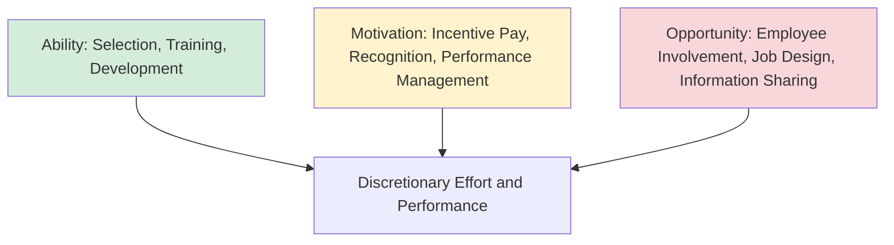
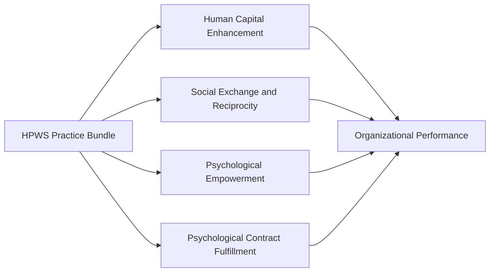

## High-Performance Work Systems

### Defining High-Performance Work Systems

**High-Performance Work Systems (HPWS)** — also referred to in the literature as High-Involvement Work Systems, High-Commitment Work Systems, or collectively as **Strategic Human Resource Management (SHRM) "bundles"** — refer to an internally consistent set of human resource practices designed to enhance employee skills, motivation, and opportunity to contribute discretionary effort, thereby improving organizational performance. The defining conceptual feature of HPWS, distinguishing it from simply adopting individual "best practice" HR policies in isolation, is the emphasis on **practice bundling and internal fit**: the practices are theorized to generate performance gains primarily through their mutually reinforcing combination, rather than through the additive effect of any single practice implemented independently.

**Key distinction from best-practice HR**: The "universalistic" best-practice perspective in HR argues certain practices (e.g., extensive training, performance-based pay) improve performance regardless of context. HPWS theory incorporates this universalistic logic but adds a **configurational** or **systems** element: practices must be internally consistent and mutually reinforcing (a firm combining extensive employee training with rigid, low-discretion job design would create internal contradiction — a common example cited to illustrate poor internal fit), and are frequently also expected to align with the organization's competitive strategy (an intersection with contingency logic, sometimes termed the "contingency" or "strategic fit" perspective within SHRM more specifically).

---

### The AMO (Ability-Motivation-Opportunity) Framework

The most widely cited theoretical foundation for HPWS design is the **AMO framework**, which proposes that discretionary employee effort and performance-relevant behavior require the simultaneous presence of three conditions:

- **Ability**: Employees must possess the necessary knowledge, skills, and capabilities to perform effectively — addressed through selection and training practices.
- **Motivation**: Employees must be motivated to exert effort toward organizational goals — addressed through compensation, incentive, and recognition practices.
- **Opportunity to Perform**: Employees must have structural opportunity to apply their ability and motivation — addressed through job design, employee involvement mechanisms, and information-sharing practices that grant genuine discretion and voice.

$$\text{Performance} = f(\text{Ability} \times \text{Motivation} \times \text{Opportunity})$$

The multiplicative (rather than additive) framing is theoretically significant: if any one component is effectively absent (e.g., highly skilled and motivated employees with no structural opportunity to exercise discretion, or high-opportunity roles filled by inadequately skilled employees), overall discretionary performance contribution is expected to be severely limited regardless of strength in the other two components — providing the theoretical rationale for HPWS's emphasis on *bundling* practices across all three dimensions rather than optimizing any single dimension in isolation.

---

### Common HPWS Practice Bundles

While specific practice inventories vary across studies (there is no single universally agreed-upon list), HPWS research commonly identifies practices clustering around the following categories, mapped to the AMO framework:

#### Ability-Enhancing Practices

- **Rigorous, selective staffing/recruitment processes**: Investment in comprehensive selection procedures (structured interviews, validated assessments) to secure high-caliber talent.
- **Extensive training and development**: Substantial and ongoing investment in both technical/functional skills and broader capability development, often exceeding industry-typical training hours.
- **Cross-training and skill breadth development**: Building versatile, multi-skilled workforces capable of flexible task reallocation.

#### Motivation-Enhancing Practices

- **Performance-based and/or profit-sharing compensation**: Linking a meaningful portion of compensation to individual, team, or organizational performance outcomes.
- **Internal promotion and career development pathways**: Signaling long-term investment in employees and aligning individual career incentive with organizational tenure and performance.
- **Employment security or reduced layoff practices**: Some HPWS formulations (though not universally) include employment security provisions, theorized to reduce employees' fear that improved productivity will result in workforce reduction, thereby supporting rather than undermining discretionary effort.
- **Formal performance appraisal linked to development and reward**: Regular, structured feedback processes connecting individual performance to both developmental and compensation outcomes.

#### Opportunity-Enhancing Practices

- **Employee involvement and participation mechanisms**: Formal channels for employee input into decisions affecting their work (quality circles, suggestion systems, participatory goal-setting).
- **Self-managed or semi-autonomous work teams**: Job design granting teams substantial discretion over work methods, scheduling, and internal task allocation.
- **Information sharing**: Transparent communication of organizational performance data, strategic priorities, and operational information to employees, enabling informed discretionary decision-making.
- **Reduced status differentials**: Flattened hierarchical symbols (e.g., open office layouts, uniform benefits across levels) intended to support open communication and reduce psychological distance between management and frontline employees.
- **Grievance and voice mechanisms**: Formal channels through which employees can raise concerns without fear of retaliation, connecting to broader voice and psychological safety literature.

---

### Theoretical Mechanisms Linking HPWS to Performance

Several theoretical pathways have been proposed to explain how HPWS practice bundles translate into improved organizational performance:

- **Human capital enhancement**: Ability-enhancing practices directly increase the stock of firm-specific and general human capital available to the organization.
- **Social exchange and reciprocity**: Motivation- and opportunity-enhancing practices (particularly employment security and genuine involvement) are theorized to invoke reciprocity norms (drawing on social exchange theory), whereby employees perceiving substantial organizational investment in their wellbeing and development respond with increased organizational commitment and discretionary effort.
- **Psychological empowerment**: Opportunity-enhancing practices (involvement, autonomy, information access) are linked to increased psychological empowerment (perceived meaning, competence, self-determination, and impact), theorized to drive intrinsic motivation and proactive behavior.
- **Signaling and psychological contract fulfillment**: HPWS bundles signal organizational commitment to employees, shaping and (when fulfilled) reinforcing positive psychological contracts, which are in turn linked to reduced counterproductive behavior and increased organizational citizenship behavior.

**[Inference]** These mechanisms are generally treated as complementary rather than competing explanations in the literature — a given HPWS bundle likely operates through multiple pathways simultaneously (e.g., training both builds human capital directly and signals organizational investment, triggering reciprocity), making it methodologically difficult to cleanly isolate the relative contribution of each specific mechanism in empirical research.

---

### Empirical Evidence and Meta-Analytic Findings

A substantial body of empirical research, notably including influential work by Huselid and colleagues in the 1990s using large multi-industry samples, has found generally positive associations between HPWS adoption (measured via composite indices of practice adoption) and organizational outcomes including productivity, financial performance, and reduced turnover.

**[Unverified]** Specific effect-size magnitudes vary considerably across studies depending on measurement approach, industry context, and methodology; readers seeking precise quantitative estimates should consult dedicated SHRM meta-analyses (e.g., Combs et al.'s widely cited meta-analysis) rather than relying on general directional claims.

**Key methodological caveats** frequently raised regarding this literature:

- **Causality and reverse causation concerns**: Much foundational HPWS research relies on cross-sectional data, raising the possibility that financially successful firms are better able to *afford* investment in HPWS practices (reverse causation) rather than HPWS practices *causing* superior performance — a concern that longitudinal and more rigorous quasi-experimental designs have only partially resolved.
- **Measurement inconsistency**: As noted, there is no single agreed-upon list of HPWS practices across studies, complicating direct comparison and meta-analytic synthesis across the literature.
- **"Black box" problem**: Considerable debate persists regarding the precise mediating mechanisms (the "black box" between HR practice adoption and firm performance), with the AMO framework and social exchange theory representing the most commonly cited but not definitively confirmed explanatory pathways.
- **Universalistic vs. contingency debate**: Some scholars argue HPWS effectiveness is genuinely universal across contexts (the "best practice" position), while others (drawing on the contingency theory covered earlier in this chapter) argue HPWS effectiveness is contingent on strategic and environmental fit — for example, HPWS may be more strongly associated with performance gains in contexts requiring high discretionary judgment and innovation than in highly routinized, low-discretion production contexts where the "opportunity" component of AMO has limited practical relevance.

---

### Implementation Challenges

- **Internal consistency requirements**: As emphasized above, partial or inconsistent adoption (e.g., extensive training paired with rigid, low-discretion job design) risks internal contradiction that undermines the bundling logic central to HPWS theory; organizations implementing HPWS incrementally should be attentive to whether newly adopted practices reinforce or contradict existing ones.
- **Cost and resource intensity**: Comprehensive HPWS adoption (extensive training, competitive performance-based compensation, employment security commitments) represents a substantial and sustained resource investment, which may be difficult to justify or sustain, particularly for smaller organizations or those facing acute cost pressure.
- **Cultural and contextual transferability**: [Inference] Much foundational HPWS research was conducted in North American and Western European contexts; the transferability of specific practice bundles (particularly those involving individual performance-based pay or reduced status differentials) to organizational and national cultural contexts with different baseline assumptions about hierarchy, collectivism, or compensation norms remains a less thoroughly resolved question, and practitioners should exercise caution before assuming direct cross-cultural transferability of specific practice configurations.
- **Line manager implementation fidelity**: HPWS's effectiveness depends substantially on how consistently and genuinely frontline managers implement intended practices (e.g., whether involvement mechanisms represent genuine influence or merely symbolic consultation); a gap between intended (designed) HR practices and actually experienced practices is a well-recognized implementation risk in the broader SHRM literature.

---

### Practical Application: Diagnosing HPWS Coherence

**Example** scenario: A manufacturing firm implements extensive cross-training and a formal employee suggestion program (opportunity- and ability-enhancing practices) but retains a strictly seniority-based promotion system with no link between individual performance and either pay progression or advancement.

Applying HPWS/AMO logic diagnostically:

1. **Identify the internal-fit gap**: The suggestion program and cross-training investment build ability and provide opportunity for input, but the absence of any performance-linked motivation mechanism creates an AMO imbalance — employees may develop the skills and structural opportunity to contribute improvement ideas, yet lack a proximate incentive connecting that discretionary effort to personal reward.
2. **Predicted consequence under AMO logic**: Given the framework's multiplicative logic, this configuration would be predicted to produce underwhelming discretionary effort despite substantial investment in two of the three AMO components, since the motivation gap constrains the practical translation of ability and opportunity into sustained employee-driven improvement behavior.
3. **Recommended intervention for internal consistency**: Introduce a motivation-enhancing complement genuinely connected to the existing opportunity mechanism — for example, formal recognition and a defined reward pathway (not necessarily individual merit pay, which carries its own well-documented risks around team cohesion) tied specifically to implemented suggestions, ensuring the three AMO components reinforce rather than partially undermine one another.

---

**Related Topics**

- Motivation Theories (Self-Determination Theory, Expectancy Theory)
- Psychological Empowerment and Employee Engagement
- Psychological Contract Theory
- Social Exchange Theory in Organizational Behavior
- Strategic Human Resource Management and Strategic Fit
- Employee Voice and Involvement Mechanisms
- Contingency Theory of Organizations
- Performance Management and Incentive Compensation Design