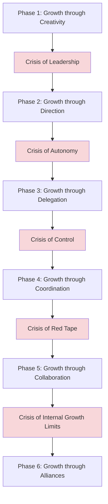
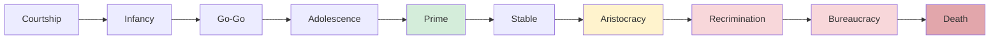

## Organizational Life Cycle

### Overview and Core Premise

Organizational life cycle theory proposes that organizations pass through a predictable sequence of developmental stages over time, each characterized by distinct structural configurations, strategic priorities, leadership requirements, and typical crises. The biological metaphor (birth, growth, maturity, decline) is explicit and intentional across most formulations, though scholars differ considerably on the precise number of stages, their labels, and whether decline/death is an inevitable terminal stage or an avoidable outcome contingent on adaptive organizational response.

**Key theoretical link to earlier chapter items**: Life cycle theory can be understood as a temporal, developmental extension of contingency theory — rather than treating environment, size, and technology as independently varying contingency factors, life cycle models argue these factors evolve together in a broadly predictable pattern as an organization ages and grows, with corresponding predictable shifts in appropriate structural design (formalization, centralization, and structural form all follow characteristic trajectories across stages).

---

### Greiner's Model of Organizational Growth

Larry Greiner's model (1972, later revised) is among the most widely cited life cycle frameworks, distinctively structured around alternating **evolutionary** (calm, incremental growth) and **revolutionary** (crisis-driven, structurally disruptive) periods. Greiner's core insight is that each evolutionary growth phase is enabled by a specific management approach, but that same approach — if not adapted — eventually becomes the source of a crisis (revolution) that must be resolved before the next evolutionary phase can begin.

#### The Five (Originally) Growth Phases and Crises

1. **Growth through Creativity → Crisis of Leadership**: Early-stage organizations grow through founder-driven innovation, informal communication, and entrepreneurial energy. As the organization grows, informal communication and ad hoc decision-making become insufficient for coordinating an expanding workforce, precipitating a **leadership crisis** requiring the introduction of professional management structure.
2. **Growth through Direction → Crisis of Autonomy**: Professional management introduces functional structure, formal communication systems, and centralized decision-making, enabling continued growth. Eventually, lower-level managers and specialists — now possessing more direct operational knowledge than distant senior leadership — chafe under continued centralized control, precipitating a **crisis of autonomy** requiring some degree of delegation.
3. **Growth through Delegation → Crisis of Control**: Decentralization empowers lower-level managers with greater decision authority, enabling faster response and expanded scope. Eventually, senior leadership perceives a loss of coordination and control across increasingly autonomous units pursuing potentially divergent priorities, precipitating a **crisis of control**.
4. **Growth through Coordination → Crisis of Red Tape**: Formal coordination mechanisms (centralized staff functions, formal planning systems, closer scrutiny of decentralized units) are introduced to restore oversight while preserving some decentralized benefits. Over time, these coordination mechanisms themselves become excessive, generating the bureaucratic dysfunctions described under Classical Organizational Design Theories (Merton's trained incapacity, goal displacement), precipitating a **crisis of red tape**.
5. **Growth through Collaboration → Crisis of [Internal Growth / "?"]**: Organizations respond to red-tape crisis through increased interpersonal collaboration, matrix-like team structures, and social control mechanisms (shared culture, peer accountability) rather than purely formal systems. Greiner's original model left the crisis following this phase deliberately unlabeled (later editions and commentators have proposed candidates such as a "crisis of psychological saturation" from intensive collaborative demands, or crises related to the limits of internal organic growth prompting external alliance/network strategies).
6. **(Later addition) Growth through Alliances → Crisis of [Identity]**: In a later revision, Greiner added a sixth phase in which organizations pursue growth through external network structures, mergers, and alliances (directly connecting to the network-structure concepts covered earlier in this chapter) rather than continued internal organic development.

**Key Points**: Greiner's central theoretical claim is that **each solution creates the seeds of the next crisis** — this is not framed as organizational failure but as a structurally inevitable pattern of growth, since the very management approach that enables one phase of growth systematically becomes inadequate (and eventually counterproductive) as organizational scale changes. This directly parallels contingency theory's fit logic, but adds an explicitly *dynamic, path-dependent* dimension: the appropriate structure at any point depends not only on current contingency factors but on the organization's prior developmental trajectory.

**[Inference]** A frequently drawn practical implication is that leadership teams should anticipate the *next* crisis proactively based on current growth-phase dynamics, rather than treating each crisis as a novel, unprecedented organizational failure requiring reactive improvisation — since the pattern of crises, while not perfectly deterministic, has substantial identified regularity across many organizations' growth histories.

---

### Quinn and Cameron's Integrative Model

Robert Quinn and Kim Cameron synthesized multiple earlier life cycle models (including Greiner's) into a four-stage integrative framework, explicitly connecting life cycle stage to the Competing Values Framework culture types covered in the Organizational Culture and Climate chapter:

1. **Entrepreneurial Stage**: Characterized by innovation, creativity, resource acquisition, and minimal formal planning or structure — corresponding closely to an **adhocracy** culture orientation.
2. **Collectivity Stage**: Characterized by informal communication, high member commitment, and a sense of family/community, with structure remaining relatively informal despite growing size — corresponding to a **clan** culture orientation.
3. **Formalization and Control Stage**: Characterized by formalized rules, procedures, conservative/stable structure, and an emphasis on efficiency — corresponding to a **hierarchy** culture orientation.
4. **Elaboration of Structure Stage**: Characterized by structural sophistication (e.g., decentralized divisions, adaptation to complex external environments) and renewed emphasis on adaptability and collaboration to sustain continued growth or avoid decline — often involving deliberate re-introduction of **adhocracy** or **market** elements to counteract the rigidity accumulated during the formalization stage.

**[Inference]** This model's explicit mapping onto the Competing Values Framework quadrants suggests organizational culture is not merely a static organizational attribute but tends to shift systematically across life cycle stages, implying that a culture type well-suited to an organization's current growth stage may become poorly suited as the organization matures — reinforcing the broader contingency principle that "good" culture (like "good" structure) is context- and stage-dependent rather than universally fixed.

---

### Adizes's Corporate Life Cycle Model

Ichak Adizes proposed a more granular life cycle model (originally ten stages, commonly summarized in condensed form) distinguishing **growing** stages from **aging** stages, with particular attention to the changing balance between **flexibility** and **control** across the organization's life:

- **Growing stages** (e.g., Courtship, Infancy, Go-Go, Adolescence): Characterized by increasing structure and control being progressively added to an initially highly flexible, founder-centric organization; Adizes highlights the "Go-Go" stage in particular as prone to overextension and lack of internal control systems commensurate with rapid growth.
- **Prime**: Adizes's model identifies an optimal midpoint — "Prime" — at which an organization achieves balance between flexibility and control, sustaining both innovative capacity and disciplined execution simultaneously (conceptually resonant with Lawrence and Lorsch's differentiation-integration balance).
- **Aging stages** (e.g., Stable, Aristocracy, Recrimination, Bureaucracy, Death): Characterized by progressively excessive control and formalization overtaking flexibility, with symptoms including risk aversion, internal political conflict ("Recrimination"), and eventual rigid bureaucratic ossification if left unaddressed.

**Key distinction from Greiner**: While Greiner's model treats each phase as necessary and generally sequential, Adizes explicitly frames aging as a *avoidable* pathology resulting from insufficient attention to renewing flexibility, rather than an inevitable terminal consequence of organizational maturity — implying deliberate managerial intervention can, in principle, sustain an organization at or near "Prime" indefinitely rather than accepting eventual decline as inevitable. [Inference] The degree to which sustained "Prime" status is empirically achievable over very long organizational timeframes, versus a more idealized target that most organizations approximate only temporarily, is not something the model itself definitively resolves and would require longitudinal empirical validation to assess rigorously.

---

### Structural and Managerial Implications Across Stages

Synthesizing across these models, several broadly consistent patterns emerge regarding how structural dimensions (introduced earlier in this chapter) evolve across organizational life cycle stages:

| Life Cycle Stage | Typical Formalization | Typical Centralization | Typical Structural Form | Primary Leadership Challenge |
| --- | --- | --- | --- | --- |
| Early/Entrepreneurial | Low | High (founder-centric) | Simple/organic | Balancing creative vision with emerging need for structure |
| Growth/Collectivity | Increasing | Moderate | Functional, emerging bureaucracy | Introducing professional management without stifling culture |
| Maturity/Formalization | High | Variable (often shifting toward planned decentralization) | Bureaucratic, possibly divisional or matrix | Managing bureaucratic dysfunction risk (red tape, goal displacement) |
| Elaboration/Renewal | Selectively reduced in targeted areas | Selectively decentralized | Matrix, network, or divisional hybrid | Reintroducing adaptability without sacrificing accumulated coordination capability |
| Decline (if unaddressed) | Excessively high | Often paradoxically both over-centralized for major decisions and under-controlled operationally | Rigid, ossified bureaucracy | Overcoming political resistance to renewal; avoiding terminal ossification |

---

### Critiques of Life Cycle Models

- **Determinism and stage-sequence rigidity**: Critics argue that strict stage-sequence models understate the degree to which organizations can skip stages, regress to earlier configurations, or follow genuinely idiosyncratic developmental paths not well captured by any universal sequence.
- **Limited empirical validation of precise stage boundaries**: [Unverified] While the general qualitative pattern of increasing formalization with organizational age and size is well-supported across structural contingency research broadly, the specific number and precise boundaries of stages proposed by any individual model (five phases, four stages, ten stages) reflect differing theoretical choices rather than a single empirically definitive stage count.
- **Overemphasis on age/size as the primary driver**: Life cycle models can understate the continued relevance of the other contingency factors discussed earlier in this chapter (environmental uncertainty, technology, strategy) as independent drivers of appropriate structure, potentially oversimplifying structural choice as primarily a function of organizational age/size rather than a more genuinely multi-factor contingency assessment.
- **Death/decline as avoidable vs. inevitable**: As noted, models diverge on whether decline represents an inevitable terminal stage (implicit in some formulations) or an avoidable pathology (Adizes's explicit position) — this distinction carries significant practical implications for whether organizational renewal efforts are theoretically well-founded or represent a losing battle against inevitable entropy.

---

### Practical Application: Diagnosing a Growth-Stage Crisis

**Example** scenario: A technology startup that grew rapidly under a highly delegated, autonomous team structure (each product team operating with substantial independent decision authority) now finds that different teams have built incompatible technical architectures, inconsistent customer-facing messaging, and duplicated effort across overlapping initiatives.

Applying Greiner's model diagnostically:

1. **Stage identification**: This pattern is consistent with Greiner's **Crisis of Control** — the organization successfully grew through a delegation phase (empowered, autonomous teams), but senior leadership has lost adequate coordination and consistency across increasingly independent units.
2. **Predicted appropriate response (per Greiner)**: Rather than reverting fully to centralized control (which Greiner's model would predict triggers renewed autonomy-crisis dynamics reminiscent of Phase 2), the model suggests introducing **coordination mechanisms** — centralized architecture standards, shared platform teams, or cross-team planning processes — that preserve substantial team-level autonomy while re-establishing organization-wide consistency, corresponding to Greiner's "Growth through Coordination" phase.
3. **Forward-looking anticipation**: Applying Greiner's core insight, the organization should anticipate that if these coordination mechanisms are successful but over-applied, a subsequent **Crisis of Red Tape** becomes the predictable next challenge, suggesting the coordination mechanisms introduced now should be designed with built-in mechanisms for periodic review and simplification rather than assumed to be a permanent, static solution.

---

**Related Topics**

- Contingency Theory of Organizations
- Classical Organizational Design Theories
- Bureaucratic, Matrix, and Network Structures
- Centralization and Formalization
- Models and Definitions of Organizational Culture (Competing Values Framework Linkage)
- Organizational Decline and Turnaround Management
- Chandler's Strategy-Structure Thesis
- Change Management Models (Kotter, Lewin) in Growth-Stage Transitions