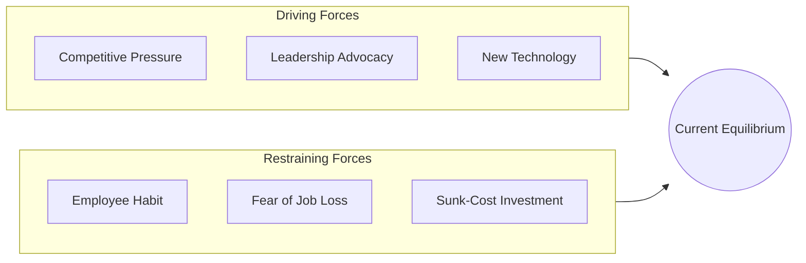
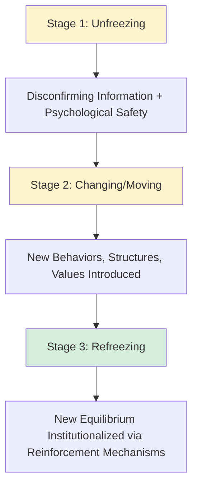
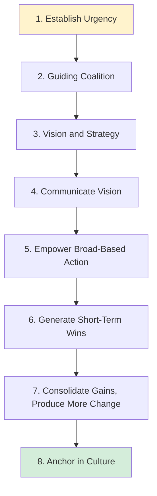
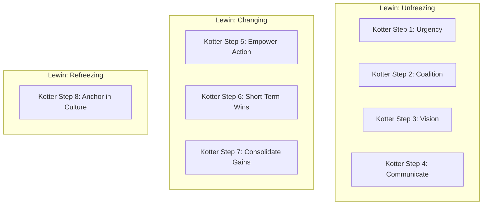

## Planned Change Theories of Lewin and Kotter

### Positioning Within Organizational Development

Planned change theories represent the foundational core of the **Organizational Development (OD)** field, distinguished from emergent or evolutionary views of organizational change by their shared assumption that organizational change can be **deliberately diagnosed, designed, and managed** through identifiable, sequential phases, typically initiated by leadership in response to an identified need or opportunity. Lewin's model, developed in the 1940s from his broader work in social psychology and group dynamics, is the historical origin point for planned change theory; Kotter's model, developed roughly five decades later, represents an extensively elaborated, practitioner-oriented refinement addressing implementation challenges that Lewin's more abstract three-stage model does not itself specify in operational detail.

---

### Kurt Lewin's Three-Stage Model

Lewin's model rests on a foundational metaphor drawn from physics: organizational behavior at any point in time represents a **quasi-stationary equilibrium** — a dynamic balance between opposing "driving forces" (pressures for change) and "restraining forces" (pressures maintaining the status quo), formalized in Lewin's broader **Force Field Analysis** technique.

#### Force Field Analysis

Before or during the change process, Force Field Analysis involves explicitly identifying and, where possible, weighting the forces on both sides of the equilibrium:

- **Driving forces**: Factors pushing toward the desired change (e.g., competitive pressure, new technology availability, leadership advocacy, financial necessity).
- **Restraining forces**: Factors maintaining the current state (e.g., employee habit and skill investment in existing methods, fear of job loss, social/political resistance from those advantaged by the status quo, sunk-cost investment in existing systems).

**Key Points**: Lewin's model implies two theoretically distinct strategies for shifting equilibrium: **increasing driving forces** or **reducing restraining forces**. Lewin's own guidance favored the latter where feasible, on the reasoning that increasing driving forces alone (e.g., through pressure or mandate) tends to generate a corresponding increase in tension and resistance, potentially producing a new equilibrium accompanied by higher overall system stress — whereas reducing restraining forces (addressing the underlying sources of resistance directly) can shift equilibrium with comparatively lower resultant tension.

#### The Three Stages

1. **Unfreezing**: Disrupting the existing equilibrium sufficiently to create genuine readiness and motivation for change. This typically requires generating credible **disconfirming information** — evidence that current methods or assumptions are no longer producing adequate results — combined with enough **psychological safety** for individuals to consider new approaches without triggering purely defensive resistance (a synthesis Edgar Schein later elaborated extensively in his own refinement of Lewin's model, introducing the concept of "survival anxiety" needing to exceed "learning anxiety" for genuine unfreezing to occur).
2. **Changing (Moving)**: The organization transitions toward new behaviors, structures, or values through active intervention — new information, role modeling, restructured processes, training, and other change mechanisms discussed further under structural and culture-change items elsewhere in this syllabus.
3. **Refreezing**: Stabilizing and institutionalizing the new state so that it becomes the organization's new equilibrium, resistant to regression to prior patterns — accomplished through reinforcement mechanisms such as updated formal systems, revised performance criteria, and embedded new social norms.

#### Critiques of Lewin's Model

- **The "refreezing" metaphor implies excessive stability**: The most commonly cited critique, particularly relevant in contemporary fast-changing environments, is that "refreezing" implies organizations should settle into a fixed, stable new equilibrium — a framing increasingly seen as poorly suited to environments (per contingency theory's organic-structure logic) requiring continuous, ongoing adaptation rather than episodic, stage-bound change followed by extended stability. Some contemporary adaptations substitute an ongoing "adapting" or "sustaining momentum" stage in place of a literal refreeze.
- **Level of abstraction**: Lewin's three stages describe a general *logic* of change but do not themselves specify detailed, operational implementation steps — a gap that subsequent models, most notably Kotter's, were explicitly developed to address.
- **[Inference]** Despite these critiques, Lewin's model remains foundational precisely because subsequent, more elaborated models (including Kotter's) are broadly understood as detailed operationalizations of the same underlying unfreeze-change-refreeze logic rather than fundamentally different theoretical alternatives.

---

### John Kotter's Eight-Step Model of Leading Change

Kotter's model, developed from his study of numerous corporate change initiatives (published initially as a 1995 *Harvard Business Review* article and later expanded into the book *Leading Change*), was explicitly motivated by an empirical observation: a large proportion of corporate change initiatives fail or fall short of objectives, and Kotter attributed much of this failure to skipping or inadequately executing specific early-stage steps in pursuit of speed.

#### The Eight Steps

1. **Establish a sense of urgency**: Build a compelling case, grounded in credible evidence (market data, competitive analysis, financial performance), that meaningful change is necessary — directly corresponding to Lewin's unfreezing stage and its emphasis on disconfirming information.
2. **Create a guiding coalition**: Assemble a sufficiently powerful group of change sponsors (spanning positional authority, expertise, credibility, and leadership capability) to lead the change effort, since Kotter's research indicated that change led by a single individual (even a powerful CEO) without broader coalition support was systematically more prone to failure.
3. **Develop a vision and strategy**: Articulate a clear, coherent picture of the desired future state and a general strategic approach for achieving it, providing direction and a basis for coordinating the many specific actions the change will require.
4. **Communicate the change vision**: Disseminate the vision extensively and consistently, through multiple channels and repeated reinforcement — Kotter specifically emphasized that vision communication typically requires far greater volume and repetition than change leaders intuitively expect, and that leadership behavior itself (walking the talk) is a critical communication channel, echoing Schein's emphasis on leader behavior as a primary culture-embedding mechanism.
5. **Empower broad-based action (Remove obstacles)**: Identify and remove structural, procedural, or systemic obstacles that undermine the vision (e.g., outdated performance systems, organizational structures, or supervisors actively resisting the change), and encourage risk-taking and non-traditional ideas consistent with the new vision.
6. **Generate short-term wins**: Deliberately plan and create visible, unambiguous performance improvements relatively early in the change process, since credible short-term wins provide evidence the change effort is working, build momentum, reward change agents, and help neutralize skeptics — directly addressing a key practical gap in Lewin's more abstract model.
7. **Consolidate gains and produce more change**: Use the credibility generated by short-term wins to tackle more difficult, systemic change elements (including structures, systems, and policies that don't fit the vision), avoiding premature declaration of victory — a specific failure mode Kotter identified as common in unsuccessful change efforts.
8. **Anchor new approaches in the culture**: Explicitly connect new behaviors and approaches to organizational success and articulate these connections, and ensure leadership development and succession planning embed the new approaches in future leadership generations — corresponding to Lewin's refreezing stage, but framed by Kotter as the *culmination* of successful behavioral and structural change rather than something to be pursued as an early or standalone step.

#### Kotter's Identified Common Failure Modes

A significant portion of Kotter's original contribution was diagnostic — cataloging specific errors he observed across failed change initiatives, each roughly corresponding to inadequate execution of one of the eight steps:

- **Allowing too much complacency** (inadequate Step 1): Failing to establish sufficient urgency before launching change activities.
- **Failing to create a sufficiently powerful guiding coalition** (inadequate Step 2): Underestimating the difficulty of change and relying on insufficient sponsorship.
- **Underestimating the power of vision** (inadequate Step 3): Proceeding with a collection of confusing, incompatible initiatives rather than one coherent vision-driven direction.
- **Undercommunicating the vision** (inadequate Step 4): Communicating vision through only a fraction of the channels and repetition actually required for genuine organization-wide understanding and buy-in.
- **Permitting obstacles to block the new vision** (inadequate Step 5): Allowing structural or personnel obstacles to persist unaddressed, undermining organizational confidence in the vision's genuine priority.
- **Failing to create short-term wins** (inadequate Step 6): Relying purely on long-term vision without generating the credibility-building evidence short-term wins provide.
- **Declaring victory too soon** (inadequate Step 7): Prematurely easing pressure and effort after initial visible progress, allowing regression before the change is genuinely consolidated.
- **Neglecting to anchor changes firmly in corporate culture** (inadequate Step 8): Failing to institutionalize new approaches, permitting reversion to prior norms once the original change-leadership team's active attention shifts elsewhere.

---

### Comparative Analysis: Lewin vs. Kotter

| Dimension | Lewin's Model | Kotter's Model |
| --- | --- | --- |
| Number of stages | 3 (Unfreeze, Change, Refreeze) | 8 (detailed sequential steps) |
| Level of abstraction | High (general logic of change) | Lower (specific, operational actions) |
| Theoretical origin | Social psychology, group dynamics, force field physics metaphor | Empirical observation of corporate change initiative failures |
| Primary diagnostic contribution | Force Field Analysis (driving vs. restraining forces) | Cataloged specific failure modes at each step |
| Treatment of final stage | "Refreezing" implies achieving new stable equilibrium | "Anchoring in culture" as culmination, less emphasis on permanent stability |
| Best characterized as | Foundational theoretical framework | Practitioner-oriented operational elaboration of the same underlying logic |

**[Inference]** Kotter's eight steps can be reasonably mapped onto Lewin's three stages (Steps 1–4 corresponding broadly to Unfreezing, Steps 5–7 corresponding to Changing, and Step 8 corresponding to Refreezing/Anchoring), suggesting the two models are best understood as operating at different levels of abstraction addressing the same underlying change logic, rather than representing fundamentally competing theoretical positions.

---

### Shared Critiques of Both Models

- **Linear, sequential assumption**: Both models present change as a broadly linear sequence of phases; critics (particularly from complexity theory and emergent-change perspectives) argue actual organizational change is often more iterative, non-linear, and characterized by simultaneous, overlapping activity across stages rather than clean sequential progression.
- **Top-down, leader-driven orientation**: Both models are structured primarily around deliberate, leadership-initiated change; they offer comparatively limited theoretical accommodation for emergent, bottom-up, or unplanned organizational change processes that arise from decentralized adaptation rather than centralized design.
- **Limited attention to power and politics**: [Inference] Both models are sometimes critiqued (from a more critical/political organizational perspective) for underemphasizing the role of genuine political conflict, competing interest groups, and power redistribution in shaping change outcomes, treating resistance primarily as a psychological or communication problem to be managed rather than potentially a rational response to genuine differences in interest between groups affected differently by the proposed change.
- **[Unverified] Success rate claims**: Kotter's frequently cited claim that a large majority of change initiatives fail is widely repeated in practitioner literature; the precise, rigorously validated empirical basis for specific failure-rate percentages circulating in popular management discourse should be treated with some caution, as these figures have been difficult to independently verify through systematic empirical replication across the broader change management research literature.

---

### Practical Application: Applying Both Models to a Digital Transformation Initiative

**Example** scenario: A traditional retail company is implementing an organization-wide digital transformation, shifting from in-store-only sales toward an integrated e-commerce and data-analytics-driven operating model.

**Next Steps** integrating both frameworks:

1. **Force Field Analysis (Lewin)**: Explicitly map driving forces (declining foot traffic, competitor e-commerce success, executive sponsorship) against restraining forces (store staff skill gaps, fear of job displacement from automation, sunk investment in existing store-based systems and processes).
2. **Establish urgency with disconfirming data (Kotter Step 1 / Lewin's Unfreezing)**: Present concrete market-share and foot-traffic decline data to store managers and staff, ensuring the case for change is grounded in credible evidence rather than asserted by fiat.
3. **Build a guiding coalition spanning both digital and traditional retail leadership (Kotter Step 2)**: Include respected store-operations leaders alongside digital/e-commerce specialists to ensure the coalition has credibility across both the legacy and emerging parts of the business, addressing the political-resistance risk noted in the shared critiques above.
4. **Generate an early, visible short-term win (Kotter Step 6)**: Pilot the new integrated online-offline fulfillment model in a small number of stores, generating concrete, visible performance data before full organization-wide rollout — directly filling the operational gap Lewin's more abstract "Changing" stage does not itself specify.
5. **Anchor and refreeze through revised incentive and promotion criteria (Kotter Step 8 / Lewin's Refreezing)**: Update performance evaluation and promotion criteria for store management to explicitly reward integrated digital-physical retail performance rather than legacy in-store-only metrics, ensuring the new equilibrium is reinforced by the same primary embedding mechanisms (rewards, promotion criteria) discussed under organizational culture change.

---

**Related Topics**

- Force Field Analysis Applications in Organizational Diagnosis
- Schein's Model of Culture Change and Learning Anxiety
- Subcultures and Culture Change
- Resistance to Change: Sources and Management Strategies
- ADKAR and Other Contemporary Change Management Models
- Organizational Life Cycle and Structural Evolution
- Complexity Theory and Emergent Organizational Change
- Change Leadership vs. Change Management: Conceptual Distinctions