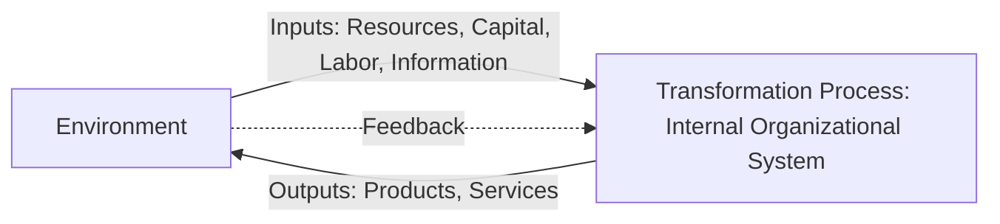
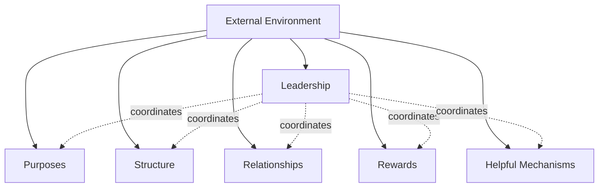
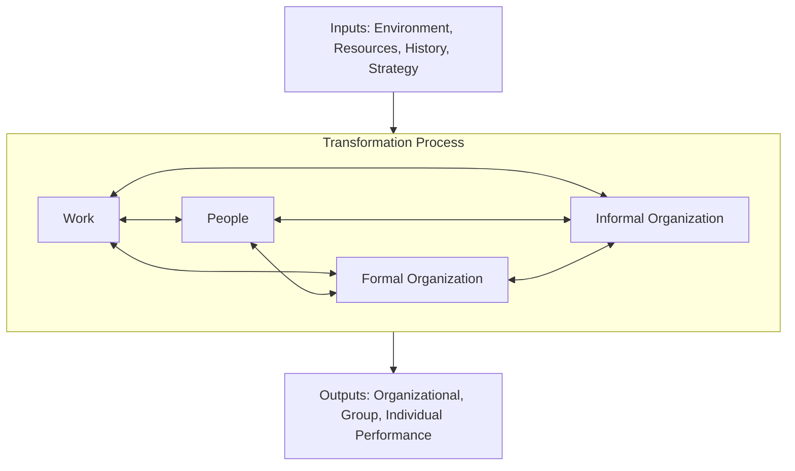
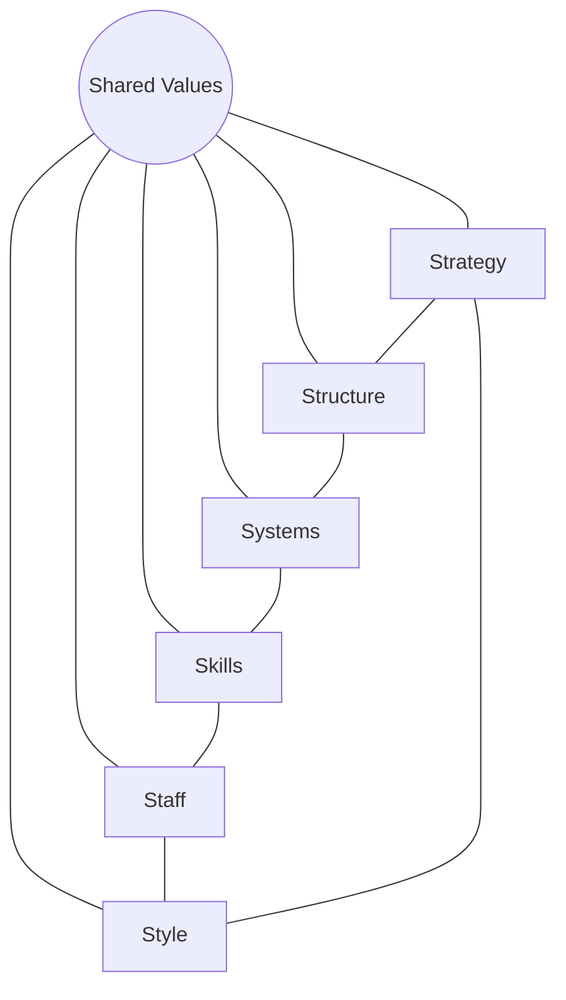
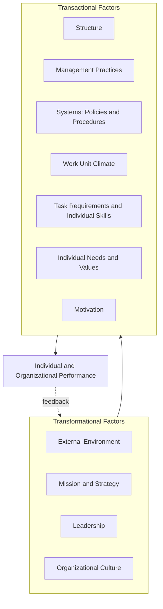

## Organizational Diagnosis Models

### Purpose and Role Within Organizational Development

Organizational diagnosis refers to the systematic process of collecting and analyzing data about an organization's current functioning in order to identify problems, gaps, and opportunities for improvement, typically as the foundational first phase of a broader planned change effort (preceding the intervention-design and implementation phases addressed by models such as Lewin's and Kotter's, covered in the prior chapter item). Diagnosis models provide structured frameworks — typically depicting the organization as a system of interrelated components — that guide practitioners in deciding *what* to examine and *how* those components relate to one another, rather than approaching data collection in an unstructured, ad hoc manner.

**Key distinction from culture/climate assessment**: While culture and climate assessment (covered in the prior chapter) focus specifically on shared values, assumptions, and perceptions, organizational diagnosis models are typically broader in scope, encompassing structural, strategic, technological, and behavioral variables simultaneously — culture/climate assessment can be understood as one specialized component that a comprehensive organizational diagnosis model might incorporate.

---

### Open-Systems Theory as the Common Theoretical Foundation

Most influential organizational diagnosis models share an underlying **open-systems theory** foundation (contrasting with the closed-system assumptions implicit in classical organizational design theory, covered in the prior chapter): organizations are conceptualized as systems that import inputs from their environment (resources, capital, labor, information), transform those inputs through internal processes, and export outputs (products, services) back into the environment, with the environment in turn providing feedback that influences subsequent inputs.

This open-systems framing carries an important diagnostic implication: because organizational components are theorized to be interdependent, a change or dysfunction in one component (e.g., strategy) is expected to produce ripple effects across other components (e.g., structure, culture, individual behavior) — diagnosis models are accordingly designed to examine multiple components *and their alignment with one another*, rather than any single component in isolation.

---

### Weisbord's Six-Box Model

Marvin Weisbord's Six-Box Model (1976) is among the most widely taught diagnosis frameworks, valued particularly for its practical simplicity and intuitive visual format. The model organizes diagnostic inquiry around six interrelated organizational components, each paired with a guiding diagnostic question:

1. **Purposes**: What business are we in? Is there clarity and consensus around organizational goals and mission?
2. **Structure**: How is work divided? Does the formal structure fit the purposes the organization is trying to achieve?
3. **Relationships**: How do people and units relate to one another? What is the quality of interdependence, conflict-management capacity, and coordination across individuals, departments, and technology?
4. **Rewards**: Do formal and informal incentive systems encourage behaviors consistent with organizational purposes, or do they inadvertently reward behaviors that undermine them (a direct connection to the goal-displacement concept covered under classical organization theory)?
5. **Leadership**: Does leadership define purposes, embody desired values through role modeling, and manage the balance among the other boxes?
6. **Helpful Mechanisms**: Do coordinating technologies, systems, and processes (budgeting, planning, information systems, control mechanisms) support or hinder the achievement of organizational purposes?

Weisbord additionally emphasized the surrounding **environment** as a contextual factor influencing all six boxes, consistent with the open-systems framing.

**Key Points**: Weisbord's model is explicitly designed for rapid, practical diagnostic use (often in a single facilitated workshop setting) rather than extensive formal data collection, making it particularly suited to preliminary diagnosis or smaller-scale organizational units, though this same simplicity is sometimes cited as a limitation relative to more comprehensive models when a rigorous, data-intensive diagnostic effort is warranted.

---

### Nadler-Tushman Congruence Model

The Nadler-Tushman Congruence Model, developed by David Nadler and Michael Tushman, places particular theoretical emphasis on the **degree of fit (congruence) between organizational components**, arguing that organizational effectiveness depends less on the absolute quality of any single component and more on how well components fit together.

#### Core Components

- **Inputs**: Environment, resources, history, and strategy — the starting conditions and constraints within which the organization operates.
- **Transformation processes**, further decomposed into four interacting subcomponents:
  - **Work**: The actual tasks being performed, including their inherent characteristics and demands.
  - **People**: The individuals performing the work, including their skills, knowledge, needs, and preferences.
  - **Formal organizational arrangements**: Structures, systems, and processes formally designed to organize and control work.
  - **Informal organization**: Emergent patterns including culture, power dynamics, and informal communication networks not captured by formal design.
- **Outputs**: Organizational, group, and individual-level performance outcomes.

#### The Congruence Diagnostic Logic

The model's central diagnostic proposition is that each pairwise relationship among the four transformation subcomponents (Work-People, Work-Formal Organization, Work-Informal Organization, People-Formal Organization, People-Informal Organization, Formal-Informal Organization) can be assessed for degree of fit, and **low congruence between any pair is theorized to produce dysfunction and reduced performance**, even if each individual component is well-designed in isolation.

**Example** of a congruence-based diagnosis: An organization may have a well-designed formal reward system (Formal Organization) and highly capable, motivated employees (People) — yet if the actual work (Work) requires extensive spontaneous cross-functional collaboration that the formal reward system does not recognize or incentivize, the resulting **Work-Formal Organization incongruence** would be diagnosed as a likely source of coordination failure, independent of any deficiency in the reward system's internal design quality or the employees' individual capability.

**Key Points**: The Nadler-Tushman model's distinctive contribution relative to Weisbord's simpler framework is this explicit focus on *pairwise fit* as the primary diagnostic unit of analysis, rather than treating each component's individual quality as the primary diagnostic concern — directly paralleling the "internal fit" logic emphasized in High-Performance Work Systems (covered in the prior chapter) and the broader contingency-theoretic emphasis on fit over any universally "correct" component design.

---

### McKinsey 7-S Framework

Developed by Robert Waterman, Tom Peters, and Julien Phillips (associated with McKinsey & Company), the 7-S Framework organizes diagnostic inquiry around seven interdependent elements, categorized into "hard" (more tangible, easily documented) and "soft" (less tangible, harder to formally specify) elements:

**Hard elements**:

- **Strategy**: The organization's plan for achieving competitive advantage and sustained success.
- **Structure**: The formal organizational chart and division of responsibilities.
- **Systems**: The formal processes and procedures used to run the organization (e.g., IT systems, budgeting processes, performance management systems).

**Soft elements**:

- **Shared Values**: Core organizational values, positioned at the center of the model as the element theorized to influence and be influenced by all other elements — conceptually overlapping substantially with the culture constructs covered in the prior chapter.
- **Skills**: The organization's core competencies and capabilities.
- **Staff**: The organization's people, including their general capabilities and demographic composition.
- **Style**: The leadership and management style characterizing how the organization actually operates (as distinct from formally documented systems).

**Key Points**: The 7-S Framework's central diagnostic argument is that effective organizational change requires attention to *all seven elements simultaneously and their mutual alignment*, explicitly critiquing change efforts that focus disproportionately on "hard" elements (restructuring, new systems) while neglecting "soft" elements (culture, staff capability, leadership style) — a critique conceptually parallel to Schein's argument (covered in the prior chapter) that culture change efforts focused solely on visible artifacts, without addressing deeper values and assumptions, tend toward superficial or unsustainable change.

---

### Burke-Litwin Causal Model of Organizational Performance and Change

The Burke-Litwin Model, developed by W. Warner Burke and George Litwin, is distinguished from the models above by its explicit attempt to specify **causal relationships and hierarchy among variables**, rather than presenting components as a non-hierarchical, mutually interdependent set. The model organizes twelve organizational dimensions into a layered causal structure, with a particularly influential distinction between **transformational** and **transactional** factors:

- **Transformational factors** (positioned at the top of the causal hierarchy, associated with fundamental, discontinuous change): External environment, mission and strategy, leadership, and organizational culture.
- **Transactional factors** (positioned lower in the causal hierarchy, associated with more incremental, day-to-day organizational functioning): Structure, management practices, systems (policies and procedures), work unit climate, task requirements and individual skills/abilities, individual needs and values, motivation, and individual and organizational performance.

**Key diagnostic implication**: The model's causal-hierarchy structure implies that changes originating at the transformational level (e.g., a shift in environment, mission, or leadership) are theorized to cascade downward and influence transactional-level variables, while changes confined purely to the transactional level (e.g., a new management practice) are less likely to produce fundamental organizational transformation absent corresponding transformational-level change — directly informing diagnostic judgments about whether an identified organizational problem requires deep, transformational-level intervention or can be adequately addressed through more incremental, transactional-level adjustment.

**[Inference]** The Burke-Litwin model's transformational/transactional distinction is frequently cited as a useful diagnostic heuristic for prioritizing intervention level — practitioners can use it to assess whether observed organizational problems are symptomatic of deeper transformational misalignment (requiring leadership, strategy, or culture-level intervention) versus more surface-level transactional issues addressable through targeted management-practice or systems adjustments, though the model's precise causal-sequencing claims are more difficult to rigorously test empirically than its simpler descriptive categorization of variables.

---

### Comparative Summary of Diagnosis Models

| Model | Primary Theoretical Emphasis | Number of Core Components | Best Suited For |
| --- | --- | --- | --- |
| Weisbord Six-Box | Practical simplicity, rapid diagnosis | 6 (plus environment) | Quick, workshop-based preliminary diagnosis |
| Nadler-Tushman Congruence | Pairwise fit between components | 4 transformation subcomponents (plus inputs/outputs) | Detailed diagnosis of specific misalignment sources |
| McKinsey 7-S | Simultaneous hard/soft element alignment | 7 (hard and soft) | Comprehensive strategic change diagnosis |
| Burke-Litwin | Causal hierarchy (transformational vs. transactional) | 12 | Prioritizing intervention level (deep vs. incremental) |

---

### Practical Application: Selecting and Applying a Diagnosis Model

**Example** scenario: A mid-sized professional services firm is experiencing declining client satisfaction scores and rising employee turnover, but leadership is uncertain whether the root cause lies in compensation structure, leadership behavior, workload, or broader strategic drift.

**Next Steps** for structuring the diagnostic effort:

1. **Initial rapid diagnosis (Weisbord)**: Conduct a facilitated leadership workshop using the Six-Box questions to generate an initial, broad-based hypothesis about where the most significant gaps appear to lie (e.g., initial discussion suggests Rewards and Relationships as areas of particular concern).
2. **Deeper congruence analysis (Nadler-Tushman)**: If the Rewards/Relationships hypothesis is confirmed as a priority area, apply the Congruence Model specifically to assess Work-Formal Organization fit — for instance, examining whether the actual work (increasingly collaborative, cross-team client engagements) is congruent with a formal reward system still structured around individual billable-hour targets, a plausible specific source of the identified relational and motivational strain.
3. **Causal-level prioritization (Burke-Litwin)**: Before finalizing an intervention, assess whether the identified reward-system misalignment is itself a symptom of a deeper transformational-level issue (e.g., a strategic shift toward more collaborative service delivery that has not been matched by corresponding leadership communication or culture-level reinforcement) — if so, the diagnostic conclusion would favor a broader transformational intervention (revisiting strategy communication and leadership modeling) rather than a narrower transactional fix (adjusting the compensation formula alone), consistent with the model's causal-hierarchy logic.

---

**Related Topics**

- Culture Assessment and Measurement
- Planned Change Theories of Lewin and Kotter
- Contingency Theory of Organizations
- High-Performance Work Systems (Internal Fit Logic)
- Action Research Model in Organizational Development
- Appreciative Inquiry as an Alternative Diagnostic Philosophy
- Organizational Climate Research
- Systems Thinking in Organizational Analysis