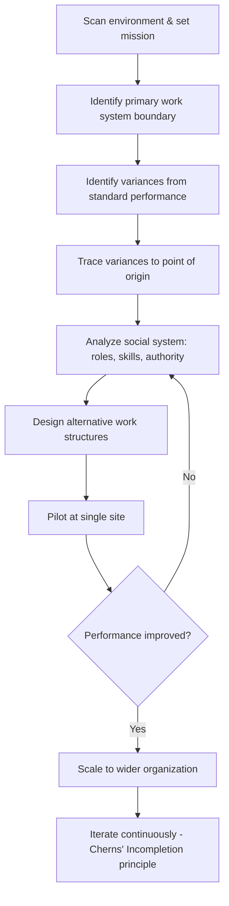

## Sociotechnical Systems Theory

### Definition and Core Premise

Sociotechnical Systems (STS) Theory holds that organizational effectiveness emerges from the joint optimization of two interdependent subsystems: the **social subsystem** (people, relationships, skills, needs, and roles) and the **technical subsystem** (tools, tasks, processes, and technology used to transform inputs into outputs). Neither subsystem can be optimized in isolation without degrading overall system performance; designing one without regard for the other produces suboptimal outcomes even if that subsystem, viewed alone, is efficient.

The theory emerged from research by Eric Trist and Ken Bamforth at the Tavistock Institute in the late 1940s and early 1950s, studying coal mining in the UK. Their observations of the "longwall method" of coal-getting, and its replacement by smaller autonomous work groups, became the founding case for the field.

### Historical Origins: The Tavistock Coal Mining Studies

**Key Points**

- Trist and Bamforth studied British coal mines transitioning from traditional "hand-got" mining (small, self-selected teams performing complete tasks) to the mechanized "longwall method."
- The longwall method introduced mechanized coal-cutting equipment and reorganized labor into large shifts of specialized, single-task workers (fillers, cutters, and stone workers) operating in a rigid sequence.
- Despite superior technology, longwall mining often produced *worse* outcomes: higher absenteeism, lower morale, more accidents, and inter-shift conflict, because the new technical system destroyed the small-group cohesion, task variety, and autonomy that had sustained productivity and psychological wellbeing under the old system.
- A subsequent variant — the "composite longwall method" — reintroduced multi-skilled, self-regulating teams who rotated tasks and shared responsibility for a complete cycle of work, while retaining the mechanized technology. This composite approach outperformed the pure longwall method on both productivity and social measures.
- The conclusion Trist and Bamforth drew: technology dictates constraints and possibilities, but the same technology can be configured with different social arrangements, and outcomes depend on how well the two are jointly designed.

**[Inference]** Some later summaries of the Tavistock studies condense multi-year, multi-site findings into a single clean before/after narrative; the original field studies involved more variation across pits and time periods than is usually presented in textbook form.

### The Two Subsystems in Detail

**Technical Subsystem**

- Machinery, equipment, and physical layout
- Task design, workflow sequencing, and process technology
- Territory: the "hard" constraints of what a process physically requires

**Social Subsystem**

- Individual attitudes, skills, and psychological needs
- Interpersonal relationships and group norms
- Authority structures, reward systems, and communication patterns

**Joint Optimization**

Joint optimization does not mean splitting resources evenly between the two subsystems. It means designing so that the technical configuration supports the social conditions (autonomy, meaningful task variety, feedback, and social support) known to sustain motivation and performance, and vice versa. A system optimized purely on technical efficiency criteria (e.g., minimizing machine idle time) can suppress social conditions needed for quality and adaptability; a system optimized purely on social criteria (e.g., maximum worker autonomy) can be technically infeasible or economically unviable.

### The Six Psychological Job-Content Requirements (Emery & Trist)

Fred Emery and Eric Trist, building on the Tavistock work, proposed that job and work-system design should satisfy these psychological requirements for workers to remain engaged and healthy:

1. **Adequate elbow room for decision-making** — some latitude for autonomy, distinct from total control or total constraint
2. **Opportunity to learn on the job and go on learning** — tasks with feedback that allow skill development, not repetitive tasks with no learning curve
3. **An optimal level of variety** — enough variation to avoid monotony without inducing fatigue or overload
4. **Mutual support and respect from co-workers** — social recognition within the work group
5. **Meaningfulness of work** — a sense that the task connects to a socially useful product or outcome, and that the worker understands their contribution to the whole
6. **A desirable future** — some prospect of career development or skill-based advancement, not a dead-end role

**[Inference]** These six criteria are widely cited as a checklist in job-design and work-redesign literature, but their empirical support varies in strength by criterion; autonomy and skill variety have the most consistent support in subsequent job-design research (e.g., Hackman and Oldham's Job Characteristics Model), while "a desirable future" is less frequently operationalized or tested directly.

### Semi-Autonomous Work Groups (Self-Managing Teams)

STS theory's most direct organizational-design output is the **semi-autonomous work group** (also called self-managing or self-regulating teams), characterized by:

- A group, rather than an individual, holding responsibility for a complete, identifiable piece of work (a "whole task")
- Internal allocation of tasks, rotation of roles, and scheduling decisions made by the group rather than external supervisors
- Group-level feedback on performance (output, quality, safety) rather than only individual-level feedback
- Reduced layers of external supervision, with the group absorbing many first-line supervisory functions
- Multi-skilling: members trained across several tasks in the group's task boundary, enabling coverage, rotation, and reduced monotony

This design directly operationalizes the composite longwall findings: technology sets task boundaries, but the social system determines how labor within those boundaries is organized.

### The STS Design Process (Joint Design Methodology)

A generalized STS redesign process, synthesized from classic STS practice (Cherns, Trist, Emery, and later socio-technical design guidelines):

1. **Scan the environment and set organizational mission/boundaries** — identify what the organization must do to survive in its task environment (customers, regulators, competitors)
2. **Identify the unit of analysis** — the "primary work system," typically a set of activities that transforms a definable input into a definable output
3. **Identify variances** — deviations from standard/expected performance (quality defects, delays, errors) that arise in the transformation process; this is a hallmark STS technique, distinct from generic process mapping
4. **Trace variances to their key points of origin** — identify where in the process the variance is created versus where it is discovered, since these are often organizationally distant
5. **Analyze the social system** — map roles, communication patterns, skills, and authority relative to the variances identified
6. **Design alternative work structures** — propose groupings of tasks (e.g., semi-autonomous teams) that give control of key variances to the people closest to them
7. **Implement, pilot, and iterate** — STS design was historically piloted at a single site before wider rollout, given the disruption redesign causes

### Cherns' Principles of Sociotechnical Design

Albert Cherns (1976, revised 1987) codified STS design guidance into a set of principles frequently cited in the field:

- **Compatibility** — the design process itself should be consistent with its objectives (e.g., a participative design process is used to design a participative workplace)
- **Minimal critical specification** — specify no more than what is essential to achieve the objective, leaving room for local adaptation and discretion
- **Variance control** — variances should be controlled as close to their point of origin as possible
- **The multifunctional principle** — build redundancy of function (workers holding multiple skills) rather than redundancy of parts (extra staff performing narrow, single functions), to increase system flexibility
- **Boundary location** — boundaries between organizational units should be drawn to support the flow of information and material, not merely along traditional departmental lines
- **Information flow** — information systems should route information to the point where action/decisions are taken, not solely upward through hierarchy
- **Support congruence** — social-support systems (pay, appraisal, recognition) should reinforce the desired social behaviors, not contradict them
- **Design and human values** — jobs should be designed to meet the psychological requirements described above (elbow room, variety, learning, meaning)
- **Incompletion** — design is an iterative, ongoing process, not a one-time event; systems require continuous re-adjustment as conditions change

### Relationship to Other Organizational Development Frameworks

**Key Points**

- STS Theory predates and informs much of the **Job Characteristics Model** (Hackman & Oldham, 1975/1980), which formalized psychological job requirements into measurable dimensions (skill variety, task identity, task significance, autonomy, feedback) and linked them to a Motivating Potential Score.
- STS is a foundational input to **High-Performance Work Systems (HPWS)** literature, which bundles autonomous teams, extensive training, and information-sharing as complementary HR practices.
- STS overlaps with **Open Systems Theory** (organizations as open systems exchanging inputs/outputs with an environment), since Emery and Trist's later work on "socio-ecological systems" extended STS thinking to organization-environment relations.
- STS differs from purely **Scientific Management (Taylorism)** by explicitly rejecting the assumption that maximum task fragmentation and specialization yields maximum efficiency; STS treats over-fragmentation as a design pathology that produces the psychological and social costs observed in the longwall case.
- STS is a direct ancestor of contemporary **Agile team structures** and **self-organizing squads** in software organizations, which similarly emphasize whole-task ownership, cross-functional skill sets, and localized decision authority — though these are rarely described using STS terminology in practice.

### Diagram: Joint Optimization Model

<svg xmlns="http://www.w3.org/2000/svg" viewBox="0 0 700 420">
<text x="350" y="30" text-anchor="middle" font-size="18" font-weight="bold" fill="#1a1a1a">Sociotechnical Systems: Joint Optimization (svg_diagram)</text>
<circle cx="230" cy="220" r="150" fill="#dbeafe" stroke="#2563eb" stroke-width="2" opacity="0.7" />
<text x="150" y="140" font-size="16" font-weight="bold" fill="#1e3a8a">Technical Subsystem</text>
<text x="120" y="165" font-size="13" fill="#1e3a8a">Machinery / Equipment</text>
<text x="120" y="185" font-size="13" fill="#1e3a8a">Task Sequencing</text>
<text x="120" y="205" font-size="13" fill="#1e3a8a">Process Technology</text>
<text x="120" y="225" font-size="13" fill="#1e3a8a">Physical Layout</text>
<circle cx="470" cy="220" r="150" fill="#fce7f3" stroke="#db2777" stroke-width="2" opacity="0.7" />
<text x="500" y="140" font-size="16" font-weight="bold" fill="#831843">Social Subsystem</text>
<text x="500" y="165" font-size="13" fill="#831843">Roles / Relationships</text>
<text x="500" y="185" font-size="13" fill="#831843">Skills / Attitudes</text>
<text x="500" y="205" font-size="13" fill="#831843">Authority Structures</text>
<text x="500" y="225" font-size="13" fill="#831843">Psychological Needs</text>
<ellipse cx="350" cy="220" rx="90" ry="90" fill="#fef3c7" stroke="#d97706" stroke-width="2.5" />
<text x="350" y="210" text-anchor="middle" font-size="14" font-weight="bold" fill="#78350f">Joint</text>
<text x="350" y="228" text-anchor="middle" font-size="14" font-weight="bold" fill="#78350f">Optimization</text>
<text x="350" y="246" text-anchor="middle" font-size="11" fill="#78350f">Organizational</text>
<text x="350" y="260" text-anchor="middle" font-size="11" fill="#78350f">Effectiveness</text>
<line x1="230" y1="380" x2="230" y2="400" stroke="#374151" stroke-width="1" />
<text x="230" y="415" text-anchor="middle" font-size="12" fill="#374151">Optimizing alone → inefficiency</text>
<line x1="470" y1="380" x2="470" y2="400" stroke="#374151" stroke-width="1" />
<text x="470" y="415" text-anchor="middle" font-size="12" fill="#374151">Optimizing alone → attrition/burnout</text>
</svg>

### Diagram: STS Redesign Process Flow

### Worked Example: Applying STS to a Modern Contact Center

**Example**

A traditional contact center assigns each agent a narrow function (e.g., only billing inquiries), routes calls through an automatic distributor with no agent input, and measures agents solely on Average Handle Time (AHT).

Applying STS principles:

- **Variance identification**: Escalations and repeat calls are the key variance; tracing them shows most originate from billing/technical handoffs, not from any single agent's error.
- **Minimal critical specification**: Instead of scripting every interaction step, agents are given the outcome required (resolved query) and discretion on how to get there.
- **Multifunctional principle**: Agents are cross-trained on billing, technical support, and account management so a single agent can resolve multi-part queries without transfer, reducing the traced variance.
- **Semi-autonomous group design**: Agents are organized into small "pods" (8–12 people) with shared quality and resolution-rate metrics rather than only individual AHT, and pods self-schedule shift coverage within constraints.
- **Support congruence**: Compensation and recognition are adjusted to reward first-call resolution and peer support behaviors rather than purely speed metrics, aligning the reward system with the redesigned social structure.

**[Inference]** This scenario is a synthesized illustrative application of STS principles rather than a documented case study; actual contact-center outcomes from such redesigns would depend heavily on implementation quality and industry context.

### Critiques and Limitations

- **Scale and complexity**: STS design methodology was developed primarily in manufacturing and extraction industries with clearly bounded, physical transformation processes; applying variance analysis to knowledge work or highly abstract service processes is less straightforward. **[Unverified]** The extent to which classical STS variance-tracing techniques transfer cleanly to modern digital/knowledge work is not well established in the literature and is often adapted informally rather than through validated methods.
- **Implementation cost and disruption**: Redesigning work structures around semi-autonomous teams often requires retraining, changed pay structures, and renegotiated supervisory roles, creating short-term costs and resistance.
- **Cultural and institutional context**: Some case literature suggests STS-based self-managing teams show mixed results outside contexts with strong labor-management cooperation or supportive union relationships; results are not uniformly positive across all deployments.
- **Overlap and terminological drift**: Modern management practice (Agile, lean, high-involvement work systems) frequently reinvents STS concepts without attribution, making the theory's distinct identity harder to trace in contemporary organizational design language.

### Key Points (Summary)

- STS Theory: organizational performance depends on jointly optimizing social and technical subsystems, not optimizing either alone.
- Originated from Trist and Bamforth's Tavistock coal-mining studies; the composite longwall method demonstrated that self-regulating, multi-skilled teams outperformed rigid, task-fragmented arrangements even with identical mechanized technology.
- Emery and Trist's six psychological job-content requirements (autonomy, learning, variety, mutual support, meaningfulness, desirable future) define what "good" work design should preserve.
- Semi-autonomous work groups are the primary structural output of STS design.
- Cherns' principles (minimal critical specification, variance control, multifunctionalism, boundary location, support congruence, incompletion) operationalize STS into design guidance.
- STS is foundational to later frameworks: Job Characteristics Model, High-Performance Work Systems, and modern self-organizing team structures.

**Related Topics**

- Job Characteristics Model (Hackman & Oldham)
- High-Performance Work Systems (HPWS)
- Autonomous and Self-Managing Work Teams
- Open Systems Theory in Organizations
- Lewin's Change Management Model (Unfreeze-Change-Refreeze)
- Action Research in Organizational Development
- Total Quality Management and Variance Control
- Tavistock Institute of Human Relations
- Job Design and Job Enrichment (Herzberg's Two-Factor Theory)
- Employee Involvement and High-Involvement Management