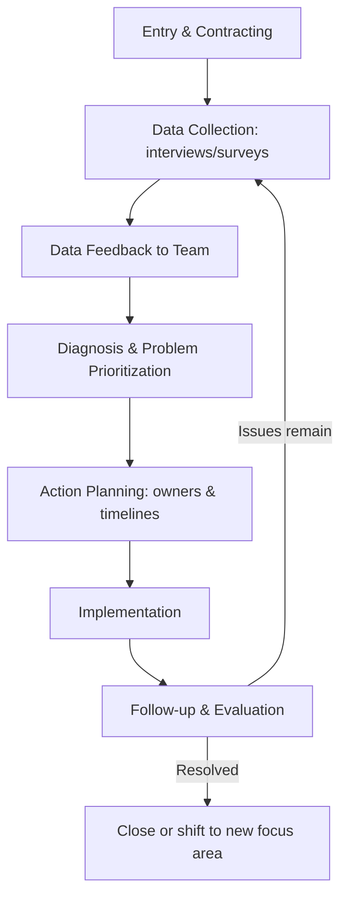

## Team-Building Interventions

### Definition and Scope

Team-building interventions are a class of planned Organizational Development (OD) activities designed to improve how an intact work group functions — its task processes, interpersonal relationships, and collective performance capacity. They are one of the oldest and most widely used OD intervention families, originating from laboratory (T-group) training in the 1940s–1950s and formalized into structured group-level techniques through the 1960s–1970s work of Richard Beckhard, Edgar Schein, and William Dyer.

Team building is distinguished from general "team activities" or morale events by its **diagnostic, data-based, and problem-focused** character: classical OD team-building interventions begin with data collection about the team's actual functioning, rather than starting from a generic activity menu.

### The Four Target Areas of Team Functioning (Dyer's Framework)

William Dyer's classic framework identifies four areas that team-building interventions typically address, individually or in combination:

1. **Goals** — Lack of clarity or agreement on team objectives, priorities, or success criteria
2. **Roles** — Ambiguity or conflict over who is responsible for what, overlapping authority, or unclear task boundaries
3. **Procedures** — Dysfunctional processes for decision-making, communication, meetings, or problem-solving
4. **Interpersonal Relationships** — Trust deficits, unresolved conflict, poor communication patterns, or breakdowns in collaboration

**Key Points**

- A diagnostic step (interviews, surveys, or observation) is normally used to determine which of the four areas is the actual root cause before an intervention is designed, since applying an interpersonal-relationship intervention to a team whose real problem is role ambiguity is unlikely to resolve the presenting issue.
- Teams frequently present symptoms (e.g., "we have communication problems") that mask a different underlying category (e.g., unresolved role conflict), which is why the diagnostic phase matters more in this intervention family than in more prescriptive OD techniques.

### Classic Team-Building Process Model

The general OD team-building intervention follows an action-research cycle adapted to the team level:

1. **Entry and contracting** — the consultant (internal or external) clarifies with the team leader and members the purpose, scope, confidentiality, and voluntariness of the process
2. **Data collection** — typically through confidential one-on-one interviews, surveys (e.g., Likert-scale team climate instruments), or direct observation of a team meeting
3. **Data feedback** — the consultant summarizes themes back to the team, anonymized and organized by category (often mapped to Dyer's four areas), without attributing specific comments to individuals
4. **Diagnosis and problem identification** — the team collectively examines the data, prioritizes issues, and agrees on which problems to work on
5. **Action planning** — the team generates specific, assignable action items with owners and timelines for each prioritized issue
6. **Implementation** — action items are carried out between sessions
7. **Follow-up and evaluation** — a subsequent session (often 4–8 weeks later) reviews progress and repeats the cycle if needed

**[Inference]** The precise interval between action planning and follow-up varies considerably by practitioner and organizational context; the 4–8 week figure is a commonly cited practical range rather than a fixed standard.

### Diagram: Team-Building Action Research Cycle

### Major Categories of Team-Building Interventions

**Goal-Setting Interventions**

- Structured sessions clarifying team mission, objectives, and individual contributions toward shared goals
- Often draws on Management by Objectives (MBO)-style techniques adapted for team-level use
- Typically produces a documented team charter or shared goal statement

**Interpersonal / Relationship-Focused Interventions**

- Structured feedback exchanges (e.g., Johari Window-based exercises) to surface blind spots and increase mutual understanding
- Trust-building exercises grounded in structured self-disclosure and reciprocal feedback rather than purely recreational "trust falls"
- Conflict-resolution sessions using structured mediation techniques when interpersonal data reveals unresolved conflict

**Role Clarification Interventions**

- **Role Analysis Technique (RAT)**: each role is examined in a group setting; the role occupant describes their perceived duties, other members provide expectations, and the group negotiates a mutually agreed role definition
- **Responsibility Charting (RACI-style matrices)**: mapping who is Responsible, Accountable, Consulted, and Informed for each key task or decision, surfacing and resolving overlaps or gaps

**Process/Procedural Interventions**

- Meeting-process redesign (agenda discipline, decision rules, time management)
- Decision-making protocol clarification (consensus vs. majority vs. leader-decides, and when each applies)
- Structured problem-solving techniques (e.g., nominal group technique, force-field analysis) to improve how the team works through issues collectively

### Role Analysis Technique (RAT) — Worked Example

**Example**

A cross-functional product team has friction between the Product Manager and Engineering Lead over who approves scope changes.

1. The Product Manager describes their perceived role: "I own prioritization and represent customer needs; I expect to approve any scope change before it's communicated externally."
2. The Engineering Lead and other members respond with their expectations: "We expect to be consulted on technical feasibility before scope commitments are made externally."
3. The group negotiates and documents an agreed role definition: scope changes affecting external commitments require joint sign-off from PM and Engineering Lead, with PM as final tie-breaker after a documented feasibility check.
4. This agreed definition becomes a written role profile the team references in future disputes, rather than relying on informal, contested assumptions.

**[Inference]** This is a synthesized illustrative application of RAT methodology rather than a documented case; actual RAT sessions vary in duration and formality depending on team size and conflict intensity.

### Team-Building at Different Organizational Levels

- **Formal work groups / intact teams** — the most common target, addressing an existing team's ongoing functioning
- **Cross-functional / project teams** — often emphasizes goal and role clarity given temporary membership and mixed reporting lines
- **Startup teams (new team formation)** — front-loads norm-setting, since the team lacks established working patterns; frequently draws on Tuckman's stages of group development (forming, storming, norming, performing, adjourning) as a diagnostic lens for what stage-appropriate intervention is needed
- **Top management teams (TMT)** — a specialized application given the added complexity of strategic decision-making dynamics, higher political stakes, and the leader's dual role as both team member and team-building sponsor

### Diagram: Team Effectiveness Diagnostic Model

<svg xmlns="http://www.w3.org/2000/svg" viewBox="0 0 700 380">
<text x="350" y="30" text-anchor="middle" font-size="18" font-weight="bold" fill="#1a1a1a">Team-Building: Four Diagnostic Areas (svg_diagram)</text>
<rect x="50" y="70" width="280" height="110" rx="10" fill="#dbeafe" stroke="#2563eb" stroke-width="2" />
<text x="190" y="100" text-anchor="middle" font-size="15" font-weight="bold" fill="#1e3a8a">Goals</text>
<text x="190" y="122" text-anchor="middle" font-size="12" fill="#1e3a8a">Clarity of objectives</text>
<text x="190" y="140" text-anchor="middle" font-size="12" fill="#1e3a8a">Priority agreement</text>
<text x="190" y="158" text-anchor="middle" font-size="12" fill="#1e3a8a">Success criteria</text>
<rect x="370" y="70" width="280" height="110" rx="10" fill="#fce7f3" stroke="#db2777" stroke-width="2" />
<text x="510" y="100" text-anchor="middle" font-size="15" font-weight="bold" fill="#831843">Roles</text>
<text x="510" y="122" text-anchor="middle" font-size="12" fill="#831843">Responsibility clarity</text>
<text x="510" y="140" text-anchor="middle" font-size="12" fill="#831843">Authority boundaries</text>
<text x="510" y="158" text-anchor="middle" font-size="12" fill="#831843">Overlap resolution</text>
<rect x="50" y="210" width="280" height="110" rx="10" fill="#fef3c7" stroke="#d97706" stroke-width="2" />
<text x="190" y="240" text-anchor="middle" font-size="15" font-weight="bold" fill="#78350f">Procedures</text>
<text x="190" y="262" text-anchor="middle" font-size="12" fill="#78350f">Decision-making rules</text>
<text x="190" y="280" text-anchor="middle" font-size="12" fill="#78350f">Meeting effectiveness</text>
<text x="190" y="298" text-anchor="middle" font-size="12" fill="#78350f">Problem-solving process</text>
<rect x="370" y="210" width="280" height="110" rx="10" fill="#dcfce7" stroke="#16a34a" stroke-width="2" />
<text x="510" y="240" text-anchor="middle" font-size="15" font-weight="bold" fill="#14532d">Interpersonal</text>
<text x="510" y="262" text-anchor="middle" font-size="12" fill="#14532d">Trust levels</text>
<text x="510" y="280" text-anchor="middle" font-size="12" fill="#14532d">Communication quality</text>
<text x="510" y="298" text-anchor="middle" font-size="12" fill="#14532d">Conflict handling</text>

<text x="350" y="355" text-anchor="middle" font-size="13" font-style="italic" fill="`#374151`">Diagnosis determines which quadrant(s) the intervention should target</text>

</svg>

### Measuring Team-Building Effectiveness

Common evaluation approaches, in roughly increasing order of rigor:

- **Reaction measures**: post-session satisfaction surveys (weakest evidence of actual behavior change)
- **Learning measures**: pre/post assessment of team members' understanding of roles, goals, or procedures
- **Behavior measures**: observed changes in meeting conduct, communication patterns, or conflict frequency
- **Results measures**: hard performance indicators (project delivery time, error rates, turnover, engagement survey scores) tracked before and after the intervention

This ordering parallels Kirkpatrick's four-level training evaluation model, which is frequently borrowed and applied to team-building evaluation despite being originally designed for individual training programs.

**[Unverified]** The degree to which team-building interventions produce durable results-level (level 4) improvements, as opposed to short-term reaction or learning-level gains, is contested in the empirical literature; meta-analytic findings on team-building effectiveness show meaningful variation by intervention type and outcome measured, with role-clarification and goal-setting interventions generally showing stronger effect sizes than purely interpersonal or recreational activities.

### Common Failure Modes

- **Skipping diagnosis**: selecting an intervention type (often interpersonal/trust exercises) without first identifying which of the four areas is the actual root cause
- **One-off event syndrome**: treating team building as a single retreat or workshop rather than an ongoing cycle with follow-up
- **Leader non-participation**: the team leader delegating attendance or not modeling the behaviors the intervention promotes, undermining credibility
- **Confidentiality breaches** in the data-feedback stage, damaging trust in future data collection
- **Confusing team building with team recreation**: purely social or recreational activities (e.g., generic "trust fall" exercises, escape rooms) without a diagnostic or action-planning component, which show weaker links to measurable team-functioning improvement compared to structured, data-based interventions

### Relationship to Other OD Interventions

- **Process Consultation** (Schein) — team building often uses process-consultation techniques during data feedback and diagnosis sessions, with the consultant helping the team see its own process rather than prescribing solutions
- **Survey Feedback** — a related OD technique often used as the data-collection method feeding into team building; survey feedback can stand alone at the organizational level or be scaled down as an input to team-level building
- **Large-Group Interventions** (Future Search, Open Space Technology) — extend team-building logic to multi-team or whole-organization settings
- **Tuckman's Stages of Group Development** — provides the theoretical lens for timing which type of team-building intervention fits a team's developmental stage (e.g., norming-stage teams benefit most from role/procedure clarification, while performing-stage teams benefit more from continuous improvement-focused interventions)

### Related Topics

- Process Consultation (Edgar Schein)
- Survey Feedback as an OD Intervention
- Tuckman's Stages of Group Development
- Role Analysis Technique and Responsibility Charting
- Johari Window and Interpersonal Feedback Models
- Large-Group Interventions: Future Search and Open Space Technology
- Kirkpatrick's Four-Level Training Evaluation Model
- Top Management Team (TMT) Dynamics
- Conflict Resolution in Organizational Teams
- Action Research Model in Organizational Development