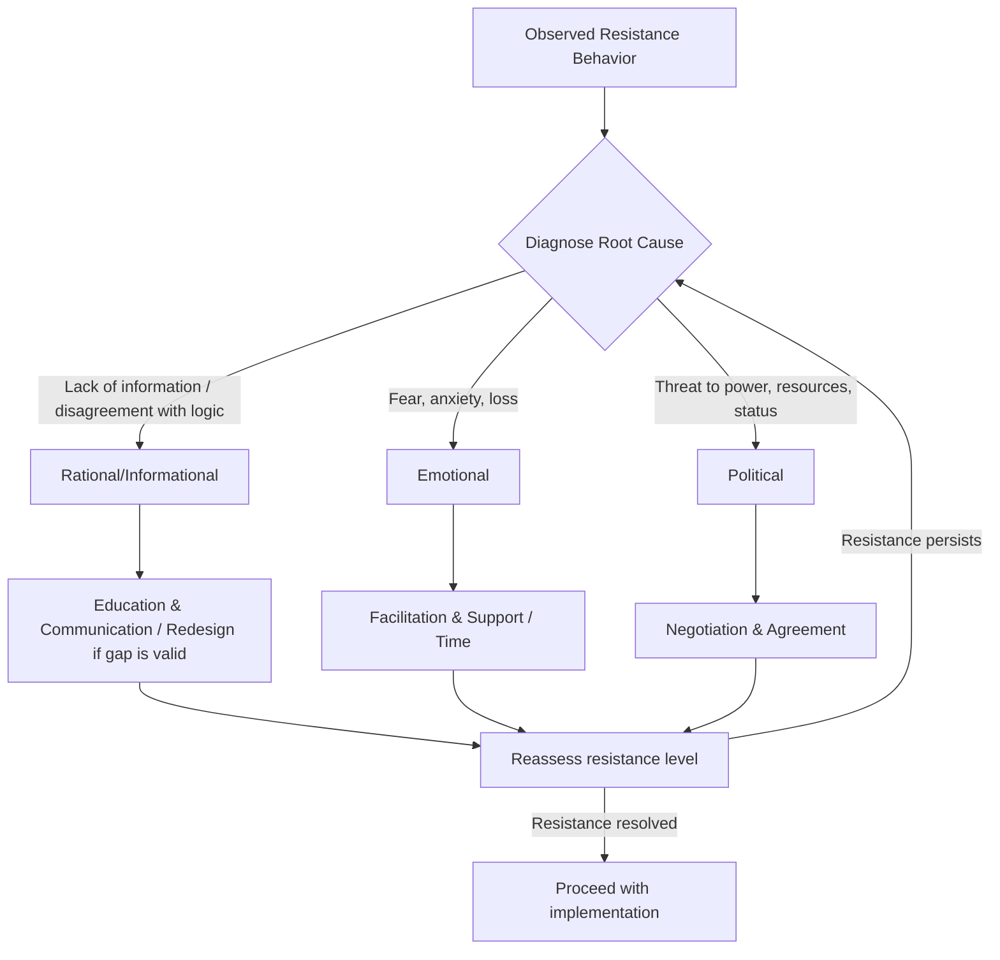

## Resistance to Change

### Definition and Conceptual Status

Resistance to change refers to individual or collective behaviors, attitudes, or emotional responses that oppose, slow, or undermine the implementation of an organizational change effort. In classical OD literature (originating with Kurt Lewin's field theory), resistance is conceptualized not as an irrational obstacle but as a **restraining force** in a field of driving and restraining forces that determine whether a system remains in equilibrium or moves toward a new state.

**Key Points**

- Later scholarship (notably work critical of the "resistance" framing, e.g., Dent & Goldberg, 1999) argues that treating resistance as inherent employee irrationality or defensiveness is itself a management-centric bias, and that most so-called "resistance" is a rational response to legitimate concerns (job security, competence threats, poor communication, or genuinely flawed change designs).
- Modern OD practice increasingly frames the phenomenon as **change reactions** or **responses to change** rather than "resistance," to avoid pathologizing legitimate concerns before they are investigated.

### Lewin's Force Field Analysis

Force Field Analysis models organizational states as a dynamic equilibrium between two opposing sets of forces:

- **Driving forces** — factors pushing toward the desired change (competitive pressure, leadership advocacy, new technology, regulatory requirements)
- **Restraining forces** — factors maintaining the status quo (habit, fear of the unknown, resource constraints, group norms, vested interests)

Lewin's central insight: increasing driving forces alone tends to increase restraining forces proportionally (producing tension without net movement, or even backlash), so change strategies that **reduce restraining forces** are often more sustainable than those that simply escalate pressure.

### Diagram: Force Field Analysis

<svg xmlns="http://www.w3.org/2000/svg" viewBox="0 0 700 400">
<text x="350" y="30" text-anchor="middle" font-size="18" font-weight="bold" fill="#1a1a1a">Force Field Analysis (svg_diagram)</text>
<line x1="350" y1="60" x2="350" y2="340" stroke="#374151" stroke-width="2" stroke-dasharray="6,4" />
<text x="350" y="55" text-anchor="middle" font-size="12" fill="#374151">Current Equilibrium</text>

<text x="180" y="80" text-anchor="middle" font-size="14" font-weight="bold" fill="`#166534`">Driving Forces →</text>

<line x1="60" y1="110" x2="330" y2="110" stroke="`#16a34a`" stroke-width="6" marker-end="url(#arrowGreen)" />

<text x="195" y="103" text-anchor="middle" font-size="11" fill="`#166534`">Competitive pressure</text>

<line x1="60" y1="150" x2="330" y2="150" stroke="`#16a34a`" stroke-width="5" marker-end="url(#arrowGreen)" />

<text x="195" y="143" text-anchor="middle" font-size="11" fill="`#166534`">Leadership advocacy</text>

<line x1="60" y1="190" x2="330" y2="190" stroke="`#16a34a`" stroke-width="4" marker-end="url(#arrowGreen)" />

<text x="195" y="183" text-anchor="middle" font-size="11" fill="`#166534`">New technology</text>

<line x1="60" y1="230" x2="330" y2="230" stroke="`#16a34a`" stroke-width="5" marker-end="url(#arrowGreen)" />

<text x="195" y="223" text-anchor="middle" font-size="11" fill="`#166534`">Regulatory demands</text>

<text x="520" y="80" text-anchor="middle" font-size="14" font-weight="bold" fill="`#991b1b`">← Restraining Forces</text>

<line x1="640" y1="110" x2="370" y2="110" stroke="`#dc2626`" stroke-width="6" marker-end="url(#arrowRed)" />

<text x="505" y="103" text-anchor="middle" font-size="11" fill="`#991b1b`">Fear of the unknown</text>

<line x1="640" y1="150" x2="370" y2="150" stroke="`#dc2626`" stroke-width="5" marker-end="url(#arrowRed)" />

<text x="505" y="143" text-anchor="middle" font-size="11" fill="`#991b1b`">Habit / routine</text>

<line x1="640" y1="190" x2="370" y2="190" stroke="`#dc2626`" stroke-width="4" marker-end="url(#arrowRed)" />

<text x="505" y="183" text-anchor="middle" font-size="11" fill="`#991b1b`">Vested interests</text>

<line x1="640" y1="230" x2="370" y2="230" stroke="`#dc2626`" stroke-width="5" marker-end="url(#arrowRed)" />

<text x="505" y="223" text-anchor="middle" font-size="11" fill="`#991b1b`">Resource constraints</text>

<text x="350" y="375" text-anchor="middle" font-size="13" font-style="italic" fill="`#374151`">Sustainable change: reduce restraining forces rather than only increasing driving forces</text>

</svg>

### Sources of Resistance: Individual Level

- **Loss aversion and uncertainty**: change threatens known routines and predictability; psychologically, potential losses are weighted more heavily than equivalent gains
- **Fear of competence loss**: concern that new systems, processes, or skills required will expose inadequacy or require retraining the individual is not confident about
- **Selective perception and cognitive habits**: individuals filter new information through existing mental models, causing change rationale to be misunderstood or dismissed
- **Low trust in change agents**: skepticism grounded in prior failed change initiatives ("change fatigue") or perceived hidden agendas
- **Threats to security and status**: perceived risk to job security, compensation, or social standing within the organization

### Sources of Resistance: Organizational/Group Level

- **Structural inertia**: existing policies, reporting lines, and reward systems that were designed for the prior state and now conflict with the new one
- **Group norms**: cohesive work groups may collectively resist change that threatens established group identity or informal power structures
- **Resource scarcity**: legitimate concern that the organization lacks the time, budget, or staffing to execute the change as designed
- **Sunk cost and past investment**: reluctance to abandon systems, processes, or projects with significant prior investment
- **Power and political dynamics**: change that redistributes authority or resources threatens specific stakeholders' influence, generating targeted opposition
- **Poor change design or communication**: if resistance stems from a genuinely flawed change plan or communication failure, treating it as employee irrationality misdiagnoses a design problem as a people problem

**[Inference]** The individual/organizational split above is an analytical convenience common in OD teaching materials; in practice, most real resistance episodes involve interacting individual and structural causes rather than falling cleanly into one category.

### Kotter and Schlesinger's Six Approaches to Managing Resistance

A widely cited framework (Kotter & Schlesinger, 1979, revised 2008) matches resistance-management tactics to the underlying cause and situational constraints (time pressure, degree of anticipated resistance):

| Approach | Best Used When | Trade-off |
| --- | --- | --- |
| **Education & Communication** | Resistance stems from misinformation or lack of information | Time-consuming if many people must be involved |
| **Participation & Involvement** | Change agents lack full information; targets have power to resist | Time-consuming; may result in a poorly designed change if participants steer it wrong |
| **Facilitation & Support** | People resist due to adjustment problems (fear, anxiety) | Time-consuming, expensive, and can still fail |
| **Negotiation & Agreement** | Someone/some group will clearly lose out and has considerable power to resist | Can be expensive; risks inviting negotiation from others |
| **Manipulation & Co-optation** | Other tactics won't work or are too costly, and speed is essential | Can create future problems if people feel manipulated |
| **Explicit & Implicit Coercion** | Speed is essential and change agents possess considerable power | Risky; can leave people angry at change initiators |

**[Inference]** Kotter and Schlesinger explicitly frame manipulation/co-optation and coercion as higher-risk, ethically fraught tactics of last resort rather than recommended default approaches; some adaptations of this framework in secondary/derivative sources omit this caveat.

### Diagnostic Framework: Distinguishing Resistance Types

**Key Points**

- **Rational/informational resistance**: stems from disagreement with the logic or evidence behind the change → addressed through education, data-sharing, and dialogue
- **Emotional resistance**: stems from anxiety, loss, or fear regardless of the change's logical merit → addressed through facilitation, support, and time
- **Political resistance**: stems from anticipated loss of power, resources, or status → addressed through negotiation or, when legitimate, redesign of the change to address the concern
- Misdiagnosing the type (e.g., treating political resistance as if it were purely emotional) typically results in ineffective interventions and can deepen distrust.

### Worked Example: ERP System Rollout

**Example**

A manufacturing firm rolls out a new Enterprise Resource Planning (ERP) system, replacing department-specific legacy tools.

- **Observed resistance**: Warehouse supervisors delay data entry, continue maintaining shadow spreadsheets, and report "the system doesn't work" in meetings.
- **Diagnosis**: Interviews reveal the resistance is not primarily emotional — supervisors correctly identify that the ERP's inventory module lacks a field for tracking partial-pallet quantities, a real operational need the legacy spreadsheet handled. This is **rational/informational resistance rooted in a genuine design gap**, not fear of technology.
- **Intervention selected**: Participation & Involvement — supervisors are added to a mid-rollout design review, and a custom field is added to the ERP configuration to capture partial-pallet data.
- **Outcome**: Shadow spreadsheet usage drops once the tool addresses the actual operational gap; framing this purely as "resistance to overcome" through communication alone would not have resolved the underlying issue.

**[Inference]** This is a synthesized illustrative example; real ERP rollout resistance dynamics vary substantially by industry, prior system maturity, and organizational trust levels.

### Diagram: Resistance Diagnosis and Response Pathway

### Measuring and Monitoring Resistance

- **Readiness-for-change assessments**: pre-implementation surveys measuring perceived need for change, self-efficacy regarding new skills required, and trust in leadership
- **Pulse surveys during rollout**: short, repeated surveys tracking sentiment shifts across implementation phases rather than a single pre/post measurement
- **Behavioral indicators**: system usage/adoption rates, help-desk ticket volume, absenteeism or turnover spikes correlated with the change timeline
- **Sentiment analysis of open-ended feedback**: qualitative comments from town halls, surveys, or feedback channels, thematically coded against the rational/emotional/political framework above

### Common Failure Modes in Managing Resistance

- **Blanket coercion**: applying speed-oriented, low-participation tactics broadly when slower, participative approaches were feasible, generating unnecessary long-term trust damage
- **Treating all resistance as irrational**: dismissing legitimate, rational objections (flawed change design, resource gaps) as mere "resistance to change," which suppresses valuable corrective feedback
- **One-time communication**: a single town hall or email announcement, rather than sustained, two-way communication throughout the change lifecycle
- **Ignoring informal leaders**: failing to engage influential, non-formal-authority individuals whose peer credibility shapes group sentiment more than management messaging
- **Underestimating political resistance**: applying only educational or emotional-support tactics to what is fundamentally a power/resource conflict, leaving the actual driver of resistance unaddressed

### Relationship to Broader Change Management Models

- **Lewin's Three-Step Model** (Unfreeze–Change–Refreeze) — resistance is the central obstacle addressed in the "unfreezing" stage, where driving forces must be strengthened or restraining forces reduced before movement is possible
- **Kotter's 8-Step Change Model** — several steps (building a guiding coalition, communicating the vision, empowering broad-based action) are explicitly designed as resistance-mitigation mechanisms
- **ADKAR Model** (Awareness, Desire, Knowledge, Ability, Reinforcement) — models resistance as a gap at a specific stage (e.g., resistance due to lack of "Desire" requires different intervention than resistance due to lack of "Ability")
- **Prosci Change Management Methodology** — operationalizes resistance management through structured sponsor coalition-building and manager-as-change-agent frameworks, with resistance tracked as a measurable risk factor throughout the project

### Related Topics

- Lewin's Three-Step Change Model (Unfreeze-Change-Refreeze)
- Kotter's 8-Step Change Model
- ADKAR Model of Individual Change
- Force Field Analysis Technique
- Organizational Readiness for Change Assessment
- Change Agent Roles and Credibility
- Prosci/ADKAR Change Management Methodology
- Power and Politics in Organizations
- Psychological Safety and Change Communication
- Survey Feedback as a Change-Monitoring Tool