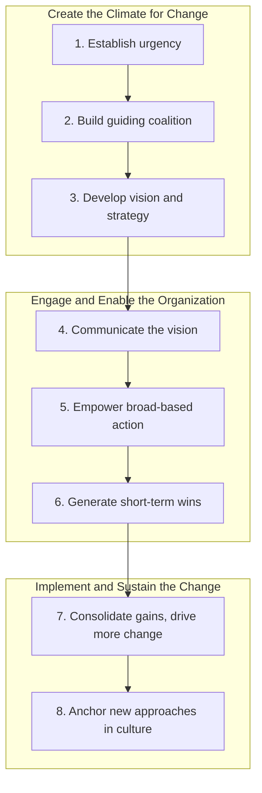

## Large-Scale Organizational Transformation

### Definition and Distinction from Incremental Change

Large-scale organizational transformation (LSOT) refers to fundamental, discontinuous change affecting an organization's core strategy, structure, culture, and operating model simultaneously, rather than isolated, incremental adjustments to a single function or process. It is distinguished from smaller-scope OD interventions by three characteristics:

- **Scope**: affects the whole organization or major multi-unit divisions, not a single team or department
- **Order of change**: typically "second-order" or "gamma" change — altering the fundamental frame, paradigm, or identity of the organization — rather than "first-order" or "alpha" change, which adjusts variables within an existing frame (e.g., improving efficiency of an existing process)
- **Discontinuity**: often triggered by, or resulting in, a break from historical trajectory (e.g., business model disruption, merger, industry deregulation, technological paradigm shift) rather than gradual evolution

**[Inference]** The alpha/beta/gamma change typology (Golembiewski, Billingsley, & Yeager, 1976) is a specific academic framework; not all transformation literature uses this precise terminology, though the underlying distinction between incremental and fundamental change is widely shared across the field.

### Triggers and Contexts for Large-Scale Transformation

- **Environmental jolts**: deregulation, new market entrants, disruptive technology, pandemic-driven demand shifts
- **Performance crises**: sustained financial decline, market share loss, or existential competitive threat
- **Mergers, acquisitions, and divestitures**: requiring integration or separation of entire organizational systems, cultures, and structures
- **Leadership succession with a new strategic mandate**: new CEO/executive team commissioned specifically to reposition the organization
- **Digital and business-model transformation**: shifting core value-creation logic (e.g., product company to platform/services company)
- **Regulatory or industry-wide restructuring**: privatization, nationalization, or major compliance regime changes

### Nadler and Tushman's Congruence Model

A foundational diagnostic framework for large-scale transformation views the organization as a system converting inputs (environment, resources, history, strategy) into outputs (system, unit, and individual performance) through four internal components that must be mutually congruent:

1. **Work** — the actual tasks performed and workflows
2. **People** — the formal and informal characteristics of organizational members (skills, needs, backgrounds)
3. **Formal Organization** — structures, systems, and processes officially designed to align work and people
4. **Informal Organization** — the unwritten culture, power dynamics, and norms that emerge over time

The model's core proposition: organizational effectiveness depends on the **congruence** (fit) among these four components. Large-scale transformation is fundamentally the work of re-establishing congruence when a change in strategy or environment has made the prior configuration misaligned — e.g., a new digital strategy (input) that the existing formal structure, legacy skill base, and risk-averse informal culture are not congruent with.

### Diagram: Nadler-Tushman Congruence Model

<svg xmlns="http://www.w3.org/2000/svg" viewBox="0 0 700 420">
<text x="350" y="30" text-anchor="middle" font-size="17" font-weight="bold" fill="#1a1a1a">Nadler-Tushman Congruence Model (svg_diagram)</text>
<rect x="20" y="160" width="130" height="100" rx="8" fill="#e0e7ff" stroke="#4338ca" stroke-width="2" />
<text x="85" y="200" text-anchor="middle" font-size="13" font-weight="bold" fill="#312e81">Inputs</text>
<text x="85" y="220" text-anchor="middle" font-size="10" fill="#312e81">Environment</text>
<text x="85" y="235" text-anchor="middle" font-size="10" fill="#312e81">Resources / History</text>
<path d="M150 210 L195 210" stroke="#374151" stroke-width="2" marker-end="url(#arr1)" />
<rect x="200" y="90" width="130" height="80" rx="8" fill="#dbeafe" stroke="#2563eb" stroke-width="2" />
<text x="265" y="120" text-anchor="middle" font-size="12" font-weight="bold" fill="#1e3a8a">Work</text>
<text x="265" y="140" text-anchor="middle" font-size="10" fill="#1e3a8a">Tasks / Workflow</text>
<rect x="200" y="330" width="130" height="80" rx="8" fill="#fce7f3" stroke="#db2777" stroke-width="2" />
<text x="265" y="360" text-anchor="middle" font-size="12" font-weight="bold" fill="#831843">People</text>
<text x="265" y="380" text-anchor="middle" font-size="10" fill="#831843">Skills / Needs</text>
<rect x="370" y="90" width="130" height="80" rx="8" fill="#fef3c7" stroke="#d97706" stroke-width="2" />
<text x="435" y="120" text-anchor="middle" font-size="12" font-weight="bold" fill="#78350f">Formal Org</text>
<text x="435" y="140" text-anchor="middle" font-size="10" fill="#78350f">Structures / Systems</text>
<rect x="370" y="330" width="130" height="80" rx="8" fill="#dcfce7" stroke="#16a34a" stroke-width="2" />
<text x="435" y="360" text-anchor="middle" font-size="12" font-weight="bold" fill="#14532d">Informal Org</text>
<text x="435" y="380" text-anchor="middle" font-size="10" fill="#14532d">Culture / Power</text>
<line x1="330" y1="130" x2="370" y2="130" stroke="#374151" stroke-width="1.5" stroke-dasharray="4,3" />
<line x1="265" y1="170" x2="265" y2="330" stroke="#374151" stroke-width="1.5" stroke-dasharray="4,3" />
<line x1="435" y1="170" x2="435" y2="330" stroke="#374151" stroke-width="1.5" stroke-dasharray="4,3" />
<line x1="330" y1="370" x2="370" y2="370" stroke="#374151" stroke-width="1.5" stroke-dasharray="4,3" />
<text x="350" y="255" text-anchor="middle" font-size="11" font-style="italic" fill="#374151">Congruence / Fit</text>
<path d="M500 250 L550 250" stroke="#374151" stroke-width="2" marker-end="url(#arr1)" />
<rect x="555" y="200" width="120" height="100" rx="8" fill="#f3e8ff" stroke="#7c3aed" stroke-width="2" />
<text x="615" y="230" text-anchor="middle" font-size="12" font-weight="bold" fill="#4c1d95">Outputs</text>
<text x="615" y="250" text-anchor="middle" font-size="10" fill="#4c1d95">System Performance</text>
<text x="615" y="265" text-anchor="middle" font-size="10" fill="#4c1d95">Unit / Individual</text>

</svg>

### Tichy's Technical, Political, and Cultural (TPC) Framework

Noel Tichy's framework identifies three interdependent systems that must be managed simultaneously in any large-scale transformation:

- **Technical System**: the formal work processes, structures, and resource-allocation mechanisms
- **Political System**: the distribution of power, authority, and resource-allocation decisions among stakeholders and coalitions
- **Cultural System**: shared values, norms, and meaning systems that shape how members interpret events

**Key Points**

- Transformation efforts that address only the technical system (new structures, new processes) while ignoring the political system (who gains/loses power) or the cultural system (whether the change fits existing shared meanings) are a commonly cited cause of transformation failure.
- Tichy's framework is frequently used alongside Nadler-Tushman's congruence model, with TPC providing a lens for *why* misalignment persists (political resistance, cultural mismatch) even after formal structural changes are announced.

### Kotter's 8-Step Model for Leading Large-Scale Change

John Kotter's model, developed from research on why major transformation efforts fail, is the most widely cited practitioner framework specifically for large-scale organizational transformation:

1. **Establish a sense of urgency** — build the case that the status quo is more dangerous than the change
2. **Create a guiding coalition** — assemble a group with sufficient positional power, expertise, credibility, and leadership to guide the effort
3. **Develop a vision and strategy** — articulate a picture of the future that is easy to communicate and appeals to stakeholders
4. **Communicate the change vision** — use every available channel repeatedly; model the vision through the guiding coalition's behavior
5. **Empower broad-based action** — remove structural barriers, change systems/structures that undermine the vision
6. **Generate short-term wins** — plan for and create visible, unambiguous improvements within 6–18 months to sustain momentum
7. **Consolidate gains and produce more change** — use credibility from early wins to tackle bigger structural/systemic problems
8. **Anchor new approaches in the culture** — connect new behaviors to organizational success and ensure leadership succession supports the new approach

**[Inference]** Kotter's original research identified failure to follow these steps (or skipping steps, particularly under time pressure) as the primary cause of transformation failure in his study sample; the generalizability of this causal claim across all industries and transformation types is not universally accepted in later academic critique, some of which argues the model understates the role of employee agency and bottom-up sensemaking.

### Diagram: Kotter's 8-Step Model — Phased View

### Distinguishing Transformation Change Types

| Dimension | Developmental Change | Transitional Change | Transformational Change |
| --- | --- | --- | --- |
| **Nature** | Improves existing state | Moves to a known new state via a defined transition | Moves to an unknown, emergent new state |
| **Scope** | Narrow, often single-process | Moderate, defined end-state | Broad, whole-system, identity-level |
| **Example** | Improving customer service response time | Migrating to a new ERP system | Shifting from product manufacturer to platform/services provider |
| **Planning approach** | Linear, plan-and-execute | Managed transition plan (current → transition → future state) | Iterative, emergent, requires ongoing sensemaking |

This typology (Ackerman, 1986; widely used in change-management practitioner literature) helps distinguish large-scale transformation from the more common transitional change managed via standard project-based change methodologies.

### Organizational Design Considerations in Large-Scale Transformation

- **Structural redesign**: shifting from functional to divisional, matrix, or network structures to support new strategic priorities
- **Governance and decision rights**: renegotiating who has authority over what decisions, often requiring new governance bodies (transformation office, steering committees)
- **Talent and capability transformation**: workforce reskilling, new hiring profiles, and in some cases significant workforce reduction or restructuring tied to changed capability requirements
- **Culture change programs**: deliberate, sustained efforts (leadership modeling, symbol and story management, reward system realignment) to shift the informal organization toward congruence with new strategy — culture change is broadly recognized as the slowest-moving and highest-risk element of transformation
- **Technology and digital infrastructure**: in contemporary transformations, technology platforms (ERP, cloud infrastructure, data architecture) are frequently both an enabler and a forcing function for structural and process change

### Worked Example: Legacy Manufacturer Shifting to Platform Business Model

**Example**

A traditional industrial equipment manufacturer transforms from a one-time equipment-sale model to a subscription-based, IoT-connected "equipment-as-a-service" model.

- **Congruence gap identified**: existing sales-commission structure (Formal Organization) rewards one-time transaction volume, directly conflicting with the new strategy's requirement for long-term customer retention and usage-based revenue (Input: new strategy).
- **Political system**: regional sales VPs who built their influence around large one-time deals resist the new model, since it initially reduces their reported quarterly revenue and commission under old metrics.
- **Cultural system**: engineering culture historically prized product durability and infrequent contact with customers post-sale; the new model requires continuous customer engagement and data-driven service delivery, a significant identity shift for engineering teams.
- **Kotter-aligned response**: leadership creates urgency using competitor case data (Step 1), forms a coalition including a respected sales VP as an early convert (Step 2), and redesigns commission structures to reward multi-year contract value rather than one-time sales (Step 5, removing structural barriers) before broader rollout.
- **Short-term win**: one regional pilot demonstrating higher lifetime customer value under the new model is publicized internally within the first year (Step 6) to build momentum for full rollout.

**[Inference]** This is a synthesized illustrative scenario constructed to demonstrate framework application; it is not a documented case study of a specific named company.

### Measuring Transformation Progress and Success

- **Leading indicators**: employee sentiment/readiness surveys, leadership coalition engagement, pilot program results, communication reach/comprehension metrics
- **Lagging indicators**: financial performance shifts, market share, customer retention/satisfaction, employee turnover in critical roles
- **Culture-specific metrics**: values-alignment surveys, behavioral observation audits, promotion/reward pattern analysis (are people who exhibit new desired behaviors actually being promoted/rewarded?)
- **Milestone-based tracking**: transformation office dashboards tracking initiative-level progress against a master transformation roadmap, typically spanning multiple years for full-scale efforts

### Common Failure Modes in Large-Scale Transformation

- **Underestimating time horizons**: large-scale, second-order change frequently requires multi-year timelines; compressed schedules driven by short-term financial pressure are a frequently cited cause of failure
- **Declaring victory too early**: stopping consolidation efforts (Kotter Step 7) after initial visible wins, before new approaches are fully anchored, allowing reversion to prior patterns
- **Neglecting the political system**: technical/structural redesign proceeding without addressing how power and resource distribution shifts, generating sustained covert resistance from disempowered stakeholders
- **Culture-strategy mismatch left unaddressed**: new strategic direction announced without any corresponding effort to shift the informal organization, producing a "say-do gap" between stated strategy and actual behavior
- **Insufficient guiding coalition power**: a coalition lacking sufficient credibility, cross-functional representation, or positional authority to override entrenched resistance from key stakeholders

### Relationship to Other OD and Change Frameworks

- **Lewin's Three-Step Model** — provides the foundational unfreeze-change-refreeze logic underlying most large-scale transformation methodologies, scaled to whole-system level
- **McKinsey 7-S Framework** — an alternative diagnostic model (Strategy, Structure, Systems, Shared Values, Skills, Style, Staff) commonly used alongside or instead of Nadler-Tushman for whole-organization alignment diagnosis
- **Burke-Litwin Model** — a related, more granular causal model distinguishing transformational factors (external environment, leadership, mission/strategy, culture) from transactional factors (structure, systems, management practices, climate), explicitly modeling which factors drive first-order versus second-order change
- **Resistance to Change** — large-scale transformation generates resistance at a systemic scale, requiring the full range of resistance-management tactics (education, participation, negotiation) applied across many simultaneous stakeholder groups rather than a single team
- **Team-Building Interventions** — often deployed at the leadership/guiding-coalition level early in a transformation to ensure the coalition itself functions cohesively before it attempts to lead broader change

### Related Topics

- Burke-Litwin Causal Model of Organizational Performance
- McKinsey 7-S Framework
- Lewin's Three-Step Change Model
- Tichy's Technical-Political-Cultural Framework
- Mergers and Acquisitions Integration
- Organizational Culture Change Strategies
- Digital Transformation and Business Model Innovation
- Change Management Office (CMO) Governance Structures
- Leadership Succession and Transformation Sponsorship
- Ackerman's Typology of Change (Developmental, Transitional, Transformational)