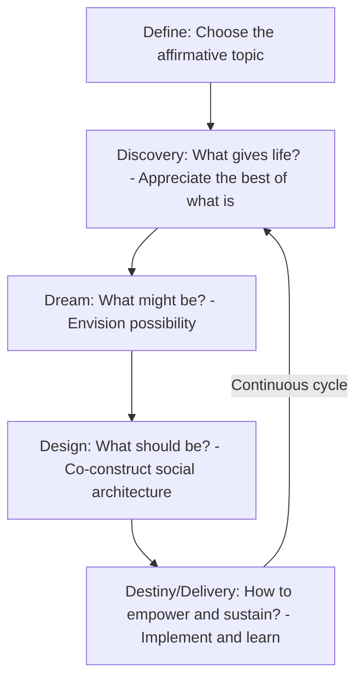

## Appreciative Inquiry

### Definition and Theoretical Origin

Appreciative Inquiry (AI) is an organizational development approach that focuses change efforts on identifying, understanding, and amplifying an organization's existing strengths, successes, and sources of vitality, rather than diagnosing and correcting deficits or problems. It was developed by David Cooperrider and Suresh Srivastva at Case Western Reserve University in the mid-1980s, originating from a doctoral action-research project on physician organization at the Cleveland Clinic.

**Key Points**

- AI is grounded in **social constructionism** — the premise that organizational reality is not an objective, fixed fact but is continuously constructed through language, conversation, and shared meaning-making among members.
- The foundational claim: organizations move in the direction of what they persistently study and ask questions about. If an organization's inquiry process focuses on problems and deficits, it tends to reproduce and reinforce a problem-focused identity; if it focuses on peak experiences and strengths, it tends to build capacity around those strengths.
- AI is explicitly positioned as a departure from the deficit-based "problem-solving" paradigm that underlies most traditional OD diagnostic models (e.g., gap analysis, root-cause analysis).

### AI Versus the Traditional Problem-Solving Paradigm

| Dimension | Problem-Solving (Deficit-Based) | Appreciative Inquiry (Strength-Based) |
| --- | --- | --- |
| **Starting question** | "What is wrong and why?" | "What is working well and why?" |
| **Core process** | Identify problem → analyze causes → generate solutions → implement | Discover strengths → envision possibilities → co-construct future → sustain momentum |
| **Underlying assumption** | Organizations are problems to be solved | Organizations are mysteries to be embraced, with untapped positive potential |
| **Energy source** | Motivated by fear of failure or dissatisfaction | Motivated by aspiration and possibility |
| **Risk** | Can reinforce a deficit-oriented identity and fatigue from constant problem focus | Can be criticized for avoiding or minimizing genuine, serious organizational problems if applied uncritically |

**[Inference]** Critics of AI (including some organizational scholars) argue that an exclusively strength-based approach risks bypassing legitimate power imbalances, conflict, or systemic dysfunction that genuinely require direct, deficit-focused diagnosis; this is a documented critique in the OD literature rather than a settled consensus against AI's use.

### The 4-D Cycle

AI is most commonly operationalized through the **4-D Cycle**, a structured sequence of collective inquiry phases:

1. **Discovery** — "What gives life?" Participants identify and share stories of peak experiences, past successes, and organizational strengths through structured, appreciative interviews
2. **Dream** — "What might be?" Participants envision bold possibilities for the future based on the strengths surfaced in Discovery, often through creative or generative exercises (visioning, future scenarios)
3. **Design** — "What should be?" Participants co-construct the structures, processes, and systems (the "social architecture") needed to realize the dream, translating aspiration into concrete organizational design
4. **Destiny** (also called **Delivery**) — "How to empower, learn, and adjust?" The organization commits to action, implements changes, and builds ongoing capacity for continued appreciative learning and adaptation

Some formulations use a **5-D model**, adding an initial **Define** phase — establishing the affirmative topic choice (what the inquiry will focus on) before Discovery begins.

### Diagram: The 4-D (5-D) Appreciative Inquiry Cycle

### The Affirmative Topic Choice

**Key Points**

- The topic choice stage is considered by AI practitioners to be the single most consequential decision in the process, since the entire inquiry orients around whatever topic is chosen.
- Topics are framed affirmatively: e.g., "Exceptional Customer Partnerships" rather than "Reducing Customer Complaints," or "High-Trust Collaboration" rather than "Fixing Communication Breakdowns."
- Poorly chosen or overly narrow/vague topics are cited as a common cause of AI initiatives producing shallow or unfocused results.

### The Appreciative Interview

The Discovery phase is typically operationalized through **paired appreciative interviews**, where organizational members interview each other (often across hierarchical or functional boundaries) using a structured protocol. A typical protocol includes:

- **Peak experience question**: "Describe a time when you felt most alive, engaged, or proud to be part of this organization. What made it possible?"
- **Values question**: "Without being modest, what do you value most about yourself, your work, and this organization?"
- **Root causes of success question**: "What are the core factors that give life to this organization when it's at its best?"
- **Three wishes question**: "If you had three wishes to enhance the vitality and health of this organization, what would they be?"

Stories and themes gathered from many paired interviews are then aggregated and shared back with the larger group, surfacing common threads of organizational strength that inform the Dream phase.

### Worked Example: Appreciative Inquiry in a Hospital Nursing Department

**Example**

A hospital nursing department is experiencing high turnover and low morale. Rather than launching an exit-interview-driven root-cause analysis, leadership commissions an AI-based initiative.

1. **Define**: The affirmative topic chosen is "Exceptional Patient-Centered Care Moments" rather than "Reducing Nurse Turnover."
2. **Discovery**: Nurses pair up across shifts and seniority levels to interview each other about peak moments of patient care they felt most proud of, surfacing recurring themes: strong peer mentorship during high-acuity shifts, moments of cross-department collaboration, and instances where nurses had autonomy to advocate for patients.
3. **Dream**: A large-group session uses the surfaced themes to envision a department where every new nurse experiences the mentorship quality described in the strongest stories, and where cross-department collaboration is the norm rather than the exception.
4. **Design**: Participants co-design a formal peer-mentorship structure for new hires and a cross-department huddle protocol, directly modeled on the specific practices identified in Discovery as sources of vitality.
5. **Destiny**: A pilot unit implements the new mentorship structure, with periodic appreciative check-ins (not only metrics review) to sustain the model and gather ongoing stories of what continues to work well.

**[Inference]** This is a synthesized illustrative scenario rather than a documented case; actual organizational outcomes from AI interventions vary based on implementation fidelity, organizational readiness, and whether underlying structural issues (e.g., staffing ratios) are addressed alongside the appreciative process.

### Theoretical Foundations: The Heliotropic Hypothesis and Positive Image

Cooperrider's theoretical grounding for AI draws on several related propositions:

- **Heliotropic hypothesis**: living systems (by analogy to plants growing toward light) evolve toward the most positive images and anticipatory visions they hold of themselves, meaning that sustained positive imagery about the future can itself become a causal force shaping organizational behavior
- **Anticipatory principle**: current organizational behavior is guided in large part by images of the future being anticipated; changing the shared image of the future changes present behavior
- **Poetic principle**: organizations, like a poem or open book, can be studied and interpreted from many angles; choosing to study "what gives life" is as legitimate and consequential a choice as choosing to study "what is broken"
- **Simultaneity principle**: inquiry and change are not sequential but simultaneous — the moment people begin asking appreciative questions, the organization has already begun to change, since the questions themselves shape attention and meaning

**[Inference]** The heliotropic hypothesis in particular draws on biological metaphor rather than being a directly tested organizational-behavior mechanism; its status in the literature is closer to a generative theoretical metaphor underpinning AI's design philosophy than an empirically validated causal law.

### Applications Beyond Single-Organization OD

- **Whole-system Summit methodology**: AI is frequently scaled up via large-group "AI Summits," gathering hundreds of stakeholders (employees, customers, suppliers, community members) simultaneously through the 4-D cycle, related to other large-group intervention methods like Future Search
- **Community and international development**: AI has been applied outside corporate contexts to community development, public health initiatives, and international NGO work, given its cross-cultural adaptability and low reliance on adversarial diagnostic framing
- **Strategic planning**: some organizations replace traditional SWOT-based strategic planning with AI-based strategic visioning, particularly the "SOAR" framework (Strengths, Opportunities, Aspirations, Results), an explicitly appreciative alternative to SWOT's inclusion of Weaknesses and Threats

### Measuring Appreciative Inquiry Outcomes

- **Narrative/thematic tracking**: qualitative coding of story themes gathered across Discovery interviews, tracked over time to assess whether desired themes (e.g., collaboration, innovation) increase in frequency
- **Engagement and participation metrics**: breadth of participation across hierarchical levels and functions in Summit-style events, used as a proxy for the "whole-system" inclusiveness AI emphasizes
- **Standard organizational outcome metrics**: turnover, engagement survey scores, and performance indicators, tracked pre/post as with other OD interventions, though AI practitioners caution against over-relying on these at the expense of the qualitative, meaning-based outcomes central to the approach
- **[Unverified]** Rigorous, controlled empirical comparisons of AI's effectiveness against deficit-based OD approaches are less common in the literature than case-study and practitioner-reported evidence; the empirical base is weighted toward qualitative case reports rather than experimental or quasi-experimental designs.

### Common Failure Modes and Critiques

- **Bypassing legitimate conflict or dysfunction**: applying AI to situations involving serious ethical violations, safety issues, or power abuses can be inappropriate if it substitutes for necessary direct accountability processes
- **Topic choice failure**: choosing an overly broad, vague, or insincere affirmative topic, producing shallow engagement
- **Tokenistic or partial implementation**: running only the Discovery phase (collecting positive stories) without following through to Dream, Design, and Destiny, resulting in a feel-good exercise with no structural change
- **Skepticism from participants**: employees who perceive persistent, unaddressed problems may view an exclusively strength-focused inquiry as inauthentic or dismissive of real grievances if not carefully facilitated
- **Cultural and linguistic translation challenges**: the affirmative framing and interview style, while designed to be cross-culturally adaptable, requires careful translation and facilitation adjustment to avoid appearing forced or performative in some organizational cultures

### Relationship to Other OD Approaches

- **Traditional Action Research** — AI is often described as a variant of action research that substitutes an appreciative, generative inquiry logic for the traditional diagnostic, deficit-based inquiry logic, while retaining the core cyclical structure of inquiry-action-reflection
- **Large-Group Interventions (Future Search, Open Space Technology)** — AI Summits share methodological family resemblance with these whole-system change techniques, all emphasizing broad stakeholder participation in a single large-group setting
- **Positive Organizational Scholarship (POS)** — AI is closely aligned with and often cited as a practical application of POS, an academic movement studying positive organizational phenomena (flourishing, virtuousness, positive deviance) as legitimate objects of organizational study
- **Team-Building Interventions** — AI techniques (appreciative interviews, strength-based dialogue) are sometimes incorporated into team-building processes as an alternative to deficit-based diagnostic data collection

### Related Topics

- Positive Organizational Scholarship
- SOAR Framework (Strengths, Opportunities, Aspirations, Results)
- Future Search and Large-Group Interventions
- Social Constructionism in Organizational Theory
- Action Research Model in Organizational Development
- Whole-System Change and AI Summit Methodology
- Organizational Storytelling and Narrative Methods
- Strength-Based Leadership Development
- Cross-Cultural Applications of OD Interventions
- Positive Deviance in Organizations