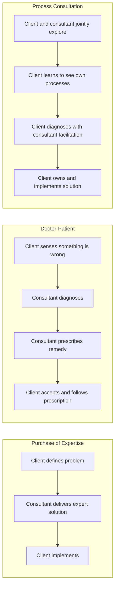

## The Change Agent and Consulting Role

### Definition and Scope

A change agent is an individual (or team) who deliberately intervenes in an organizational system to facilitate planned change, drawing on behavioral science knowledge and process skill rather than positional authority alone. The role spans a spectrum from **external consultants** (independent of the client organization, brought in for a defined engagement) to **internal change agents** (organizational members, often in HR, OD, or line management roles, who facilitate change as part of their ongoing organizational role). Both share a common core: they help a client system diagnose, plan, and implement change through structured process, rather than simply issuing directives.

**Key Points**

- The term "change agent" originates from Kurt Lewin's action research tradition, where the change agent's role was explicitly framed as facilitating client self-diagnosis and self-directed problem-solving, not prescribing solutions unilaterally.
- Internal and external change agents each carry distinct advantages and constraints: internal agents have contextual knowledge and ongoing relationships but may face credibility or objectivity concerns; external agents bring outside perspective and freedom from internal politics but must invest time building trust and contextual understanding.

### Schein's Three Models of Consultation

Edgar Schein's foundational framework identifies three distinct consulting stances a change agent can adopt, each with different assumptions about where expertise and responsibility for the solution reside:

1. **Purchase of Expertise Model** — the client identifies a specific problem and purchases the consultant's specialized knowledge or service to solve it directly (e.g., "design our new compensation system"). The consultant is expected to deliver an expert solution; the client's role is largely to specify requirements and implement the recommendation.
2. **Doctor-Patient Model** — the client recognizes something is wrong but cannot self-diagnose; the consultant is brought in to diagnose the problem (like a physician) and prescribe a remedy. The client's role shifts to accepting the diagnosis and following the prescribed treatment. Schein identifies significant risks in this model: the client may resist a diagnosis that threatens their self-image, may not have provided accurate information (since sharing sensitive information with an outsider carries risk), and may become dependent on the consultant rather than building internal diagnostic capability.
3. **Process Consultation Model** — the consultant helps the client learn to see, understand, and act on organizational processes themselves, rather than diagnosing or prescribing on the client's behalf. The core assumption: the client owns the problem and the solution, and organizational effectiveness improves more sustainably when the client's own diagnostic and problem-solving capability is strengthened, not merely when a single problem is fixed.

**[Inference]** Schein positioned Process Consultation as generally preferable for building long-term organizational capability, though he did not claim it is universally superior in every situation — the Purchase and Doctor-Patient models remain appropriate when the client genuinely lacks the internal capacity or time to engage in a learning-oriented process, or when the required expertise is highly specialized and narrowly technical.

### Diagram: Schein's Three Consultation Models

### The Change Agent's Core Skill Set

- **Diagnostic skill**: ability to gather and interpret data about organizational functioning without imposing premature conclusions
- **Process observation**: skill in observing group dynamics, communication patterns, and decision-making processes as they unfold in real time
- **Facilitation**: managing group discussions, surfacing conflicting views, and guiding groups toward productive outcomes without dominating the content of the discussion
- **Feedback skill**: delivering data and observations to clients in ways that are specific, behavioral, and non-judgmental, minimizing defensiveness
- **Contracting and boundary management**: establishing clear, explicit, and renegotiable agreements about scope, confidentiality, and mutual expectations at each stage of an engagement
- **Self-awareness and use of self**: recognizing how the change agent's own presence, assumptions, and emotional reactions influence the client system — a distinguishing feature of OD practice compared to purely technical consulting

### The Consulting Process: Contracting and Entry

**Key Points**

- **Entry** is the phase in which initial contact is made and a preliminary understanding of the presenting problem is established, often through a sponsor or gatekeeper within the client organization.
- **Psychological contracting** — the informal, often unstated mutual expectations between change agent and client — is distinguished from **formal contracting** (scope, fees, timeline, deliverables documented in a written agreement). Misalignment in the psychological contract (e.g., a client expecting the consultant to simply fix the problem while the consultant intends to build client capability through Process Consultation) is a frequently cited early source of engagement breakdown.
- Effective entry and contracting involves clarifying: who the actual client is (the immediate contact may not be the ultimate decision-maker or the party most affected by the change), what data will be shared and with whom, and what the change agent will and will not do.

### Levels of Intervention Depth (Harrison's Framework)

Roger Harrison's framework for calibrating intervention depth identifies a continuum from surface-level, publicly observable data to deep, psychologically sensitive material:

- **Shallow interventions**: focus on overt, structural, and behavioral data readily observable and low-risk to discuss (organizational charts, stated procedures, task allocation)
- **Deep interventions**: focus on underlying values, unconscious motivations, and interpersonal dynamics that are more threatening to surface and discuss

Harrison's guiding principle: intervene at the level where the actual data lies and where the client has the readiness and consent to work, rather than automatically pursuing the deepest possible level. Intervening too deep relative to client readiness risks defensive resistance and damaged trust; intervening too shallow relative to the actual root cause risks failing to address the real issue.

### Ethical Considerations in the Change Agent Role

- **Informed consent and confidentiality**: participants in diagnostic interviews or surveys must understand how their data will be used and protected, particularly given power differentials between employees and management
- **Managing dual loyalties**: change agents, particularly internal ones, often face tension between loyalty to the sponsoring executive (who typically controls the contract/employment) and loyalty to the broader client system (employees whose interests may diverge from the sponsor's)
- **Value imposition**: even Process Consultation, despite its non-prescriptive stance, involves the change agent's own values shaping which questions are asked and which data is highlighted; OD ethics codes generally call for transparency about this influence rather than a claim of pure neutrality
- **Competence boundaries**: recognizing when a presenting issue exceeds the change agent's expertise (e.g., issues requiring clinical psychological intervention, legal compliance expertise, or specialized technical knowledge) and referring appropriately
- **Avoiding dependency**: particularly relevant to the Doctor-Patient model risk noted above — a change agent has an ethical responsibility to build client capability rather than fostering ongoing reliance on the consultant's continued presence

### Worked Example: Selecting a Consulting Model

**Example**

An organization's VP of Operations contacts an OD practitioner: "Our leadership team meetings are unproductive — decisions never get made. Can you come observe a meeting and tell us what to fix?"

- **Purchase of Expertise framing** would have the consultant simply deliver a set of meeting-facilitation best practices as a report.
- **Doctor-Patient framing** would have the consultant observe the meeting, diagnose the specific dysfunction (e.g., unclear decision rights, dominant personalities suppressing input), and prescribe a fix (e.g., "implement a RACI matrix and a explicit decision-making protocol").
- **Process Consultation framing**, which Schein's model would generally favor here given the interpersonal/dynamic nature of the presenting issue, would have the consultant observe the meeting alongside the leadership team, then facilitate a joint debrief where the team itself identifies the patterns (e.g., the team notices for itself that the CFO consistently interrupts before others finish speaking), builds its own diagnosis, and co-designs its own remedy with the consultant's facilitation support rather than a delivered prescription.
- The choice between these models depends on factors including the team's readiness for a learning-oriented process, time constraints, and whether the underlying issue is more technical (structural/procedural) or more interpersonal/dynamic in nature — the latter of which Process Consultation is generally considered better suited to address sustainably.

**[Inference]** This is a synthesized illustrative scenario constructed to demonstrate model selection logic rather than a documented case.

### Internal Versus External Change Agent Trade-offs

| Factor | Internal Change Agent | External Change Agent |
| --- | --- | --- |
| **Contextual knowledge** | High — deep familiarity with history, politics, culture | Lower initially — requires deliberate onboarding/diagnosis |
| **Perceived objectivity** | Lower — may be seen as having stakes in outcomes or reporting-line loyalties | Higher — perceived independence can increase candor from participants |
| **Ongoing relationship** | Continuous — can sustain change efforts long after a discrete project ends | Time-bound — engagement typically ends at contract completion, risking momentum loss |
| **Cost and availability** | Generally lower marginal cost; immediately available | Higher cost; requires procurement and scheduling |
| **Confidentiality dynamics** | Employees may be less willing to disclose sensitive information to someone who remains in the organization | Employees may disclose more freely to an outsider with no ongoing stake |
| **Political standing** | Embedded in existing power structures, which can help or hinder depending on relationships | Can operate somewhat outside internal political alliances, useful for politically sensitive engagements |

### Diagram: Change Agent Positioning Spectrum

<svg xmlns="http://www.w3.org/2000/svg" viewBox="0 0 700 260">
<text x="350" y="30" text-anchor="middle" font-size="17" font-weight="bold" fill="#1a1a1a">Change Agent Positioning Spectrum (svg_diagram)</text>
<line x1="60" y1="140" x2="640" y2="140" stroke="#374151" stroke-width="3" />
<circle cx="120" cy="140" r="8" fill="#2563eb" />
<text x="120" y="120" text-anchor="middle" font-size="12" font-weight="bold" fill="#1e3a8a">Internal HR/OD Staff</text>
<text x="120" y="170" text-anchor="middle" font-size="10" fill="#374151">High context, embedded</text>
<circle cx="290" cy="140" r="8" fill="#7c3aed" />
<text x="290" y="120" text-anchor="middle" font-size="12" font-weight="bold" fill="#4c1d95">Internal Change Team</text>
<text x="290" y="170" text-anchor="middle" font-size="10" fill="#374151">Dedicated, cross-functional</text>
<circle cx="460" cy="140" r="8" fill="#db2777" />
<text x="460" y="120" text-anchor="middle" font-size="12" font-weight="bold" fill="#831843">Hybrid/Embedded Consultant</text>
<text x="460" y="170" text-anchor="middle" font-size="10" fill="#374151">Long-term external partner</text>
<circle cx="600" cy="140" r="8" fill="#d97706" />
<text x="600" y="120" text-anchor="middle" font-size="12" font-weight="bold" fill="#78350f">External Consultant</text>
<text x="600" y="170" text-anchor="middle" font-size="10" fill="#374151">Independent, time-bound</text>

<text x="120" y="205" text-anchor="middle" font-size="11" fill="`#166534`">Higher familiarity</text>

<text x="600" y="205" text-anchor="middle" font-size="11" fill="`#991b1b`">Higher perceived objectivity</text>

</svg>

### Common Failure Modes in the Change Agent Role

- **Premature diagnosis**: forming conclusions before adequate data collection, often driven by pattern-matching to prior engagements rather than the specific client's actual data
- **Collusion with the sponsor**: aligning too closely with the sponsoring executive's preferred narrative, undermining the change agent's credibility with the broader client system and compromising the diagnostic process
- **Over-identification with Process Consultation dogma**: rigidly refusing to provide any direct expertise or recommendation even when the client genuinely needs and has consented to expert input, mistaking the model's general preference for capability-building as an absolute rule
- **Contract ambiguity**: failing to clarify scope, confidentiality boundaries, or "who is the client" early, leading to conflicting expectations mid-engagement
- **Fostering dependency**: repeatedly stepping in to resolve issues directly rather than building the client's internal capacity, particularly relevant to long-tenured internal change agents or consultants with recurring engagements
- **Ignoring one's own impact**: failing to recognize how the change agent's presence, questions, and non-verbal reactions are themselves interventions that shape the client system, a common oversight when practitioners view themselves as purely neutral observers

### Relationship to Broader OD Practice

- **Action Research Model** — the change agent role is the practitioner-facing enactment of the action research cycle (data collection, feedback, joint diagnosis, action planning), with Schein's models describing variations in how directive versus facilitative that enactment is
- **Team-Building Interventions** — change agents frequently apply Process Consultation principles specifically during the data-feedback and diagnosis stages of team building
- **Resistance to Change** — a change agent's credibility, perceived trustworthiness, and consulting stance directly influence how much resistance a change initiative generates; Process Consultation's emphasis on client ownership is partly a resistance-mitigation strategy, since imposed diagnoses and solutions typically generate more resistance than self-generated ones
- **Large-Scale Organizational Transformation** — large transformations typically require a portfolio of change agents (internal transformation office staff, external strategy/implementation consultants, embedded coaches) operating across Schein's three models simultaneously depending on the workstream

### Related Topics

- Process Consultation (Edgar Schein) — Extended Treatment
- Action Research Model in Organizational Development
- Contracting and the Psychological Contract in Consulting
- OD Practitioner Ethics and Professional Standards
- Harrison's Levels of Intervention Depth
- Internal Consulting Function Design (OD/HR Business Partner Models)
- Facilitation Skills for Organizational Practitioners
- Power Dynamics in the Client-Consultant Relationship
- Building Internal Change Capability and Capacity
- Sponsor and Stakeholder Management in Change Initiatives