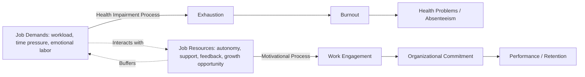

## Job Demands-Resources and Job Demand-Control Models

### Overview and Chapter Context

Both models are foundational stress theories in occupational health psychology explaining how job characteristics produce strain, motivation, or wellbeing outcomes. The Job Demand-Control (JDC) Model (Karasek, 1979) is the older, more parsimonious framework focused specifically on demands and decision latitude; the Job Demands-Resources (JD-R) Model (Demerouti, Bakker, Nachreiner, & Schaufeli, 2001) is a later, more flexible framework generalizing beyond any fixed set of named variables. JD-R is best understood as both an extension of and a response to limitations identified in JDC.

### Job Demand-Control (JDC) Model

**Core Structure**

Karasek's model proposes that job strain results from the interaction of two dimensions:

- **Psychological demands**: workload, time pressure, role conflict, pace of work
- **Decision latitude** (also called job control): the combination of **decision authority** (autonomy over how and when work is done) and **skill discretion** (variety of skills used and opportunity to develop new ones)

The model's central and most-cited claim is the **strain hypothesis**: jobs high in demands but low in control ("high-strain jobs") produce the greatest risk of psychological strain and, in later cardiovascular-health-focused research, physical health risk (e.g., hypertension, cardiovascular disease). This is not simply an additive effect — the model specifies an **interaction**, where the combination of high demand and low control is disproportionately harmful compared to either factor alone.

**The Four Job Types (2x2 Quadrant Model)**

|  | Low Control | High Control |
| --- | --- | --- |
| **Low Demands** | Passive Job (risk of skill atrophy, learned helplessness over time) | Low-Strain Job (most favorable; low risk) |
| **High Demands** | High-Strain Job (highest risk of psychological and physical strain) | Active Job (demands are offset by control; associated with learning and mastery, not strain) |

**Key Points**

- The **Active Job** quadrant (high demand, high control) is a distinctive prediction of the model: rather than being the most stressful combination, high demand paired with high control is theorized to promote active learning, mastery, and engagement, since the worker has the latitude to manage the demands effectively.
- The **Passive Job** quadrant (low demand, low control) is theorized to carry its own long-term risk — not acute strain, but gradual erosion of skill use and problem-solving capability, sometimes linked to reduced life satisfaction and de-skilling over time.

### The Job Demand-Control-Support (JDCS) Model Extension

Johnson and Hall (1988) extended Karasek's model by adding a third dimension: **social support** (from supervisors and coworkers). The extended model proposes an "iso-strain" hypothesis: jobs combining high demands, low control, *and* low social support ("iso-strain jobs") carry the highest risk, since social support can buffer the negative effects of the high-strain combination.

**[Inference]** The buffering effect of social support in the JDCS model has received more consistent empirical support in some outcome domains (e.g., psychological wellbeing) than others (e.g., specific cardiovascular endpoints), where findings across studies have been more mixed; this is a matter of ongoing empirical investigation rather than a fully settled finding.

### Diagram: Job Demand-Control Model Quadrants

<svg xmlns="http://www.w3.org/2000/svg" viewBox="0 0 700 420">
<text x="350" y="30" text-anchor="middle" font-size="17" font-weight="bold" fill="#1a1a1a">Karasek's Job Demand-Control Model (svg_diagram)</text>
<line x1="120" y1="360" x2="620" y2="360" stroke="#374151" stroke-width="2" />
<line x1="120" y1="360" x2="120" y2="70" stroke="#374151" stroke-width="2" />
<text x="370" y="395" text-anchor="middle" font-size="13" fill="#374151">Psychological Demands →</text>
<text x="60" y="215" text-anchor="middle" font-size="13" fill="#374151" transform="rotate(-90 60 215)">Decision Latitude →</text>
<rect x="120" y="70" width="250" height="145" fill="#dcfce7" stroke="#16a34a" stroke-width="2" />
<text x="245" y="130" text-anchor="middle" font-size="14" font-weight="bold" fill="#14532d">Low-Strain Job</text>
<text x="245" y="150" text-anchor="middle" font-size="11" fill="#14532d">Low Demand / High Control</text>
<text x="245" y="170" text-anchor="middle" font-size="11" fill="#14532d">Most favorable outcome</text>
<rect x="370" y="70" width="250" height="145" fill="#dbeafe" stroke="#2563eb" stroke-width="2" />
<text x="495" y="130" text-anchor="middle" font-size="14" font-weight="bold" fill="#1e3a8a">Active Job</text>
<text x="495" y="150" text-anchor="middle" font-size="11" fill="#1e3a8a">High Demand / High Control</text>
<text x="495" y="170" text-anchor="middle" font-size="11" fill="#1e3a8a">Learning &amp; mastery, not strain</text>
<rect x="120" y="215" width="250" height="145" fill="#fef3c7" stroke="#d97706" stroke-width="2" />
<text x="245" y="275" text-anchor="middle" font-size="14" font-weight="bold" fill="#78350f">Passive Job</text>
<text x="245" y="295" text-anchor="middle" font-size="11" fill="#78350f">Low Demand / Low Control</text>
<text x="245" y="315" text-anchor="middle" font-size="11" fill="#78350f">Skill atrophy risk over time</text>
<rect x="370" y="215" width="250" height="145" fill="#fee2e2" stroke="#dc2626" stroke-width="2" />
<text x="495" y="275" text-anchor="middle" font-size="14" font-weight="bold" fill="#7f1d1d">High-Strain Job</text>
<text x="495" y="295" text-anchor="middle" font-size="11" fill="#7f1d1d">High Demand / Low Control</text>
<text x="495" y="315" text-anchor="middle" font-size="11" fill="#7f1d1d">Highest risk quadrant</text>
</svg>

### Job Demands-Resources (JD-R) Model

**Core Structure**

The JD-R model generalizes beyond JDC's fixed demand/control variables, proposing that **any** job characteristic can be classified into one of two broad categories, and that the specific variables relevant will differ by occupation:

- **Job Demands**: aspects of the job requiring sustained physical, cognitive, or emotional effort and thus associated with physiological or psychological costs (e.g., workload, time pressure, emotional labor, role conflict, physical demands)
- **Job Resources**: aspects of the job that help achieve work goals, reduce demands and their associated costs, or stimulate personal growth and development (e.g., autonomy, social support, feedback, skill variety, opportunities for development, supervisor coaching)

**The Dual-Process Model**

JD-R's central theoretical contribution is specifying **two distinct psychological processes** operating in parallel, rather than a single strain pathway:

1. **The Health Impairment (Energetic) Process**: high and sustained job demands deplete employees' physical and mental energy resources, leading to exhaustion and, over time, burnout and health problems
2. **The Motivational Process**: job resources fulfill basic psychological needs (autonomy, competence, relatedness — echoing Self-Determination Theory), foster work engagement, and lead to positive organizational outcomes (performance, organizational commitment, lower turnover intention)

**Key Points**

- Job demands are not framed as inherently negative in JD-R; demands become harmful primarily when they exceed an employee's adaptive capacity or are not offset by adequate resources (this distinction is elaborated in later refinements distinguishing "challenge" versus "hindrance" demands, discussed below).
- Job resources have a **dual role**: they are intrinsically motivating (satisfying basic psychological needs) and extrinsically motivating (instrumental in achieving work goals and coping with demands).

### The Buffering Hypothesis in JD-R

JD-R proposes that job resources can **buffer** the impact of job demands on strain — high resources weaken the relationship between high demands and exhaustion/burnout. This buffering function is analogous to, but more generalized than, the role of control in Karasek's original JDC model and social support in the JDCS extension; JD-R treats control and support as two specific examples within the broader resource category rather than the only relevant buffers.

### Diagram: JD-R Dual-Process Model

### Challenge-Hindrance Stressor Framework Integration

A widely adopted refinement (Cavanaugh et al., 2000; frequently integrated into contemporary JD-R research) subdivides job demands into two qualitatively different types based on their appraisal by employees:

- **Challenge demands**: demands appraised as opportunities for growth or achievement despite requiring effort (e.g., high workload on a meaningful project, time pressure on a valued deadline, job complexity) — associated with engagement and, in some studies, even positive motivational outcomes despite the effort cost
- **Hindrance demands**: demands appraised as obstacles to goal achievement with limited growth potential (e.g., role ambiguity, organizational politics, red tape, interpersonal conflict) — associated primarily with strain and negative outcomes, with little corresponding motivational benefit

**[Inference]** The challenge-hindrance distinction refines but does not fully replace the original demands-as-uniformly-costly framing in JD-R; the extent to which challenge demands genuinely avoid health-impairment costs (versus simply being differently appraised while still imposing some physiological cost) remains a point of ongoing empirical nuance rather than fully resolved.

### Comparing JDC and JD-R

| Dimension | Job Demand-Control (JDC) | Job Demands-Resources (JD-R) |
| --- | --- | --- |
| **Scope** | Fixed set of variables (demands, control; later + support) | Open framework — any demand/resource relevant to the specific job can be included |
| **Core mechanism** | Interaction between demand and control (strain hypothesis) | Two parallel processes: health impairment and motivation |
| **Primary outcome focus** | Psychological/physical strain, cardiovascular risk | Burnout and work engagement as twin outcomes |
| **Flexibility across occupations** | Lower — same variables applied across all job types | Higher — variables tailored to occupation-specific demands/resources |
| **Positive outcomes modeled** | Limited (Active Job as relatively favorable) | Explicit dedicated motivational pathway (engagement) |
| **Empirical tradition** | Strongly linked to epidemiological/cardiovascular health research | Strongly linked to burnout and engagement research (e.g., Maslach Burnout Inventory, Utrecht Work Engagement Scale) |

### Worked Example: Comparing Model Application in a Call Center

**Example**

A call center employs agents handling high call volume with strict average-handle-time targets.

- **JDC application**: The core diagnostic question is whether agents have decision latitude (can they deviate from scripts, manage their own break timing, exercise judgment in resolving calls) alongside the high demand (call volume, time pressure). A center imposing strict scripts with no agent discretion and high call volume would be classified as a **high-strain job configuration**, predicting elevated psychological strain risk.
- **JD-R application**: The same center is analyzed by cataloguing its specific demands (call volume, emotional labor from difficult customers, handle-time pressure) and specific resources (supervisor coaching availability, peer support during breaks, opportunities to specialize in complex call types, feedback quality). The health-impairment process is tracked via exhaustion/absenteeism trends; the motivational process is tracked via engagement survey scores. An intervention increasing supervisor coaching availability (a resource) is predicted to buffer the demand-exhaustion relationship and separately boost engagement, a dual-pathway prediction JDC's single-interaction model does not explicitly generate.

**[Inference]** This is a synthesized illustrative comparison; real-world call center diagnostic work would typically draw on validated instruments (e.g., the Copenhagen Psychosocial Questionnaire or occupation-specific JD-R surveys) rather than informal classification as shown here.

### Measurement Instruments

- **Job Content Questionnaire (JCQ)**: the standard validated instrument for measuring JDC model constructs (psychological demands, decision latitude, social support)
- **Utrecht Work Engagement Scale (UWES)** and **Maslach Burnout Inventory (MBI)**: the most common outcome measures paired with JD-R model research, corresponding respectively to the motivational and health-impairment pathways
- **Occupation-specific JD-R questionnaires**: because JD-R is an open framework, many studies develop custom demand/resource inventories tailored to a specific occupation (e.g., teacher-specific, healthcare-specific, or IT-specific JD-R surveys) rather than relying on a single universal instrument

### Applications to Job (Re)Design

- **JDC-based interventions** typically focus on increasing decision latitude for high-strain roles (expanding autonomy, cross-training for skill discretion) as the primary lever, consistent with the model's interaction hypothesis
- **JD-R-based interventions** are broader, addressing both sides of the dual process: reducing or better-managing hindrance demands (streamlining bureaucracy, clarifying roles) while separately increasing resources (feedback systems, developmental opportunities, autonomy, support structures) to boost engagement independent of demand reduction
- Both models inform **job crafting** research — the idea that employees can proactively reshape their own demands and resources (e.g., seeking more feedback, reducing unnecessary task demands) rather than relying solely on top-down redesign

### Common Misapplications and Limitations

- **Treating all demands as uniformly harmful**: overlooks the challenge-hindrance distinction, potentially leading to demand-reduction interventions that inadvertently strip out engaging, growth-oriented work alongside genuinely harmful hindrance stressors
- **Ignoring the interaction in JDC**: analyzing demands and control as independent additive effects rather than testing the specified interaction, which is the model's central and most distinctive claim
- **Assuming resources always help regardless of context**: some resources may be under-utilized or even burdensome if mismatched to employee needs or if resource abundance itself becomes a demand (e.g., excessive autonomy without adequate support can increase decision-fatigue for some employees)
- **[Unverified]** The empirical literature on whether resource abundance can itself become counterproductive past a certain threshold is less developed and more contested than the core buffering and motivational-process findings, which have substantially more consistent meta-analytic support.

### Relationship to Broader Occupational Health Frameworks

- **Effort-Reward Imbalance (ERI) Model** (Siegrist) — a related but distinct stress model focused on the balance between employee effort and perceived reward (esteem, security, career opportunities), often discussed alongside JDC/JD-R as a complementary demand-oriented framework
- **Conservation of Resources (COR) Theory** (Hobfoll) — provides a broader psychological mechanism (resource loss and gain spirals) that underlies and is frequently cited to explain *why* JD-R's resource-buffering and depletion mechanisms operate as they do
- **Self-Determination Theory** — the psychological-needs mechanism (autonomy, competence, relatedness) underlying JD-R's motivational process draws directly on SDT's basic needs framework
- **Burnout and Engagement as Occupational Health Outcomes** — JD-R is the dominant contemporary framework connecting job design directly to these two specific, well-validated outcome constructs

### Related Topics

- Effort-Reward Imbalance Model (Siegrist)
- Conservation of Resources Theory (Hobfoll)
- Job Crafting and Proactive Work Design
- Burnout: Antecedents, Measurement, and Intervention
- Work Engagement and the Utrecht Work Engagement Scale
- Challenge-Hindrance Stressor Framework
- Self-Determination Theory in Work Motivation
- Job Characteristics Model (Hackman & Oldham)
- Psychosocial Risk Assessment in Occupational Health
- Occupational Stress Interventions and Primary Prevention