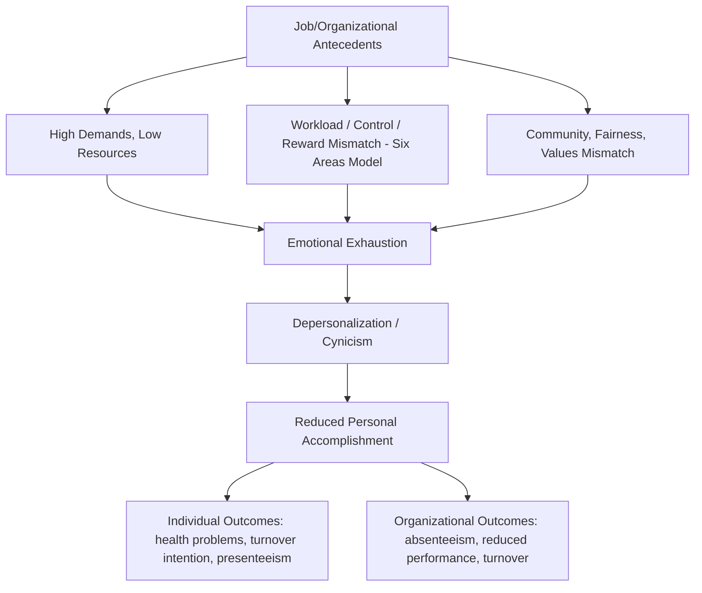
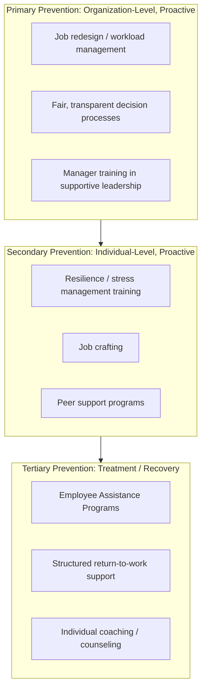

## Burnout and Its Prevention

### Definition and Classification Status

Burnout is a psychological syndrome resulting from chronic, unresolved workplace stress, characterized by three core dimensions: emotional exhaustion, depersonalization (cynicism), and reduced personal accomplishment. The most widely used conceptual and measurement framework is Christina Maslach's three-dimensional model, operationalized through the Maslach Burnout Inventory (MBI).

**Key Points**

- The World Health Organization's **ICD-11** (effective 2022) classifies burnout as an "occupational phenomenon" resulting specifically from chronic workplace stress that has not been successfully managed — explicitly **not classified as a medical condition or mental disorder** in ICD-11, and explicitly scoped to the occupational context only (not applied to stress in other life domains).
- This classification status matters practically: it shapes how burnout can be diagnosed, billed, or treated within health systems, and distinguishes burnout from clinical depression or anxiety disorders, though the three conditions share overlapping symptoms and frequently co-occur.

### The Three Dimensions of Burnout (Maslach Model)

1. **Emotional Exhaustion**: feelings of being emotionally overextended and depleted of one's emotional and physical resources; considered the core, most consistently measured dimension across studies
2. **Depersonalization / Cynicism**: development of negative, callous, or excessively detached responses toward the job, colleagues, or (in service/helping professions) toward clients and recipients of one's work
3. **Reduced Personal Accomplishment / Reduced Professional Efficacy**: decline in feelings of competence and successful achievement in one's work, and a negative self-evaluation of one's job performance

**[Inference]** Some contemporary burnout researchers argue the reduced-personal-accomplishment dimension behaves somewhat differently from the other two in factor-analytic studies (loading less consistently as a "core" burnout symptom and more as a potential consequence of the other two), which is part of why some newer instruments (e.g., the Oldenburg Burnout Inventory, the Copenhagen Burnout Inventory) restructure or drop this dimension; this is an active area of measurement debate rather than a settled consensus.

### Diagram: The Three Dimensions of Burnout

<svg xmlns="http://www.w3.org/2000/svg" viewBox="0 0 700 380">
<text x="350" y="30" text-anchor="middle" font-size="17" font-weight="bold" fill="#1a1a1a">Maslach's Three-Dimensional Burnout Model (svg_diagram)</text>
<circle cx="200" cy="180" r="110" fill="#fee2e2" stroke="#dc2626" stroke-width="2.5" />
<text x="200" y="165" text-anchor="middle" font-size="14" font-weight="bold" fill="#7f1d1d">Emotional</text>
<text x="200" y="185" text-anchor="middle" font-size="14" font-weight="bold" fill="#7f1d1d">Exhaustion</text>
<text x="200" y="210" text-anchor="middle" font-size="10" fill="#7f1d1d">Depleted emotional/</text>
<text x="200" y="225" text-anchor="middle" font-size="10" fill="#7f1d1d">physical resources</text>
<circle cx="500" cy="180" r="110" fill="#fef3c7" stroke="#d97706" stroke-width="2.5" />
<text x="500" y="165" text-anchor="middle" font-size="14" font-weight="bold" fill="#78350f">Depersonalization</text>
<text x="500" y="185" text-anchor="middle" font-size="14" font-weight="bold" fill="#78350f">/ Cynicism</text>
<text x="500" y="210" text-anchor="middle" font-size="10" fill="#78350f">Detached, callous</text>
<text x="500" y="225" text-anchor="middle" font-size="10" fill="#78350f">response to work/others</text>
<circle cx="350" cy="300" r="110" fill="#dbeafe" stroke="#2563eb" stroke-width="2.5" />
<text x="350" y="330" text-anchor="middle" font-size="14" font-weight="bold" fill="#1e3a8a">Reduced Personal</text>
<text x="350" y="350" text-anchor="middle" font-size="14" font-weight="bold" fill="#1e3a8a">Accomplishment</text>

<text x="350" y="90" text-anchor="middle" font-size="12" font-style="italic" fill="`#374151`">Three dimensions measured independently via the MBI</text>

</svg>

### Antecedents of Burnout

**Organizational/Job-Level Antecedents (JD-R Framework)**

- High, sustained job demands without corresponding resources (see the Job Demands-Resources model's health-impairment pathway)
- Role ambiguity and role conflict
- Lack of control/autonomy over work
- Insufficient social support from supervisors or coworkers
- Unfair treatment or perceived inequity in workload, recognition, or reward distribution
- Values mismatch between the individual and the organization

**Maslach and Leiter's Six Areas of Worklife Model**

A widely cited framework identifying six specific domains where mismatch between the individual and the job predicts burnout:

1. **Workload** — demands exceeding sustainable capacity
2. **Control** — insufficient influence over decisions affecting one's work
3. **Reward** — insufficient recognition (financial, social, or intrinsic) for effort and contribution
4. **Community** — poor quality of social interaction and support at work
5. **Fairness** — perceived inequity in decisions, resource allocation, or treatment
6. **Values** — conflict between organizational values/practices and personal values

**Key Points**

- The Six Areas model frames burnout as resulting from **mismatch/misfit** in any of these six areas, not solely from workload — a common misconception is that burnout is primarily a workload problem, but the model and subsequent research indicate fairness and values mismatches can be equally or more predictive in some populations.

**Individual-Level Factors**

- **[Inference]** Certain individual dispositional factors (e.g., high neuroticism, perfectionism, low hardiness) show associations with burnout vulnerability in the research literature, but these associations are generally smaller in effect size than organizational/job-level factors, and framing burnout primarily as an individual vulnerability risks obscuring its predominantly organizational origins — a critique frequently raised against purely individual-resilience-focused burnout narratives.

### Diagram: Antecedents-to-Outcomes Pathway

### Consequences of Burnout

**Individual-Level Outcomes**

- Physical health impacts: cardiovascular risk indicators, sleep disturbance, chronic fatigue, weakened immune function
- Mental health impacts: elevated risk of depression and anxiety symptoms (with significant symptom overlap and frequent co-occurrence, though burnout and clinical depression remain conceptually and, per ICD-11, classificatorily distinct)
- Reduced job satisfaction and increased turnover intention
- **Presenteeism**: being physically present at work while functioning at reduced capacity, sometimes a more costly organizational consequence than absenteeism because it is less visible

**Organizational-Level Outcomes**

- Increased absenteeism and turnover, with associated replacement/training costs
- Reduced performance quality and productivity
- Increased error rates, particularly significant in safety-critical occupations (healthcare, aviation, transportation)
- Contagion effects: burnout can spread within teams through social contagion mechanisms, as cynicism and exhaustion are observable and can normalize within a work group

### Occupational Risk Concentration

Burnout research has historically concentrated on **human-service and helping professions** (healthcare, education, social work, emergency services) given the emotional-labor demands inherent to these roles, though contemporary research extends the construct across virtually all occupational sectors as JD-R-based conceptualizations have broadened the model beyond its original human-services focus.

**[Inference]** Whether certain professions are genuinely at categorically higher burnout risk, or whether apparent concentration partly reflects where burnout research has historically been conducted and measured most intensively, is difficult to fully disentangle from the existing literature.

### Prevention Framework: Primary, Secondary, and Tertiary Intervention

Occupational health intervention research typically categorizes burnout prevention efforts by intervention timing and target:

**Primary Prevention (Organization-Level, Proactive)**

- Job redesign to reduce hindrance demands and increase resources (per the JD-R model): workload management, role clarity initiatives, autonomy expansion
- Fair and transparent decision-making processes and resource-allocation practices (addressing the Fairness domain)
- Structured recognition and reward systems aligned with actual effort and contribution
- Manager training in supportive leadership behaviors and workload monitoring
- Organizational culture initiatives addressing values alignment between the organization's stated and enacted priorities

**Secondary Prevention (Individual-Level, Proactive)**

- Stress-management and resilience-building training (cognitive-behavioral techniques, mindfulness-based stress reduction)
- Time-management and boundary-setting skill development
- Peer support programs and structured debriefing practices, particularly in high-emotional-labor occupations
- Job-crafting interventions, empowering individuals to proactively reshape their own demands and resources

**Tertiary Prevention (Treatment/Recovery, Reactive)**

- Access to employee assistance programs (EAPs) and mental health support resources
- Structured return-to-work programs following burnout-related leave
- Individual coaching or counseling focused on recovery and re-engagement
- Organizational accommodation (workload adjustment, role modification) during recovery

**Key Points**

- A frequently cited critique in the occupational health literature is that most workplace burnout interventions historically over-invest in secondary (individual-resilience) prevention — teaching employees to cope better with unchanged organizational conditions — relative to primary (organizational-level, root-cause) prevention that addresses the structural antecedents (workload, fairness, values mismatch) directly.
- Meta-analytic evidence on intervention effectiveness generally suggests organizational-level interventions targeting job redesign produce more durable reductions in burnout than individual-level resilience training alone, though individual-level interventions still show measurable short-to-medium-term benefit and are more straightforward and lower-cost to implement, which partly explains their popularity relative to organizational-level intervention.

### Diagram: Three-Level Prevention Framework

### Worked Example: Burnout Intervention in a Healthcare Setting

**Example**

A hospital's emergency department shows elevated MBI exhaustion and cynicism scores in an annual staff survey.

1. **Diagnosis via Six Areas of Worklife**: A structured assessment reveals the primary mismatches are Workload (chronic understaffing during peak hours) and Fairness (perceived inequity in shift assignment for less senior staff), not primarily Values or Community, which score comparably to benchmark norms.
2. **Primary prevention response**: Leadership implements acuity-based staffing ratios during peak hours (addressing Workload) and a transparent, seniority-blind shift-bidding system (addressing Fairness), rather than defaulting to a generic resilience-training rollout.
3. **Secondary prevention response**: A structured, brief peer-debriefing protocol is introduced after high-acuity trauma cases, giving staff a consistent outlet for the emotional-labor demands inherent to the role.
4. **Tertiary prevention response**: Staff already showing high exhaustion scores are offered confidential EAP counseling access and, where clinically indicated, temporary schedule modification during recovery.
5. **Follow-up**: MBI scores are re-administered at 6 and 12 months, with the staffing and fairness interventions expected to show the largest sustained effect based on the diagnosis-matched intervention design.

**[Inference]** This is a synthesized illustrative scenario rather than a documented case study; actual healthcare burnout interventions and their measured effectiveness vary substantially by institution, staffing model, and implementation fidelity.

### Measurement Instruments

- **Maslach Burnout Inventory (MBI)**: the most widely used and validated instrument, with occupation-specific versions (Human Services Survey, Educators Survey, General Survey for non-human-service occupations)
- **Copenhagen Burnout Inventory (CBI)**: distinguishes personal, work-related, and client-related burnout as separate subscales, used more extensively in some European occupational health research traditions
- **Oldenburg Burnout Inventory (OLBO)**: measures exhaustion and disengagement, designed to be applicable across a broader range of occupations beyond human services
- **[Unverified]** Comparative claims about which instrument has superior cross-occupational validity are contested across the measurement literature, and instrument choice in practice often reflects regional research traditions and prior organizational usage as much as psychometric superiority.

### Common Failure Modes in Burnout Prevention Programs

- **Individualizing a systemic problem**: framing burnout prevention entirely around personal resilience or wellness programming (meditation apps, yoga sessions) while leaving root-cause organizational demands (understaffing, unfair workload distribution) unaddressed
- **One-time wellness initiatives**: episodic wellness days or single training sessions without sustained structural change, producing short-lived sentiment improvement without addressing underlying antecedents
- **Ignoring measurement and diagnosis**: implementing generic interventions without first diagnosing which of the Six Areas of Worklife (or which specific JD-R demands/resources) are actually mismatched in the specific organizational context
- **Survivor guilt/backlash risk in reactive-only models**: relying solely on tertiary prevention (EAP access after burnout has already occurred) signals to employees that the organization is managing symptoms rather than causes, which can itself contribute to further cynicism
- **Stigma barriers**: employees underutilizing available tertiary-prevention resources (EAPs, counseling) due to fear of career consequences or perceived stigma, particularly in high-performance or high-status professional cultures

### Relationship to Other Occupational Health Frameworks

- **Job Demands-Resources Model** — provides the dominant contemporary theoretical mechanism (the health-impairment process) explaining how burnout develops, and directly informs the primary-prevention job-redesign approach
- **Job Demand-Control Model** — the earlier strain-hypothesis framework, with high-strain jobs (high demand, low control) representing an antecedent condition strongly associated with burnout risk
- **Work Engagement** — frequently studied as the conceptual and empirical "opposite pole" to burnout, particularly within JD-R's dual-process framing, though the two are measured with related but distinct instruments (UWES for engagement, MBI for burnout) rather than being treated as strictly the same continuum in all research traditions
- **Organizational Culture and Psychological Safety** — cultures that stigmatize acknowledging exhaustion or seeking help are frequently cited as barriers to both primary prevention uptake and tertiary prevention utilization

### Related Topics

- Job Demands-Resources and Job Demand-Control Models
- Work Engagement and the Utrecht Work Engagement Scale
- Maslach and Leiter's Six Areas of Worklife Model
- Employee Assistance Programs (EAP) Design and Utilization
- Presenteeism and Its Organizational Costs
- Compassion Fatigue and Emotional Labor in Helping Professions
- Organizational Justice and Fairness Perceptions
- Return-to-Work Programs After Psychological Injury
- Resilience Training: Efficacy and Limitations
- Psychological Safety and Workplace Mental Health Stigma