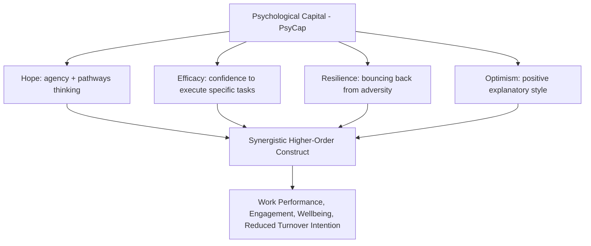

## Positive Organizational Behavior and Psychological Capital

### Definition and Origin

Positive Organizational Behavior (POB) is the study and application of positively oriented human resource strengths and psychological capacities that can be measured, developed, and effectively managed to improve workplace performance. It was formally defined and delineated by Fred Luthans in the early 2000s as a deliberately narrower, more rigorously operationalized counterpart to the broader **Positive Organizational Scholarship (POS)** movement.

**Key Points**

- Luthans established explicit **inclusion criteria** for a construct to qualify as POB, distinguishing it from generic "positive thinking" or motivational rhetoric: a POB construct must be (1) grounded in theory and research, (2) validly measurable, (3) relatively unique to the organizational behavior field, (4) **state-like** rather than purely fixed trait-like (meaning it is open to development and change through intervention), and (5) demonstrated to have a positive impact on performance and other work outcomes.
- The state-like versus trait-like distinction is central: POB deliberately excludes stable personality traits (e.g., the Big Five) from its scope, since traits are not considered malleable through workplace intervention in the way POB's target constructs are.

### The State-Trait Continuum

POB constructs are positioned along a conceptual continuum:

- **Pure states**: highly malleable, momentary (e.g., a specific mood)
- **State-like constructs**: the POB target zone — relatively malleable and open to development, but more stable than a fleeting mood (e.g., self-efficacy, hope, optimism, resilience)
- **Trait-like constructs**: relatively stable and enduring, less amenable to short-term intervention (e.g., core self-evaluations, general dispositional optimism)
- **Pure traits**: highly stable across the lifespan (e.g., the Big Five personality dimensions)

### Diagram: State-Trait Continuum and POB's Target Zone

<svg xmlns="http://www.w3.org/2000/svg" viewBox="0 0 700 260">
<text x="350" y="30" text-anchor="middle" font-size="17" font-weight="bold" fill="#1a1a1a">State-Trait Continuum (svg_diagram)</text>
<line x1="60" y1="140" x2="640" y2="140" stroke="#374151" stroke-width="3" />
<circle cx="100" cy="140" r="8" fill="#16a34a" />
<text x="100" y="120" text-anchor="middle" font-size="12" font-weight="bold" fill="#14532d">Pure States</text>
<text x="100" y="170" text-anchor="middle" font-size="10" fill="#374151">Momentary mood</text>
<rect x="200" y="100" width="300" height="80" rx="10" fill="#dbeafe" stroke="#2563eb" stroke-width="2.5" />
<text x="350" y="130" text-anchor="middle" font-size="14" font-weight="bold" fill="#1e3a8a">POB / PsyCap Target Zone</text>
<text x="350" y="150" text-anchor="middle" font-size="11" fill="#1e3a8a">Hope, Efficacy, Resilience, Optimism</text>
<text x="350" y="165" text-anchor="middle" font-size="10" fill="#1e3a8a">Malleable, developable</text>
<circle cx="600" cy="140" r="8" fill="#dc2626" />
<text x="600" y="120" text-anchor="middle" font-size="12" font-weight="bold" fill="#7f1d1d">Pure Traits</text>
<text x="600" y="170" text-anchor="middle" font-size="10" fill="#374151">Big Five personality</text>

<text x="350" y="220" text-anchor="middle" font-size="12" font-style="italic" fill="`#374151`">Excluded from POB: stable traits not amenable to short-term workplace intervention</text>

</svg>

### Psychological Capital (PsyCap): The HERO Model

Psychological Capital is the most developed and empirically validated construct to emerge from the POB research program. It is a **second-order, higher-order construct** composed of four first-order components, commonly referenced by the acronym **HERO**:

1. **Hope**: a positive motivational state involving (a) **agency** — goal-directed determination and willpower — and (b) **pathways** — the generation of alternative routes to achieve goals when obstacles arise. Grounded in Snyder's Hope Theory.
2. **Efficacy** (Self-Efficacy): an individual's conviction or confidence in their ability to mobilize the motivation, cognitive resources, and courses of action needed to successfully execute a specific task. Grounded in Bandura's Social Cognitive Theory.
3. **Resilience**: the capacity to bounce back from adversity, failure, conflict, or even positive events and increased responsibility, and to sustain or even exceed prior functioning after setbacks. Grounded in resilience research from developmental and clinical psychology, adapted to organizational contexts.
4. **Optimism**: a positive explanatory style that attributes positive events to internal, stable, and pervasive causes and negative events to external, temporary, and situation-specific causes. Grounded in Seligman's attributional/explanatory-style research.

**Key Points**

- PsyCap's core theoretical claim is that these four components form a **synergistic higher-order construct** — the combined effect of HERO on performance and wellbeing outcomes is theorized and empirically shown in Luthans and colleagues' research to be greater than the sum of the four components measured individually, because they share an underlying core of positive appraisal and motivational agency.
- This synergy claim is the primary justification for treating PsyCap as a unified construct (measured via a composite score) rather than simply reporting the four components as separate, unrelated variables.

### Diagram: PsyCap's Four HERO Components

### Measurement: The PsyCap Questionnaire (PCQ)

The **PCQ-24** (Psychological Capital Questionnaire, 24-item version) is the standard validated instrument, developed and refined by Luthans, Youssef, and Avolio, with six items per HERO subscale drawn and adapted from established measures of each individual construct (e.g., adapted hope, efficacy, resilience, and optimism scales), then validated as a combined higher-order factor in organizational samples.

**[Inference]** Shorter versions (e.g., a 12-item PCQ) exist in the literature and are sometimes used for practical survey-length reasons in applied organizational settings; the trade-off between brevity and the psychometric robustness of the full 24-item version is a consideration researchers and practitioners weigh differently depending on context.

### PsyCap Development: The Micro-Intervention (PCI) Model

Because PsyCap is explicitly defined as state-like and developable, Luthans and colleagues developed structured, time-efficient training interventions — **Psychological Capital Interventions (PCI)** — typically delivered in short workshop formats (historically often cited around 1–3 hours, given the model's emphasis on brief, cost-effective, ROI-justifiable interventions suitable for busy organizational contexts). Typical PCI content includes:

- **Hope-building exercises**: goal-setting practice emphasizing specific, challenging but attainable goals, combined with structured generation of multiple alternative pathways and contingency plans for anticipated obstacles
- **Efficacy-building exercises**: identifying and reflecting on past mastery experiences, structured goal-attainment success recall, and modeling/vicarious learning through peer success stories
- **Resilience-building exercises**: identifying personal and organizational assets/resources that can be drawn upon during adversity, and reframing setbacks as manageable rather than catastrophic
- **Optimism-building exercises**: practicing an optimistic explanatory style through structured reframing exercises, while explicitly training a **realistic** (rather than unfounded or "Pollyanna-ish") optimism that acknowledges genuine constraints

**[Inference]** Luthans and colleagues have specifically emphasized that PsyCap-based optimism training is intended to cultivate *realistic* optimism, distinguishing the construct from naive positive thinking; the degree to which delivered interventions in practice consistently achieve this distinction, as opposed to drifting toward generic positivity messaging, is not something the theoretical literature alone can guarantee and would depend on facilitation quality.

### Worked Example: PsyCap Intervention During Organizational Change

**Example**

A mid-sized company undergoing a divisional restructuring is concerned about employee anxiety and disengagement during the multi-month transition period.

1. **Baseline measurement**: PCQ-24 is administered to affected employees, revealing notably low Hope-pathways scores (employees report feeling that if their initial approach to navigating new role requirements fails, they have no alternative strategy) and low Resilience scores.
2. **Targeted intervention design**: Rather than a generic "stay positive" communication campaign, a 90-minute PCI workshop specifically targets pathways-thinking (structured exercises generating multiple approaches to skill-gap challenges in new roles) and resilience (identifying personal support networks and past successful adaptation experiences as evidence of capacity to manage the current transition).
3. **Manager reinforcement**: Managers are briefed on HERO language and coached to reinforce pathways-thinking and efficacy-building in one-on-one check-ins during the transition (e.g., asking "what's another way you could approach that?" rather than simply reassuring).
4. **Follow-up measurement**: PCQ-24 is re-administered post-transition, alongside standard change-readiness and engagement metrics, to assess whether the targeted HERO components shifted alongside broader wellbeing indicators.

**[Inference]** This is a synthesized illustrative scenario constructed to demonstrate PsyCap intervention design logic rather than a documented case study.

### Empirical Outcomes Associated with PsyCap

Meta-analytic and primary research (predominantly led by Luthans, Avolio, Avey, and colleagues) has associated higher PsyCap with:

- Higher job performance and job satisfaction
- Higher organizational commitment and lower turnover intention
- Higher work engagement and organizational citizenship behavior
- Lower levels of cynicism, counterproductive work behavior, and job stress/anxiety
- Better psychological wellbeing outcomes, including some research linking PsyCap to physical health indicators

**[Unverified]** The bulk of PsyCap's supporting empirical base has historically involved researchers closely associated with the construct's original development; while the volume of published PsyCap research is substantial and includes meta-analyses, the degree of independent replication by researchers outside this core group, and PsyCap's incremental predictive validity over already-established related constructs (general self-efficacy, dispositional optimism, core self-evaluations), is a point of ongoing methodological discussion in the broader organizational behavior literature.

### POB/PsyCap in Relation to Adjacent Positive Constructs

| Construct | Field of Origin | Relationship to PsyCap |
| --- | --- | --- |
| **Core Self-Evaluations (CSE)** | Organizational Behavior (Judge et al.) | A broader, more trait-like construct (self-esteem, generalized self-efficacy, locus of control, emotional stability); PsyCap is positioned as more state-like and developable by comparison |
| **Positive Organizational Scholarship (POS)** | Organizational Studies (Cameron, Dutton, Quinn) | The broader academic movement studying positive phenomena at multiple levels (individual, group, organizational); POB/PsyCap is a more narrowly operationalized, individual-level, intervention-focused subset |
| **Employee Engagement** | Organizational Psychology | An outcome frequently associated with and predicted by PsyCap, rather than a component of PsyCap itself |
| **Grit** | Personality/Positive Psychology (Duckworth) | A related but conceptually distinct construct emphasizing perseverance and passion for long-term goals; sometimes discussed alongside PsyCap as another state-like or trait-like positive capacity depending on the theoretical framing used |

### Common Misapplications and Critiques

- **Conflating POB with generic positivity culture**: applying PsyCap language as motivational branding ("just be more resilient") without the structured, evidence-based PCI methodology undermines the construct's intended rigor and can appear to shift responsibility for systemic problems onto individual mindset
- **Ignoring the state-like distinction**: treating PsyCap scores as fixed, trait-like individual differences (e.g., using them in hiring/selection decisions as a stable predictor) contradicts the construct's foundational premise that it is meant to be developed, not merely selected for
- **Overstating synergy without measurement**: reporting only a composite PsyCap score without examining whether the theorized synergistic effect actually holds in a given sample, rather than simply reflecting the additive sum of four correlated but conceptually separable constructs
- **Bypassing organizational-level root causes**: similar to critiques of individual-resilience-focused burnout interventions, PsyCap-based interventions risk being used as a lower-cost substitute for addressing genuine structural job demands or resource deficits, rather than as a complement to organizational-level intervention

### Relationship to Broader Occupational Health and OD Frameworks

- **Job Demands-Resources Model** — PsyCap is frequently studied as a **personal resource** within the JD-R framework, interacting with job resources to predict engagement and buffering the effect of job demands on exhaustion
- **Burnout and Its Prevention** — PsyCap-building interventions are sometimes incorporated as a secondary-prevention component within broader burnout-prevention programs, though critiques of individualizing systemic burnout causes apply equally here
- **Self-Determination Theory** — PsyCap's efficacy component overlaps conceptually with SDT's competence need, though PsyCap is positioned as a more integrative, applied organizational construct rather than a basic-needs theory
- **Positive Organizational Scholarship** — POB/PsyCap represents the more measurement-focused, intervention-oriented branch of the broader positive-organizational-studies movement, distinguished from POS's often more macro, organizational-level, and less strictly operationalized scope

### Related Topics

- Positive Organizational Scholarship (Broader Movement)
- Job Demands-Resources Model: Personal Resources
- Self-Efficacy Theory (Bandura) in Organizational Contexts
- Hope Theory (Snyder) and Goal-Directed Cognition
- Core Self-Evaluations and Dispositional Predictors of Work Outcomes
- Resilience Training in Occupational Health
- Employee Engagement: Antecedents and Measurement
- Appreciative Inquiry
- Organizational Citizenship Behavior
- Positive Psychology Interventions in the Workplace